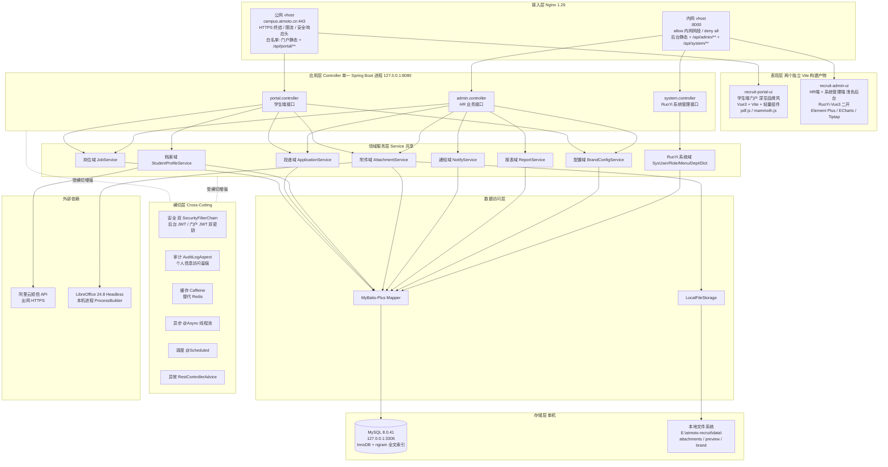
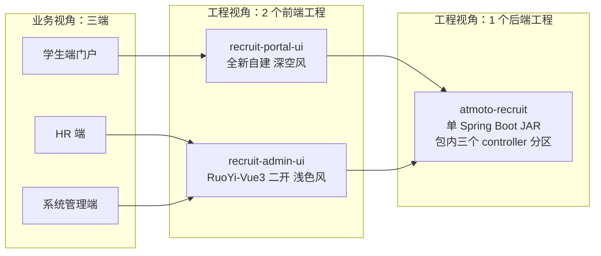
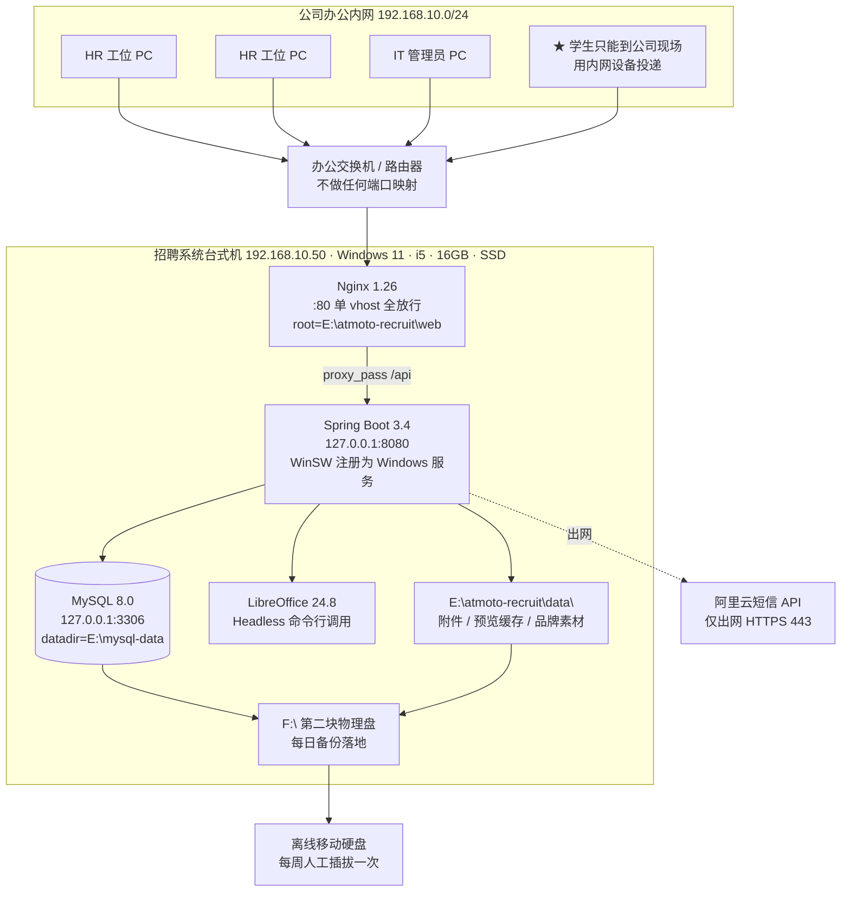
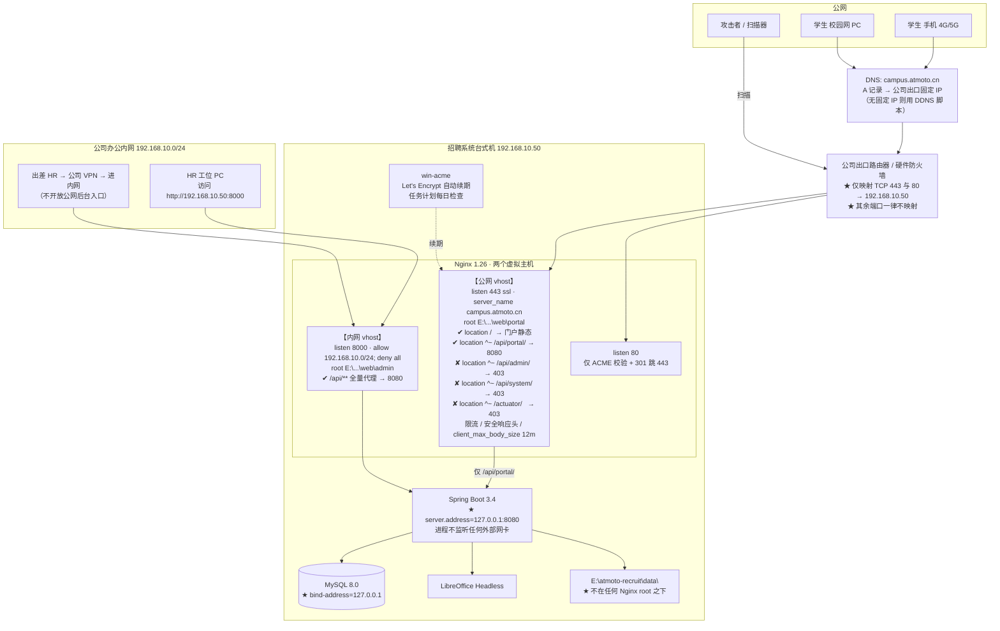

# 系统架构设计：遨天科技校园招聘简历管理系统

> 版本：V1.0　编制日期：2026-08-06　编制角色：系统架构师
> 上游基线：`00-技术选型裁决基线.md`（不得推翻）、`设计简报.md`、`品牌视觉规范.md`、`01-技术可行性评估.md`、需求文档 V1.0
> 职责边界：本文只定义**分层架构 / 模块划分 / 部署拓扑 / 目录结构 / 技术组件落位 / 非功能性设计**。表结构 DDL 交数据架构师、API 契约交接口设计师、状态机与调度规则交工作流设计师。
> 裁决冲突声明：**无**。本文所有设计均在 `00-技术选型裁决基线.md` 允许范围内；其中"RuoYi 去 Redis 化"是对裁决"不引入 Redis"的落地实现，不是推翻。

---

## 0. 一句话架构

**一个 Spring Boot 3 单体后端（单 JAR）+ 两个 Vue 3 前端工程（深空风学生门户 / 浅色风统一后台）+ 一个 Nginx 双虚拟主机（公网只开门户、后台锁内网）+ 一台 Windows 台式机上的 MySQL 与本地文件系统。**

---

## 1. 总体架构

### 1.1 分层架构图



### 1.2 各层职责

| 层 | 职责 | 不做什么 |
|---|---|---|
| 接入层 Nginx | HTTPS 终结、静态资源分发、`/api` 反向代理、gzip、访问日志、IP 限流、安全响应头、**公网/内网边界隔离** | 不做业务鉴权、不做 URL 重写魔法、不缓存 API 响应 |
| 表现层 Vue | 视图渲染、表单校验（第一道）、PDF 前端渲染、品牌色注入 | 不做权限判定（只做菜单显隐）、不做业务规则计算 |
| 应用层 Controller | 参数绑定与 Bean Validation、鉴权注解、DTO/VO 转换、统一响应包装 | **不写业务逻辑**、不直接调 Mapper |
| 领域服务层 Service | 业务规则、事务边界（`@Transactional` 只在此层）、跨表编排、外部依赖调用 | 不感知 HTTP、不返回 `AjaxResult` |
| 横切层 | 安全过滤链、审计切面、缓存、异步线程池、定时任务、全局异常 | 不含业务分支 |
| 数据访问层 | SQL 与文件 I/O | 不含事务控制、不含权限判断（数据权限由框架切面注入） |
| 存储层 | MySQL + 本地磁盘 | — |

**分层强约束**：调用方向严格自上而下，禁止 Service 反向依赖 Controller、禁止 Mapper 之间互调。`portal` 与 `admin` 两个应用层包**互不引用**，共享逻辑一律下沉到 `biz.common.service`。

### 1.3 决策：单体应用，不拆微服务

| 项 | 内容 |
|---|---|
| **结论** | **1 个 Spring Boot 单体后端，打成 1 个可执行 JAR，1 个 JVM 进程。** |
| 备选 1 | 两个 Spring Boot 应用（portal-api 8080 / admin-api 8081）共享同一个 MySQL |
| 淘汰原因 | ① 同一份 `job` / `application` / `resume_attachment` 数据出现两个写入方，事务与业务规则一致性只能靠"两边都记得改"的约定维持，是最典型的隐式耦合；② 运维成本翻倍——两套 JVM 参数、两套日志目录、两套启动/健康检查/升级脚本，而甲方**无专职运维**；③ 内存翻倍（2×350MB），在 16GB 台式机上还要给 MySQL 与 LibreOffice 留空间；④ **进程隔离在单机上不带来真实安全收益**——两个进程同机同用户运行，攻破任一进程即可读取另一进程的配置文件、附件目录与数据库凭据，真正的隔离需要两台机器或两个网段，超出预算；⑤ 20 并发无任何独立伸缩需求。 |
| 备选 2 | 微服务（网关 + 注册中心 + 配置中心 + N 个业务服务） |
| 淘汰原因 | 至少额外 3 个常驻 Java 进程（Nacos ≈ 1GB、Gateway ≈ 300MB），单机 16GB / 20 并发 / GB 级数据的场景下直接违反设计简报第三节"禁止微服务、禁止分布式中间件集群"的硬约束。团队 1–1.5 人，微服务的组织收益（团队并行）不存在。 |
| 选它的理由 | 单进程启动 3–5 秒、单 JAR 升级只需替换文件、单份日志、单点备份、单套事务。性能基线已裁定 20 并发下余量 50 倍，**架构复杂度的唯一合法来源只剩安全边界，不是性能**。 |

### 1.4 决策：三端如何组织为工程

需求侧是"三端"（学生端门户 / HR 后台 / 系统管理端），但**"端"是业务视角，不等于工程数量**。



#### 结论表

| 维度 | 结论 |
|---|---|
| 前端工程数 | **2 个**：`recruit-portal-ui`（学生门户）+ `recruit-admin-ui`（HR 端 **合并** 系统管理端） |
| 后端应用数 | **1 个**：`atmoto-recruit`，单 JAR |
| 后端内部分区 | 三套 Controller 包 + 三段 URL 前缀：`/api/portal/**`（学生）、`/api/admin/**`（HR 业务）、`/api/system/**`（RuoYi 系统管理） |

#### 为什么 HR 端与系统管理端合并为一个前端工程

- 用户群完全重叠：两者的使用者都是公司内部员工，**同一次登录、同一棵菜单树、同一套 RBAC**。RuoYi 的路由本就是"后端返回菜单树 → 前端动态注册路由"，系统管理与业务菜单天然在一棵树上。
- 视觉体系一致：都是浅色后台、表格密集、Element Plus。
- 拆开的代价：需要复制两份登录页、布局壳、权限指令（`v-hasPermi`）、axios 封装、token 刷新逻辑，且用户在两个域名/两个 SPA 之间跳转还要处理跨应用会话——纯粹的重复劳动，零收益。
- 淘汰备选："3 个前端工程"。淘汰原因如上。

#### 为什么学生门户必须独立工程（本项目最重要的前端取舍）

RuoYi-Vue3 自带一整套后台前端。是否复用它、在里面开一个"门户"路由分区并换一套深色主题？**结论：不复用，独立建。**

| 论据 | 说明 |
|---|---|
| **包体与首屏** | RuoYi 前端携带 Element Plus 全量组件、ECharts、代码生成器页面、富文本、图标全集、动态路由框架，构建产物 typically 1.5–2.5MB。学生**用手机移动网络**在宣讲会现场投递，这个体积不可接受。门户工程按需引入，目标 gzip 后首屏 JS **≤ 250KB**。 |
| **视觉体系对立** | 门户是 `#0A0E17` 深空底 + `#152535` 卡片 + `#5FB8D6` 主色 + 宽字距标题 + Rajdhani/Share Tech Mono；后台是白底 + 14px 系统字体 + 密集表格。共用一套组件库意味着门户的每一个 Element Plus 组件都要被深色样式覆盖一遍——覆盖成本高于重写，且每次组件库升级都可能样式破裂。 |
| **部署边界要求** | 门户产物必须能**独立发布到公网 vhost**，后台产物只发内网 vhost。同一个 Vite 工程即便做多 entry，也共享 `node_modules`、共享公共 chunk、共享环境变量，无法做到"公网目录里绝不出现任何后台代码"。**独立工程是把安全边界固化到构建产物层面**，这是本决策的第一理由。 |
| **认证体系不同** | 门户走学生 JWT（手机号+短信/密码），后台走 RuoYi JWT（用户名+密码+图形验证码）。两套 axios 拦截器、两套 token 存储键、两套 401 跳转目标。混在一个工程里必然出现"学生 token 被写进后台 store"这类事故。 |
| **淘汰的备选** | 备选："单工程 + 动态换肤 + 路由分区"。淘汰原因：以上四条每一条都成立，尤其第三条——公网目录里存在后台 JS 文件（哪怕不可达）等于把后台的接口路径、字段名、菜单结构、权限点标识全部公开给攻击者做侦察。 |

#### 三端在后端的组织方式

同一个 JAR 内，靠 **URL 前缀 + 独立 SecurityFilterChain + 独立 Controller 包** 三重划分：

| 分区 | URL 前缀 | 过滤链 | Controller 包 | 暴露面 |
|---|---|---|---|---|
| 学生端 | `/api/portal/**` | `portalFilterChain`（Order 1） | `com.atmoto.recruit.biz.portal.controller` | **公网** |
| HR 业务 | `/api/admin/**` | `adminFilterChain`（Order 2） | `com.atmoto.recruit.biz.admin.controller` | 仅内网 |
| 系统管理 | `/api/system/**` | `adminFilterChain`（Order 2） | `com.atmoto.recruit.system.controller` | 仅内网 |

> URL 前缀是**硬边界**：Nginx 公网 vhost 的白名单、Spring Security 的 `securityMatcher`、审计切面的分类判定，三者都以它为准。约定：任何新增接口必须落在这三个前缀之一，Code Review 检查项第一条。

---

## 2. 模块划分

### 2.1 Maven 多模块结构

以 RuoYi-Vue（Spring Boot 3 / Vue3 分支）为基座，**裁剪后重命名**：

```
atmoto-recruit/                        （父 POM，统一版本管理）
├─ recruit-common/        ← ruoyi-common     【RuoYi 提供，少量扩展】
├─ recruit-framework/     ← ruoyi-framework  【RuoYi 提供，重点改造：去 Redis、双过滤链】
├─ recruit-system/        ← ruoyi-system     【RuoYi 提供，几乎不改】
├─ recruit-biz/           ← 全新              【100% 自研，业务主体】
└─ recruit-admin/         ← ruoyi-admin      【启动模块 + RuoYi 系统管理 Controller】
```

**已移除的 RuoYi 原生模块**：

| 移除模块 | 理由 |
|---|---|
| `ruoyi-generator`（代码生成器） | 生产环境不需要在线生成代码；它暴露了数据库元数据查询接口与模板渲染入口，是明确的攻击面。开发期如需生成 CRUD，在开发者本机的独立 RuoYi 实例上生成后拷贝代码。 |
| `ruoyi-quartz`（定时任务） | 裁决第二节明确"不引入 Quartz"。它会引入 11 张 QRTZ 表与一套动态任务管理 UI（可在后台执行任意 Bean 方法，高危）。改用 `@Scheduled`。 |

### 2.2 完整 Java 包结构树

图例：`【R】` = RuoYi 原生直接复用；`【R改】` = RuoYi 原生但需改造；`【新】` = 自研新建。

```
com.atmoto.recruit
│
├── RecruitApplication.java                                    【R改】启动类，移除 Quartz/Generator 扫描
│
├── common/                                                    ── recruit-common 模块
│   ├── annotation/
│   │   ├── Log.java  DataScope.java  RateLimiter.java  Anonymous.java  RepeatSubmit.java   【R】
│   │   └── AuditPersonalData.java                             【新】个人信息访问审计注解
│   ├── constant/
│   │   ├── HttpStatus.java  Constants.java  CacheConstants.java                            【R】
│   │   └── BizConstants.java                                  【新】URL 前缀、文件白名单、限额常量
│   ├── core/
│   │   ├── domain/  AjaxResult  BaseEntity  TableDataInfo  TreeEntity                      【R】
│   │   ├── page/    PageDomain  TableSupport                                               【R】
│   │   └── text/  Convert                                                                  【R】
│   ├── enums/
│   │   ├── BusinessType.java  UserStatus.java                                              【R】
│   │   └── ErrorCode.java                                     【新】错误码枚举（码值由接口设计师填充）
│   ├── exception/
│   │   ├── ServiceException.java  base/*                                                   【R】
│   │   └── BizException.java                                  【新】业务异常，携带 ErrorCode
│   └── utils/
│       ├── SecurityUtils  StringUtils  DateUtils  ServletUtils  ip/IpUtils                 【R】
│       ├── sql/SqlUtil.java（排序字段白名单校验）                                            【R】
│       ├── file/FileUploadUtils.java                                                       【R改】接入 magic number 校验
│       └── file/FileSafetyUtils.java                          【新】文件头嗅探 + docx 结构校验
│
├── framework/                                                 ── recruit-framework 模块
│   ├── config/
│   │   ├── SecurityConfig.java                                【R改】★ 拆为双 SecurityFilterChain
│   │   ├── CaffeineCacheConfig.java                           【新】★ 替代 RedisConfig
│   │   ├── MyBatisPlusConfig.java  MybatisPlusInterceptor（分页）                          【R】
│   │   ├── ResourcesConfig.java（CORS、静态资源）                                           【R改】收紧 CORS 白名单
│   │   ├── AsyncConfig.java                                   【新】两个线程池：转换池(1)、通知池(2)
│   │   ├── SchedulingConfig.java                              【新】@EnableScheduling + 单线程调度器
│   │   ├── ThreadPoolConfig.java                                                           【R】
│   │   └── FilterConfig.java（XssFilter、RepeatableFilter）                                【R】
│   ├── security/
│   │   ├── filter/JwtAuthenticationTokenFilter.java           【R】后台 token 过滤器
│   │   ├── filter/PortalTokenFilter.java                      【新】★ 学生端 token 过滤器
│   │   ├── handle/AuthenticationEntryPointImpl.java  LogoutSuccessHandlerImpl.java         【R】
│   │   ├── handle/PortalAuthEntryPoint.java                   【新】门户 401 响应
│   │   ├── context/AuthenticationContextHolder.java                                        【R】
│   │   └── context/PortalUserHolder.java                      【新】ThreadLocal 存当前学生 ID
│   ├── cache/
│   │   └── RedisCache.java → CaffeineCache.java               【R改】★ 保留类名与方法签名，实现换 Caffeine
│   ├── web/
│   │   ├── service/TokenService.java                          【R改】底层 cache 换 Caffeine
│   │   ├── service/SysLoginService.java  SysPermissionService.java  UserDetailsServiceImpl 【R】
│   │   ├── service/PortalTokenService.java                    【新】★ 学生 token 签发/校验（独立密钥）
│   │   ├── exception/GlobalExceptionHandler.java              【R改】补齐业务异常与 traceId
│   │   └── interceptor/RepeatSubmitInterceptor.java                                        【R改】底层 cache 换 Caffeine
│   ├── aspectj/
│   │   ├── LogAspect.java  DataScopeAspect.java  RateLimiterAspect.java                    【R改】限流底层换 Caffeine
│   │   └── AuditLogAspect.java                                【新】★ 个人信息访问审计切面
│   └── datasource/  （RuoYi 多数据源，本项目单库，保留不用）                                  【R】
│
├── system/                                                    ── recruit-system 模块【R】几乎不改
│   ├── domain/    SysUser SysRole SysMenu SysDept SysPost SysDictType SysDictData
│   │              SysConfig SysOperLog SysLogininfor SysNotice SysUserRole ...
│   ├── mapper/    对应 Mapper 接口与 XML
│   └── service/   ISysUserService ISysRoleService ISysMenuService ISysDeptService
│                  ISysDictDataService ISysConfigService ISysOperLogService ...
│
├── biz/                                                       ── recruit-biz 模块【新】100% 自研
│   │
│   ├── common/                          ← 跨端共享，portal 与 admin 均依赖
│   │   ├── domain/
│   │   │   ├── Job.java  JobCategory.java  JobTag.java
│   │   │   ├── Student.java  StudentEducation.java  StudentProfileExt.java
│   │   │   ├── Application.java                        （投递记录，含 sourceChannel 渠道字段）
│   │   │   ├── ResumeAttachment.java                   （附件元数据 + 转换状态）
│   │   │   ├── BrandConfig.java  PortalBanner.java  PortalNotice.java
│   │   │   ├── SmsSendLog.java
│   │   │   └── BizAuditLog.java                        （个人信息访问审计）
│   │   ├── mapper/                                     （MyBatis-Plus Mapper + XML）
│   │   ├── enums/
│   │   │   ├── ApplicationStatus.java   ★ 枚举含附录 4.1 全部状态值，P0 只约束两个跃迁
│   │   │   ├── JobStatus.java  ConvertStatus.java  AttachmentType.java  SourceChannel.java
│   │   ├── service/
│   │   │   ├── JobService / JobServiceImpl
│   │   │   ├── ApplicationService / Impl               （防重复投递、状态变更）
│   │   │   ├── StudentProfileService / Impl
│   │   │   ├── AttachmentService / Impl                （上传、鉴权取流、预览路由）
│   │   │   ├── BrandConfigService / Impl               （A-001，带 Caffeine 缓存）
│   │   │   ├── JobCategoryService / Impl               （A-002 岗位类别）
│   │   │   └── AuditService / Impl                     （写 biz_audit_log，独立事务 REQUIRES_NEW）
│   │   └── dto/ vo/                                    （共享传输对象）
│   │
│   ├── portal/                          ← 学生端，仅被 /api/portal/** 使用
│   │   ├── controller/
│   │   │   ├── PortalAuthController          S-001 S-002 注册/登录/找回/短信码/图形码
│   │   │   ├── PortalProfileController       S-004 S-005（S-006/008/009 为 P1 占位）
│   │   │   ├── PortalJobController           S-010 S-011 S-012 列表/筛选/搜索/详情
│   │   │   ├── PortalApplicationController   S-013 投递（S-014 我的投递为 P1）
│   │   │   ├── PortalFileController          附件上传 / 本人附件下载与预览
│   │   │   ├── PortalBrandController         品牌配置/Banner/公告（匿名可访问）
│   │   │   └── PortalNoticeController        【P1 占位】站内消息 S-015
│   │   ├── service/
│   │   │   ├── PortalAuthService / Impl      （BCrypt、登录失败计数、隐私政策版本记录）
│   │   │   ├── SmsCodeService / Impl         （生成、Caffeine TTL 存储、核销）
│   │   │   ├── SmsRateLimitService / Impl    （六层防刷）
│   │   │   └── PortalOwnershipGuard          ★ 归属校验：任何返回学生数据的查询必须过这一关
│   │   └── dto/ vo/
│   │
│   ├── admin/                           ← HR 端，仅被 /api/admin/** 使用
│   │   ├── controller/
│   │   │   ├── JobAdminController            H-001 H-002（H-003 模板为 P1）
│   │   │   ├── ResumeAdminController         H-004 H-005 列表/详情/HR 备注
│   │   │   ├── ApplicationAdminController    H-006 通过/淘汰/批量
│   │   │   ├── ResumeExportController        H-007 Excel 导出 + 附件原件下载
│   │   │   ├── AttachmentAdminController     鉴权预览（inline PDF）
│   │   │   ├── ReportController              数据报表（P0 必须）
│   │   │   ├── BrandConfigController         A-001
│   │   │   ├── JobCategoryController         A-002 岗位类别
│   │   │   └── InterviewController           【P2 空壳占位】H-008~010
│   │   ├── service/
│   │   │   ├── ResumeQueryService / Impl     （多维筛选排序，@DataScope 注入）
│   │   │   ├── ResumeExportService / Impl    （EasyExcel 流式写出 + 导出审计）
│   │   │   ├── HrNoteService / Impl
│   │   │   └── ReportService / Impl          （纯 SQL 聚合，无中间表）
│   │   └── dto/ vo/
│   │
│   ├── file/                            ← 附件与预览基础设施
│   │   ├── LocalFileStorage.java             路径生成（UUID + 年月分桶）、写入、读流、删除
│   │   ├── FileValidator.java                白名单 + 大小 + magic number + docx 结构
│   │   └── preview/
│   │       ├── PreviewService.java           预览路由：PDF 直取 / Word 取缓存 / 未就绪返回状态
│   │       ├── LibreOfficeConverter.java     ★ ProcessBuilder + 30s 超时 + 独立 UserInstallation
│   │       └── ConvertQueue.java             单线程有界队列（容量 200，满则拒绝并标记待重试）
│   │
│   ├── sms/                             ← 短信
│   │   ├── SmsSender.java                    接口
│   │   ├── AliyunSmsSender.java              阿里云 dysmsapi20170525
│   │   ├── MockSmsSender.java                dev/test 环境，验证码打日志不外发
│   │   └── SmsTemplateEnum.java
│   │
│   ├── notify/                          ← 通知（P0 极简，P1/P2 扩展位）
│   │   ├── NotifyService.java                统一入口 notify(event, target, params)
│   │   ├── NotifyEvent.java                  事件枚举（对应需求附录 4.2 七类，P0 只触发 1 类）
│   │   └── channel/
│   │       ├── NotifyChannel.java            接口
│   │       ├── InAppChannel.java             【P0】落库站内消息表
│   │       ├── SmsChannel.java               【P1 占位】
│   │       └── MailChannel.java              【P2 占位】
│   │
│   └── task/                            ← 定时任务（@Scheduled）
│       ├── JobExpireTask.java                H-002 到期自动下架，每 10 分钟
│       ├── TempCleanTask.java                temp/export 目录清理，每日 03:00
│       ├── ConvertRetryTask.java             转换失败/未完成重试，每 15 分钟
│       ├── DataRetentionTask.java            ★【P0 dry-run】只扫描并写报告日志，不删除
│       └── OrphanProcessTask.java            清理僵死 soffice.exe 进程，每小时
│
└── （recruit-admin 模块）controller/
    ├── system/    SysUserController SysRoleController SysMenuController SysDeptController
    │              SysDictDataController SysConfigController SysProfileController
    │              SysOperlogController SysLogininforController                            【R】
    ├── common/    CaptchaController（图形验证码）                                          【R改】底层 cache 换 Caffeine
    └── monitor/   CacheController【R改】改为展示 Caffeine 统计；ServerController【R】
        （★ SysOperlogController 的"清空日志"接口必须删除——见 5.2 审计不可删原则）
```

### 2.3 RuoYi 去 Redis 化改造清单（关键改造项）

RuoYi-Vue 原生强依赖 Redis。裁决"不引入 Redis"，必须逐点落地。**所有 Redis 调用在 RuoYi 中都收敛在 `RedisCache` 一个门面类**，改造集中度高。

| RuoYi 依赖点 | 原实现 | 改造方案 | 副作用与接受理由 |
|---|---|---|---|
| 登录 token 存储与续期 `TokenService` | Redis key `login_tokens:{uuid}`，TTL 30min 自动续期 | Caffeine `expireAfterAccess(30min)`，maximumSize 500 | 应用重启后所有人需重新登录。单机场景重启频率极低（月级），可接受。 |
| 图形验证码 `CaptchaController` | Redis key `captcha_codes:{uuid}`，TTL 2min | Caffeine `expireAfterWrite(2min)` | 无 |
| 参数配置缓存 `SysConfigServiceImpl` | Redis Hash | Caffeine，配置修改时主动 evict | 无 |
| 字典缓存 `SysDictTypeServiceImpl` | Redis Hash | 同上 | 无 |
| 防重复提交 `RepeatSubmitInterceptor` | Redis key，TTL 10s | Caffeine `expireAfterWrite(10s)` | 无 |
| 限流注解 `RateLimiterAspect` | Redis Lua 脚本原子计数 | Caffeine + `AtomicInteger`（单机无需分布式原子性） | 无 |
| 在线用户监控 `SysUserOnlineController` | 扫描 Redis keys | Caffeine `asMap()` 遍历 | 无 |

**实现约束**：新建 `CaffeineCache` 类，**方法签名与 RuoYi 原 `RedisCache` 完全一致**（`setCacheObject` / `getCacheObject` / `deleteObject` / `setCacheList` / `setCacheMap` / `keys` 等），使所有调用方零改动。类上加醒目注释说明"本类替代 RuoYi RedisCache，单机 Caffeine 实现，不可用于多实例部署"。

短信验证码存储同样走 Caffeine（裁决第二节明确允许的"唯一例外"）。

---

## 3. 部署拓扑（两套方案）

### 3.0 共同基线：两套方案共用同一软件栈

**决策**：即使是纯内网的方案 A，**也部署 Nginx**。

- 理由：方案 A 与方案 B 的差异被压缩到**一个 `nginx.conf` 与一张证书**，应用 JAR、目录结构、启动脚本、备份脚本、防火墙脚本全部相同。从 A 升级到 B 不需要重新部署任何组件。若方案 A 省掉 Nginx，则升级时要改 Spring Boot 静态资源配置、改前端 base path、改跨域配置，等于二次部署。
- 成本：一个 5MB 的 `nginx.exe` + 一份配置文件。裁决第二节对 Nginx 的定性是"按需"，此处论证为"两套都要"。

### 3.1 方案 A：纯内网部署



| 项 | 配置 |
|---|---|
| 访问地址 | `http://recruit.local:80`（内网 DNS 或 hosts）或 `http://192.168.10.50` |
| 端口映射 | **无**。路由器不做任何 NAT 转发 |
| HTTPS | 不启用（内网明文可接受，因为不跨公网；若公司有内网 CA 可签发内网证书，非必须） |
| 学生如何投递 | **只能到公司现场用内网设备** |
| 适用场景 | 仅适合：① 开发联调期；② HR 内部试运行；③ 到校宣讲会时 HR 用自带热点+笔记本代录（不现实） |

**方案 A 的致命问题**：本项目的核心目标是"学生一站式在线投递，替代邮箱与纸质简历"。纯内网部署下学生根本无法投递，**项目目标不成立**。因此方案 A 只作为**上线前的过渡形态与降级预案**，不作为最终交付形态。

### 3.2 方案 B：学生端公网可访问（**推荐方案**）



#### 方案 B 关键设计逐项说明

**① 安全边界：四层收敛，任一层失效仍有下一层**

| 层 | 措施 | 失效后果 |
|---|---|---|
| L1 网络 | 路由器只映射 443/80，其余端口不可从公网到达 | 若被绕过 → 进 L2 |
| L2 Nginx vhost | 公网 vhost 用 `^~` 前缀精确匹配放行 `/api/portal/`，对 `/api/admin/`、`/api/system/`、`/actuator/`、`/druid/` 显式 `return 403`；`location /` 只 serve 门户静态目录 | 若配置写错 → 进 L3 |
| L3 应用绑定 | `server.address=127.0.0.1`，Spring Boot 只监听回环，**任何绕过 Nginx 的直连尝试在 TCP 层就失败** | 若攻击者已在本机 → 进 L4 |
| L4 Spring Security | `adminFilterChain` 要求 RuoYi JWT + 权限点；学生 JWT 的 `aud=portal` claim 在后台链上不被接受，签名密钥也不同 | 需同时攻破两套密钥 |

> `^~` 前缀匹配优先级高于正则 location，可保证 `/api/admin/xxx` 一定命中 403 块，不会被 `/api/` 通配块吃掉。这是本配置能否成立的关键语法点，部署验收必须实测。

**② HR 后台是否暴露公网**

| 项 | 内容 |
|---|---|
| **结论** | **不暴露。** HR 后台只在内网 `:8000` 提供，且 Nginx 层 `allow 192.168.10.0/24; deny all;` |
| 出差/居家 HR 怎么办 | 走**公司 VPN 进内网**。多数企业路由器/防火墙自带 L2TP/IPSec 或 OpenVPN；若无，推荐 **WireGuard**（单个 exe + 一份配置，性能与易用性最好）。VPN 由公司 IT 统一管理，不属本系统交付范围。 |
| 备选 1 | 后台也开公网子域 `hr.atmoto.cn` | 
| 淘汰原因 | 简历库是本系统全部价值所在，一旦后台登录页暴露公网，就要独立承担撞库、弱口令爆破、0day 扫描的全部压力。而 HR 筛简历本就是集中在办公室完成的工作（校招季 1–2 个月），暴露收益极低、风险极高。 |
| 备选 2 | Cloudflare Tunnel / frp 内网穿透后台 |
| 淘汰原因 | 引入外部第三方对流量的中间人位置，简历数据经第三方链路，与设计简报第四节"个人信息保护"取向冲突；且多一个需维护的常驻进程。 |
| **若甲方坚持暴露后台的最小加固包** | ① 独立子域 + 独立 Nginx server 块；② 客户端 IP 白名单（HR 家庭宽带固定 IP）或 mTLS 客户端证书；③ 强制二次验证（登录后短信码，复用已有短信通道）；④ `limit_req rate=2r/s` + 登录接口 5 次失败锁定 15 分钟；⑤ 后台访问全量记入审计。**此加固包需额外 4 人日，且必须在合同中明确风险由甲方承担。** |

**③ HTTPS 证书**

| 项 | 结论 |
|---|---|
| **选型** | **win-acme（wacs.exe）+ Let's Encrypt**，HTTP-01 验证 |
| 理由 | 免费；自动 90 天续期（win-acme 自己注册 Windows 任务计划）；单 exe 免安装；对**无专职运维**的甲方，"自动续期"是压倒性优势 |
| 前提 | 公网 80 端口必须可达（用于 ACME challenge）。若运营商封 80，改用 **DNS-01 验证** + win-acme 的阿里云 DNS 插件（域名 `atmoto.cn` 在阿里云则天然可用） |
| 备选 | 阿里云免费 DV 证书 |
| 淘汰原因 | 2025 年起免费证书有效期缩短且需**手动申请与部署**，一年多次手工操作，在无运维场景下极易过期导致门户全站不可访问 |
| 排除 | 自签证书——学生浏览器红色安全警告，投递转化率归零，不可接受 |
| TLS 配置 | 仅 `TLSv1.2 TLSv1.3`；禁用弱套件；`ssl_session_cache shared:SSL:10m`；HSTS 先 `max-age=300` 观察 1 周，稳定后调 `max-age=31536000` |
| 续期监控 | `healthcheck.ps1` 每日检查证书剩余有效期，< 20 天未续期则告警 |

**④ 域名**

| 项 | 结论 |
|---|---|
| 域名 | `campus.atmoto.cn`（复用公司已有主域 `atmoto.cn`，一眼可辨归属，提升学生信任） |
| ICP 备案 | 公司已有备案 `京ICP备20000185号-1`。**子域名需在同一备案主体下办理"接入备案/新增网站"**，中国大陆境内 80/443 对外提供服务无备案会被运营商阻断。预计 **10–20 个工作日** |
| ⚠️ 项目风险 | 与"短信签名报备 15 工作日"并列，**必须在项目 D0 同时启动**，否则阻塞上线。见第 8 节 R5 |
| 无固定公网 IP 时 | 使用 DDNS：阿里云 DNS OpenAPI + `ddns.ps1` 每 5 分钟检测出口 IP 变化并更新 A 记录（约 40 行 PowerShell，零第三方服务）。淘汰花生壳等第三方 DDNS：免费版有连接数与带宽限制且域名不可控 |

**⑤ 防火墙与端口规划**

| 端口 | 服务 | 监听地址 | 公网 | 内网 | Windows 防火墙入站规则 |
|---|---|---|---|---|---|
| 80 | Nginx（ACME + 301 跳转） | `0.0.0.0` | ✅ 开放 | ✅ | 允许（配置文件 Public+Private） |
| 443 | Nginx 公网 vhost（学生门户） | `0.0.0.0` | ✅ 开放 | ✅ | 允许（Public+Private） |
| 8000 | Nginx 内网 vhost（HR 后台） | `0.0.0.0`（Nginx 层 allow/deny） | ❌ 路由器不映射 | ✅ | **仅 Private/Domain 配置文件**，Public 拒绝 |
| 8080 | Spring Boot | **`127.0.0.1`** | ❌ | ❌ | 无需规则（回环不过防火墙） |
| 3306 | MySQL | **`127.0.0.1`** | ❌ | ❌ | 无需规则 |
| 3389 | 远程桌面 | — | ❌ **绝对不映射** | 仅内网 | 仅 Private，且强密码 + 账户锁定策略 |
| — | LibreOffice | 无监听（纯命令行，不启用 `--accept=socket` 模式） | — | — | — |

> `server.address=127.0.0.1` 与 `bind-address=127.0.0.1` 是本方案成本最低、收益最高的两行配置：即便 Nginx 配置写错或防火墙规则被误改，8080/3306 在网络层就不可从外部到达。

**⑥ Nginx 公网 vhost 核心配置要点**（完整配置在部署文档，此处只列架构级要求）

```nginx
# 请求体上限：略大于业务 10MB，为 multipart 边界留余量
client_max_body_size 12m;

# 限流区（架构级参数，具体阈值可在上线后按访问日志调整）
limit_req_zone  $binary_remote_addr zone=portal_api:10m rate=10r/s;   # 普通接口
limit_req_zone  $binary_remote_addr zone=sms_api:10m    rate=1r/m;    # 短信接口（第一道防刷）
limit_conn_zone $binary_remote_addr zone=perip:10m;

server {
    listen 443 ssl http2;
    server_name campus.atmoto.cn;
    root E:/atmoto-recruit/web/portal;

    # —— 安全响应头 ——
    add_header Strict-Transport-Security "max-age=31536000" always;
    add_header X-Content-Type-Options    "nosniff"          always;
    add_header X-Frame-Options           "SAMEORIGIN"       always;
    add_header Referrer-Policy           "strict-origin-when-cross-origin" always;
    add_header Content-Security-Policy   "default-src 'self'; img-src 'self' data: blob:; script-src 'self'; style-src 'self' 'unsafe-inline'; font-src 'self'; worker-src 'self' blob:; connect-src 'self'; frame-ancestors 'none'" always;
    # 说明：worker-src blob: 是 pdf.js 的 Worker 所必需；style-src unsafe-inline 是品牌色动态注入所必需

    # —— 白名单：唯一放行的 API 前缀 ——
    location ^~ /api/portal/ {
        limit_req  zone=portal_api burst=20 nodelay;
        limit_conn perip 10;
        proxy_pass http://127.0.0.1:8080;
    }

    # —— 黑名单：显式 403，优先级高于任何正则 location ——
    location ^~ /api/admin/  { return 403; }
    location ^~ /api/system/ { return 403; }
    location ^~ /actuator/   { return 403; }
    location ^~ /druid/      { return 403; }
    location ^~ /swagger     { return 403; }
    location ^~ /v3/api-docs { return 403; }

    # —— 静态资源：SPA history 回退 ——
    location / { try_files $uri $uri/ /index.html; }
}
```

> 生产 `application-prod.yml` 中 **禁用 Knife4j/Swagger 与 Druid 监控页**（`springdoc.api-docs.enabled=false`、Druid StatViewServlet 关闭）。Nginx 的 403 是第二道，应用层关闭是第一道。

**⑦ 明确推荐**

> **推荐采用方案 B。** 方案 A 无法满足"学生在线投递"这一项目根本目标，只作为上线前联调形态与网络故障时的降级形态保留。
>
> 方案 B 的落地形态确定为：**单 Nginx 双虚拟主机 + 公网只开学生门户 + HR 后台锁内网/VPN + Spring Boot 与 MySQL 双双绑定 127.0.0.1 + win-acme 自动证书**。
>
> 交付验收必须包含一项**从公司网络之外的设备**实测：`https://campus.atmoto.cn/api/admin/job/list` 返回 **403**，`https://campus.atmoto.cn/api/system/user/list` 返回 **403**，`http://<公网IP>:8080` 与 `:3306` **连接超时**。这三条不通过不予验收。

---

## 4. 服务器目录结构（Windows）

```
E:\atmoto-recruit\                       ★ 系统根目录（除第三方软件外一切都在这里）
│
├─ app\                                  应用运行时
│  ├─ recruit-admin.jar                  当前生产 JAR
│  ├─ recruit-admin.jar.bak              上一版本（回滚用，deploy 脚本自动保留）
│  ├─ config\                            ★ JAR 外部配置，不入版本库
│  │  ├─ application-prod.yml            数据库密码 / JWT 双密钥 / 短信 AK-SK / 文件根路径
│  │  └─ logback-spring.xml              日志输出规则
│  ├─ service\                           Windows 服务封装
│  │  ├─ recruit-service.exe             WinSW
│  │  ├─ recruit-service.xml             服务定义（自动重启、JVM 参数）
│  │  └─ recruit-service.wrapper.log
│  └─ jre\                               ★ 内嵌 Temurin JRE 17（可选但推荐）
│                                        理由：避免系统 JDK 被 IT 统一升级或卸载导致服务起不来
│
├─ web\                                  前端构建产物（Nginx root）
│  ├─ portal\                            recruit-portal-ui dist —— 公网 vhost 的 root
│  │  ├─ index.html  assets\  fonts\     Rajdhani / Share Tech Mono 自托管 woff2
│  └─ admin\                             recruit-admin-ui  dist —— 内网 vhost 的 root
│
├─ data\                                 ★★ 业务数据，备份的绝对重点，禁止置于任何 Nginx root 下
│  ├─ attachments\2026\08\{uuid}.pdf      简历原件（UUID 命名，按年\月分桶）
│  ├─ preview\2026\08\{uuid}.pdf          LibreOffice 转换出的 PDF 缓存（可重建，但备份省时间）
│  ├─ brand\                              A-001 品牌素材
│  │  ├─ logo.png                         默认值：官网 logo-75847c49.png（部署时复制）
│  │  ├─ banner-01.webp                   默认值：官网 product-304417bb.png 压缩后 ≤300KB
│  │  └─ favicon.ico
│  ├─ export\                             Excel 导出临时文件，24 小时后由 TempCleanTask 清理
│  ├─ temp\                               上传暂存与 LibreOffice 输出中转
│  └─ loprofile\                          ★ LibreOffice 独立 UserInstallation 目录
│                                          （不共享 profile，否则并发/残留会导致转换静默失败）
│
├─ logs\
│  ├─ app\      app.log · app.2026-08-05.0.log.gz          应用日志，30 天
│  ├─ error\    error.log · error.2026-08-05.0.log.gz      ERROR 级，90 天
│  ├─ audit\    audit-2026-08.log                          审计日志文本副本（DB 为主），3 年
│  ├─ sql\      slow.log                                   MySQL 慢查询，30 天
│  ├─ nginx\    access.log · error.log                     180 天（《网络安全法》≥6 个月）
│  ├─ service\  service.out.log · service.err.log          WinSW 捕获的 stdout/stderr
│  └─ task\     backup-2026-08-06.log · health-*.log       运维脚本日志，90 天
│
├─ scripts\
│  ├─ start.bat  stop.bat  restart.bat  status.bat         ★ 纯 ASCII，仅调用 ps1
│  ├─ deploy.bat                                           ★ 纯 ASCII，停服→备份JAR→替换→起服→健康检查
│  ├─ backup.bat                                           ★ 纯 ASCII，供任务计划调用
│  ├─ lib\                                                 ★ 全部 UTF-8 with BOM
│  │  ├─ backup.ps1        数据库 dump + 附件增量 + 校验 + 轮转
│  │  ├─ restore.ps1       从指定日期备份恢复（含确认提示与 dry-run 开关）
│  │  ├─ healthcheck.ps1   健康探测 + 磁盘 + 证书有效期 + 备份存在性 → 告警
│  │  ├─ daily-report.ps1  每日 08:30 运营与运维日报邮件
│  │  ├─ rotate-log.ps1    清理超期日志
│  │  └─ ddns.ps1          （无固定 IP 时启用）
│  └─ sql\
│     ├─ init-schema.sql   建库建表（由数据架构师提供）
│     ├─ init-data.sql     初始化数据：品牌配置默认值、岗位类别、字典、超管账号
│     ├─ upgrade-*.sql     版本升级脚本（按版本号命名，只增不改）
│     └─ anonymize.sql     ★ 生产数据脱敏为测试数据
│
├─ backup\                               本机备份落地区（再由脚本同步到 F: 与离线盘）
│  ├─ daily\20260806\ db.sql.gz · files\ · manifest.txt · sha256.txt
│  ├─ weekly\2026-W32\
│  └─ monthly\202608\
│
└─ doc\                                  交付文档随系统一同存放（便于运维现场查阅）
   ├─ 部署手册.md  运维手册.md  恢复演练记录.md  应急联系人.md

F:\atmoto-recruit-backup\                ★ 第二块物理盘（非同一磁盘！）
   └─ daily\ weekly\ monthly\            backup.ps1 的同步目标

E:\mysql-data\                           ★ MySQL datadir 迁出 C 盘系统分区
C:\nginx\                                Nginx 解压目录（conf\ 与 logs\ 软链到 E:\atmoto-recruit\logs\nginx）
C:\Program Files\LibreOffice\            LibreOffice 安装目录
```

**目录设计的三条硬约束**：

1. **`data\` 绝不能位于任何 Nginx `root` 之下**——这是"附件不可被直接遍历访问"的物理保证。任何附件访问必须经 Controller 鉴权后以文件流返回。
2. **`app\config\` 中的密钥文件不入 Git**，`.gitignore` 必须包含；仓库中只保留 `application-prod.yml.template`。
3. **`E:` 与 `F:` 必须是两块物理磁盘**，不是同一块盘的两个分区——否则磁盘物理故障时备份与数据一起丢。

---

## 5. 非功能性设计

### 5.1 安全

#### 5.1.1 认证方案：学生端与 HR 端**完全分离**

| 项 | 内容 |
|---|---|
| **结论** | 两套独立认证体系：独立用户表、独立 JWT 密钥、独立签发/校验服务、独立 SecurityFilterChain |
| 备选 | 复用 RuoYi `sys_user`，给学生分配一个 `STUDENT` 角色 |
| 淘汰原因（4 条） | ① **组织语义污染**：`sys_user` 强关联 `dept_id`（部门树）、`post_id`（岗位）、`role`（菜单权限），学生这三者全为空；HR 打开"用户管理"会看到几千条学生记录混在十几个员工中间，部门树统计全部失真。② **权限模型不同**：HR 是"角色→菜单→按钮→数据范围"的多维 RBAC，学生只有一条规则"只能访问 owner 是自己的数据"，用 RBAC 表达是杀鸡用牛刀且更易出错。③ **安全边界不同**：学生 token 在**公网**流通，泄露概率远高于内网 token。共用一套密钥意味着一个泄露的学生 token 只要碰上后台某个接口漏写 `@PreAuthorize`，就是完整的越权。分离后，学生 token 的 `aud=portal` claim 与独立签名密钥使其在 `adminFilterChain` 上**根本无法通过验签**——从"依赖每个接口都写对注解"变成"结构上不可能"。④ **登录方式不同**：手机号+短信/密码 vs 用户名+密码+图形验证码，账号锁定策略、找回流程、注册开放性全都不同。 |

**实现要点**：

| 项 | 学生端 | HR/系统管理端 |
|---|---|---|
| 用户表 | `biz_student`（自研） | `sys_user`（RuoYi） |
| 登录凭据 | 手机号 + 短信验证码 / 手机号 + 密码 | 用户名 + 密码 + 图形验证码 |
| Token | JWT，`aud=portal`，密钥 `jwt.portal.secret` | JWT，`aud=admin`，密钥 `jwt.admin.secret`（RuoYi 原生） |
| Token 有效期 | 7 天（学生低频访问，频繁登录体验差）；不做服务端会话，纯无状态验签 + 版本号字段可全量失效 | 30 分钟滑动续期（Caffeine），与 RuoYi 一致 |
| 过滤链 | `portalFilterChain`，`securityMatcher("/api/portal/**")`，`@Order(1)` | `adminFilterChain`，其余全部，`@Order(2)` |
| 上下文 | `PortalUserHolder`（ThreadLocal，只存 studentId） | `SecurityUtils.getLoginUser()`（RuoYi） |
| 匿名可访问 | 岗位列表/详情/品牌配置/Banner/注册/登录/图形码/短信码 | 仅登录与图形码 |

> 两条过滤链必须显式配置 `securityMatcher`，且 `portalFilterChain` 的 `@Order` 更小。这是 Spring Security 6 的标准多链写法，不使用已废弃的 `WebSecurityConfigurerAdapter`。

#### 5.1.2 密码存储

- **BCrypt，cost=10**（Spring Security `BCryptPasswordEncoder`，RuoYi 原生已用）。学生端复用同一 encoder。
- 淘汰 MD5 / SHA-256+盐：GPU 爆破成本过低。淘汰 Argon2：Java 生态需额外依赖，BCrypt 对本场景已足够且是 Spring 默认。
- 密码强度：≥8 位且至少含字母与数字（学生端与 HR 端一致）。密码明文**绝不出现在任何日志中**——`LogAspect` 的敏感字段过滤列表必须包含 `password`、`oldPassword`、`newPassword`、`smsCode`、`accessKeySecret`。
- HR 初始密码由管理员创建时系统随机生成，**首次登录强制修改**。

#### 5.1.3 越权防护

| 场景 | 措施 |
|---|---|
| **学生水平越权**（看别人的投递/附件/档案） | 所有 `portal` 接口的数据查询**强制注入服务端取得的 `studentId`**，绝不接受前端传入的 `studentId` 参数。集中实现为 `PortalOwnershipGuard.assertOwn(entityType, entityId)`，凡返回学生私有数据的 Service 方法第一行必须调用。Code Review 检查项。 |
| **学生垂直越权**（调后台接口） | `portalFilterChain` 只注册 `/api/portal/**`；后台 URL 由 `adminFilterChain` 接管，学生 token 验签失败 → 401。公网 Nginx 再加 403。 |
| **HR 数据范围** | P0 实现两级：`招聘主管`（全部简历）/ `招聘专员`（仅本人负责岗位的简历）。实现方式：`biz_job.owner_user_id` 字段 + RuoYi `@DataScope` 的自定义规则分支。**满足设计简报"权限模型需支持"的要求，且成本可控。** 部门维度数据范围（`@DataScope(deptAlias=...)`）的 SQL 占位符在 Mapper XML 中**一并预留**，P1 只需在角色上勾选即可启用，无需改代码。 |
| **HR 功能权限** | RuoYi `@PreAuthorize("@ss.hasPermi('recruit:resume:export')")` 按钮级权限点。权限点清单由接口设计师给出。 |
| **越权测试** | 验收必测：学生 A 用自己的 token 请求学生 B 的附件 ID → 403；招聘专员请求他人岗位的简历详情 → 403。 |

#### 5.1.4 附件下载与预览鉴权

```mermaid
sequenceDiagram
    participant U as 请求方（学生/HR）
    participant N as Nginx
    participant C as AttachmentController
    participant S as AttachmentService
    participant A as AuditService
    participant F as 本地文件系统

    U->>N: GET /api/{portal|admin}/attachment/{id}?mode=preview|download
    N->>C: 代理（不触碰文件系统）
    C->>C: 过滤链已完成身份认证
    C->>S: 取附件元数据（by id）
    S->>S: ① 归属校验：学生=owner 本人；HR=该附件所属岗位在其数据范围内
    S->>S: ② 权限点校验（HR：resume:preview / resume:download）
    S->>A: ③ 写审计（谁·何时·看了谁的·哪种模式·IP）
    S->>F: ④ 按 DB 中的 storage_path 拼绝对路径（前端传入的任何路径片段一律丢弃）
    F-->>S: InputStream
    S-->>C: 流
    C-->>U: preview → Content-Disposition: inline（PDF）<br/>download → attachment; filename*=UTF-8''<RFC5987编码原名>
```

- **URL 中只出现附件的数据库 ID，永不出现文件路径或文件名**。防目录穿越的根本手段是"路径由服务端从 DB 拼装"，而非"过滤 `..`"。
- 预览统一转为 PDF 后由前端 pdf.js 渲染；`preview` 模式返回的也是经鉴权的流，不是可公开访问的静态 URL。
- 附件目录不在 Nginx root 下（见 4 节硬约束 1）。
- 每次预览与下载**都记审计**，导出附件原件的批量下载额外记录条数。

#### 5.1.5 上传文件校验（五道，缺一不可）

| # | 校验 | 实现 |
|---|---|---|
| 1 | 大小 ≤ 10MB | Nginx `client_max_body_size 12m`（第一道，避免大文件打满磁盘）+ `spring.servlet.multipart.max-file-size=10MB` + 业务层再判一次 |
| 2 | 扩展名白名单 | 仅 `.pdf` `.doc` `.docx`，大小写不敏感；**取扩展名时只取最后一个点之后的部分**并做长度限制（防 `a.pdf.exe`、`a.php%00.pdf`） |
| 3 | **内容嗅探（magic number）** | PDF：`25 50 44 46`（`%PDF`）；DOC：OLE2 CFB 头 `D0 CF 11 E0 A1 B1 1A E1`；DOCX：ZIP 头 `50 4B 03 04` **且**能在 ZIP 条目中找到 `word/document.xml`（仅判 ZIP 头不足以区分 docx/xlsx/jar）。实现用 Hutool `FileTypeUtil` + 自写 20 行 ZIP 条目检查。<br/>**淘汰 Apache Tika**：仅为类型检测引入 40MB+ 依赖树，违反"组件最小化"。 |
| 4 | 扩展名与内容一致性 | 声明 `.pdf` 但内容是 ZIP → 拒绝。三者（声明扩展名、Content-Type、magic）必须一致 |
| 5 | 落盘重命名 | 存储名 = `UUID` + 规范化扩展名（从**内容嗅探结果**推导，不用用户提供的）。原始文件名单独存 DB 字段，下载时做 RFC5987 编码并剥离控制字符、换行、路径分隔符 |

> 额外：`data\attachments\` 目录不在任何 Web 可达路径下，因此即便攻击者上传了可执行内容也无法通过 HTTP 触发执行——这是最终防线。不引入杀毒引擎扫描（单机场景过重），改由 Windows Defender 实时保护覆盖该目录。

#### 5.1.6 短信防刷（六层）

| # | 规则 | 存储 |
|---|---|---|
| 1 | **发送前必须通过图形验证码**（RuoYi Kaptcha） | Caffeine 2min |
| 2 | 同手机号 **60 秒**内最多 1 条 | Caffeine |
| 3 | 同手机号 **24 小时**内最多 10 条 | Caffeine |
| 4 | 同 IP **24 小时**内最多 20 条 | Caffeine |
| 5 | Nginx 层 `limit_req zone=sms_api rate=1r/m burst=2` | Nginx |
| 6 | 手机号格式正则 + 号段合法性；命中黑名单表直接拒绝 | MySQL |

- 验证码本身：6 位数字，**5 分钟有效**，一次性核销（用后立即从 Caffeine 移除），同一验证码连续校验错误 5 次即作废。
- 所有发送记录入 `biz_sms_send_log`（手机号掩码存储、模板、结果、IP、耗时），供事后追查与对账。
- **Caffeine 重启即丢失计数的风险**：攻击者需精确掌握重启时机才能绕过日限额，概率极低。最后防线是在**阿里云控制台配置短信日发送量上限与余额告警**——这是不依赖本系统状态的硬止损，必须在部署清单中作为一项。
- 淘汰"计数落 MySQL"：为一个概率极低的绕过场景每次发送多两次写库，不划算。

#### 5.1.7 SQL 注入 / XSS / CSRF

| 威胁 | 措施 |
|---|---|
| SQL 注入 | ① MyBatis 一律 `#{}` 参数化，**禁止 `${}`**；唯二例外是 RuoYi 的 `@DataScope` 数据范围拼接与 `order by` 排序字段，两者都必须过 RuoYi 自带的 `SqlUtil.escapeOrderBySql()` 白名单校验；② 排序字段用**前端传字段名 → 后端映射表 → 真实列名**，前端字段名不直接进 SQL；③ MySQL 账号最小权限：应用账号只授 `SELECT/INSERT/UPDATE/DELETE` on `recruit.*`，**不授 `FILE`、`DROP`、`GRANT`**，杜绝注入后写 webshell |
| **存储型 XSS（本项目最高危 Web 漏洞）** | 岗位 JD 是富文本，由 HR 录入、在**公网学生门户**用 `v-html` 渲染。必须**服务端**用 Jsoup `Safelist`（`relaxed()` 基础上移除 `iframe`/`object`/`embed`/所有 `on*` 事件属性/`javascript:` 协议）在**入库前**清洗。前端 DOMPurify 只是补充，不能作为唯一防线。<br/>Jsoup 是单 jar 约 450KB，符合最小化原则。 |
| 反射型 XSS | RuoYi 自带 `XssFilter` 对所有请求参数做转义（`@Xss` 注解可豁免富文本字段）；响应头 `X-Content-Type-Options: nosniff` + CSP `script-src 'self'` |
| CSRF | **架构上免疫**：全程 JWT + `Authorization` 头，**不使用 Cookie 承载会话**，浏览器不会自动携带凭据。前端 token 存 `localStorage`（XSS 风险由上两条控制），不存 Cookie。 |
| 点击劫持 | `X-Frame-Options: SAMEORIGIN` + CSP `frame-ancestors 'none'` |
| 敏感信息泄露 | 生产禁用 Swagger/Knife4j/Druid 监控页；异常响应不含堆栈/SQL/绝对路径；`/actuator` 只保留 `health` 且仅 127.0.0.1 |
| 传输安全 | 公网全程 HTTPS + HSTS；`Secure`/`SameSite` 对本方案不适用（无 Cookie） |
| 隐私合规 | 注册页必须有**独立勾选**的《隐私政策》与《用户协议》（默认不勾），入库记录 `policy_version` 与同意时间戳，满足 PIPL 第 14 条"充分知情下自愿、明确作出" |

### 5.2 日志

#### 5.2.1 日志分类与保留策略

| 类别 | 载体 | 位置 | 级别/内容 | 保留期 | 依据 |
|---|---|---|---|---|---|
| 应用日志 | Logback | `logs\app\` | INFO 及以上，按天滚动 + gzip | **30 天** | 排障够用 |
| 错误日志 | Logback（独立 appender） | `logs\error\` | 仅 ERROR，含完整堆栈与 traceId | **90 天** | 跨季度问题回溯 |
| 访问日志 | Nginx | `logs\nginx\access.log` | 时间/IP/方法/URI/状态/耗时/UA/Referer | **180 天** | 《网络安全法》第 21 条：网络日志留存 ≥6 个月 |
| **个人信息访问审计** | MySQL `biz_audit_log` + `logs\audit\` 文本副本 | DB 为主 | 见下表 | **3 年** | PIPL 第 55/56 条：个人信息处理记录保存 ≥3 年 |
| 后台操作日志 | MySQL `sys_oper_log`（RuoYi `@Log`） | DB | 增删改操作 | **1 年** | RuoYi 原生 |
| 登录日志 | MySQL `sys_logininfor` | DB | 登录成功/失败/IP/浏览器 | **1 年** | 撞库溯源 |
| 学生端登录日志 | MySQL `biz_student_login_log` | DB | 同上 | **1 年** | 公网入口需独立追踪 |
| 短信发送日志 | MySQL `biz_sms_send_log` | DB | 掩码手机号/模板/结果/IP | **1 年** | 对账与防刷取证 |
| 慢查询日志 | MySQL | `logs\sql\slow.log` | `long_query_time=1` | 30 天 | 性能排障 |
| 服务日志 | WinSW | `logs\service\` | 进程 stdout/stderr、崩溃重启记录 | 90 天 | 判断非正常退出 |
| 运维任务日志 | PowerShell | `logs\task\` | 备份/健康检查/日报执行结果 | 90 天 | 备份可信度 |

清理由 `rotate-log.ps1`（每周日 04:00）与 DB 侧的 `@Scheduled` 归档任务共同执行；**`biz_audit_log` 只归档不删除**。

#### 5.2.2 审计日志必须记录的操作（个人信息保护法要求）

| 事件 | 触发点 | 记录理由 |
|---|---|---|
| **简历详情查看** | `ResumeAdminController#detail` | PIPL 核心：可回答"谁在何时看过某候选人的个人信息" |
| **附件在线预览** | `AttachmentController` mode=preview | 同上 |
| **附件原件下载** | `AttachmentController` mode=download / 批量下载 | 数据外流的第一途径 |
| **Excel 导出** | `ResumeExportController` | **数据外流的最主要途径**，额外记录：导出条数、筛选条件、导出字段集、文件 SHA256 |
| 简历状态变更（通过/淘汰/批量） | `ApplicationAdminController` | 涉及对个人的自动化/半自动化决策 |
| 简历/学生账号删除 | 删除接口 | 不可逆操作 |
| 学生本人修改个人信息 | `PortalProfileController` | 数据变更留痕 |
| HR 账号 / 角色 / 权限变更 | RuoYi Sys*Controller | 权限扩张溯源 |
| 登录成功 / 失败（两端） | 登录服务 | 入侵检测 |
| 数据保留清理任务执行 | `DataRetentionTask` | 证明"最短必要期限"义务已履行 |
| 备份与恢复执行 | 运维脚本回写 | 数据完整性责任链 |

**审计记录字段**：`操作人类型(HR/学生/系统)`、`操作人ID`、`操作人姓名快照`、`来源IP`、`时间`、`事件类型`、`目标对象类型`、`目标对象ID`、`目标候选人姓名快照`、`影响条数`、`结果(成功/失败)`、`耗时ms`、`请求摘要(脱敏：手机号中间4位掩码，不存完整请求体)`、`traceId`。

**三条不可协商的审计原则**：

1. **不可删除**：`biz_audit_log` 无删除接口、无清空按钮。RuoYi 后台自带的"操作日志—清空"功能**必须下线**（删除 `SysOperlogController#clean` 与前端按钮）。
2. **独立于业务事务**：`AuditService` 用 `@Transactional(propagation = REQUIRES_NEW)`，业务回滚不影响审计落库；反之审计写失败只记 ERROR 不阻断业务。
3. **不重复记录敏感原文**：只存脱敏摘要。审计表本身若泄露不应造成二次伤害——这是"审计"而非"备份"。

**为什么不直接复用 RuoYi 的 `sys_oper_log`**：① RuoYi 后台有"清空日志"按钮，审计必须不可删；② `oper_param` 存全量请求体，可能含手机号明文与附件内容，反而扩大泄露面；③ 语义缺失——`sys_oper_log` 记的是"调了哪个方法"，审计需要的是"看了哪个候选人"，缺少 `目标候选人` 维度就无法响应"某学生要求查询其个人信息被谁处理过"（PIPL 第 45 条查阅权）。**结论：两者并存，各司其职。**

### 5.3 备份

#### 5.3.1 备份策略

| 对象 | 频率 | 方式 | 目标 | 保留 |
|---|---|---|---|---|
| MySQL 全量 | 每日 **02:00** | `mysqldump --single-transaction --routines --triggers --set-gtid-purged=OFF` → gzip | `E:\atmoto-recruit\backup\daily\` → 同步 `F:\` | 日备 **30 天** |
| MySQL binlog | 实时 | 开启 `log_bin`，`binlog_expire_logs_seconds=1209600`（14 天） | `E:\mysql-data\binlog\` | 14 天 |
| 附件 + 品牌素材 | 每日 **02:20** | `robocopy E:\atmoto-recruit\data F:\...\files /E /XO /R:3 /W:10 /NP /LOG+:...` | `F:\` | 镜像常驻 |
| 周备（DB+附件全量打包） | 每周日 **02:40** | 7-Zip 打包 daily 快照 | `backup\weekly\` → `F:\` | **12 周** |
| 月备（仅 DB） | 每月 1 日 | 从当日日备复制 | `backup\monthly\` → `F:\` | **12 个月** |
| **离线副本** | 每周一次（人工） | 插入移动硬盘，运行 `backup.ps1 -Offline` 复制最近一份周备 | 移动硬盘（拔下存放） | 滚动 8 份 |

**关键细节（易踩坑，必须写进脚本）**：

- `robocopy` **禁用 `/MIR`**，改用 `/E /XO`。`/MIR` 会把源端已删除的文件同步删除，导致误删无法从备份恢复——这与备份的目的相悖。附件目录只增不减（清理由 `DataRetentionTask` 显式执行并留审计），备份端可以只增。
- **备份完整性校验**：dump 完成后校验 ① 文件大小 > 上一次的 80%；② 解压后尾部包含 `-- Dump completed`；③ 生成并记录 `sha256.txt`。任一失败 → 写 ERROR 日志 + 立即告警（邮件 + 短信给 IT）。**没有校验的备份等于没有备份。**
- `E:` 与 `F:` **必须是两块物理磁盘**。
- 离线副本是**防勒索软件**的唯一有效手段——在线的 `F:` 盘会和 `E:` 一起被加密。

#### 5.3.2 RTO / RPO 与恢复演练

| 指标 | 目标 | 达成手段 |
|---|---|---|
| **RPO**（可容忍数据丢失） | **≤ 15 分钟** | 每日全量 + binlog 时间点恢复。若不开 binlog 则 RPO=24h，开 binlog 成本几乎为零，**必开** |
| **RTO**（恢复时长） | **≤ 2 小时** | `restore.ps1` 一条命令完成建库→导入→附件回拷→起服务→健康检查 |
| **恢复演练** | **每季度一次，写入运维手册作为强制动作** | 在测试实例（8090 端口 + `recruit_test` 库）上执行完整 restore，跑冒烟用例（登录/投递/预览/导出），记录实测 RTO 与发现的问题到 `doc\恢复演练记录.md`。**演练未做视同备份不可信。** |

#### 5.3.3 Windows 脚本编码方案（用户环境硬性要求）

采用**两层结构**，把编码问题从根上消除：

```
scripts\backup.bat        ← 纯 ASCII，无中文，无 chcp。唯一职责：调用 ps1
scripts\lib\backup.ps1    ← UTF-8 with BOM，所有中文输出与业务逻辑在此
```

`backup.bat`（**纯 ASCII，无 BOM，不含 `chcp 65001`**）：

```bat
@echo off
setlocal
set BASE=%~dp0
powershell.exe -NoProfile -ExecutionPolicy Bypass -File "%BASE%lib\backup.ps1" %*
exit /b %ERRORLEVEL%
```

`backup.ps1`（**UTF-8 with BOM**，开头两行固定）：

```powershell
[Console]::OutputEncoding = [System.Text.Encoding]::UTF8
$OutputEncoding           = [System.Text.Encoding]::UTF8
# 以下为备份逻辑，中文日志输出正常
```

**编码规则速查（本项目所有脚本一律遵守）**：

| 文件 | 内容编码 | BOM | 禁止事项 |
|---|---|---|---|
| `*.bat`（本项目全部） | **纯 ASCII** | 否 | 禁止写中文、禁止 `chcp 65001`、禁止 UTF-8 BOM |
| `*.ps1` | UTF-8 | **是（必须）** | 无 BOM 会被 PowerShell 5.1 按 ANSI 读取，中文乱码并触发语法错误 |
| `*.sql` / `*.yml` / `*.md` | UTF-8 | 否 | — |
| `nginx.conf` | UTF-8 | 否 | 注释尽量用英文（Nginx 对非 ASCII 注释兼容性不稳） |

> 通过 Bash 工具调用 PowerShell 时，**必须用 `-File script.ps1`**，不得用 `-Command "..."` 内联——bash 会预展开 `$_`、`$null` 等 PowerShell 自动变量为空串。

`mysqldump` 密码不写进脚本明文，使用 **MySQL 选项文件** `E:\atmoto-recruit\app\config\.my.cnf`（`[mysqldump] user=... password=...`，NTFS ACL 限制为仅 Administrators + 服务账号可读），脚本用 `--defaults-extra-file=`。

**任务计划**（`schtasks` 一次性注册，写入 `deploy.bat`）：

| 任务 | 时间 | 脚本 |
|---|---|---|
| 每日备份 | 02:00 | `backup.bat` |
| 健康检查 | 每 5 分钟 | `healthcheck.ps1` |
| 每日运营日报 | 08:30 | `daily-report.ps1` |
| 日志轮转清理 | 周日 04:00 | `rotate-log.ps1` |
| 证书续期 | win-acme 自建 | — |

### 5.4 异常处理

**统一响应结构**（沿用 RuoYi `AjaxResult`）：`{ "code": 200, "msg": "操作成功", "data": {...} }`，业务失败时附加 `traceId`。

**全局异常处理器**（`@RestControllerAdvice`，在 RuoYi `GlobalExceptionHandler` 基础上补齐）：

| 异常 | HTTP | 处理 |
|---|---|---|
| `BizException`（自研业务异常） | 200 | 返回携带的业务码与用户可读提示，**不记 ERROR 日志**（业务预期内） |
| `ServiceException`（RuoYi） | 200 | 同上 |
| `MethodArgumentNotValidException` / `BindException` | 200 | 聚合字段校验错误信息 |
| `AccessDeniedException` | 403 | "没有权限访问该资源"，**同时写审计**（越权尝试是安全事件） |
| 认证失败 / token 失效 | 401 | 前端据此跳转对应登录页（门户 vs 后台） |
| `MaxUploadSizeExceededException` | 200 | "文件大小不得超过 10MB" |
| `DuplicateKeyException` | 200 | 映射为"该岗位您已投递过"等业务语义，不暴露索引名 |
| `Exception`（兜底） | 500 | 生成 `traceId`，日志记完整堆栈，**响应体只给 traceId 与"系统异常，请联系管理员并提供编号 XXXXXXXX"** |

**错误码体系原则**（具体码值由**接口设计师**定义）：

1. 分段规划：`200` 成功；`1xxxx` 通用与参数校验；`2xxxx` 认证与授权；`3xxxx` 学生端业务；`4xxxx` HR 端业务；`5xxxx` 系统与外部依赖故障（LibreOffice / 短信 / 文件系统 / DB）。
2. 一码一义，只增不改，废弃码永不复用。
3. 码值集中定义在 `common.enums.ErrorCode` 枚举，**禁止在 Service 里裸写字符串消息**。
4. 消息面向用户，不含技术细节；技术细节只进日志。
5. 每个 5xx 必须有 `traceId`（MDC 注入，取 UUID 前 8 位），日志中可直接检索。

**外部依赖降级原则**（不阻断主链路）：

| 依赖故障 | 降级行为 |
|---|---|
| LibreOffice 转换失败/超时 | 附件 `convert_status=FAILED`，**投递本身仍然成功**；HR 预览时前端用 mammoth.js 降级渲染 docx，`.doc` 则提示"下载原件查看"；`ConvertRetryTask` 每 15 分钟重试，累计 3 次后终止并告警 |
| 阿里云短信不可用 | 注册/找回流程返回明确提示与客服邮箱；不重试轰炸；短信日志记录失败原因。**降级预案**：临时开启邮箱验证码（Spring Mail + 企业邮箱），代码在 `SmsSender` 接口下多一个实现即可 |
| 磁盘写满 | 上传接口在写入前检查剩余空间 < 5GB 直接拒绝并告警，避免半截文件与数据库不一致 |
| MySQL 短暂不可用 | HikariCP 连接重试；健康检查探测到即告警并尝试重启 MySQL 服务 |

### 5.5 监控（单机最朴素可行方案）

**明确不引入**：Prometheus / Grafana / Zabbix / ELK / SkyWalking。理由：每一个都是独立常驻进程（内存 200MB–2GB 起），在 16GB 单机上服务一个 20 并发的系统，运维成本远超收益；且甲方无专职运维，没人会去看 Grafana 面板。

**四件套方案**：

| # | 手段 | 说明 |
|---|---|---|
| 1 | **Spring Boot Actuator 仅开 `/actuator/health`** | 绑定 127.0.0.1，Nginx 公网 403。自定义 `HealthIndicator`：MySQL 连通、附件根目录可写、磁盘剩余空间、LibreOffice 可执行、转换队列积压数 |
| 2 | **`healthcheck.ps1` 每 5 分钟（任务计划）** | ① 请求 health，非 200 或超时 → 连续 2 次失败则 `Restart-Service` 并告警；② 磁盘剩余 < 20GB 告警；③ 当日备份文件缺失或校验失败告警；④ HTTPS 证书剩余 < 20 天告警；⑤ `logs\error\error.log` 当日 ERROR 条数 > 50 告警 |
| 3 | **每日 08:30 运营+运维日报邮件** | 昨日：新注册数、投递数、新增简历数、HR 登录次数、转换失败数、ERROR 条数、备份状态与大小、磁盘占用、系统连续运行时长。收件人：HR 负责人 + IT。**这是甲方真正会看的"监控面板"** |
| 4 | **WinSW 进程守护** | Spring Boot 注册为 Windows 服务，配置 `onfailure restart`、开机自启、日志轮转。MySQL 用官方 MSI 自带服务。Nginx 同样用 WinSW 包装（Nginx 原生无 Windows 服务） |

**告警通道**：SMTP 企业邮箱（首选，免费）+ 阿里云短信（仅 P0 级：服务宕机、磁盘将满、备份连续 2 天失败）。复用业务已有的短信通道，不新增组件。

**WinSW 选型**：淘汰 NSSM（更新停滞多年）；淘汰 `sc.exe` 直接注册 `java.exe`（无法处理崩溃重启、无法捕获 stdout、参数转义易错）。WinSW 是单 exe + 一份 XML，MIT 协议，Windows 服务化的事实标准。

---

## 6. 环境规划

### 6.1 三环境定义

| 环境 | 载体 | 数据库 | 文件目录 | 端口 | 用途 | 谁在用 |
|---|---|---|---|---|---|---|
| **开发 dev** | 开发者自己的 PC | 本机 MySQL `recruit_dev` | `D:\dev\recruit-data` | 8080 + Vite 5173/5174 | 日常编码 | 开发者 |
| **测试 test** | **与生产同一台台式机上的第二套实例** | 同实例不同库 `recruit_test` | `E:\atmoto-recruit-test\data` | Spring 8090 / Nginx 8100 | 上线前与升级前验证 | 开发者 + 甲方 UAT |
| **生产 prod** | 台式机 | `recruit` | `E:\atmoto-recruit\data` | Spring 8080 / Nginx 443+8000 | 正式运行 | 全体 |

### 6.2 决策：要不要独立测试机

| 项 | 内容 |
|---|---|
| **结论** | **不购置独立测试机，但必须在生产机上保留一套可随时拉起的测试实例。** 平时保持"停止"状态，仅在验收与每次升级前启动。 |
| 备选 1 | 完全不要测试环境，开发者本机测完直接上生产 |
| 淘汰原因 | 本项目**至少三类缺陷只在 Windows 生产机上才会暴露**：① LibreOffice 的绝对路径、UserInstallation profile、进程权限；② Windows 中文环境的 GBK/UTF-8 编码（文件名、Excel 导出、日志、bat 脚本）；③ 磁盘盘符、NTFS ACL 与 Windows 服务账号权限。开发者本机（可能是 macOS 或不同 Windows 版本）测通不代表生产能跑。**升级直接上生产 = 拿含数千份简历的库赌运气。** |
| 备选 2 | 再买一台台式机做测试 |
| 淘汰原因 | 硬件 + 电费 + 一套完全重复的安装与备份维护，只为一年上线 1 次 + 数次升级。成本与收益严重不成比例，也超出"单台台式机"的既定约束。 |
| 资源可行性 | 测试实例 JVM `-Xmx256m`，MySQL 复用同一实例（只多一个库），Nginx 复用同一进程（多一个 server 块）。**平时停止，增量内存为 0**；启动时约 +400MB，16GB 机器绰绰有余。 |

### 6.3 测试环境的强制数据约束（合规红线）

> **禁止将生产简历数据原样拷贝到测试库。** 这是 PIPL 下的明确违规（测试环境访问控制与审计强度均低于生产）。

- 测试数据来源：`init-data.sql` + `mock-data.sql`（合成数据：随机姓名、`138****0000` 格式假手机号、占位 PDF/DOCX 附件）。
- 如确需用生产数据结构做压测，必须先执行 `anonymize.sql`：姓名→`测试用户{序号}`、手机号→`13800000{序号}`、邮箱→`test{序号}@example.com`、身份/籍贯→固定值、HR 备注→清空、附件→统一替换为 3 个占位样本文件。**脱敏在生产机上完成后再导入测试库，脱敏前的 dump 不得离开生产目录。**
- 测试实例的 Nginx server 块 **只监听内网 8100 且 `allow` 开发者 IP**，绝不映射公网。

### 6.4 配置管理

- Spring Profile：`application.yml`（公共）+ `application-dev.yml` / `application-test.yml` / `application-prod.yml`。
- **敏感配置不入版本库**：DB 密码、JWT 双密钥、阿里云 AK/SK、SMTP 密码。仓库只放 `application-prod.yml.template`。
- 生产配置放 JAR 外部：启动参数 `--spring.config.additional-location=file:./config/`，配置文件位于 `E:\atmoto-recruit\app\config\`，NTFS ACL 限定仅 Administrators + 服务账号可读。
- 升级只替换 JAR，**不覆盖 config 目录**（`deploy.bat` 中明确排除）。
- 两个 JWT 密钥（`jwt.admin.secret` / `jwt.portal.secret`）在首次部署时用 `[Convert]::ToBase64String((1..48|%{Get-Random -Max 256}))` 生成，**不同环境不同值**，绝不使用示例值。

---

## 7. 实施路线（P0）

### 7.1 假设人力

| 角色 | 投入 | 承担 |
|---|---|---|
| **A：Java 全栈**（主力） | 100%（1.0 人） | 后端全部、RuoYi 二开、HR 后台前端、部署运维脚本 |
| **B：前端工程师** | 50%（0.5 人） | 学生端门户 UI 全部、HR 端复杂交互组件（简历预览、快捷键） |
| **C：甲方 HR + IT** | 约 8 人日（分散） | 需求确认、UAT、内容录入、备案与短信报备对接 |

> 人日单位为中文人日（8 小时）。估算含单元自测，不含甲方等待时间。

### 7.2 里程碑

| # | 里程碑 | 范围 | A(人日) | B(人日) | 验收标准 |
|---|---|---|---|---|---|
| **M0** | 环境与骨架 | JDK/MySQL/Nginx/LibreOffice 安装；RuoYi 拉取与裁剪（去 generator/quartz）；Maven 模块改名；**Caffeine 替换 Redis 全量改造**；双 SecurityFilterChain 骨架；WinSW 服务化；start/stop/deploy 脚本 | 5 | 0 | ① `start.bat` 一键起服，`/actuator/health` 全绿；② RuoYi 后台可登录、字典/参数/验证码/限流/在线用户全部正常，**全程无 Redis 进程**；③ `/api/portal/ping` 走 portal 链、`/api/system/user/list` 走 admin 链，两链互不接受对方 token |
| **M1** | 系统管理端 | A-002 部门与岗位类别（预置硬件研发/软件研发/职能三序列）；A-003 HR 账号与角色（招聘主管/招聘专员两角色）；A-001 品牌配置（公司名/Logo/品牌色/Banner/公告，含图片上传） | 6 | 2 | ① 可新建 HR 账号并分配角色，权限点生效；② 品牌配置修改后 `/api/portal/brand` 立即返回新值（缓存已 evict）；③ Logo/Banner 上传落到 `data\brand\` 且经过五道文件校验 |
| **M2** | 岗位域 | H-001 创建岗位（Tiptap 富文本 + **Jsoup 服务端清洗** + 标签 + 截止日期）；H-002 编辑/上下架；`JobExpireTask` 到期自动下架；岗位后台列表 | 6 | 2 | ① 创建→上架→改截止日期为过去→10 分钟内自动下架；② 在 JD 中提交 `<script>alert(1)</script>` 与 ``，入库后已被清洗；③ 岗位类别/部门下拉来自 A-002 |
| **M3** | 学生端认证与档案 | S-001 注册、S-002 登录/找回；阿里云短信接入；图形验证码；**六层防刷**；BCrypt；`PortalTokenFilter`；隐私政策勾选与版本记录；S-004 基本资料、S-005 教育经历（多条） | 7 | 4 | ① 注册-登录-找回三条链路通；② 六层防刷逐条实测（60s/日10/IP20/图形码/Nginx限流/黑名单）；③ 未登录访问 `/api/portal/profile` 返回 401；④ 学生 A 的 token 请求学生 B 的档案返回 403；⑤ 未勾选隐私政策无法提交注册 |
| **M4** | 岗位浏览与投递 | S-010 列表分页、S-011 多条件筛选 + **ngram 全文搜索**、S-012 详情、S-013 一键投递（防重复）；附件上传（五道校验）；**LibreOffice 异步转换 + 单线程队列 + 30s 超时 + 独立 profile**；`?source=` 渠道采集入库 | 8 | 5 | ① 关键词"电源 研发"能命中岗位；② 上传 10MB 边界文件成功、10.1MB 被拒；③ 把 `.exe` 改名 `.pdf` 上传被拒（magic 校验）；④ docx 上传后 ≤30s 生成预览 PDF，转换失败不影响投递成功；⑤ 同岗位二次投递被拒并提示；⑥ 带 `?source=宣讲会` 的投递在库中可查到渠道 |
| **M5** | HR 简历管理 | H-004 列表多维筛选排序、H-005 详情 + **pdf.js 预览 + mammoth 降级** + HR 内部备注、H-006 通过/淘汰/批量、H-007 EasyExcel 导出 + 附件原件下载；**审计切面与 `biz_audit_log` 全量落地**；数据权限（负责人维度） | 11 | 3 | ① PDF 与 Word 附件均可在线预览，转换失败时自动降级；② 审计表能查到"某 HR 在某时看了某候选人的简历/下载了附件/导出了 N 条"；③ 招聘专员看不到他人负责岗位的简历（403）；④ 导出 500 条 Excel < 5s 且中文不乱码；⑤ 批量淘汰 50 条事务一致 |
| **M6** | 报表 + 门户视觉 + 加固 + 上线 | 数据报表（投递趋势/岗位漏斗/学校分布/学历分布/渠道来源，ECharts）；学生门户品牌视觉全量落地（深空配色、自托管字体、移动适配）；HR 键盘快捷键（J/K/P/R/E）；HTTPS + 安全响应头 + 限流；备份/健康检查/日报脚本；**恢复演练**；部署文档与培训 | 8 | 5 | ① 报表五张图数据与 SQL 手工核对一致；② 门户 Lighthouse 移动端首屏 JS gzip ≤250KB；③ **从公网外部设备实测 `/api/admin/**`、`/api/system/**`、`/actuator/**` 全部 403，8080/3306 连接超时**；④ 完整恢复演练成功并记录实测 RTO ≤2h；⑤ 断电重启后系统 5 分钟内自动恢复服务；⑥ HR 培训完成并签收运维手册 |
| — | **小计** | | **51** | **21** | |
| — | **+15% 缓冲** | | **59** | **24** | |

### 7.3 日历工期

- **关键路径 = A 的 59 人日 ≈ 12 周**（B 的 24 人日在 50% 投入下并行 48 个工作日，完全被 A 吸收，不上关键路径）。
- 加甲方 UAT 与缺陷修复 **2 周**。
- **总工期约 14 周（3.5 个月）**。

### 7.4 D0 必须并行启动的三件事（不占开发人日，但阻塞上线）

| 事项 | 周期 | 责任方 | 不做的后果 |
|---|---|---|---|
| 阿里云企业实名认证 + 短信签名与模板报备 | **15 个工作日** | 甲方 + 开发者协助 | 阻塞 M3 联调 |
| `campus.atmoto.cn` 子域名 ICP 接入备案 | **10–20 个工作日** | 甲方 | 阻塞 M6 上线 |
| 确认公网出口：固定 IP？80/443 是否被封？路由器端口映射权限？ | 3 个工作日 | 甲方 IT | 阻塞方案 B 全部前提 |

> 这三件事若在 M4 才启动，项目会在临上线时空转 3 周。**M0 启动日即发起。**

### 7.5 P1 / P2 扩展位如何预留（本期不实现）

| 需求 | 扩展位设计 | 开启成本 |
|---|---|---|
| S-014 我的投递 | `biz_application` 表已完整记录状态与时间；只需加一个 `PortalApplicationController#myList` | 1 人日 |
| S-006/008/009 经历类 | `biz_student_*` 子表由数据架构师一并设计；Controller/Service 按 M3 的教育经历同构复制 | 3 人日 |
| S-015 站内消息 | `NotifyService` + `InAppChannel` P0 已实现（投递成功落库），只差前端消息中心页面 | 2 人日 |
| S-016 短信/邮件通知 | `NotifyChannel` 接口 + `SmsChannel`/`MailChannel` 空实现类已在位，加实现 + 配置开关即可 | 3 人日 |
| S-003 微信登录 | `biz_student.wx_openid` 字段预留；`PortalAuthService` 抽象 `AuthProvider` | 4 人日 |
| H-003 岗位模板 | `biz_job.is_template` 标志位预留，复用岗位 CRUD | 1 人日 |
| H-008~010 面试管理 | `InterviewController` 空壳类占位；`ApplicationStatus` 枚举**已含附录 4.1 全部状态值**，P0 仅约束 `待筛选→筛选通过/已淘汰` 两个跃迁，扩展只需放开状态机配置（状态机规则由工作流设计师定义） | 12 人日 |
| 渠道来源分析（P1 建议项） | **P0 已采集**：`biz_application.source_channel` 字段 + `?source=` 参数入库。只差报表维度 | 0.5 人日 |
| 简历数据保留清理（P1 合规） | **P0 已落库**：`data_retention_days`、`auto_cleanup_date` 字段在投递时计算写入；`DataRetentionTask` **P0 以 dry-run 运行**（只扫描并输出报告日志，不删除）。P1 只需把开关从 `dryRun=true` 改为 `false` | 1 人日（含删除逻辑与审计） |
| 未来扩容（若并发升到 200+ 或需要多机） | 已知路径：`CaffeineCache` → 换回 `RedisCache`（方法签名一致，改一个 Bean）；本地文件 → MinIO（`LocalFileStorage` 抽出接口）；前置负载均衡。**本期不做任何前置抽象**（那才是过度设计），只保证改动集中在这两个类 | — |

---

## 8. 架构风险与缓解

| # | 风险 | 概率 | 影响 | 缓解措施 |
|---|---|---|---|---|
| **R1** | **单点故障——整机不可用**（硬件故障、断电、Windows 自动更新重启、勒索软件） | 中 | **高**：校招季系统中断，学生无法投递，雇主品牌受损 | ① `backup.ps1` 每日备份 + binlog，RPO ≤15 分钟、RTO ≤2 小时，**每季度恢复演练**；② **离线移动硬盘周备**——防勒索软件的唯一有效手段（在线的 F: 盘会一起被加密）；③ Windows 组策略关闭自动重启、设置活动时间；④ Spring Boot / MySQL / Nginx 全部注册为**开机自启的 Windows 服务**，断电恢复后 5 分钟内自愈；⑤ 配 UPS（≥600VA，可支撑 10 分钟安全关机）；⑥ **在合同/交付说明中明确告知甲方"单机部署的固有可用性上限，不承诺 7×24 SLA"**；⑦ 校招高峰期（宣讲会当周）准备一台冷备笔记本，`restore.ps1` 可在 2 小时内接管——非本期交付，写入运维手册作为应急预案 |
| **R2** | **LibreOffice 转换不稳定**（特定 .doc 导致 soffice 卡死、进程残留、并发共享 profile 静默失败） | **高** | 中：Word 简历预览不可用；进程堆积可能耗尽内存 | ① `ProcessBuilder` **硬超时 30s**，超时 `destroyForcibly()`；② **单线程有界队列**（容量 200）串行转换，杜绝并发共享 profile 冲突；③ **每次调用传独立 `-env:UserInstallation=file:///E:/atmoto-recruit/data/loprofile/{n}`**——这是 Windows 上 LibreOffice 并发/残留导致"命令返回 0 但没有输出文件"的根因，必须显式规避；④ `OrphanProcessTask` 每小时清理运行超 5 分钟的 `soffice.exe`；⑤ **转换与投递解耦**：转换失败不影响投递成功，`convert_status=FAILED` 时前端 mammoth.js 降级渲染 docx、`.doc` 提示下载原件；⑥ 详情页**永远保留"下载原件"按钮**——保证 HR 100% 能看到简历，预览只是效率增强；⑦ `ConvertRetryTask` 重试 3 次后告警 |
| **R3** | **公网暴露带来的攻击面**（撞库、扫描、0day、DDoS、证书过期导致全站不可访问） | **高**（被扫描是必然） | 高：简历库泄露 = PIPL 重大违规 + 声誉损失 | ① **四层边界收敛**（见 3.2①）：路由器只映射 80/443 → Nginx 公网 vhost 白名单 → `server.address=127.0.0.1` → Spring Security 双链双密钥；② **HR 后台绝不上公网**，出差走 VPN；③ Nginx `limit_req` + `limit_conn` 限流；④ 生产禁用 Swagger/Druid/Actuator（除 health）；⑤ 学生登录失败 5 次锁定 15 分钟；⑥ **证书自动续期 + 剩余 20 天告警**（win-acme + healthcheck.ps1）；⑦ 每月人工巡检一次 Nginx `access.log` 的 4xx/5xx 异常聚集；⑧ **交付验收强制项**：从公司网络之外实测三条 403 与两个端口超时（见 3.2⑦）；⑨ 依赖库每季度跑一次 `mvn dependency-check`（OWASP），高危 CVE 及时升级 |
| **R4** | **短信报备（15 工作日）与 ICP 子域备案（10–20 工作日）阻塞上线** | **高** | 高：开发完成但无法上线，M3/M6 空转 | ① **D0 即启动**（见 7.4），列为项目启动会第一议题，由甲方 HR + IT 分别认领并周报跟踪；② 开发期用 `MockSmsSender`（验证码打日志）不阻塞 M3 编码，只阻塞真机联调；③ 短信降级预案：`SmsSender` 接口下增加邮箱验证码实现（Spring Mail + 企业邮箱，2 人日），备案未过时可先内网试运行 |
| **R5** | **简历数据泄露/被无节制导出**（内部 HR 越权或离职带走、外部入侵） | 中 | **高**：PIPL 下属重大个人信息安全事件，需向监管报告并通知个人 | ① **全量审计**：查看/预览/下载/导出/删除五类操作 100% 记录，含目标候选人与条数（5.2.2）；② 审计表**不可删除**，RuoYi"清空日志"功能下线；③ 单次 Excel 导出**上限 1000 条**，超出需分批（提高批量外泄成本并留下多条审计）；④ 导出文件名内嵌 `操作人_时间戳`，Excel 末行写入导出人与时间水印，泄露可溯源；⑤ 数据权限：招聘专员仅见本人负责岗位；⑥ 附件目录不在 Web 可达路径，下载必经鉴权 Controller；⑦ **数据保留策略**：`auto_cleanup_date` 字段 P0 落库，`DataRetentionTask` P0 dry-run 验证、P1 开启真删，履行"最短必要期限"义务；⑧ HR 离职时由管理员立即停用账号（RuoYi 原生支持），审计可回溯其历史查看范围 |
| **R6** | **RuoYi 去 Redis 改造引入隐性缺陷**（token 续期、限流、防重复提交、字典缓存行为变化） | 中 | 中：登录异常、限流失效、字典不刷新等零散故障，排查耗时 | ① 改造**集中在 `CaffeineCache` 一个类**，方法签名与 RuoYi `RedisCache` 完全一致，调用方零改动；② 2.3 节已列出全部 7 个依赖点，M0 验收逐条实测（登录续期、验证码、字典刷新、参数刷新、防重复提交、限流注解、在线用户）；③ 为 `CaffeineCache` 写单元测试覆盖 TTL、evict、maximumSize 淘汰；④ 类注释明确标注"单机专用，多实例部署必须换回 Redis"，防止后人误用；⑤ 接受"重启后需重新登录"这一行为变化，写入运维手册与 HR 培训材料 |

---

## 9. 与下游设计 Agent 的交接清单

| 承接方 | 本文已定义的约束 | 需其产出的内容 |
|---|---|---|
| **数据架构师** | 表所属业务域与 Java 包位置；必须包含的字段：`source_channel`、`data_retention_days`、`auto_cleanup_date`、`owner_user_id`、`convert_status`、`policy_version`；`biz_audit_log` 的字段语义与不可删原则；ngram 全文索引用于岗位搜索；同岗位防重复投递需唯一索引 | 完整 DDL、ER 图、索引设计、数据字典、`init-data.sql`（品牌配置默认值 `#5FB8D6`、岗位类别硬件/软件/职能三序列）、`anonymize.sql`、数据保留清理策略 |
| **接口设计师** | 三段 URL 前缀 `/api/portal/**`、`/api/admin/**`、`/api/system/**` 为硬边界；统一响应体沿用 `AjaxResult`；错误码五段分区规则；双 JWT 认证方案与匿名接口清单；附件接口只传 ID 不传路径；导出上限 1000 条 | REST API 清单与契约、错误码码值表、前端页面清单、HR 快捷键键位、品牌视觉落地细则、文件上传下载接口定义 |
| **工作流设计师** | `ApplicationStatus` 枚举含全部状态值但 P0 只约束两个跃迁；五个 `@Scheduled` 任务及其职责；`DataRetentionTask` P0 为 dry-run；LibreOffice 单线程有界队列 + 30s 超时 + 独立 profile + 3 次重试；`NotifyService`/`NotifyChannel` 扩展位 | 候选人状态机、岗位生命周期、定时任务 cron 与幂等设计、异步转换任务的完整时序与异常分支、通知触发矩阵、批量操作事务边界 |

---

## 10. 决策速查表

| 议题 | 结论 | 主要淘汰项 |
|---|---|---|
| 架构形态 | 单体后端，1 个 JAR | 双应用（隐式耦合+运维翻倍，单机无隔离收益）、微服务（违反硬约束） |
| 前端工程数 | **2 个**：门户独立 + HR/系统管理合并 | 1 个（包体、视觉、部署边界、认证四重冲突）、3 个（HR 与系统管理纯重复） |
| 后台基座 | RuoYi-Vue，移除 generator 与 quartz | JeecgBoot（竞业条款 + 过重） |
| Redis | 不用，`CaffeineCache` 替换 RuoYi `RedisCache` | Redis（裁决禁止）、无缓存（RuoYi 大量依赖） |
| Nginx | **两套拓扑都用** | 内网省略（导致 A→B 需二次部署） |
| 部署拓扑 | **方案 B**：双 vhost，公网只开门户 | 方案 A（学生无法投递，项目目标不成立） |
| HR 后台公网 | **不暴露**，走 VPN | 开公网子域（简历库是全部价值，风险不对等）、内网穿透（第三方中间人） |
| HTTPS 证书 | win-acme + Let's Encrypt 自动续期 | 阿里云免费证书（需手动续，无运维场景下必过期）、自签（浏览器告警） |
| 认证体系 | **学生端与 HR 端完全分离**（独立表/密钥/过滤链） | 共用 `sys_user` + STUDENT 角色（组织污染 + 越权面扩大） |
| 密码 | BCrypt cost=10 | MD5/SHA+盐、Argon2 |
| 文件类型校验 | Hutool magic number + 自写 docx ZIP 条目检查 | Apache Tika（40MB 依赖树） |
| 富文本 XSS | **服务端** Jsoup Safelist 入库前清洗 | 仅前端 DOMPurify（可绕过） |
| 审计日志 | 独立 `biz_audit_log`，不可删，与 `sys_oper_log` 并存 | 只用 `sys_oper_log`（可清空 + 缺候选人维度 + 存敏感原文） |
| 备份同步 | `robocopy /E /XO` | `/MIR`（会同步删除，与备份目的相悖） |
| 进程守护 | WinSW | NSSM（停更）、`sc.exe` 裸注册 java.exe |
| 监控 | health + 5 分钟脚本 + 每日邮件日报 + WinSW 自愈 | Prometheus/Grafana/Zabbix/ELK（单机过重且无人会看） |
| 测试环境 | 生产机上的第二套实例，平时停止 | 独立测试机（成本不成比例）、无测试环境（Windows 特有缺陷赌运气） |
| 脚本编码 | `.bat` 纯 ASCII 只做调度；`.ps1` UTF-8 with BOM 承载逻辑与中文 | `.bat` 写中文 + `chcp 65001`（必乱码） |

---

*—— 文档结束 ——*
