# 数据架构设计文档：遨天科技校园招聘简历管理系统

> **设计依据**：`设计简报.md`、`00-技术选型裁决基线.md`、`品牌视觉规范.md`（第5.5节）、需求原文附录4.1
> **数据库**：MySQL 8.0.x | InnoDB | utf8mb4_0900_ai_ci | 单库单实例
> **状态**：一期（P0 完整 DDL + P1/P2 预留表）

---

## 1. RuoYi-Vue 自带表复用清单（明确不重复设计）

RuoYi-Vue 框架已提供以下核心表，**本项目直接复用，不新建**：

| RuoYi 表名 | 用途 | 本项目映射 |
|---|---|---|
| `sys_user` | 内部用户（HR 账号） | HR 人员账号、登录、角色关联 |
| `sys_role` | 角色定义 | HR 主管 / HR 专员 / 面试官 等角色 |
| `sys_dept` | 部门树（组织架构） | 复用为公司部门结构，岗位关联此表 |
| `sys_menu` | 菜单权限 | HR 后台菜单与按钮权限 |
| `sys_dict_type` | 字典类型定义 | 学历、面试轮次、通知类型等字典的分类 |
| `sys_dict_data` | 字典数据值 | 上述字典的具体枚举值 |
| `sys_config` | 系统参数配置 | 短信模板ID、文件上传路径等参数 |
| `sys_oper_log` | 通用操作日志 | HR 在后台的所有操作审计 |
| `sys_notice` | 系统公告 | 面向 HR 的内部通知（非学生通知） |
| `sys_post` | 岗位（内部职级） | RuoYi 原生内部职级概念，本项目不混用 |

**重要约定**：
- `sys_user` 仅存 HR 等**内部用户**，学生用户独立建表（理由见第4节第1条）
- `sys_dept` 既用于 HR 的组织归属，也用于岗位的所属部门——一个部门树，双重用途
- `sys_dict_data` 用于所有简单枚举，数值少、无层级关系的字典统一走 RuoYi 字典表

---

## 2. 实体关系图（ER Diagram）

```mermaid
erDiagram
    %% ========== 学生域 ==========
    STU_USER {
        bigint id PK "学生ID"
        varchar phone UK "手机号"
        varchar password_hash "密码哈希"
        varchar real_name "真实姓名"
        varchar email "邮箱"
        varchar status "账号状态"
    }

    STU_PROFILE {
        bigint id PK "资料ID"
        bigint student_id FK "关联学生"
        varchar real_name "姓名"
        char gender "性别"
        date birth_date "出生日期"
        varchar phone "手机号"
        varchar email "邮箱"
        varchar native_place "户籍地"
        varchar current_residence "现居地"
    }

    STU_EDUCATION {
        bigint id PK
        bigint student_id FK
        varchar school_name "学校"
        varchar major "专业"
        varchar degree "学历"
        date start_date "入学时间"
        date end_date "毕业时间"
    }

    STU_INTERNSHIP {
        bigint id PK
        bigint student_id FK
        char record_type "类型:实习/项目"
        varchar org_name "公司/项目名"
        varchar position "岗位/角色"
        text description "描述"
    }

    STU_CERTIFICATE {
        bigint id PK
        bigint student_id FK
        varchar cert_type "类型:技能/证书/语言"
        varchar cert_name "名称"
    }

    STU_ACTIVITY {
        bigint id PK
        bigint student_id FK
        varchar org_name "社团名称"
        varchar position "职务"
        text description "职责"
    }

    STU_RESUME_FILE {
        bigint id PK
        bigint student_id FK
        varchar file_name "文件名"
        varchar file_path "存储路径"
        bigint file_size "文件大小"
        varchar file_type "文件类型"
        varchar preview_status "预览转换状态"
    }

    %% ========== 岗位域 ==========
    JOB_CATEGORY {
        bigint id PK
        varchar category_name "类别名称"
        varchar category_code "类别编码"
        bigint parent_id "父级ID"
    }

    JOB_POSITION {
        bigint id PK
        varchar title "岗位名称"
        bigint department_id FK "关联sys_dept"
        bigint category_id FK "关联岗位类别"
        varchar location "工作地点"
        text description "职责描述"
        text requirement "任职要求"
        varchar tags "标签"
        datetime deadline "截止日期"
        varchar status "状态"
    }

    JOB_TEMPLATE {
        bigint id PK
        varchar template_name "模板名称"
        varchar title "岗位名称"
        bigint department_id FK
        bigint category_id FK
        text description "职责描述"
        text requirement "任职要求"
    }

    %% ========== 投递域 ==========
    APP_APPLICATION {
        bigint id PK
        bigint student_id FK
        bigint job_id FK
        varchar status "投递状态"
        varchar source "渠道来源"
        int version_no "投递版本号"
        json snapshot_profile "基本资料快照"
        json snapshot_educations "教育经历快照"
        json snapshot_internships "实习经历快照"
        json snapshot_certificates "证书快照"
        json snapshot_activities "社团快照"
        datetime apply_time "投递时间"
    }

    APP_STATUS_HISTORY {
        bigint id PK
        bigint application_id FK
        varchar from_status "原状态"
        varchar to_status "新状态"
        varchar operator_type "操作人类型"
        varchar remark "备注"
        datetime create_time "操作时间"
    }

    APP_HR_NOTE {
        bigint id PK
        bigint application_id FK
        bigint hr_user_id FK "HR用户ID"
        text note_content "备注内容"
    }

    %% ========== 面试域（P2预留） ==========
    IVW_SCHEDULE {
        bigint id PK
        bigint application_id FK
        varchar interview_round "面试轮次"
        varchar interview_type "面试方式"
        bigint interviewer_id FK "面试官(sys_user)"
        datetime scheduled_time "面试时间"
        varchar status "状态"
    }

    IVW_FEEDBACK {
        bigint id PK
        bigint schedule_id FK
        bigint interviewer_id FK
        json scores "评分"
        text comment "评语"
    }

    %% ========== 通知域（P1/P2预留） ==========
    NOT_MESSAGE {
        bigint id PK
        bigint recipient_id "接收人ID"
        varchar recipient_type "接收人类型"
        varchar title "标题"
        text content "内容"
        char is_read "已读标记"
    }

    NOT_RECORD {
        bigint id PK
        bigint recipient_id "接收人ID"
        varchar channel "渠道:SMS/EMAIL"
        text content "发送内容"
        varchar send_status "发送状态"
    }

    %% ========== 系统域（RuoYi之外新增） ==========
    SYS_BRAND_CONFIG {
        bigint id PK
        varchar config_key UK "配置键"
        varchar config_value "配置值"
    }

    SYS_BANNER {
        bigint id PK
        varchar title "标题"
        varchar image_url "图片URL"
        int sort_order "排序"
        char is_active "启用标记"
    }

    AUDIT_RESUME_ACCESS {
        bigint id PK
        bigint operator_id "操作人ID"
        bigint target_student_id "目标学生ID"
        varchar operation_type "操作类型"
        varchar ip_address "IP地址"
        datetime create_time "操作时间"
    }

    %% ========== 关系 ==========
    STU_USER ||--|| STU_PROFILE : "1:1 基本资料"
    STU_USER ||--o{ STU_EDUCATION : "1:N 教育经历"
    STU_USER ||--o{ STU_INTERNSHIP : "1:N 实习/项目"
    STU_USER ||--o{ STU_CERTIFICATE : "1:N 技能证书"
    STU_USER ||--o{ STU_ACTIVITY : "1:N 社团经历"
    STU_USER ||--o{ STU_RESUME_FILE : "1:N 简历附件"
    STU_USER ||--o{ APP_APPLICATION : "1:N 投递记录"

    JOB_CATEGORY ||--o{ JOB_CATEGORY : "自引用树"
    JOB_CATEGORY ||--o{ JOB_POSITION : "1:N 岗位"
    JOB_POSITION ||--o{ APP_APPLICATION : "1:N 投递"

    APP_APPLICATION ||--o{ APP_STATUS_HISTORY : "1:N 状态流转"
    APP_APPLICATION ||--o{ APP_HR_NOTE : "1:N HR备注"
    APP_APPLICATION ||--o{ IVW_SCHEDULE : "1:N 面试安排"

    IVW_SCHEDULE ||--o{ IVW_FEEDBACK : "1:N 面试反馈"

    APP_APPLICATION ||--o{ NOT_MESSAGE : "关联通知"
```



---

## 3. 表结构总览

| 序号 | 表名 | 域 | 优先级 | 说明 |
|------|------|-----|--------|------|
| 1 | `stu_user` | 学生 | P0 | 学生账号（独立于 sys_user） |
| 2 | `stu_profile` | 学生 | P0 | 基本资料 S-004 |
| 3 | `stu_education` | 学生 | P0 | 教育经历 S-005（多条） |
| 4 | `stu_internship` | 学生 | P1 | 实习/项目经历 S-006（多条） |
| 5 | `stu_certificate` | 学生 | P1 | 技能/证书 S-008 |
| 6 | `stu_activity` | 学生 | P1 | 社团经历 S-009 |
| 7 | `stu_resume_file` | 学生 | P0 | 简历附件 S-007 |
| 8 | `job_category` | 岗位 | P0 | 岗位类别（层级树） |
| 9 | `job_position` | 岗位 | P0 | 岗位主表 H-001 |
| 10 | `job_template` | 岗位 | P1 | 岗位模板 H-003 |
| 11 | `app_application` | 投递 | P0 | 投递记录 S-013 |
| 12 | `app_status_history` | 投递 | P0 | 状态流转历史 |
| 13 | `app_hr_note` | 投递 | P0 | HR 内部备注 H-005 |
| 14 | `ivw_schedule` | 面试 | P2 | 面试安排（预留） |
| 15 | `ivw_feedback` | 面试 | P2 | 面试反馈（预留） |
| 16 | `not_message` | 通知 | P1 | 站内消息 S-015（预留） |
| 17 | `not_record` | 通知 | P1 | 通知发送记录 S-016（预留） |
| 18 | `sys_brand_config` | 系统 | P0 | 品牌配置 A-001 |
| 19 | `sys_banner` | 系统 | P0 | Banner/公告 A-001 |
| 20 | `audit_resume_access` | 系统 | P1 | 简历访问审计（合规） |

> 注：RuoYi 自带 `sys_user` / `sys_role` / `sys_dept` / `sys_menu` / `sys_dict_*` / `sys_oper_log` / `sys_config` / `sys_notice` 共约 15 张表不在上表中罗列。

---

## 4. 完整 DDL

> 所有 DDL 遵循以下约定：
> - **主键**：全部使用 `BIGINT AUTO_INCREMENT`，理由：单机部署无分布式 ID 需求，自增主键最简单、性能最好、B+Tree 插入效率最高。雪花 ID 需要额外算法依赖且对单机无收益。
> - **审计字段**：`create_by` VARCHAR(64) / `create_time` DATETIME / `update_by` VARCHAR(64) / `update_time` DATETIME / `del_flag` CHAR(1) — 遵循 RuoYi 基座规范
> - **逻辑删除**：`del_flag` 取值 `'0'`（正常）/ `'2'`（删除），与 RuoYi 保持一致
> - **字符集**：`utf8mb4` + `utf8mb4_0900_ai_ci`（MySQL 8.0 默认，支持 emoji、不区分重音）

### 4.1 学生域（stu_*）

```sql
-- ============================================
-- 1. 学生账号表
-- ============================================
CREATE TABLE `stu_user` (
    `id`              BIGINT        NOT NULL AUTO_INCREMENT COMMENT '学生ID',
    `phone`           VARCHAR(20)   NOT NULL COMMENT '手机号（登录账号，唯一）',
    `password_hash`   VARCHAR(128)  NOT NULL COMMENT '密码哈希（BCrypt，60字符编码后约76字符，128留足余量）',
    `real_name`       VARCHAR(64)   DEFAULT NULL COMMENT '真实姓名（注册时不填，填写基本资料时更新）',
    `email`           VARCHAR(128)  DEFAULT NULL COMMENT '邮箱',
    `status`          VARCHAR(20)   NOT NULL DEFAULT 'ACTIVE' COMMENT '账号状态：ACTIVE-正常, DISABLED-禁用, LOCKED-临时锁定',
    `last_login_time` DATETIME      DEFAULT NULL COMMENT '最后登录时间',
    `last_login_ip`   VARCHAR(64)   DEFAULT NULL COMMENT '最后登录IP（IPv6最大45字符，64留余量）',
    `login_fail_count` INT          NOT NULL DEFAULT 0 COMMENT '连续登录失败次数（达到阈值后锁定）',
    `lock_until`      DATETIME      DEFAULT NULL COMMENT '账号锁定截止时间',
    `data_retention_days` INT       NOT NULL DEFAULT 730 COMMENT '数据保留天数（默认730天≈2年，行业惯例）',
    `auto_cleanup_date` DATE         DEFAULT NULL COMMENT '自动清理日期（创建时计算：创建日期 + data_retention_days）',
    `privacy_agreed`  CHAR(1)       NOT NULL DEFAULT '0' COMMENT '隐私政策同意标记：0-未同意, 1-已同意（注册时勾选）',
    `privacy_agreed_time` DATETIME  DEFAULT NULL COMMENT '隐私政策同意时间',
    `create_by`       VARCHAR(64)   DEFAULT 'SELF' COMMENT '创建者（SELF=自主注册）',
    `create_time`     DATETIME      NOT NULL DEFAULT CURRENT_TIMESTAMP COMMENT '创建时间',
    `update_by`       VARCHAR(64)   DEFAULT NULL COMMENT '更新者',
    `update_time`     DATETIME      NOT NULL DEFAULT CURRENT_TIMESTAMP ON UPDATE CURRENT_TIMESTAMP COMMENT '更新时间',
    `del_flag`        CHAR(1)       NOT NULL DEFAULT '0' COMMENT '逻辑删除标记：0-正常, 2-删除',
    PRIMARY KEY (`id`),
    UNIQUE KEY `uk_phone` (`phone`),
    KEY `idx_status` (`status`),
    KEY `idx_cleanup_date` (`auto_cleanup_date`),
    KEY `idx_del_flag` (`del_flag`)
) ENGINE=InnoDB DEFAULT CHARSET=utf8mb4 COLLATE=utf8mb4_0900_ai_ci COMMENT='学生账号表（独立于sys_user，学生是外部用户）';


-- ============================================
-- 2. 学生基本资料表 S-004
-- ============================================
CREATE TABLE `stu_profile` (
    `id`                BIGINT       NOT NULL AUTO_INCREMENT COMMENT '资料ID',
    `student_id`        BIGINT       NOT NULL COMMENT '关联学生账号ID',
    `real_name`         VARCHAR(64)  NOT NULL COMMENT '真实姓名',
    `gender`            CHAR(1)      DEFAULT NULL COMMENT '性别：M-男, F-女, O-其他',
    `birth_date`        DATE         DEFAULT NULL COMMENT '出生日期',
    `phone`             VARCHAR(20)  NOT NULL COMMENT '手机号（与stu_user.phone同步）',
    `email`             VARCHAR(128) DEFAULT NULL COMMENT '邮箱',
    `native_place`      VARCHAR(128) DEFAULT NULL COMMENT '户籍所在地',
    `current_residence` VARCHAR(128) DEFAULT NULL COMMENT '现居住地',
    `avatar_url`        VARCHAR(512) DEFAULT NULL COMMENT '头像URL',
    `create_by`         VARCHAR(64)  DEFAULT NULL COMMENT '创建者',
    `create_time`       DATETIME     NOT NULL DEFAULT CURRENT_TIMESTAMP COMMENT '创建时间',
    `update_by`         VARCHAR(64)  DEFAULT NULL COMMENT '更新者',
    `update_time`       DATETIME     NOT NULL DEFAULT CURRENT_TIMESTAMP ON UPDATE CURRENT_TIMESTAMP COMMENT '更新时间',
    `del_flag`          CHAR(1)      NOT NULL DEFAULT '0' COMMENT '逻辑删除标记',
    PRIMARY KEY (`id`),
    UNIQUE KEY `uk_student_id` (`student_id`),
    KEY `idx_real_name` (`real_name`)
) ENGINE=InnoDB DEFAULT CHARSET=utf8mb4 COLLATE=utf8mb4_0900_ai_ci COMMENT='学生基本资料表 S-004';


-- ============================================
-- 3. 教育经历表 S-005（支持多条）
-- ============================================
CREATE TABLE `stu_education` (
    `id`          BIGINT       NOT NULL AUTO_INCREMENT COMMENT '教育经历ID',
    `student_id`  BIGINT       NOT NULL COMMENT '关联学生账号ID',
    `school_name` VARCHAR(128) NOT NULL COMMENT '学校名称',
    `major`       VARCHAR(128) NOT NULL COMMENT '专业名称',
    `degree`      VARCHAR(32)  NOT NULL COMMENT '学历：大专/本科/硕士/博士/其他',
    `start_date`  DATE         DEFAULT NULL COMMENT '入学时间',
    `end_date`    DATE         DEFAULT NULL COMMENT '毕业时间',
    `gpa_rank`    VARCHAR(20)  DEFAULT NULL COMMENT 'GPA或排名（选填，文本格式兼容多种写法）',
    `sort_order`  INT          NOT NULL DEFAULT 0 COMMENT '排序序号（值越小越靠前，最高学历排最前）',
    `create_by`   VARCHAR(64)  DEFAULT NULL COMMENT '创建者',
    `create_time` DATETIME     NOT NULL DEFAULT CURRENT_TIMESTAMP COMMENT '创建时间',
    `update_by`   VARCHAR(64)  DEFAULT NULL COMMENT '更新者',
    `update_time` DATETIME     NOT NULL DEFAULT CURRENT_TIMESTAMP ON UPDATE CURRENT_TIMESTAMP COMMENT '更新时间',
    `del_flag`    CHAR(1)      NOT NULL DEFAULT '0' COMMENT '逻辑删除标记',
    PRIMARY KEY (`id`),
    KEY `idx_student_id` (`student_id`),
    KEY `idx_school_degree` (`school_name`, `degree`),
    KEY `idx_del_flag` (`del_flag`)
) ENGINE=InnoDB DEFAULT CHARSET=utf8mb4 COLLATE=utf8mb4_0900_ai_ci COMMENT='学生教育经历表 S-005（支持多条记录）';


-- ============================================
-- 4. 实习/项目经历表 S-006（P1，一期建表留空）
-- ============================================
CREATE TABLE `stu_internship` (
    `id`          BIGINT       NOT NULL AUTO_INCREMENT COMMENT '经历ID',
    `student_id`  BIGINT       NOT NULL COMMENT '关联学生账号ID',
    `record_type` CHAR(1)      NOT NULL DEFAULT 'I' COMMENT '记录类型：I-实习经历, P-项目经历',
    `org_name`    VARCHAR(128) NOT NULL COMMENT '公司名称（实习）/ 项目名称（项目）',
    `position`    VARCHAR(128) DEFAULT NULL COMMENT '岗位名称（实习）/ 担任角色（项目）',
    `start_date`  DATE         DEFAULT NULL COMMENT '开始时间',
    `end_date`    DATE         DEFAULT NULL COMMENT '结束时间',
    `description` TEXT         DEFAULT NULL COMMENT '工作描述（实习）/ 成果描述（项目）',
    `sort_order`  INT          NOT NULL DEFAULT 0 COMMENT '排序序号',
    `create_by`   VARCHAR(64)  DEFAULT NULL COMMENT '创建者',
    `create_time` DATETIME     NOT NULL DEFAULT CURRENT_TIMESTAMP COMMENT '创建时间',
    `update_by`   VARCHAR(64)  DEFAULT NULL COMMENT '更新者',
    `update_time` DATETIME     NOT NULL DEFAULT CURRENT_TIMESTAMP ON UPDATE CURRENT_TIMESTAMP COMMENT '更新时间',
    `del_flag`    CHAR(1)      NOT NULL DEFAULT '0' COMMENT '逻辑删除标记',
    PRIMARY KEY (`id`),
    KEY `idx_student_id` (`student_id`),
    KEY `idx_record_type` (`record_type`),
    KEY `idx_del_flag` (`del_flag`)
) ENGINE=InnoDB DEFAULT CHARSET=utf8mb4 COLLATE=utf8mb4_0900_ai_ci COMMENT='学生实习/项目经历表 S-006（P1预留，一期建表不实现业务逻辑）';


-- ============================================
-- 5. 技能/证书表 S-008（P1，一期建表留空）
-- ============================================
CREATE TABLE `stu_certificate` (
    `id`          BIGINT       NOT NULL AUTO_INCREMENT COMMENT '证书ID',
    `student_id`  BIGINT       NOT NULL COMMENT '关联学生账号ID',
    `cert_type`   VARCHAR(32)  NOT NULL COMMENT '类型：SKILL-技能, CERT-证书, LANGUAGE-语言能力',
    `cert_name`   VARCHAR(128) NOT NULL COMMENT '名称（技能名/证书名/语言名）',
    `cert_level`  VARCHAR(64)  DEFAULT NULL COMMENT '等级/分数（如CET-6 580分、Python熟练）',
    `description` VARCHAR(512) DEFAULT NULL COMMENT '补充说明',
    `sort_order`  INT          NOT NULL DEFAULT 0 COMMENT '排序序号',
    `create_by`   VARCHAR(64)  DEFAULT NULL COMMENT '创建者',
    `create_time` DATETIME     NOT NULL DEFAULT CURRENT_TIMESTAMP COMMENT '创建时间',
    `update_by`   VARCHAR(64)  DEFAULT NULL COMMENT '更新者',
    `update_time` DATETIME     NOT NULL DEFAULT CURRENT_TIMESTAMP ON UPDATE CURRENT_TIMESTAMP COMMENT '更新时间',
    `del_flag`    CHAR(1)      NOT NULL DEFAULT '0' COMMENT '逻辑删除标记',
    PRIMARY KEY (`id`),
    KEY `idx_student_id` (`student_id`),
    KEY `idx_del_flag` (`del_flag`)
) ENGINE=InnoDB DEFAULT CHARSET=utf8mb4 COLLATE=utf8mb4_0900_ai_ci COMMENT='学生技能/证书表 S-008（P1预留，一期建表不实现业务逻辑）';


-- ============================================
-- 6. 社团经历表 S-009（P1，一期建表留空）
-- ============================================
CREATE TABLE `stu_activity` (
    `id`          BIGINT       NOT NULL AUTO_INCREMENT COMMENT '社团经历ID',
    `student_id`  BIGINT       NOT NULL COMMENT '关联学生账号ID',
    `org_name`    VARCHAR(128) NOT NULL COMMENT '社团/组织名称',
    `position`    VARCHAR(64)  DEFAULT NULL COMMENT '担任职务',
    `description` TEXT         DEFAULT NULL COMMENT '主要职责及业绩',
    `sort_order`  INT          NOT NULL DEFAULT 0 COMMENT '排序序号',
    `create_by`   VARCHAR(64)  DEFAULT NULL COMMENT '创建者',
    `create_time` DATETIME     NOT NULL DEFAULT CURRENT_TIMESTAMP COMMENT '创建时间',
    `update_by`   VARCHAR(64)  DEFAULT NULL COMMENT '更新者',
    `update_time` DATETIME     NOT NULL DEFAULT CURRENT_TIMESTAMP ON UPDATE CURRENT_TIMESTAMP COMMENT '更新时间',
    `del_flag`    CHAR(1)      NOT NULL DEFAULT '0' COMMENT '逻辑删除标记',
    PRIMARY KEY (`id`),
    KEY `idx_student_id` (`student_id`),
    KEY `idx_del_flag` (`del_flag`)
) ENGINE=InnoDB DEFAULT CHARSET=utf8mb4 COLLATE=utf8mb4_0900_ai_ci COMMENT='学生社团经历表 S-009（P1预留，一期建表不实现业务逻辑）';


-- ============================================
-- 7. 简历附件表 S-007
-- ============================================
CREATE TABLE `stu_resume_file` (
    `id`              BIGINT       NOT NULL AUTO_INCREMENT COMMENT '附件ID',
    `student_id`      BIGINT       NOT NULL COMMENT '关联学生账号ID',
    `file_name`       VARCHAR(256) NOT NULL COMMENT '原始文件名（含扩展名）',
    `file_path`       VARCHAR(512) NOT NULL COMMENT '文件存储路径（相对upload根目录）',
    `file_size`       BIGINT       NOT NULL COMMENT '文件大小（字节，展示时转MB）',
    `file_type`       VARCHAR(10)  NOT NULL COMMENT '文件类型：PDF/DOC/DOCX',
    `is_current`      CHAR(1)      NOT NULL DEFAULT '1' COMMENT '是否为当前版本：1-当前, 0-历史（学生多次上传时标记）',
    `preview_status`  VARCHAR(20)  NOT NULL DEFAULT 'PENDING' COMMENT '预览转换状态：PENDING-待转换, CONVERTING-转换中, SUCCESS-成功, FAILED-失败',
    `preview_path`    VARCHAR(512) DEFAULT NULL COMMENT '预览PDF路径（转换成功后填充）',
    `preview_error`   VARCHAR(512) DEFAULT NULL COMMENT '预览转换失败原因',
    `upload_time`     DATETIME     NOT NULL DEFAULT CURRENT_TIMESTAMP COMMENT '上传时间',
    `create_by`       VARCHAR(64)  DEFAULT NULL COMMENT '创建者',
    `create_time`     DATETIME     NOT NULL DEFAULT CURRENT_TIMESTAMP COMMENT '创建时间',
    `update_by`       VARCHAR(64)  DEFAULT NULL COMMENT '更新者',
    `update_time`     DATETIME     NOT NULL DEFAULT CURRENT_TIMESTAMP ON UPDATE CURRENT_TIMESTAMP COMMENT '更新时间',
    `del_flag`        CHAR(1)      NOT NULL DEFAULT '0' COMMENT '逻辑删除标记',
    PRIMARY KEY (`id`),
    KEY `idx_student_current` (`student_id`, `is_current`),
    KEY `idx_preview_status` (`preview_status`),
    KEY `idx_del_flag` (`del_flag`)
) ENGINE=InnoDB DEFAULT CHARSET=utf8mb4 COLLATE=utf8mb4_0900_ai_ci COMMENT='学生简历附件表 S-007';
```

### 4.2 岗位域（job_*）

```sql
-- ============================================
-- 8. 岗位类别表 A-002
-- ============================================
CREATE TABLE `job_category` (
    `id`            BIGINT       NOT NULL AUTO_INCREMENT COMMENT '类别ID',
    `category_name` VARCHAR(64)  NOT NULL COMMENT '类别名称（如"硬件研发"）',
    `category_code` VARCHAR(32)  NOT NULL COMMENT '类别编码（唯一，如"HARDWARE_RD"）',
    `parent_id`     BIGINT       DEFAULT NULL COMMENT '父级类别ID（NULL=一级类别）',
    `ancestors`     VARCHAR(512) DEFAULT '' COMMENT '祖级列表（逗号分隔，如"0,1"，便于树查询）',
    `sort_order`    INT          NOT NULL DEFAULT 0 COMMENT '排序序号',
    `status`        CHAR(1)      NOT NULL DEFAULT '0' COMMENT '状态：0-启用, 1-停用',
    `create_by`     VARCHAR(64)  DEFAULT NULL COMMENT '创建者',
    `create_time`   DATETIME     NOT NULL DEFAULT CURRENT_TIMESTAMP COMMENT '创建时间',
    `update_by`     VARCHAR(64)  DEFAULT NULL COMMENT '更新者',
    `update_time`   DATETIME     NOT NULL DEFAULT CURRENT_TIMESTAMP ON UPDATE CURRENT_TIMESTAMP COMMENT '更新时间',
    `del_flag`      CHAR(1)      NOT NULL DEFAULT '0' COMMENT '逻辑删除标记',
    PRIMARY KEY (`id`),
    UNIQUE KEY `uk_category_code` (`category_code`),
    KEY `idx_parent_id` (`parent_id`),
    KEY `idx_sort_order` (`sort_order`)
) ENGINE=InnoDB DEFAULT CHARSET=utf8mb4 COLLATE=utf8mb4_0900_ai_ci COMMENT='岗位类别表（层级树，反映公司真实业务序列）';


-- ============================================
-- 9. 岗位主表 H-001
-- ============================================
CREATE TABLE `job_position` (
    `id`                BIGINT       NOT NULL AUTO_INCREMENT COMMENT '岗位ID',
    `title`             VARCHAR(128) NOT NULL COMMENT '岗位名称',
    `department_id`     BIGINT       NOT NULL COMMENT '所属部门ID（关联sys_dept.dept_id）',
    `category_id`       BIGINT       NOT NULL COMMENT '岗位类别ID（关联job_category.id）',
    `location`          VARCHAR(128) NOT NULL COMMENT '工作地点（如"北京市海淀区"）',
    `degree_requirement` VARCHAR(32) DEFAULT NULL COMMENT '学历要求（关联sys_dict_data，如"本科"）',
    `headcount`         INT          NOT NULL DEFAULT 1 COMMENT '招聘人数',
    `description`       MEDIUMTEXT   NOT NULL COMMENT '岗位职责描述（富文本HTML，预留较大容量）',
    `requirement`       MEDIUMTEXT   NOT NULL COMMENT '任职要求（富文本HTML）',
    `tags`              VARCHAR(512) DEFAULT NULL COMMENT '岗位标签（JSON数组，如["急聘","校招专属","技术岗"]）',
    `deadline`          DATETIME     NOT NULL COMMENT '投递截止日期',
    `status`            VARCHAR(20)  NOT NULL DEFAULT 'DRAFT' COMMENT '岗位状态：DRAFT-草稿, PUBLISHED-已发布, CLOSED-已下架, EXPIRED-已到期',
    `sort_order`        INT          NOT NULL DEFAULT 0 COMMENT '排序序号（值越大越靠前）',
    `view_count`        INT          NOT NULL DEFAULT 0 COMMENT '浏览量（缓存值，定期回写）',
    `apply_count`       INT          NOT NULL DEFAULT 0 COMMENT '投递数（缓存值，定期回写）',
    `create_by`         VARCHAR(64)  DEFAULT NULL COMMENT '创建者（HR用户名）',
    `create_time`       DATETIME     NOT NULL DEFAULT CURRENT_TIMESTAMP COMMENT '创建时间',
    `update_by`         VARCHAR(64)  DEFAULT NULL COMMENT '更新者',
    `update_time`       DATETIME     NOT NULL DEFAULT CURRENT_TIMESTAMP ON UPDATE CURRENT_TIMESTAMP COMMENT '更新时间',
    `del_flag`          CHAR(1)      NOT NULL DEFAULT '0' COMMENT '逻辑删除标记',
    PRIMARY KEY (`id`),
    KEY `idx_department_status` (`department_id`, `status`),
    KEY `idx_category_status` (`category_id`, `status`),
    KEY `idx_status_deadline` (`status`, `deadline`),
    KEY `idx_location` (`location`),
    KEY `idx_sort_order` (`sort_order`),
    KEY `idx_del_flag` (`del_flag`),
    FULLTEXT INDEX `ft_job_search` (`title`, `description`) WITH PARSER ngram
) ENGINE=InnoDB DEFAULT CHARSET=utf8mb4 COLLATE=utf8mb4_0900_ai_ci COMMENT='岗位主表 H-001';


-- ============================================
-- 10. 岗位模板表 H-003（P1，一期建表留空）
-- ============================================
CREATE TABLE `job_template` (
    `id`                BIGINT       NOT NULL AUTO_INCREMENT COMMENT '模板ID',
    `template_name`     VARCHAR(128) NOT NULL COMMENT '模板名称（如"电源研发工程师-标准模板"）',
    `title`             VARCHAR(128) DEFAULT NULL COMMENT '岗位名称',
    `department_id`     BIGINT       DEFAULT NULL COMMENT '所属部门ID',
    `category_id`       BIGINT       DEFAULT NULL COMMENT '岗位类别ID',
    `location`          VARCHAR(128) DEFAULT NULL COMMENT '工作地点',
    `degree_requirement` VARCHAR(32) DEFAULT NULL COMMENT '学历要求',
    `headcount`         INT          DEFAULT 1 COMMENT '招聘人数',
    `description`       MEDIUMTEXT   DEFAULT NULL COMMENT '岗位职责描述（富文本）',
    `requirement`       MEDIUMTEXT   DEFAULT NULL COMMENT '任职要求（富文本）',
    `tags`              VARCHAR(512) DEFAULT NULL COMMENT '岗位标签',
    `create_by`         VARCHAR(64)  DEFAULT NULL COMMENT '创建者',
    `create_time`       DATETIME     NOT NULL DEFAULT CURRENT_TIMESTAMP COMMENT '创建时间',
    `update_by`         VARCHAR(64)  DEFAULT NULL COMMENT '更新者',
    `update_time`       DATETIME     NOT NULL DEFAULT CURRENT_TIMESTAMP ON UPDATE CURRENT_TIMESTAMP COMMENT '更新时间',
    `del_flag`          CHAR(1)      NOT NULL DEFAULT '0' COMMENT '逻辑删除标记',
    PRIMARY KEY (`id`),
    KEY `idx_del_flag` (`del_flag`)
) ENGINE=InnoDB DEFAULT CHARSET=utf8mb4 COLLATE=utf8mb4_0900_ai_ci COMMENT='岗位模板表 H-003（P1预留，一期建表不实现业务逻辑）';
```

### 4.3 投递域（app_*）

```sql
-- ============================================
-- 11. 投递记录表 S-013（核心表）
-- ============================================
CREATE TABLE `app_application` (
    `id`                   BIGINT       NOT NULL AUTO_INCREMENT COMMENT '投递ID',
    `student_id`           BIGINT       NOT NULL COMMENT '学生ID（关联stu_user.id）',
    `job_id`               BIGINT       NOT NULL COMMENT '岗位ID（关联job_position.id）',
    `status`               VARCHAR(32)  NOT NULL DEFAULT 'PENDING_SCREEN' COMMENT '投递状态，见状态字典',
    `source`               VARCHAR(32)  DEFAULT NULL COMMENT '渠道来源：CAMPUS_TALK-宣讲会, OFFICIAL_SITE-官网, REFERRAL-内推, OTHER-其他',
    `source_detail`        VARCHAR(256) DEFAULT NULL COMMENT '渠道详情（如内推人姓名、宣讲会城市）',
    `apply_time`           DATETIME     NOT NULL DEFAULT CURRENT_TIMESTAMP COMMENT '投递时间',
    `version_no`           INT          NOT NULL DEFAULT 1 COMMENT '投递版本号（每次"更新后重新投递"递增，同一student+job最多一条有效记录）',
    -- 简历快照字段（投递时刻的完整数据快照，JSON格式）
    `snapshot_profile`     JSON         DEFAULT NULL COMMENT '基本资料快照（stu_profile的JSON副本）',
    `snapshot_educations`  JSON         DEFAULT NULL COMMENT '教育经历快照（stu_education数组的JSON副本）',
    `snapshot_internships` JSON         DEFAULT NULL COMMENT '实习/项目经历快照（stu_internship数组的JSON副本）',
    `snapshot_certificates` JSON        DEFAULT NULL COMMENT '技能/证书快照（stu_certificate数组的JSON副本）',
    `snapshot_activities`  JSON         DEFAULT NULL COMMENT '社团经历快照（stu_activity数组的JSON副本）',
    `snapshot_resume_file` JSON         DEFAULT NULL COMMENT '简历附件快照（含文件名、预览路径等元数据）',
    -- 数据保留
    `data_retention_days`  INT          NOT NULL DEFAULT 730 COMMENT '数据保留天数',
    `auto_cleanup_date`    DATE         DEFAULT NULL COMMENT '自动清理日期（投递日期+保留天数）',
    `create_by`            VARCHAR(64)  DEFAULT NULL COMMENT '创建者（学生姓名或SELF）',
    `create_time`          DATETIME     NOT NULL DEFAULT CURRENT_TIMESTAMP COMMENT '创建时间',
    `update_by`            VARCHAR(64)  DEFAULT NULL COMMENT '更新者',
    `update_time`          DATETIME     NOT NULL DEFAULT CURRENT_TIMESTAMP ON UPDATE CURRENT_TIMESTAMP COMMENT '更新时间',
    `del_flag`             CHAR(1)      NOT NULL DEFAULT '0' COMMENT '逻辑删除标记',
    PRIMARY KEY (`id`),
    UNIQUE KEY `uk_student_job` (`student_id`, `job_id`),
    KEY `idx_job_status` (`job_id`, `status`),
    KEY `idx_status_time` (`status`, `apply_time`),
    KEY `idx_student_status` (`student_id`, `status`),
    KEY `idx_source` (`source`),
    KEY `idx_cleanup_date` (`auto_cleanup_date`),
    KEY `idx_del_flag` (`del_flag`)
) ENGINE=InnoDB DEFAULT CHARSET=utf8mb4 COLLATE=utf8mb4_0900_ai_ci COMMENT='投递记录表 S-013（含简历快照，同岗位唯一约束防重复投递）';


-- ============================================
-- 12. 投递状态流转历史表
-- ============================================
CREATE TABLE `app_status_history` (
    `id`             BIGINT       NOT NULL AUTO_INCREMENT COMMENT '历史记录ID',
    `application_id` BIGINT       NOT NULL COMMENT '投递记录ID（关联app_application.id）',
    `from_status`    VARCHAR(32)  DEFAULT NULL COMMENT '原状态（首次投递时为NULL）',
    `to_status`      VARCHAR(32)  NOT NULL COMMENT '新状态',
    `operator_id`    BIGINT       DEFAULT NULL COMMENT '操作人ID（HR用户关联sys_user.user_id，或NULL=系统自动）',
    `operator_type`  VARCHAR(20)  NOT NULL COMMENT '操作人类型：HR-人事, SYSTEM-系统自动, STUDENT-学生',
    `remark`         VARCHAR(512) DEFAULT NULL COMMENT '操作备注（如淘汰原因、重新投递说明）',
    `create_time`    DATETIME     NOT NULL DEFAULT CURRENT_TIMESTAMP COMMENT '操作时间',
    PRIMARY KEY (`id`),
    KEY `idx_application_id` (`application_id`),
    KEY `idx_operator_id` (`operator_id`),
    KEY `idx_create_time` (`create_time`)
) ENGINE=InnoDB DEFAULT CHARSET=utf8mb4 COLLATE=utf8mb4_0900_ai_ci COMMENT='投递状态流转历史表（不可变日志，仅追加）';


-- ============================================
-- 13. HR 内部备注表 H-005
-- ============================================
CREATE TABLE `app_hr_note` (
    `id`             BIGINT       NOT NULL AUTO_INCREMENT COMMENT '备注ID',
    `application_id` BIGINT       NOT NULL COMMENT '投递记录ID（关联app_application.id）',
    `hr_user_id`     BIGINT       NOT NULL COMMENT 'HR用户ID（关联sys_user.user_id）',
    `note_content`   TEXT         NOT NULL COMMENT '备注内容',
    `create_time`    DATETIME     NOT NULL DEFAULT CURRENT_TIMESTAMP COMMENT '创建时间',
    `update_time`    DATETIME     NOT NULL DEFAULT CURRENT_TIMESTAMP ON UPDATE CURRENT_TIMESTAMP COMMENT '更新时间',
    PRIMARY KEY (`id`),
    KEY `idx_application_id` (`application_id`),
    KEY `idx_hr_user_id` (`hr_user_id`)
) ENGINE=InnoDB DEFAULT CHARSET=utf8mb4 COLLATE=utf8mb4_0900_ai_ci COMMENT='HR内部备注表 H-005（仅HR可见，学生不可见）';
```

### 4.4 面试域（ivw_*，P2 预留）

```sql
-- ============================================
-- 14. 面试安排表 H-008（P2预留，一期仅建表）
-- ============================================
CREATE TABLE `ivw_schedule` (
    `id`              BIGINT       NOT NULL AUTO_INCREMENT COMMENT '面试安排ID',
    `application_id`  BIGINT       NOT NULL COMMENT '投递记录ID（关联app_application.id）',
    `interview_round` VARCHAR(32)  NOT NULL COMMENT '面试轮次：FIRST-初面, SECOND-复面, FINAL-终面',
    `interview_type`  VARCHAR(32)  NOT NULL COMMENT '面试方式：ON_SITE-现场, VIDEO-视频, PHONE-电话',
    `interviewer_id`  BIGINT       NOT NULL COMMENT '面试官ID（关联sys_user.user_id）',
    `scheduled_time`  DATETIME     NOT NULL COMMENT '面试预定时间',
    `duration_minutes` INT         NOT NULL DEFAULT 60 COMMENT '面试时长（分钟）',
    `location`        VARCHAR(256) DEFAULT NULL COMMENT '面试地点（现场面试）/ 会议室（视频面试）',
    `meeting_link`    VARCHAR(512) DEFAULT NULL COMMENT '视频会议链接（视频面试时填写）',
    `status`          VARCHAR(32)  NOT NULL DEFAULT 'SCHEDULED' COMMENT '状态：SCHEDULED-已安排, COMPLETED-已完成, CANCELLED-已取消, RESCHEDULED-已改期',
    `remark`          VARCHAR(512) DEFAULT NULL COMMENT '面试备注（HR内部）',
    `create_by`       VARCHAR(64)  DEFAULT NULL COMMENT '创建者',
    `create_time`     DATETIME     NOT NULL DEFAULT CURRENT_TIMESTAMP COMMENT '创建时间',
    `update_by`       VARCHAR(64)  DEFAULT NULL COMMENT '更新者',
    `update_time`     DATETIME     NOT NULL DEFAULT CURRENT_TIMESTAMP ON UPDATE CURRENT_TIMESTAMP COMMENT '更新时间',
    `del_flag`        CHAR(1)      NOT NULL DEFAULT '0' COMMENT '逻辑删除标记',
    PRIMARY KEY (`id`),
    KEY `idx_application_id` (`application_id`),
    KEY `idx_interviewer_time` (`interviewer_id`, `scheduled_time`),
    KEY `idx_status_time` (`status`, `scheduled_time`),
    KEY `idx_del_flag` (`del_flag`)
) ENGINE=InnoDB DEFAULT CHARSET=utf8mb4 COLLATE=utf8mb4_0900_ai_ci COMMENT='面试安排表 H-008（P2预留，一期不实现业务逻辑）';


-- ============================================
-- 15. 面试反馈表 H-009（P2预留，一期仅建表）
-- ============================================
CREATE TABLE `ivw_feedback` (
    `id`             BIGINT       NOT NULL AUTO_INCREMENT COMMENT '反馈ID',
    `schedule_id`    BIGINT       NOT NULL COMMENT '面试安排ID（关联ivw_schedule.id）',
    `interviewer_id` BIGINT       NOT NULL COMMENT '面试官ID（关联sys_user.user_id）',
    `scores`         JSON         DEFAULT NULL COMMENT '评分维度与得分（JSON，如{"专业能力":85,"沟通能力":90,"综合素质":88}）',
    `overall_rating` TINYINT      DEFAULT NULL COMMENT '综合评价：1-5星（或不推荐/保留/推荐）',
    `comment`        TEXT         DEFAULT NULL COMMENT '面试评语（文字）',
    `status`         VARCHAR(20)  NOT NULL DEFAULT 'DRAFT' COMMENT '状态：DRAFT-草稿, SUBMITTED-已提交',
    `create_time`    DATETIME     NOT NULL DEFAULT CURRENT_TIMESTAMP COMMENT '创建时间',
    `update_time`    DATETIME     NOT NULL DEFAULT CURRENT_TIMESTAMP ON UPDATE CURRENT_TIMESTAMP COMMENT '更新时间',
    PRIMARY KEY (`id`),
    KEY `idx_schedule_id` (`schedule_id`),
    KEY `idx_interviewer_id` (`interviewer_id`)
) ENGINE=InnoDB DEFAULT CHARSET=utf8mb4 COLLATE=utf8mb4_0900_ai_ci COMMENT='面试反馈表 H-009（P2预留，一期不实现业务逻辑）';
```

### 4.5 通知域（not_*，P1/P2 预留）

```sql
-- ============================================
-- 16. 站内消息表 S-015（P1预留，一期仅建表）
-- ============================================
CREATE TABLE `not_message` (
    `id`             BIGINT       NOT NULL AUTO_INCREMENT COMMENT '消息ID',
    `recipient_id`   BIGINT       NOT NULL COMMENT '接收人ID（学生=stu_user.id, HR=sys_user.user_id）',
    `recipient_type` VARCHAR(16)  NOT NULL COMMENT '接收人类型：STUDENT-学生, HR-HR用户',
    `message_type`   VARCHAR(32)  NOT NULL COMMENT '消息类型：APPLY_SUCCESS-投递成功, SCREEN_PASS-筛选通过, SCREEN_FAIL-筛选未通过, INTERVIEW_INVITE-面试邀请, OFFER-录用通知, THANK_LETTER-感谢信',
    `title`          VARCHAR(256) NOT NULL COMMENT '消息标题',
    `content`        TEXT         NOT NULL COMMENT '消息正文（支持简单HTML）',
    `ref_id`         BIGINT       DEFAULT NULL COMMENT '关联业务ID（如application_id）',
    `is_read`        CHAR(1)      NOT NULL DEFAULT '0' COMMENT '已读标记：0-未读, 1-已读',
    `read_time`      DATETIME     DEFAULT NULL COMMENT '阅读时间',
    `create_time`    DATETIME     NOT NULL DEFAULT CURRENT_TIMESTAMP COMMENT '发送时间',
    PRIMARY KEY (`id`),
    KEY `idx_recipient_read` (`recipient_id`, `recipient_type`, `is_read`),
    KEY `idx_create_time` (`create_time`)
) ENGINE=InnoDB DEFAULT CHARSET=utf8mb4 COLLATE=utf8mb4_0900_ai_ci COMMENT='站内消息表 S-015（P1预留，一期不实现业务逻辑）';


-- ============================================
-- 17. 通知发送记录表 S-016（P1预留，一期仅建表）
-- ============================================
CREATE TABLE `not_record` (
    `id`             BIGINT       NOT NULL AUTO_INCREMENT COMMENT '通知记录ID',
    `message_id`     BIGINT       DEFAULT NULL COMMENT '关联站内消息ID（not_message.id，可为NULL=独立触发通知）',
    `recipient_id`   BIGINT       NOT NULL COMMENT '接收人ID',
    `recipient_type` VARCHAR(16)  NOT NULL COMMENT '接收人类型：STUDENT/HR',
    `channel`        VARCHAR(16)  NOT NULL COMMENT '通知渠道：SMS-短信, EMAIL-邮件, WECHAT-微信',
    `contact_info`   VARCHAR(128) NOT NULL COMMENT '联系方式（手机号/邮箱/OpenID）',
    `template_code`  VARCHAR(64)  DEFAULT NULL COMMENT '模板编码（对应阿里云短信模板ID或邮件模板）',
    `content`        TEXT         DEFAULT NULL COMMENT '实际发送内容（变量替换后）',
    `send_status`    VARCHAR(20)  NOT NULL DEFAULT 'PENDING' COMMENT '发送状态：PENDING-待发送, SENDING-发送中, SUCCESS-成功, FAILED-失败',
    `send_time`      DATETIME     DEFAULT NULL COMMENT '实际发送时间',
    `retry_count`    INT          NOT NULL DEFAULT 0 COMMENT '重试次数',
    `error_msg`      VARCHAR(512) DEFAULT NULL COMMENT '发送失败原因',
    `create_time`    DATETIME     NOT NULL DEFAULT CURRENT_TIMESTAMP COMMENT '创建时间',
    PRIMARY KEY (`id`),
    KEY `idx_message_id` (`message_id`),
    KEY `idx_recipient` (`recipient_id`, `recipient_type`),
    KEY `idx_send_status` (`send_status`),
    KEY `idx_create_time` (`create_time`)
) ENGINE=InnoDB DEFAULT CHARSET=utf8mb4 COLLATE=utf8mb4_0900_ai_ci COMMENT='通知发送记录表 S-016（P1预留，一期不实现业务逻辑）';
```

### 4.6 系统域（RuoYi 之外新增）

```sql
-- ============================================
-- 18. 品牌配置表 A-001
-- ============================================
CREATE TABLE `sys_brand_config` (
    `id`           BIGINT       NOT NULL AUTO_INCREMENT COMMENT '配置ID',
    `config_key`   VARCHAR(64)  NOT NULL COMMENT '配置键（如company_name, logo_url, brand_color, banner_enabled）',
    `config_value` TEXT         DEFAULT NULL COMMENT '配置值',
    `config_type`  VARCHAR(32)  NOT NULL DEFAULT 'STRING' COMMENT '配置值类型：STRING, NUMBER, BOOLEAN, JSON, HTML',
    `config_group` VARCHAR(32)  NOT NULL DEFAULT 'GENERAL' COMMENT '配置分组：GENERAL-通用, BRAND-品牌, BANNER-Banner, CONTACT-联系方式',
    `description`  VARCHAR(256) DEFAULT NULL COMMENT '配置说明',
    `create_by`    VARCHAR(64)  DEFAULT NULL COMMENT '创建者',
    `create_time`  DATETIME     NOT NULL DEFAULT CURRENT_TIMESTAMP COMMENT '创建时间',
    `update_by`    VARCHAR(64)  DEFAULT NULL COMMENT '更新者',
    `update_time`  DATETIME     NOT NULL DEFAULT CURRENT_TIMESTAMP ON UPDATE CURRENT_TIMESTAMP COMMENT '更新时间',
    PRIMARY KEY (`id`),
    UNIQUE KEY `uk_config_key` (`config_key`)
) ENGINE=InnoDB DEFAULT CHARSET=utf8mb4 COLLATE=utf8mb4_0900_ai_ci COMMENT='品牌配置表 A-001（区别于RuoYi的sys_config，专门存放门户展示类配置）';


-- ============================================
-- 19. Banner/公告表 A-001
-- ============================================
CREATE TABLE `sys_banner` (
    `id`          BIGINT       NOT NULL AUTO_INCREMENT COMMENT 'Banner ID',
    `title`       VARCHAR(128) NOT NULL COMMENT 'Banner标题/公告标题',
    `banner_type` VARCHAR(16)  NOT NULL DEFAULT 'IMAGE' COMMENT '类型：IMAGE-图片Banner, TEXT-纯文字公告',
    `image_url`   VARCHAR(512) DEFAULT NULL COMMENT 'Banner图片URL（IMAGE类型时必填）',
    `link_url`    VARCHAR(512) DEFAULT NULL COMMENT '点击跳转链接（可为岗位详情页等）',
    `content`     TEXT         DEFAULT NULL COMMENT '公告正文（TEXT类型时使用）',
    `sort_order`  INT          NOT NULL DEFAULT 0 COMMENT '排序序号（值越大越靠前）',
    `is_active`   CHAR(1)      NOT NULL DEFAULT '1' COMMENT '启用标记：0-禁用, 1-启用',
    `start_time`  DATETIME     DEFAULT NULL COMMENT '展示开始时间',
    `end_time`    DATETIME     DEFAULT NULL COMMENT '展示结束时间',
    `create_by`   VARCHAR(64)  DEFAULT NULL COMMENT '创建者',
    `create_time` DATETIME     NOT NULL DEFAULT CURRENT_TIMESTAMP COMMENT '创建时间',
    `update_by`   VARCHAR(64)  DEFAULT NULL COMMENT '更新者',
    `update_time` DATETIME     NOT NULL DEFAULT CURRENT_TIMESTAMP ON UPDATE CURRENT_TIMESTAMP COMMENT '更新时间',
    `del_flag`    CHAR(1)      NOT NULL DEFAULT '0' COMMENT '逻辑删除标记',
    PRIMARY KEY (`id`),
    KEY `idx_active_sort` (`is_active`, `sort_order`),
    KEY `idx_time_range` (`start_time`, `end_time`),
    KEY `idx_del_flag` (`del_flag`)
) ENGINE=InnoDB DEFAULT CHARSET=utf8mb4 COLLATE=utf8mb4_0900_ai_ci COMMENT='Banner/公告表 A-001';


-- ============================================
-- 20. 简历访问审计表（合规要求——个保法）
-- ============================================
CREATE TABLE `audit_resume_access` (
    `id`                 BIGINT       NOT NULL AUTO_INCREMENT COMMENT '审计记录ID',
    `operator_id`        BIGINT       NOT NULL COMMENT '操作人ID（关联sys_user.user_id）',
    `operator_name`      VARCHAR(64)  NOT NULL COMMENT '操作人姓名（冗余，防止user被删后丢失审计信息）',
    `target_student_id`  BIGINT       NOT NULL COMMENT '目标学生ID（关联stu_user.id）',
    `target_student_name` VARCHAR(64) NOT NULL COMMENT '目标学生姓名（冗余）',
    `target_application_id` BIGINT    DEFAULT NULL COMMENT '关联投递记录ID（NULL=未关联具体投递的查看，如列表浏览）',
    `operation_type`     VARCHAR(32)  NOT NULL COMMENT '操作类型：VIEW_DETAIL-查看简历详情, VIEW_ATTACHMENT-查看/预览附件, DOWNLOAD_ATTACHMENT-下载附件, EXPORT_EXCEL-导出Excel, DELETE_RESUME-删除简历',
    `operation_detail`   VARCHAR(512) DEFAULT NULL COMMENT '操作详情补充',
    `ip_address`         VARCHAR(64)  DEFAULT NULL COMMENT '操作IP地址',
    `user_agent`         VARCHAR(512) DEFAULT NULL COMMENT '浏览器User-Agent',
    `create_time`        DATETIME     NOT NULL DEFAULT CURRENT_TIMESTAMP COMMENT '操作时间',
    PRIMARY KEY (`id`),
    KEY `idx_operator_time` (`operator_id`, `create_time`),
    KEY `idx_target_student` (`target_student_id`, `create_time`),
    KEY `idx_operation_type` (`operation_type`),
    KEY `idx_create_time` (`create_time`)
) ENGINE=InnoDB DEFAULT CHARSET=utf8mb4 COLLATE=utf8mb4_0900_ai_ci COMMENT='简历访问审计表（个保法合规：记录所有对个人简历数据的查看/导出/删除操作）';
```

---

## 5. 关键设计决策（逐条论证）

### 决策一：学生账号与 RuoYi 的 sys_user 是否共用？

**结论：必须分离，学生使用独立的 `stu_user` 表。**

理由：

| 维度 | sys_user（HR 等内部用户） | stu_user（学生外部用户） |
|------|--------------------------|------------------------|
| 认证方式 | Spring Security + RuoYi RBAC 体系 | JWT Token + 独立登录接口 |
| 权限模型 | 角色-菜单-按钮 三级权限 | 无后台权限概念，仅控制"只能看自己的数据" |
| 字段差异 | 部门归属（dept_id）、岗位（post_id）、角色列表 | 隐私政策同意标记、数据保留天数、毕业年份 |
| 安全隔离 | 内部员工表 | 外部公开注册用户表 |
| 操作日志 | sys_oper_log | 独立的审计表 audit_resume_access |
| 删除策略 | RuoYi 逻辑删除 | 独立的逻辑删除 + 数据保留合规 |

若强行混用一张表：需要在 `sys_user` 上加 `user_type` 字段区分（RuoYi 原生有此字段），但会导致 Spring Security 的 `loadUserByUsername` 需要区分查询源、权限校验需要判断用户类型、字段利用率低（学生不需要 dept_id/post_id，HR 不需要 privacy_agreed）、安全风险（学生表被拖库时 HR 数据也暴露在一个表中）。**分离后每个表职责单一、安全隔离、各自独立演进。**

---

### 决策二：简历"快照"问题——HR 看到投递时版本还是最新版本？

**结论：投递时做完整快照，HR 始终看到投递时刻的数据。**

这是 ATS（Applicant Tracking System）行业的经典设计问题。两种方案对比如下：

| 方案 | 优点 | 缺点 |
|------|------|------|
| **实时引用**（投递记录只存 student_id，查看时 JOIN 拉最新数据） | 无需额外存储，始终最新 | 学生修改资料后 HR 看到的内容与投递时不一致，且改动历史不可追溯，合规风险 |
| **投递快照**（投递时把当时的 profile/education/internship 序列化存入投递记录） | 数据不可变，审计合规；HR 看到的就是投递时版本；学生修改不影响已投递记录 | 存储冗余（一份快照约 2-5KB） |

**实现方式**：`app_application` 表设 5 个 `snapshot_*` JSON 字段。投递时，后端执行：
1. 从 `stu_profile` / `stu_education` / `stu_internship` / `stu_certificate` / `stu_activity` / `stu_resume_file` 查出学生当前数据
2. 组装为 JSON 对象写入对应的 snapshot 字段
3. 连同 student_id、job_id、apply_time 一并插入

HR 查看简历详情时，优先读 snapshot 字段。快照是投递时刻的不可变副本。

对于"更新简历后重新投递"场景（见决策三），新版本更新所有 snapshot 字段并递增 version_no。

**存储成本**：2-5KB/份 × 6000 份/3年 ≈ 12-30MB（数据库层面），完全可接受。

---

### 决策三：同岗位防重复投递——唯一索引 vs 应用层？

**结论：使用数据库唯一索引 `uk_student_job (student_id, job_id)` 硬约束，配合"重新投递=更新快照"的语义。**

问题分析：需求文档 S-013 规定"同一岗位不可重复投递"，但又说"可提示更新简历后重新投递"。这两者存在语义冲突：

- 如果简单的唯一约束阻止一切重复插入，学生更新了简历也无法"重新投递"
- 如果不做唯一约束，可能出现多条相同 student+job 的有效记录

**设计方案**：
1. `app_application` 表保留 `UNIQUE KEY uk_student_job (student_id, job_id)` 作为**硬约束**
2. "重新投递"不走删除+新建的逻辑，而是走**更新现有记录**的逻辑：
   - 学生在前端点击"更新简历后重新投递"
   - 后端验证学生确实更新了个人资料（比较 snapshot 是否与当前数据不同）
   - 更新 `snapshot_*` 字段为最新数据
   - `version_no` 递增
   - `status` 重置为 `PENDING_SCREEN`
   - 在 `app_status_history` 里追加一条"学生重新投递"记录
3. 这样一条 student+job 始终只有一条数据库记录，同时完成了"重新投递"的语义

**为什么不走"删除旧记录 + 新建"**：丢失历史版本无法追溯、status_history 断链、不满足审计要求。

---

### 决策四：岗位关键词搜索——MySQL FULLTEXT + ngram

**结论：使用 MySQL 8.0 原生 FULLTEXT + ngram 分词器，不做 Elasticsearch。**

建索引步骤：

```sql
-- 第一步：在 my.ini / my.cnf 中设置 ngram token 大小（需重启MySQL）
-- [mysqld]
-- ngram_token_size = 2
-- 说明：中文最小语义单元通常为2字词（如"电源""研发"），设为2最常用。
-- 设为1会索引单字导致搜索"工程师"匹配到"师"所在的无关内容。

-- 第二步：验证 ngram 配置是否生效
SHOW VARIABLES LIKE 'ngram_token_size';

-- 第三步：建全文索引（已在 job_position DDL 中包含）
ALTER TABLE job_position ADD FULLTEXT INDEX ft_job_search (title, description) WITH PARSER ngram;

-- 第四步：搜索示例
-- 搜索"电源研发工程师"
SELECT * FROM job_position
WHERE MATCH(title, description) AGAINST('电源 研发 工程师' IN NATURAL LANGUAGE MODE);

-- 支持布尔模式（+必须包含, -排除）
SELECT * FROM job_position
WHERE MATCH(title, description) AGAINST('+电源 +测试 -销售' IN BOOLEAN MODE);
```

**选 ngram_token_size=2 的理由**：
- 中文二字词是最常见语义单元（如"电源""结构""研发""数据"）
- 设 1 会导致大量单字匹配噪声
- 设 3 会漏掉二字词的搜索（如搜"电源"不匹配）

**为什么不用 Elasticsearch**：岗位总数仅数十个（整个系统生命周期内最多几百个），FULLTEXT 全文扫描耗时 < 10ms，引入 ES 增加运维面、内存占用、部署复杂度，违反"组件最小化"原则。技术选型基线已明确排除 ES。

---

### 决策五：附件存储路径设计

**原则**：数据库只存元数据+相对路径，实际文件存磁盘，路径防遍历、防重名、按日期分目录。

**存储目录结构**：
```
{D:/campus-hr/upload}/
├── attach/                    # 原始附件
│   └── {yyyy}/{MM}/{dd}/     # 按日期分目录
│       └── {uuid}.{ext}       # UUID重命名 + 原始扩展名
├── preview/                   # LibreOffice 转换后的预览 PDF
│   └── {yyyy}/{MM}/{dd}/
│       └── {uuid}.pdf
└── export/                    # 导出的 Excel 等临时文件（定期清理）
    └── {yyyy}/{MM}/{dd}/
        └── {timestamp}_{job_name}_简历汇总.xlsx
```

**路径生成规则**：
```
file_path = "attach/{yyyy}/{MM}/{dd}/{uuid}.{ext}"
preview_path = "preview/{yyyy}/{MM}/{dd}/{uuid}.pdf"
```

- UUID：使用 Java `UUID.randomUUID()` 生成，杜绝文件名冲突
- 日期：使用上传日期（非投递日期），保证同一批上传的文件在同一个日目录下
- 原始扩展名保留：用于 Content-Type 判断
- 相对路径存储：数据库存储相对 `upload_root` 的路径，便于整体迁移

**防遍历**：所有文件下载/预览必须通过后端 Controller 鉴权（验证当前用户是否有权访问该文件），不允许直接通过 URL 访问磁盘路径。前端使用 Nginx `internal` 指令或后端 `X-Accel-Redirect` 做代理。

---

### 决策六：主键策略——BIGINT 自增 vs 雪花 ID

**结论：全部使用 BIGINT AUTO_INCREMENT。**

| 维度 | BIGINT 自增 | 雪花 ID（Snowflake） |
|------|------------|---------------------|
| 单机性能 | 最优（B+Tree 顺序插入） | 略差（ID 虽趋势递增但非严格顺序，页分裂概率略高） |
| 实现复杂度 | 零（MySQL 原生） | 需引入 ID 生成器（如 Hutool IdUtil） |
| 分布式兼容 | 不适用（但本项目单机） | 设计初衷 |
| 对外暴露风险 | 可被猜解投递量 | ID 不可猜解 |
| 本项目评估 | 不需要隐藏投递总量 | 不需要分布式能力 |

**选择理由**：本项目明确单机部署、无分库分表需求、投递总量不是商业机密，自增 ID 最简单可靠。

---

## 6. 索引设计（核心表查询场景）

### 6.1 简历列表多维筛选 H-004 —— 核心查询

H-004 的典型查询场景：HR 按岗位查看简历，组合筛选：状态 + 学校 + 学历 + 投递时间排序。

```sql
-- 最频繁的查询：某岗位下某状态的投递列表
SELECT * FROM app_application WHERE job_id = ? AND status = ? ORDER BY apply_time DESC;
-- 覆盖索引：idx_job_status (job_id, status, apply_time)

-- 按投递时间范围筛选
SELECT * FROM app_application WHERE job_id = ? AND apply_time BETWEEN ? AND ?;
-- 覆盖索引：idx_job_status 中的 (job_id, apply_time) 部分已满足

-- 按学生状态组合 + 学校/学历筛选（这部分在 JSON snapshot 中，不走索引）
-- 处理方式：先用 job_id + status 过滤至候选集（通常 < 500 条），再在应用层做 JSON 字段匹配
-- 不建 JSON 虚拟列索引的理由：数据量太小（每岗位最多几百份），JSON_EXTRACT 全扫描 < 20ms
```

**复合索引建议**：

| 索引名 | 字段 | 覆盖场景 |
|--------|------|---------|
| `uk_student_job` | `(student_id, job_id)` UNIQUE | 防重复投递校验 |
| `idx_job_status` | `(job_id, status, apply_time)` | H-004：按岗位+状态+时间查询，最核心 |
| `idx_status_time` | `(status, apply_time)` | 跨岗位按状态查询 |
| `idx_student_status` | `(student_id, status)` | 学生端"我的投递"S-014 |
| `idx_cleanup_date` | `(auto_cleanup_date)` | 定时清理任务 |

### 6.2 岗位浏览搜索 S-010 / S-011

| 索引名 | 字段 | 覆盖场景 |
|--------|------|---------|
| `ft_job_search` | `(title, description)` FULLTEXT ngram | 关键词全文搜索 |
| `idx_department_status` | `(department_id, status)` | 按部门筛选在招岗位 |
| `idx_category_status` | `(category_id, status)` | 按岗位类别筛选 |
| `idx_status_deadline` | `(status, deadline)` | 在招岗位按截止日期排序 |

### 6.3 学生域索引

| 表 | 索引名 | 字段 | 覆盖场景 |
|----|--------|------|---------|
| stu_user | `uk_phone` | `(phone)` UNIQUE | 登录/注册手机号查重 |
| stu_user | `idx_status` | `(status)` | 账号状态筛选 |
| stu_user | `idx_cleanup_date` | `(auto_cleanup_date)` | 定时清理 |
| stu_education | `idx_student_id` | `(student_id)` | 学生详情页加载教育经历 |
| stu_resume_file | `idx_student_current` | `(student_id, is_current)` | 获取当前简历附件 |

### 6.4 面试域索引（P2 预留）

| 索引名 | 字段 | 覆盖场景 |
|--------|------|---------|
| `idx_interviewer_time` | `(interviewer_id, scheduled_time)` | 面试官查看自己的面试日程 |
| `idx_status_time` | `(status, scheduled_time)` | 按时间和状态筛选面试 |

### 6.5 全文索引补充说明

```sql
-- 修改全文索引最小词长（需要重建设置）
-- my.ini: [mysqld] innodb_ft_min_token_size = 2
-- 验证：
SHOW VARIABLES LIKE 'innodb_ft_min_token_size';
```

对于岗位搜索，同时建议在应用层做 LIKE 降级兜底：
```sql
-- 当 FULLTEXT 结果太少时，降级为 LIKE 模糊匹配
SELECT * FROM job_position
WHERE status = 'PUBLISHED'
  AND (title LIKE CONCAT('%', ?, '%') OR description LIKE CONCAT('%', ?, '%'))
ORDER BY sort_order DESC;
```

---

## 7. 数据字典（初始化数据）

以下初始化 SQL 需在一期部署时执行。常用枚举走 RuoYi 的 `sys_dict_type` + `sys_dict_data` 体系；岗位类别走独立 `job_category` 表（因为有层级结构）。

### 7.1 岗位类别初始化（job_category）——反映公司真实业务序列

依据品牌视觉规范第 5.5 节，公司有**硬件研发**（电推进：电源/结构/控制/测试/工艺）、**软件研发**（数智业务：数据平台/算法/前后端）、**职能**三大序列。

```sql
-- 一级类别
INSERT INTO job_category (id, category_name, category_code, parent_id, ancestors, sort_order, status) VALUES
(1, '硬件研发',   'HARDWARE_RD',  NULL, '0', 1, '0'),
(2, '软件研发',   'SOFTWARE_RD',  NULL, '0', 2, '0'),
(3, '职能管理',   'FUNCTIONAL',   NULL, '0', 3, '0');

-- 硬件研发子类别
INSERT INTO job_category (id, category_name, category_code, parent_id, ancestors, sort_order, status) VALUES
(11, '电源研发工程师', 'HW_POWER',   1, '0,1', 1, '0'),
(12, '结构设计工程师', 'HW_STRUCT',  1, '0,1', 2, '0'),
(13, '控制工程师',     'HW_CTRL',   1, '0,1', 3, '0'),
(14, '测试工程师',     'HW_TEST',   1, '0,1', 4, '0'),
(15, '工艺工程师',     'HW_PROCESS',1, '0,1', 5, '0');

-- 软件研发子类别
INSERT INTO job_category (id, category_name, category_code, parent_id, ancestors, sort_order, status) VALUES
(21, '数据平台工程师', 'SW_DATA',   2, '0,2', 1, '0'),
(22, '算法工程师',     'SW_ALGO',   2, '0,2', 2, '0'),
(23, '前端开发工程师', 'SW_FE',     2, '0,2', 3, '0'),
(24, '后端开发工程师', 'SW_BE',     2, '0,2', 4, '0'),
(25, '低代码平台工程师','SW_LOWCODE',2,'0,2', 5, '0');

-- 职能管理子类别
INSERT INTO job_category (id, category_name, category_code, parent_id, ancestors, sort_order, status) VALUES
(31, '人力资源',  'FN_HR',     3, '0,3', 1, '0'),
(32, '行政管理',  'FN_ADMIN',  3, '0,3', 2, '0'),
(33, '财务管理',  'FN_FINANCE',3, '0,3', 3, '0'),
(34, '法务合规',  'FN_LEGAL',  3, '0,3', 4, '0');

-- 重置自增ID
ALTER TABLE job_category AUTO_INCREMENT = 100;
```

### 7.2 部门初始化（sys_dept）

```sql
-- 向 RuoYi 的 sys_dept 插入公司实际部门
-- 注意：RuoYi 本身需要至少一条根部门记录，以下在根部门下插入
INSERT INTO sys_dept (dept_id, parent_id, ancestors, dept_name, order_num, leader, phone, email, status, del_flag, create_by, create_time) VALUES
(100, 0,   '0',     '遨天科技',         0, 'CEO', NULL, NULL, '0', '0', 'admin', NOW()),
(101, 100, '0,100', '空间推进事业部',   1, NULL, NULL, NULL, '0', '0', 'admin', NOW()),
(102, 100, '0,100', '数智业务事业部',   2, NULL, NULL, NULL, '0', '0', 'admin', NOW()),
(103, 100, '0,100', '星座业务部',       3, NULL, NULL, NULL, '0', '0', 'admin', NOW()),
(104, 100, '0,100', '综合管理部',       4, NULL, NULL, NULL, '0', '0', 'admin', NOW()),
(105, 100, '0,100', '人文发展部',       5, NULL, NULL, NULL, '0', '0', 'admin', NOW());
```

### 7.3 字典数据初始化（sys_dict_type + sys_dict_data）

```sql
-- ===== 字典类型 =====
INSERT INTO sys_dict_type (dict_name, dict_type, status, create_by, create_time, remark) VALUES
('候选人状态',       'candidate_status',     '0', 'admin', NOW(), '附录4.1完整状态，一期只用前3个'),
('学历',            'education_degree',     '0', 'admin', NOW(), 'S-005教育经历学历枚举'),
('面试轮次',        'interview_round',      '0', 'admin', NOW(), 'P2预留'),
('面试方式',        'interview_type',       '0', 'admin', NOW(), 'P2预留'),
('通知类型',        'notification_type',    '0', 'admin', NOW(), 'P1预留'),
('渠道来源',        'application_source',   '0', 'admin', NOW(), 'S-013投递来源'),
('性别',            'gender',               '0', 'admin', NOW(), 'S-004基本资料'),
('岗位状态',        'job_status',           '0', 'admin', NOW(), 'H-001/H-002岗位状态'),
('附件预览状态',    'preview_status',       '0', 'admin', NOW(), 'S-007附件转换状态'),
('消息类型',        'message_type',         '0', 'admin', NOW(), 'P1预留');

-- ===== 候选人状态（附录4.1完整状态） =====
INSERT INTO sys_dict_data (dict_sort, dict_label, dict_value, dict_type, css_class, list_class, is_default, status, create_by, create_time, remark) VALUES
(1,  '待筛选',    'PENDING_SCREEN',    'candidate_status', NULL, NULL, 'Y', '0', 'admin', NOW(), '一期使用'),
(2,  '筛选通过',  'SCREEN_PASSED',     'candidate_status', NULL, NULL, 'N', '0', 'admin', NOW(), '一期使用'),
(3,  '已淘汰',    'ELIMINATED',        'candidate_status', NULL, NULL, 'N', '0', 'admin', NOW(), '一期使用'),
(4,  '待面试',    'PENDING_INTERVIEW', 'candidate_status', NULL, NULL, 'N', '0', 'admin', NOW(), 'P2预留'),
(5,  '面试中',    'IN_INTERVIEW',      'candidate_status', NULL, NULL, 'N', '0', 'admin', NOW(), 'P2预留'),
(6,  '面试通过',  'INTERVIEW_PASSED',  'candidate_status', NULL, NULL, 'N', '0', 'admin', NOW(), 'P2预留'),
(7,  '待录用',    'PENDING_OFFER',     'candidate_status', NULL, NULL, 'N', '0', 'admin', NOW(), 'P2预留'),
(8,  '已发Offer', 'OFFER_SENT',        'candidate_status', NULL, NULL, 'N', '0', 'admin', NOW(), 'P2预留'),
(9,  '已接受',    'ACCEPTED',          'candidate_status', NULL, NULL, 'N', '0', 'admin', NOW(), 'P2预留'),
(10, '已拒绝',    'REJECTED',          'candidate_status', NULL, NULL, 'N', '0', 'admin', NOW(), 'P2预留'),
(11, '已入职',    'ONBOARDED',         'candidate_status', NULL, NULL, 'N', '0', 'admin', NOW(), 'P2预留'),
(12, '已撤回',    'WITHDRAWN',         'candidate_status', NULL, NULL, 'N', '0', 'admin', NOW(), '学生主动撤回（预留）');

-- ===== 学历 =====
INSERT INTO sys_dict_data (dict_sort, dict_label, dict_value, dict_type, is_default, status, create_by, create_time) VALUES
(1, '大专', 'ASSOCIATE', 'education_degree', 'N', '0', 'admin', NOW()),
(2, '本科', 'BACHELOR',  'education_degree', 'Y', '0', 'admin', NOW()),
(3, '硕士', 'MASTER',    'education_degree', 'N', '0', 'admin', NOW()),
(4, '博士', 'DOCTOR',    'education_degree', 'N', '0', 'admin', NOW()),
(5, '其他', 'OTHER',     'education_degree', 'N', '0', 'admin', NOW());

-- ===== 面试轮次（P2预留） =====
INSERT INTO sys_dict_data (dict_sort, dict_label, dict_value, dict_type, status, create_by, create_time) VALUES
(1, '初面', 'FIRST',   'interview_round', '0', 'admin', NOW()),
(2, '复面', 'SECOND',  'interview_round', '0', 'admin', NOW()),
(3, '终面', 'FINAL',   'interview_round', '0', 'admin', NOW());

-- ===== 面试方式（P2预留） =====
INSERT INTO sys_dict_data (dict_sort, dict_label, dict_value, dict_type, status, create_by, create_time) VALUES
(1, '现场面试', 'ON_SITE', 'interview_type', '0', 'admin', NOW()),
(2, '视频面试', 'VIDEO',   'interview_type', '0', 'admin', NOW()),
(3, '电话面试', 'PHONE',   'interview_type', '0', 'admin', NOW());

-- ===== 通知类型（P1预留） =====
INSERT INTO sys_dict_data (dict_sort, dict_label, dict_value, dict_type, status, create_by, create_time) VALUES
(1, '投递成功',   'APPLY_SUCCESS',    'notification_type', '0', 'admin', NOW()),
(2, '筛选通过',   'SCREEN_PASS',      'notification_type', '0', 'admin', NOW()),
(3, '筛选未通过', 'SCREEN_FAIL',      'notification_type', '0', 'admin', NOW()),
(4, '面试邀请',   'INTERVIEW_INVITE', 'notification_type', '0', 'admin', NOW()),
(5, '面试提醒',   'INTERVIEW_REMIND', 'notification_type', '0', 'admin', NOW()),
(6, '录用通知',   'OFFER_NOTICE',     'notification_type', '0', 'admin', NOW()),
(7, '感谢信',     'THANK_LETTER',     'notification_type', '0', 'admin', NOW());

-- ===== 渠道来源 =====
INSERT INTO sys_dict_data (dict_sort, dict_label, dict_value, dict_type, is_default, status, create_by, create_time) VALUES
(1, '官网',     'OFFICIAL_SITE', 'application_source', 'Y', '0', 'admin', NOW()),
(2, '宣讲会',   'CAMPUS_TALK',   'application_source', 'N', '0', 'admin', NOW()),
(3, '内推',     'REFERRAL',      'application_source', 'N', '0', 'admin', NOW()),
(4, '其他',     'OTHER',         'application_source', 'N', '0', 'admin', NOW());

-- ===== 性别 =====
INSERT INTO sys_dict_data (dict_sort, dict_label, dict_value, dict_type, status, create_by, create_time) VALUES
(1, '男',   'M', 'gender', '0', 'admin', NOW()),
(2, '女',   'F', 'gender', '0', 'admin', NOW()),
(3, '其他', 'O', 'gender', '0', 'admin', NOW());

-- ===== 岗位状态 =====
INSERT INTO sys_dict_data (dict_sort, dict_label, dict_value, dict_type, status, create_by, create_time) VALUES
(1, '草稿',   'DRAFT',      'job_status', '0', 'admin', NOW()),
(2, '已发布', 'PUBLISHED',  'job_status', '0', 'admin', NOW()),
(3, '已下架', 'CLOSED',     'job_status', '0', 'admin', NOW()),
(4, '已到期', 'EXPIRED',    'job_status', '0', 'admin', NOW());

-- ===== 附件预览状态 =====
INSERT INTO sys_dict_data (dict_sort, dict_label, dict_value, dict_type, status, create_by, create_time) VALUES
(1, '待转换',  'PENDING',     'preview_status', '0', 'admin', NOW()),
(2, '转换中',  'CONVERTING',  'preview_status', '0', 'admin', NOW()),
(3, '转换成功','SUCCESS',     'preview_status', '0', 'admin', NOW()),
(4, '转换失败','FAILED',      'preview_status', '0', 'admin', NOW());
```

### 7.4 品牌配置初始化（sys_brand_config）

```sql
INSERT INTO sys_brand_config (config_key, config_value, config_type, config_group, description, create_by, create_time) VALUES
('company_name',      '遨天科技（北京）有限公司', 'STRING',  'BRAND',   '公司全称',               'admin', NOW()),
('company_short_name', '遨天科技',                'STRING',  'BRAND',   '公司简称',               'admin', NOW()),
('logo_url',          '/profile/upload/brand/logo-75847c49.png', 'STRING', 'BRAND', 'Logo图片URL（默认使用官网Logo）', 'admin', NOW()),
('brand_color',       '#5FB8D6',                  'STRING',  'BRAND',   '品牌主色（默认官网#5FB8D6）','admin', NOW()),
('brand_bright_color','#6BB3FF',                  'STRING',  'BRAND',   '品牌亮色/强调色',        'admin', NOW()),
('brand_bg_color',    '#0A0E17',                  'STRING',  'BRAND',   '深空背景色',             'admin', NOW()),
('slogan',            '赋能人类太空活动',          'STRING',  'BRAND',   '门户主视觉标语',         'admin', NOW()),
('footer_copyright',  '© 2026 遨天科技（北京）有限公司 版权所有', 'STRING', 'BRAND', '页脚版权信息', 'admin', NOW()),
('footer_icp',        '京ICP备20000185号-1',        'STRING',  'BRAND',   'ICP备案号',             'admin', NOW()),
('contact_email',     'hr@atmoto.cn',               'STRING',  'CONTACT', '校招联系邮箱（需甲方确认）','admin', NOW()),
('contact_address',   '北京市海淀区上地信息路12号 中关村发展大厦二层E座', 'STRING', 'CONTACT', '公司地址', 'admin', NOW()),
('banner_enabled',    'true',                       'BOOLEAN', 'BANNER',  '首页Banner是否启用',    'admin', NOW());
```

---

## 8. 合规：数据保留与清理（P1 合规刚需，一期必须预留字段）

### 8.1 字段设计

已在 `stu_user` 和 `app_application` 表中预留：

| 字段 | 位置 | 含义 |
|------|------|------|
| `data_retention_days` | stu_user, app_application | 数据保留天数（默认730天≈2年） |
| `auto_cleanup_date` | stu_user, app_application | 自动清理日期（创建日期 + data_retention_days，由 `@Scheduled` 定时任务计算填充） |

### 8.2 清理策略：匿名化 vs 物理删除

| 场景 | 策略 | 说明 |
|------|------|------|
| **已录用** | **匿名化** | 保留教育背景、技能等非标识数据供招聘分析，姓名/手机号/邮箱替换为匿名标识符 |
| **未录用（筛选通过但未入职）** | **逻辑删除** | 保留1-2年作为人才库储备，到期后匿名化 |
| **已淘汰** | **物理删除** | 建议保留6个月-1年后物理删除个人标识数据 |
| **学生主动注销账号** | **逻辑删除 + 匿名化** | 日志保留（含del_flag标记），个人标识字段清空 |
| **审计日志** | **长期保留** | `audit_resume_access` 和 `sys_oper_log` 不随业务数据一起清理 |

### 8.3 行业惯例对照

| 数据类别 | 建议保留期 | 依据 |
|----------|-----------|------|
| 未录用候选人简历 | 1-2年 | 可能与下一届校招岗位匹配 |
| 已淘汰候选人简历 | 6个月-1年 | 《个保法》"实现目的所需最短时间" |
| 已录用员工简历 | 入职后转入员工档案体系 | 转入HR管理系统而非本招聘系统 |
| 简历访问/导出审计日志 | 3年以上 | 个保法诉讼时效 + 内部审计 |

### 8.4 定时清理任务（伪代码）

```java
// 每天凌晨3点执行
@Scheduled(cron = "0 0 3 * * ?")
public void cleanupExpiredData() {
    // 1. 筛选 auto_cleanup_date <= NOW() 的投递记录
    // 2. 对状态为 ELIMINATED 的记录执行物理删除
    // 3. 对状态非 ELIMINATED 的记录执行匿名化（姓名/手机号/邮箱替换）
    // 4. 同步处理关联的 stu_user（若无有效投递记录则匿名化）
    // 5. 清理对应的 stu_resume_file 磁盘文件
    // 6. 写入 sys_oper_log 记录本次清理操作
}
```

### 8.5 审计日志设计（个保法合规）

RuoYi 自带的 `sys_oper_log` 记录 CRUD 操作，但粒度不够满足个保法对"个人敏感数据访问"的审计要求。因此增设 `audit_resume_access` 表，记录**每一次**简历查看、附件预览/下载、Excel 导出、简历删除操作。

**关键设计点**：
- `operator_name` 和 `target_student_name` 冗余存储，防止关联用户被删后审计链断裂
- `operation_type` 精确区分 VIEW / DOWNLOAD / EXPORT / DELETE
- 记录 IP 和 User-Agent 支持溯源
- 本表**不设 del_flag**（不可删除，只追加）

---

## 9. 渠道来源追踪（一期预留字段，P1 优先实现）

### 9.1 数据库设计

`app_application` 表已有 `source` 和 `source_detail` 字段。

### 9.2 URL 参数采集方案

学生端门户的岗位详情页 URL 需支持 `?source=xxx` 参数：

```
# 官网直接访问
https://campus.at-moto.com/job/15

# 宣讲会专属链接（含渠道参数）
https://campus.at-moto.com/job/15?source=CAMPUS_TALK&detail=北京航空航天大学-2026春招

# 内推专属链接（含内推人标识）
https://campus.at-moto.com/job/15?source=REFERRAL&detail=张三
```

**前端采集逻辑**：
1. 页面加载时解析 `URLSearchParams`，提取 `source` 和 `detail` 参数
2. 存入 `sessionStorage`（用户关闭标签页后清除；若跨页面保持，改用 `localStorage` 带过期）
3. 投递提交时，随表单数据一并发送到后端
4. 后端写入 `app_application.source` 和 `app_application.source_detail`
5. 若前端未传 source，默认为 `OFFICIAL_SITE`（官网直接访问）

### 9.3 扩展性说明

`source_detail` 使用 VARCHAR(256) 自由文本而非外键，原因：
- 宣讲会名称、城市等无固定枚举值
- 内推人姓名无法预设
- 后续可能新增渠道（如"校园大使"），无需改表

---

## 10. 备份与恢复

### 10.1 备份策略

| 项目 | 方案 |
|------|------|
| 数据库备份 | 每天凌晨 2:00 `mysqldump` 全量备份 |
| 附件备份 | 每天凌晨 3:00 `robocopy` 增量同步附件目录 |
| 备份保留 | 最近 7 天每日保留 + 最近 4 周每周保留 + 最近 12 月每月保留（Grandfather-Father-Son 策略） |
| 备份位置 | `D:/campus-hr/backup/db/`（数据库），`D:/campus-hr/backup/files/`（附件） |

### 10.2 数据库备份（Windows 脚本）

**backup_db.bat**（纯 ASCII，不含中文）：

```bat
@echo off
REM Database backup script for Campus Recruitment System
REM Save as ASCII, no BOM

SETLOCAL EnableDelayedExpansion

REM === Configuration ===
SET MYSQL_HOME=C:\mysql-8.0
SET DB_HOST=localhost
SET DB_PORT=3306
SET DB_USER=root
SET DB_NAME=campus_hr
SET BACKUP_DIR=D:\campus-hr\backup\db
SET DATE_STR=%date:~0,4%%date:~5,2%%date:~8,2%

REM === Create backup dir ===
if not exist "%BACKUP_DIR%" mkdir "%BACKUP_DIR%"

REM === Daily backup ===
SET FILE_DAILY=%BACKUP_DIR%\%DB_NAME%_daily_%DATE_STR%.sql
"%MYSQL_HOME%\bin\mysqldump" -h%DB_HOST% -P%DB_PORT% -u%DB_USER% -p --single-transaction --routines --triggers --events --hex-blob --default-character-set=utf8mb4 --databases %DB_NAME% > "%FILE_DAILY%"

REM === Weekly backup (Sunday) ===
SET DOW=%date:~-1%
if "%DOW%"=="0" (
    copy "%FILE_DAILY%" "%BACKUP_DIR%\%DB_NAME%_weekly_%DATE_STR%.sql"
)

REM === Monthly backup (1st day) ===
SET DOM=%date:~7,2%
if "%DOM%"=="01" (
    copy "%FILE_DAILY%" "%BACKUP_DIR%\%DB_NAME%_monthly_%DATE_STR%.sql"
)

REM === Cleanup old daily backups (>7 days) ===
forfiles /p "%BACKUP_DIR%" /m "%DB_NAME%_daily_*.sql" /d -7 /c "cmd /c del @file" 2>nul

echo Backup completed: %DATE_STR%
```

### 10.3 附件目录备份（Windows 脚本）

**backup_files.bat**（纯 ASCII）：

```bat
@echo off
REM File backup script for Campus Recruitment System
SETLOCAL

SET UPLOAD_DIR=D:\campus-hr\upload
SET BACKUP_DIR=D:\campus-hr\backup\files
SET LOG_FILE=%BACKUP_DIR%\robocopy_%date:~0,4%%date:~5,2%%date:~8,2%.log

if not exist "%BACKUP_DIR%" mkdir "%BACKUP_DIR%"

robocopy "%UPLOAD_DIR%" "%BACKUP_DIR%" /MIR /R:3 /W:10 /NP /LOG:"%LOG_FILE%"

echo File backup completed.
```

### 10.4 定时任务配置

使用 Windows 任务计划程序（Task Scheduler）：

```powershell
# 创建数据库备份任务（每天凌晨2:00）-- 保存为 UTF-8 with BOM .ps1
[Console]::OutputEncoding = [System.Text.Encoding]::UTF8
$OutputEncoding           = [System.Text.Encoding]::UTF8

$action = New-ScheduledTaskAction -Execute "D:\campus-hr\scripts\backup_db.bat"
$trigger = New-ScheduledTaskTrigger -Daily -At "02:00"
$principal = New-ScheduledTaskPrincipal -UserId "SYSTEM" -LogonType ServiceAccount -RunLevel Highest
Register-ScheduledTask -TaskName "CampusHR-DB-Backup" -Action $action -Trigger $trigger -Principal $principal -Description "校招系统数据库每日备份"

$action2 = New-ScheduledTaskAction -Execute "D:\campus-hr\scripts\backup_files.bat"
$trigger2 = New-ScheduledTaskTrigger -Daily -At "03:00"
Register-ScheduledTask -TaskName "CampusHR-File-Backup" -Action $action2 -Trigger $trigger2 -Principal $principal -Description "校招系统附件每日备份"
```

### 10.5 恢复步骤

```sql
-- 第一步：创建空库（如数据库不存在）
CREATE DATABASE IF NOT EXISTS campus_hr
    DEFAULT CHARACTER SET utf8mb4
    DEFAULT COLLATE utf8mb4_0900_ai_ci;

-- 第二步：导入备份
-- 命令行执行：
-- mysql -h localhost -P 3306 -u root -p campus_hr < D:\campus-hr\backup\db\campus_hr_daily_20260806.sql

-- 第三步：验证数据完整性
SELECT COUNT(*) FROM stu_user;
SELECT COUNT(*) FROM app_application;
SELECT COUNT(*) FROM job_position;

-- 第四步：恢复附件目录
-- robocopy D:\campus-hr\backup\files D:\campus-hr\upload /MIR
```

---

## 11. 容量估算

### 11.1 假设参数

| 参数 | 取值 | 说明 |
|------|------|------|
| 每年校招岗位数 | 30 个 | 公司规模 ~128 人，校招岗位有限 |
| 每年投递学生数 | 2000 人 | 校友+社招平台引流，保守估计 |
| 每位学生附件大小 | 5 MB | 上限 10MB，平均 5MB |
| 每份投递快照大小 | 3 KB | JSON 快照平均大小 |
| 每份教育经历 | 2 条/学生 | 本科+硕士常见 |
| 每份实习经历（P1） | 1 条/学生 | 非必填，约 40% 填写 |
| 数据库元数据膨胀系数 | 1.3 | InnoDB 索引 + 页填充率 |

### 11.2 3 年数据量估算

| 数据类别 | 计算公式 | 3年总量 |
|----------|---------|---------|
| 学生账号 + 基本资料 | 2000人/年 × 3年 × 2KB | ~12 MB |
| 教育经历 | 2000人/年 × 3年 × 2条 × 0.5KB | ~6 MB |
| 实习/项目经历 | 2000人/年 × 3年 × 0.4条 × 1KB | ~2.4 MB |
| 投递记录（含快照） | 2000次/年 × 3年 × 5KB | ~30 MB |
| 状态历史 | 2000次 × 3状态变更 × 0.5KB × 3年 | ~9 MB |
| HR备注 | 2000次 × 0.3条 × 0.5KB × 3年 | ~1 MB |
| 岗位/类别/配置 | 常量 | ~1 MB |
| 面试/通知（P2） | 预留 | ~10 MB |
| 审计日志 | 较高写入量，3年 | ~50 MB |
| **数据库合计（含膨胀系数1.3）** | | **~160 MB** |
| 简历附件磁盘 | 2000人/年 × 3年 × 5MB | **30 GB** |
| 预览PDF磁盘 | 附件 × 1.5倍（PDF转换后略大） | **45 GB** |
| **磁盘总需求** | | **~75 GB** |

### 11.3 存储建议

| 项目 | 建议 | 理由 |
|------|------|------|
| 数据库 | 单库单实例，分配 500MB 表空间足矣 | 实际数据量 < 200MB，500MB 有充足余量 |
| 附件目录 | 单一磁盘目录，分配 100GB | 75GB 预估 + 25GB 安全余量 + 导出等临时文件空间 |
| 备份目录 | 分配 200GB | 至少保留 2 份全量备份 + 7 天日备份 |
| 归档策略 | 每届校招结束后，将上上届的简历附件打包压缩移至归档目录 | 减少在线存储，降低备份时间 |
| innodb_buffer_pool_size | 建议设为 256MB | 数据量极小，256MB 已可缓存全部热数据 |

---

## 12. 一期部署 DDL 执行顺序

```sql
-- ===== Step 1: 创建数据库 =====
CREATE DATABASE IF NOT EXISTS campus_hr
    DEFAULT CHARACTER SET utf8mb4
    DEFAULT COLLATE utf8mb4_0900_ai_ci;

USE campus_hr;

-- ===== Step 2: 确认 ngram_token_size =====
-- 需在 my.ini 中设置后重启 MySQL: ngram_token_size = 2
SHOW VARIABLES LIKE 'ngram_token_size';

-- ===== Step 3: 创建业务表（按依赖顺序） =====
-- 3.1 学生域
SOURCE 01_stu_user.sql;
SOURCE 02_stu_profile.sql;
SOURCE 03_stu_education.sql;
SOURCE 04_stu_internship.sql;     -- P1预留
SOURCE 05_stu_certificate.sql;    -- P1预留
SOURCE 06_stu_activity.sql;       -- P1预留
SOURCE 07_stu_resume_file.sql;

-- 3.2 岗位域
SOURCE 08_job_category.sql;
SOURCE 09_job_position.sql;
SOURCE 10_job_template.sql;       -- P1预留

-- 3.3 投递域
SOURCE 11_app_application.sql;
SOURCE 12_app_status_history.sql;
SOURCE 13_app_hr_note.sql;

-- 3.4 面试域（P2预留）
SOURCE 14_ivw_schedule.sql;       -- P2预留
SOURCE 15_ivw_feedback.sql;       -- P2预留

-- 3.5 通知域（P1/P2预留）
SOURCE 16_not_message.sql;        -- P1预留
SOURCE 17_not_record.sql;         -- P1预留

-- 3.6 系统域
SOURCE 18_sys_brand_config.sql;
SOURCE 19_sys_banner.sql;
SOURCE 20_audit_resume_access.sql;

-- ===== Step 4: 执行数据字典初始化 =====
SOURCE 21_init_job_category.sql;
SOURCE 22_init_sys_dept.sql;
SOURCE 23_init_sys_dict.sql;
SOURCE 24_init_sys_brand_config.sql;
```

---

## 附录 A：表名前缀约定

| 前缀 | 域 | 示例 |
|------|-----|------|
| `stu_` | 学生域（Student） | stu_user, stu_education |
| `job_` | 岗位域（Job） | job_position, job_category |
| `app_` | 投递域（Application） | app_application, app_status_history |
| `ivw_` | 面试域（Interview） | ivw_schedule, ivw_feedback |
| `not_` | 通知域（Notification） | not_message, not_record |
| `sys_` | 系统域（复用 RuoYi） | sys_user, sys_dept, sys_dict_data |
| `audit_` | 审计域 | audit_resume_access |

## 附录 B：与 RuoYi 框架的集成要点

1. **sys_user.dept_id** 关联 `sys_dept.dept_id`——HR 的部门归属。
2. **job_position.department_id** 也关联 `sys_dept.dept_id`——岗位所属部门。同一部门表支持双重语义。
3. **sys_dict_data** 的 `dict_type` 字段对应本文第 7.3 节各字典类型（如 `candidate_status`）。
4. **sys_oper_log** 记录所有 HR 操作，作为通用审计日志层。
5. **修改 RuoYi 登录流程**：学生端不经过 RuoYi 的 `SysLoginController`，需要独立的 `/stu/login` 接口，使用 JWT Token，不依赖 `sys_user` 表。

## 附录 C：P0 / P1 / P2 表实现清单

| 阶段 | 需要执行的 DDL | 需要执行业务逻辑 |
|------|---------------|-----------------|
| **一期 P0** | 全部 20 张新表 + RuoYi 15 张表 | stu_user, stu_profile, stu_education, stu_resume_file, job_category, job_position, app_application, app_status_history, app_hr_note, sys_brand_config, sys_banner, audit_resume_access |
| **二期 P1** | 无新表（一期已全建） | stu_internship, stu_certificate, stu_activity, job_template, not_message, not_record, 完整状态流转 |
| **三期 P2** | 无新表（一期已全建） | ivw_schedule, ivw_feedback, 面试全流程 |
