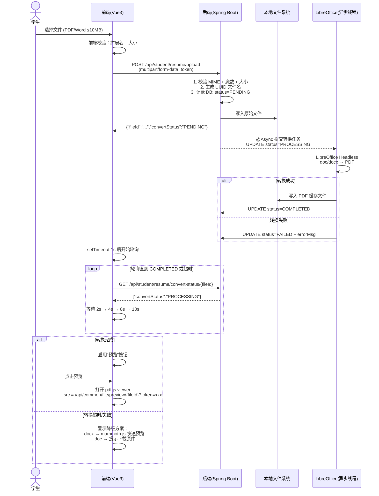
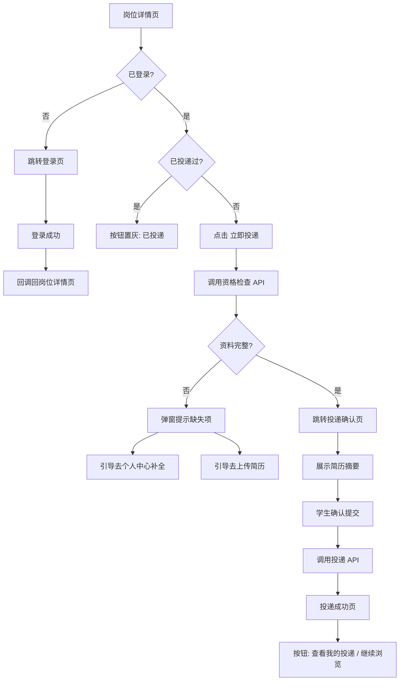

# 接口与界面设计文档

> 基线：`00-技术选型裁决基线.md`（Spring Boot 3.4 + Vue3 + Element Plus + RuoYi-Vue 基座）
> 视觉基线：`品牌视觉规范.md`（色值 `#5FB8D6`、`#0A0E17`、`#152535`、`#5FB88D`、`#E05252`）
> 需求基线：`设计简报.md`（P0 范围）
> 架构基线：`03-架构设计.md`（如已产出）

---

## 一、API 设计规范

### 1.1 URL 命名规范

```
协议: HTTPS（公网）或 HTTP（内网）
域名: 按部署拓扑确定
前缀: /api （RuoYi-Vue 约定）
版本: 不显式加 /v1 —— 一期不考虑多版本共存，URL 中不加版本号以减少路由复杂度。
      如未来需要 API 版本升级，通过请求头 X-API-Version: 2 区分。
```

| 端 | URL 前缀 | 说明 |
|---|---|---|
| 学生端 | `/api/student/` | 学生注册、登录、资料、岗位浏览、投递 |
| HR 端 | `/api/hr/` | 岗位管理、简历管理、导出 |
| 系统管理 | `/api/system/` | 品牌配置、部门、岗位类别、HR账号 |
| 通用 | `/api/common/` | 验证码、文件预览桥接、字典数据 |

### 1.2 HTTP 方法与状态码约定

| 方法 | 用途 | 幂等 |
|---|---|---|
| GET | 查询、读取 | 是 |
| POST | 创建、提交 | 否 |
| PUT | 全量更新 | 是 |
| PATCH | 局部更新（如状态变更） | 是 |
| DELETE | 删除 | 是 |

**HTTP 状态码使用：**

| 状态码 | 场景 |
|---|---|
| 200 | 成功（含业务错误时也用 200 + 业务错误码，见 1.4） |
| 400 | 参数校验失败 |
| 401 | 未认证（token 过期/无效/缺失） |
| 403 | 无权限 |
| 404 | 资源不存在 |
| 413 | 文件超过大小限制 |
| 415 | 文件类型不支持 |
| 500 | 服务器内部错误 |

### 1.3 统一响应体结构

采用 RuoYi-Vue 的 `AjaxResult` 模式，所有接口返回 JSON。

#### 成功响应

```json
{
  "code": 200,
  "msg": "操作成功",
  "data": { ... }
}
```

#### 分页成功响应

```json
{
  "code": 200,
  "msg": "查询成功",
  "data": {
    "rows": [ ... ],
    "total": 152
  }
}
```

#### 业务错误响应

```json
{
  "code": 10001,
  "msg": "手机号已注册",
  "data": null
}
```

> **约定**：HTTP 状态码始终为 200（除非框架级 400/401/403/404/413/415/500）。业务错误通过 `code` 字段区分。`code = 200` 表示成功，其他为错误码。

#### 参数校验错误响应

```json
{
  "code": 400,
  "msg": "姓名不能为空;手机号格式不正确",
  "data": null
}
```

### 1.4 错误码体系

| 段位 | 范围 | 模块 | 说明 |
|---|---|---|---|
| 1xxxx | 10001–10099 | 通用 | 参数校验、系统异常 |
| 2xxxx | 20001–20099 | 认证与鉴权 | 登录、token、权限 |
| 3xxxx | 30001–30099 | 学生 | 注册、资料、投递 |
| 4xxxx | 40001–40099 | 岗位 | 岗位CRUD |
| 5xxxx | 50001–50099 | 投递 | 投递相关 |
| 6xxxx | 60001–60099 | 文件 | 上传、转换、预览 |

#### P0 错误码全表

| 错误码 | HTTP | 消息 | 说明 |
|---|---|---|---|
| **通用 1xxxx** | | | |
| 10001 | 400 | 参数校验失败: {详情} | 请求参数不合法 |
| 10002 | 500 | 系统内部错误 | 未预期异常 |
| 10003 | 404 | 资源不存在 | 通用 404 |
| 10004 | 400 | 请求过于频繁，请稍后再试 | 限流 |
| **认证 2xxxx** | | | |
| 20001 | 401 | 未登录或登录已过期 | token 缺失/过期 |
| 20002 | 401 | 账号或密码错误 | 登录失败 |
| 20003 | 403 | 无操作权限 | 权限不足 |
| 20004 | 400 | 验证码错误或已过期 | 短信验证码 |
| 20005 | 400 | 验证码发送太频繁，请 60 秒后再试 | 防刷 |
| 20006 | 400 | 账号已被禁用 | 账号状态异常 |
| 20007 | 400 | 密码长度 6-20 位 | 密码格式 |
| **学生 3xxxx** | | | |
| 30001 | 400 | 手机号已注册 | 注册重复 |
| 30002 | 400 | 请先完成基本资料填写 | 投递前置检查 |
| 30003 | 400 | 请先上传简历附件 | 投递前置检查 |
| 30004 | 400 | 教育经历至少填写一条 | 投递前置检查 |
| 30005 | 404 | 学生不存在 | |
| **岗位 4xxxx** | | | |
| 40001 | 404 | 岗位不存在或已下架 | |
| 40002 | 400 | 岗位已截止投递 | 过期 |
| 40003 | 400 | 岗位名称已存在 | 重名检查 |
| **投递 5xxxx** | | | |
| 50001 | 400 | 您已投递过该岗位，不可重复投递 | 防重复 |
| 50002 | 400 | 岗位已截止投递 | 投递时校验 |
| 50003 | 400 | 今日投递次数已达上限 | 可选限流 |
| 50004 | 400 | 指定的简历附件不存在 | 投递时 fileId 校验 |
| **文件 6xxxx** | | | |
| 60001 | 413 | 文件大小超过限制（最大 10MB） | |
| 60002 | 415 | 仅支持 PDF、DOC、DOCX 格式 | 类型校验 |
| 60003 | 400 | 文件内容与扩展名不匹配 | 内容嗅探不通过 |
| 60004 | 400 | 文件上传失败，请重试 | 上传异常 |
| 60005 | 503 | 文件预览正在处理中，请稍后再试 | 转换未完成 |
| 60006 | 500 | 文件转换失败 | LibreOffice 异常 |
| 60007 | 404 | 文件不存在或已被删除 | |

### 1.5 分页参数约定

| 参数名 | 类型 | 默认值 | 说明 |
|---|---|---|---|
| `pageNum` | int | 1 | 页码（从 1 开始） |
| `pageSize` | int | 10 | 每页条数（最大 100） |

响应分页对象：

```json
{
  "rows": [ ... ],
  "total": 152
}
```

### 1.6 排序参数约定

| 参数名 | 类型 | 默认值 | 说明 |
|---|---|---|---|
| `orderByColumn` | string | — | 排序字段名（使用数据库列名，后端白名单校验防注入） |
| `isAsc` | string | "desc" | "asc" 升序 / "desc" 降序 |

### 1.7 时间格式约定

- **API 传输**：统一使用 ISO 8601 格式字符串 `"yyyy-MM-dd HH:mm:ss"`，时区为 `Asia/Shanghai`（北京时间，UTC+8）
- **纯日期**（如出生年月）：`"yyyy-MM-dd"`
- **前端展示**：可由前端按用户习惯格式化，但发往 API 时转回 ISO 8601

---

## 二、鉴权设计

### 2.1 两套独立认证

| 维度 | 学生端 | HR 端 |
|---|---|---|
| 认证方式 | JWT (无状态) | JWT (无状态) |
| 登录接口 | `POST /api/student/auth/login` | `POST /api/hr/auth/login` |
| 签发密钥 | 独立 secret `student-jwt-secret` | 独立 secret `hr-jwt-secret` |
| token 存放 | Header: `Authorization: Bearer <token>` | Header: `Authorization: Bearer <token>` |
| token 有效期 | 7 天（学生场景低频，不宜频繁登录） | 2 小时 + 滑动刷新（后台安全性要求更高） |
| 刷新策略 | 无刷新 token（到期重新登录） | 请求任意接口时若 token 剩余有效期 < 30 分钟，响应头返回新 token |
| 登出 | 前端清除 token（无状态 JWT 不维护服务端黑名单） | 同学生端 |

#### 论证：JWT vs Session（单机场景）

| 因素 | JWT | Session（Cookie） |
|---|---|---|
| 单机部署 | 均无分布式问题 | 均无分布式问题 |
| 前后端分离 | Header 传递，零配置 | 需处理 CORS Cookie（SameSite / Secure） |
| 移动端扩展 | 天然支持 | Cookie 方案移动端兼容性差 |
| RuoYi-Vue 基座 | **已内置 JWT**，直接复用 | 需回退到传统 Session 模式 |
| 登出即失效 | 需引入黑名单（本项目不引入） | 天然支持 |

**结论**：采用 JWT。单机场景下 JWT 的无状态优势虽不明显，但与 RuoYi-Vue 基座一致，零适配成本。登出"即时失效"需求在本项目中不关键（HR 端 2 小时自动过期覆盖风险），不引入 token 黑名单。

### 2.2 接口权限标注

HR 端沿用 RuoYi-Vue 的 RBAC 权限体系，在 Controller 方法上使用 `@PreAuthorize` 注解：

```java
// 示例：岗位管理权限
@PreAuthorize("@ss.hasPermi('hr:job:edit')")
@PutMapping("/job/{id}")
public AjaxResult updateJob(@PathVariable Long id, @RequestBody JobDTO dto) { ... }

// 示例：角色要求
@PreAuthorize("@ss.hasRole('admin')")
@DeleteMapping("/job/{id}")
public AjaxResult deleteJob(@PathVariable Long id) { ... }
```

权限标识命名规范：`{端}:{模块}:{操作}`，如 `hr:resume:list`、`hr:resume:export`、`system:config:edit`。

学生端不引入角色权限，统一通过 JWT 中携带的 `studentId` 做身份识别。

### 2.3 学生越权防护

学生只能操作自己的数据，在接口层通过以下机制强制：

```java
// Controller 层：从 JWT 提取当前学生 ID，不信任前端传入
Long currentStudentId = SecurityUtils.getLoginStudentId();

// Service 层：所有涉及学生数据的查询/修改都带 student_id 条件
resumeService.findByIdAndStudentId(resumeId, currentStudentId);

// 投递时：投递记录自动绑定当前登录学生
application.setStudentId(currentStudentId);
```

**铁律**：学生端接口绝不允许从请求体/URL 参数中读取 `studentId`，一律从 token 中提取。

---

## 三、完整 API 清单（P0 全覆盖）

### 3.1 学生端认证

#### S-AUTH-001：发送短信验证码

```
POST /api/student/auth/send-code
权限: 无（匿名）
限流: 同一手机号 60 秒内仅可发送 1 次；同一 IP 每小时 10 次
```

**请求：**
```json
{
  "phone": "13800138000",
  "captchaUuid": "uuid-from-graphic-captcha",
  "captchaCode": "a3f2"
}
```

**响应：**
```json
{
  "code": 200,
  "msg": "验证码已发送",
  "data": null
}
```

> 说明：`captchaUuid` 和 `captchaCode` 来自图形验证码接口。图形验证码接口复用 RuoYi-Vue 内置的 `/api/common/captcha`，前端输入正确图形验证码后才能触发短信发送，防止自动化脚本批量刷短信。

#### S-AUTH-002：学生注册

```
POST /api/student/auth/register
权限: 无
```

**请求：**
```json
{
  "phone": "13800138000",
  "smsCode": "123456",
  "password": "Abc@1234",
  "agreePrivacy": true
}
```

**响应：**
```json
{
  "code": 200,
  "msg": "注册成功",
  "data": {
    "token": "eyJhbGciOiJIUzI1NiIs...（JWT token）"
  }
}
```

> 注册成功即视为已登录，直接返回 token，学生无需再走登录流程。

#### S-AUTH-003：密码登录

```
POST /api/student/auth/login
权限: 无
```

**请求：**
```json
{
  "phone": "13800138000",
  "password": "Abc@1234"
}
```

**响应：**
```json
{
  "code": 200,
  "msg": "登录成功",
  "data": {
    "token": "eyJhbGciOiJIUzI1NiIs..."
  }
}
```

#### S-AUTH-004：找回密码

```
POST /api/student/auth/reset-password
权限: 无
```

**请求：**
```json
{
  "phone": "13800138000",
  "smsCode": "123456",
  "newPassword": "NewAbc@1234"
}
```

**响应：**
```json
{
  "code": 200,
  "msg": "密码重置成功",
  "data": null
}
```

#### S-AUTH-005：登出

```
POST /api/student/auth/logout
权限: 学生登录态
```

**请求：** 无请求体，仅需携带 token。

**响应：**
```json
{
  "code": 200,
  "msg": "登出成功",
  "data": null
}
```

> 登出为前端行为（清除 token），后端接口仅做日志记录。

### 3.2 学生端资料

#### S-PROFILE-001：获取基本资料

```
GET /api/student/profile
权限: 学生登录态
```

**响应：**
```json
{
  "code": 200,
  "msg": "查询成功",
  "data": {
    "studentId": 1,
    "name": "张三",
    "gender": "男",
    "birthDate": "2000-05-15",
    "phone": "13800138000",
    "email": "zhangsan@example.com",
    "nativePlace": "北京市",
    "currentCity": "北京市",
    "avatarUrl": null
  }
}
```

#### S-PROFILE-002：保存/更新基本资料

```
PUT /api/student/profile
权限: 学生登录态
```

**请求：**
```json
{
  "name": "张三",
  "gender": "男",
  "birthDate": "2000-05-15",
  "email": "zhangsan@example.com",
  "nativePlace": "北京市",
  "currentCity": "北京市"
}
```

**响应：**
```json
{
  "code": 200,
  "msg": "保存成功",
  "data": null
}
```

#### S-EDU-001：获取教育经历列表

```
GET /api/student/educations
权限: 学生登录态
```

**响应：**
```json
{
  "code": 200,
  "msg": "查询成功",
  "data": [
    {
      "eduId": 1,
      "schoolName": "北京航空航天大学",
      "major": "飞行器设计与工程",
      "degree": "硕士",
      "startDate": "2024-09-01",
      "endDate": "2027-06-30",
      "gpa": "3.8/4.0",
      "gpaRank": "前 10%",
      "sortOrder": 1
    }
  ]
}
```

#### S-EDU-002：新增教育经历

```
POST /api/student/educations
权限: 学生登录态
```

**请求：**
```json
{
  "schoolName": "北京航空航天大学",
  "major": "飞行器设计与工程",
  "degree": "硕士",
  "startDate": "2024-09-01",
  "endDate": "2027-06-30",
  "gpa": "3.8/4.0",
  "gpaRank": "前 10%"
}
```

**响应：**
```json
{
  "code": 200,
  "msg": "添加成功",
  "data": { "eduId": 1 }
}
```

#### S-EDU-003：更新教育经历

```
PUT /api/student/educations/{eduId}
权限: 学生登录态 + 数据归属校验
```

#### S-EDU-004：删除教育经历

```
DELETE /api/student/educations/{eduId}
权限: 学生登录态 + 数据归属校验
```

#### S-RESUME-001：上传简历附件

```
POST /api/student/resume/upload
权限: 学生登录态
Content-Type: multipart/form-data
```

**请求表单：**
| 字段 | 类型 | 说明 |
|---|---|---|
| file | File | PDF/DOC/DOCX，≤10MB |
| name | String | 可选，附件显示名称 |

**响应：**
```json
{
  "code": 200,
  "msg": "上传成功",
  "data": {
    "fileId": "f3a2b1c4d5e6...",
    "originalName": "张三_北航_飞行器设计.pdf",
    "fileSize": 2457600,
    "convertStatus": "PROCESSING"
  }
}
```

> `convertStatus` 枚举：`PENDING` → `PROCESSING` → `COMPLETED` / `FAILED`。详见第四节。

#### S-RESUME-002：获取简历附件列表

```
GET /api/student/resume/files
权限: 学生登录态
```

**响应：**
```json
{
  "code": 200,
  "msg": "查询成功",
  "data": [
    {
      "fileId": "f3a2b1c4d5e6...",
      "originalName": "张三_北航_飞行器设计.pdf",
      "fileSize": 2457600,
      "uploadTime": "2026-08-05 14:30:00",
      "convertStatus": "COMPLETED"
    }
  ]
}
```

#### S-RESUME-003：删除简历附件

```
DELETE /api/student/resume/files/{fileId}
权限: 学生登录态 + 数据归属校验
```

**响应：**
```json
{
  "code": 200,
  "msg": "删除成功",
  "data": null
}
```

#### S-RESUME-004：预览简历附件

```
GET /api/student/resume/preview/{fileId}
权限: 学生登录态 + 数据归属校验
```

**响应：** 302 重定向到 pdf.js 渲染页面，或直接返回 PDF 流（取决于前端实现方式）。详见第四节。

### 3.3 学生端岗位

#### S-JOB-001：岗位列表（分页+筛选+搜索）

```
GET /api/student/jobs
权限: 学生登录态（或可选匿名）
```

**请求参数：**
| 参数 | 类型 | 必填 | 说明 |
|---|---|---|---|
| pageNum | int | 否 | 页码，默认 1 |
| pageSize | int | 否 | 每页条数，默认 10 |
| departmentId | long | 否 | 部门筛选 |
| jobCategory | string | 否 | 岗位类别筛选（如"硬件研发"） |
| workLocation | string | 否 | 工作地点筛选 |
| degreeRequirement | string | 否 | 学历要求筛选 |
| keyword | string | 否 | 关键词搜索（岗位名称+描述） |

**响应：**
```json
{
  "code": 200,
  "msg": "查询成功",
  "data": {
    "rows": [
      {
        "jobId": 1,
        "jobName": "电源研发工程师",
        "departmentName": "研发部",
        "jobCategory": "硬件研发",
        "workLocation": "北京",
        "degreeRequirement": "硕士及以上",
        "labels": ["急聘", "校招专属"],
        "deadline": "2026-10-31",
        "appliedCount": 23,
        "createTime": "2026-08-01 10:00:00"
      }
    ],
    "total": 15
  }
}
```

#### S-JOB-002：岗位筛选选项（下拉数据）

```
GET /api/student/jobs/filter-options
权限: 学生登录态
```

**响应：**
```json
{
  "code": 200,
  "msg": "查询成功",
  "data": {
    "departments": [
      { "id": 1, "name": "研发部" }
    ],
    "jobCategories": ["硬件研发", "软件研发", "职能"],
    "workLocations": ["北京", "上海"],
    "degreeRequirements": ["本科", "硕士", "博士"]
  }
}
```

> 筛选选项从已上架岗位的数据库唯一值中动态聚合，保证选项始终有数据。

#### S-JOB-003：岗位详情

```
GET /api/student/jobs/{jobId}
权限: 学生登录态
```

**响应：**
```json
{
  "code": 200,
  "msg": "查询成功",
  "data": {
    "jobId": 1,
    "jobName": "电源研发工程师",
    "departmentName": "研发部",
    "jobCategory": "硬件研发",
    "workLocation": "北京",
    "degreeRequirement": "硕士及以上",
    "majorRequirement": "电气工程、电力电子、自动化等相关专业",
    "responsibilities": "<h3>岗位职责</h3><ul><li>负责航天器电源系统方案设计...</li></ul>",
    "requirements": "<h3>任职要求</h3><ul><li>硕士及以上学历...</li></ul>",
    "labels": ["急聘", "校招专属"],
    "deadline": "2026-10-31",
    "status": "ONLINE",
    "appliedCount": 23
  }
}
```

### 3.4 学生端投递

#### S-APP-001：投递前预览（获取简历摘要）

```
GET /api/student/applications/preview?jobId=1
权限: 学生登录态
```

**响应：**
```json
{
  "code": 200,
  "msg": "查询成功",
  "data": {
    "jobName": "电源研发工程师",
    "studentName": "张三",
    "phone": "138****8000",
    "email": "zha***@example.com",
    "gender": "男",
    "birthDate": "2000-05",
    "schoolName": "北京航空航天大学",
    "major": "飞行器设计与工程",
    "degree": "硕士",
    "gpa": "3.8/4.0",
    "resumeFileName": "张三_北航_飞行器设计.pdf",
    "checklist": {
      "profileComplete": true,
      "hasEducation": true,
      "hasResumeFile": true,
      "alreadyApplied": false
    }
  }
}
```

> `checklist` 字段由后端逐项检查并返回，前端据此决定是否允许提交。任一检查项为 `false` 时，前端阻断投递并引导补齐。

#### S-APP-002：提交投递

```
POST /api/student/applications
权限: 学生登录态
```

**请求：**
```json
{
  "jobId": 1,
  "fileId": 5
}
```

> `fileId` 为可选字段（类型 Long），指定投递使用的简历附件 ID。不传时默认取学生附件列表第一条；传入时按 id + studentId 双重校验归属。附件不存在则返回错误码 `50004`（"指定的简历附件不存在"）。

**响应：**
```json
{
  "code": 200,
  "msg": "投递成功",
  "data": {
    "applicationId": 42,
    "status": "待筛选",
    "applyTime": "2026-08-06 15:30:00"
  }
}
```

#### S-APP-003：投递资格前置检查

```
GET /api/student/applications/check-eligibility?jobId=1
权限: 学生登录态
```

**响应：**
```json
{
  "code": 200,
  "msg": "查询成功",
  "data": {
    "eligible": true,
    "errors": []
  }
}
```

**不可投递时：**
```json
{
  "code": 200,
  "msg": "查询成功",
  "data": {
    "eligible": false,
    "errors": [
      "请先完成基本资料填写",
      "请先上传简历附件",
      "教育经历至少填写一条"
    ]
  }
}
```

> 前端在做"立即投递"按钮时可先调用此接口做轻量检查，不必在投递接口中返回大量校验信息。

### 3.5 HR 端认证

#### H-AUTH-001：HR 登录

```
POST /api/hr/auth/login
权限: 无
```

**请求：**
```json
{
  "username": "zhanghr",
  "password": "xxx",
  "captchaUuid": "uuid-from-graphic-captcha",
  "captchaCode": "a3f2"
}
```

> `captchaUuid` 和 `captchaCode` 复用 `/api/common/captcha` 图形验证码。

**响应：**
```json
{
  "code": 200,
  "msg": "登录成功",
  "data": {
    "token": "eyJhbGciOiJIUzI1NiIs..."
  }
}
```

#### H-AUTH-002：获取当前 HR 信息

```
GET /api/hr/auth/current-user
权限: HR 登录态
```

**响应：**
```json
{
  "code": 200,
  "msg": "查询成功",
  "data": {
    "userId": 1,
    "username": "zhanghr",
    "realName": "张经理",
    "avatar": null,
    "roles": ["hr", "hr_manager"],
    "permissions": ["hr:job:*", "hr:resume:*", "hr:report:view"]
  }
}
```

#### H-AUTH-003：HR 登出

```
POST /api/hr/auth/logout
权限: HR 登录态
```

### 3.6 HR 端岗位

#### H-JOB-001：获取岗位列表（HR 后台）

```
GET /api/hr/jobs
权限: hr:job:list
```

**请求参数：**
| 参数 | 类型 | 必填 | 说明 |
|---|---|---|---|
| pageNum | int | 否 | 默认 1 |
| pageSize | int | 否 | 默认 10 |
| jobName | string | 否 | 岗位名称模糊搜索 |
| status | string | 否 | ONLINE / OFFLINE / EXPIRED |
| departmentId | long | 否 | 部门筛选 |
| jobCategory | string | 否 | 岗位类别 |

**响应：**
```json
{
  "code": 200,
  "msg": "查询成功",
  "data": {
    "rows": [
      {
        "jobId": 1,
        "jobName": "电源研发工程师",
        "departmentName": "研发部",
        "jobCategory": "硬件研发",
        "workLocation": "北京",
        "degreeRequirement": "硕士及以上",
        "deadline": "2026-10-31",
        "status": "ONLINE",
        "appliedCount": 23,
        "alreadyPassCount": 5,
        "createTime": "2026-08-01 10:00:00"
      }
    ],
    "total": 8
  }
}
```

#### H-JOB-002：创建岗位

```
POST /api/hr/jobs
权限: hr:job:add
```

**请求：**
```json
{
  "jobName": "电源研发工程师",
  "departmentId": 1,
  "jobCategory": "硬件研发",
  "workLocation": "北京",
  "degreeRequirement": "硕士及以上",
  "majorRequirement": "电气工程、电力电子、自动化等相关专业",
  "responsibilities": "<h3>岗位职责</h3><ul><li>...</li></ul>",
  "requirements": "<h3>任职要求</h3><ul><li>...</li></ul>",
  "labels": ["急聘", "校招专属"],
  "deadline": "2026-10-31"
}
```

**响应：**
```json
{
  "code": 200,
  "msg": "新增成功",
  "data": { "jobId": 9 }
}
```

#### H-JOB-003：编辑岗位

```
PUT /api/hr/jobs/{jobId}
权限: hr:job:edit
```

请求体与创建相同（全量更新）。

#### H-JOB-004：获取岗位详情（编辑回显）

```
GET /api/hr/jobs/{jobId}
权限: hr:job:query
```

#### H-JOB-005：上架/下架岗位

```
PATCH /api/hr/jobs/{jobId}/status
权限: hr:job:edit
```

**请求：**
```json
{
  "status": "OFFLINE"
}
```

**响应：**
```json
{
  "code": 200,
  "msg": "操作成功",
  "data": null
}
```

#### H-JOB-006：删除岗位

```
DELETE /api/hr/jobs/{jobId}
权限: hr:job:remove
```

> 有关联投递记录的岗位不可物理删除（提示"该岗位已有 N 条投递记录，只能下架不能删除"）。

### 3.7 HR 端简历管理

这是 HR 使用频率最高的模块，接口设计需支持高效操作。

#### H-RESUME-001：简历列表（多维筛选+分页+排序）

```
GET /api/hr/resumes
权限: hr:resume:list
```

**请求参数：**
| 参数 | 类型 | 必填 | 说明 |
|---|---|---|---|
| pageNum | int | 否 | 默认 1 |
| pageSize | int | 否 | 默认 20（HR 列表密） |
| jobId | long | 否 | 按岗位筛选 |
| status | string | 否 | 待筛选 / 筛选通过 / 已淘汰 |
| schoolName | string | 否 | 学校名称模糊搜索 |
| degree | string | 否 | 本科 / 硕士 / 博士 |
| keyword | string | 否 | 姓名/专业/学校关键词 |
| orderByColumn | string | 否 | 排序字段：apply_time / school_name / degree |
| isAsc | string | 否 | asc / desc，默认 desc |

**响应：**
```json
{
  "code": 200,
  "msg": "查询成功",
  "data": {
    "rows": [
      {
        "applicationId": 42,
        "studentId": 1,
        "studentName": "张三",
        "schoolName": "北京航空航天大学",
        "major": "飞行器设计与工程",
        "degree": "硕士",
        "jobName": "电源研发工程师",
        "status": "待筛选",
        "applyTime": "2026-08-05 14:30:00",
        "hasResumeFile": true
      }
    ],
    "total": 152
  }
}
```

#### H-RESUME-002：简历详情

```
GET /api/hr/resumes/{applicationId}
权限: hr:resume:query
```

**响应：**
```json
{
  "code": 200,
  "msg": "查询成功",
  "data": {
    "applicationId": 42,
    "status": "待筛选",
    "applyTime": "2026-08-05 14:30:00",
    "student": {
      "studentId": 1,
      "name": "张三",
      "gender": "男",
      "birthDate": "2000-05-15",
      "phone": "13800138000",
      "email": "zhangsan@example.com",
      "nativePlace": "北京市",
      "currentCity": "北京市"
    },
    "educations": [
      {
        "schoolName": "北京航空航天大学",
        "major": "飞行器设计与工程",
        "degree": "硕士",
        "startDate": "2024-09-01",
        "endDate": "2027-06-30",
        "gpa": "3.8/4.0",
        "gpaRank": "前 10%"
      }
    ],
    "resumeFiles": [
      {
        "fileId": "f3a2b1c4d5e6...",
        "originalName": "张三_北航_飞行器设计.pdf",
        "fileSize": 2457600,
        "convertStatus": "COMPLETED"
      }
    ],
    "hrNote": {
      "noteId": 5,
      "content": "专业匹配度高，GPA 优秀，建议优先面试",
      "updateTime": "2026-08-06 10:00:00",
      "updateBy": "张经理"
    },
    "job": {
      "jobId": 1,
      "jobName": "电源研发工程师",
      "departmentName": "研发部",
      "jobCategory": "硬件研发",
      "workLocation": "北京"
    }
  }
}
```

#### H-RESUME-003：预览简历附件

```
GET /api/hr/resumes/{applicationId}/preview/{fileId}
权限: hr:resume:query
```

返回 PDF 流或 302 到 pdf.js 渲染页面。详见第四节。

#### H-RESUME-004：添加/更新内部备注

```
PUT /api/hr/resumes/{applicationId}/note
权限: hr:resume:edit
```

**请求：**
```json
{
  "content": "专业匹配度高，GPA 优秀，建议优先面试"
}
```

**响应：**
```json
{
  "code": 200,
  "msg": "保存成功",
  "data": {
    "noteId": 5,
    "content": "专业匹配度高，GPA 优秀，建议优先面试",
    "updateTime": "2026-08-06 10:00:00",
    "updateBy": "张经理"
  }
}
```

#### H-RESUME-005：单个筛选操作

```
PATCH /api/hr/resumes/{applicationId}/status
权限: hr:resume:edit
```

**请求：**
```json
{
  "status": "筛选通过"
}
```

**响应：**
```json
{
  "code": 200,
  "msg": "操作成功",
  "data": { "status": "筛选通过" }
}
```

#### H-RESUME-006：批量筛选操作

```
PATCH /api/hr/resumes/batch-status
权限: hr:resume:edit
```

**请求：**
```json
{
  "applicationIds": [42, 43, 45, 47],
  "status": "已淘汰"
}
```

**响应：**
```json
{
  "code": 200,
  "msg": "操作成功，共处理 4 条",
  "data": { "successCount": 4, "failCount": 0 }
}
```

#### H-RESUME-007：导出简历 Excel

```
POST /api/hr/resumes/export
权限: hr:resume:export
```

**请求：**
```json
{
  "applicationIds": [42, 43, 45, 47],
  "fields": ["studentName", "phone", "email", "schoolName", "major", "degree", "gpa", "jobName", "status", "applyTime"]
}
```

> 不传 `applicationIds` 则导出当前筛选条件下全部简历（由 GET 参数传递筛选条件）。
> `fields` 不传则导出全部默认字段。

**响应：** 二进制流，`Content-Type: application/vnd.openxmlformats-officedocument.spreadsheetml.sheet`，`Content-Disposition: attachment; filename="简历导出_20260806.xlsx"`。

#### H-RESUME-008：批量下载简历附件

```
POST /api/hr/resumes/download-attachments
权限: hr:resume:export
```

**请求：**
```json
{
  "applicationIds": [42, 43, 45]
}
```

**响应：** ZIP 文件流，`Content-Type: application/zip`，`Content-Disposition: attachment; filename="简历附件_电源研发工程师_20260806.zip"`。

> ZIP 内部按 `{学生姓名}_{文件名}` 组织，避免文件名冲突。

### 3.8 系统管理

#### SYS-CONFIG-001：获取品牌配置

```
GET /api/system/config/brand
权限: system:config:query
```

**响应：**
```json
{
  "code": 200,
  "msg": "查询成功",
  "data": {
    "companyName": "遨天科技（北京）有限公司",
    "companySlogan": "赋能人类太空活动",
    "logoUrl": "/profile/upload/logo/logo-75847c49.png",
    "brandColor": "#5FB8D6",
    "brandColorRgb": "95 184 214",
    "bgColor": "#0A0E17",
    "cardColor": "#152535"
  }
}
```

#### SYS-CONFIG-002：更新品牌配置

```
PUT /api/system/config/brand
权限: system:config:edit
```

请求体与获取结构一致，全量更新。

#### SYS-BANNER-001：获取 Banner/公告列表

```
GET /api/system/banners
权限: system:config:query
```

#### SYS-BANNER-002：新增/编辑/删除 Banner 公告

```
POST   /api/system/banners   — 新增 (system:config:add)
PUT    /api/system/banners/{id} — 编辑 (system:config:edit)
DELETE /api/system/banners/{id} — 删除 (system:config:remove)
```

**Banner 数据结构：**
```json
{
  "bannerId": 1,
  "title": "遨天科技 2026 校园招聘正式启动",
  "imageUrl": "/profile/upload/banner/campus-2026.jpg",
  "linkUrl": null,
  "type": "BANNER",
  "sortOrder": 1,
  "status": "ONLINE",
  "startTime": "2026-08-01 00:00:00",
  "endTime": "2026-12-31 23:59:59"
}
```

> `type` 枚举：`BANNER`（首页轮播图）、`NOTICE`（公告文字条）。

#### SYS-DEPT-001：部门管理 CRUD

```
GET    /api/system/departments        — 部门列表/树 (system:dept:list)
GET    /api/system/departments/{id}   — 部门详情 (system:dept:query)
POST   /api/system/departments        — 新增 (system:dept:add)
PUT    /api/system/departments/{id}   — 编辑 (system:dept:edit)
DELETE /api/system/departments/{id}   — 删除 (system:dept:remove)
```

> 有子部门或关联岗位的不可删除。

#### SYS-CATEGORY-001：岗位类别管理

```
GET    /api/system/categories        — 列表 (system:category:list)
POST   /api/system/categories        — 新增 (system:category:add)
PUT    /api/system/categories/{id}   — 编辑 (system:category:edit)
DELETE /api/system/categories/{id}   — 删除 (system:category:remove)
```

**岗位类别数据结构：**
```json
{
  "categoryId": 1,
  "categoryName": "硬件研发",
  "categoryCode": "HW_RD",
  "sortOrder": 1,
  "status": "0",
  "remark": "电源/结构/控制/测试/工艺等岗位"
}
```

> **预置数据**：系统首次启动时初始化以下类别（基于品牌规范§5.5 业务板块）：
> - 硬件研发（电源、结构、控制、测试、工艺等电推进与推力矢量硬件岗）
> - 软件研发（数据平台、算法、前后端、低代码等数智业务岗）
> - 职能（人力资源、财务、行政、法务等）

#### SYS-USER-001：HR 账号管理

```
GET    /api/system/hr-users           — 列表 (system:user:list)
GET    /api/system/hr-users/{id}      — 详情 (system:user:query)
POST   /api/system/hr-users           — 新增 (system:user:add)
PUT    /api/system/hr-users/{id}      — 编辑 (system:user:edit)
DELETE /api/system/hr-users/{id}      — 删除 (system:user:remove)
PATCH  /api/system/hr-users/{id}/reset-pwd — 重置密码 (system:user:resetPwd)
```

> HR 账号管理复用 RuoYi-Vue 内置的 `sys_user` + `sys_role` + `sys_menu` 体系，无需新建表。接口路径映射到 RuoYi 内置 Controller。

### 3.9 报表（P0 必须）

#### H-REPORT-001：投递总量趋势

```
GET /api/hr/reports/application-trend
权限: hr:report:view
```

**请求参数：**
| 参数 | 类型 | 说明 |
|---|---|---|
| startDate | string | 起始日期 |
| endDate | string | 截止日期 |
| granularity | string | day / week / month |

**响应：**
```json
{
  "code": 200,
  "msg": "查询成功",
  "data": [
    { "date": "2026-08-01", "count": 12 },
    { "date": "2026-08-02", "count": 8 },
    { "date": "2026-08-03", "count": 15 }
  ]
}
```

#### H-REPORT-002：岗位投递排行

```
GET /api/hr/reports/job-ranking
权限: hr:report:view
```

**请求参数：**
| 参数 | 类型 | 说明 |
|---|---|---|
| topN | int | 取前 N，默认 10 |

**响应：**
```json
{
  "code": 200,
  "msg": "查询成功",
  "data": [
    { "jobName": "电源研发工程师", "appliedCount": 48, "passCount": 8, "passRate": "16.7%" },
    { "jobName": "控制算法工程师", "appliedCount": 35, "passCount": 6, "passRate": "17.1%" }
  ]
}
```

#### H-REPORT-003：学校分布

```
GET /api/hr/reports/school-distribution
权限: hr:report:view
```

**响应：**
```json
{
  "code": 200,
  "msg": "查询成功",
  "data": [
    { "schoolName": "北京航空航天大学", "count": 25, "rate": "16.4%" },
    { "schoolName": "哈尔滨工业大学", "count": 18, "rate": "11.8%" }
  ]
}
```

#### H-REPORT-004：学历分布

```
GET /api/hr/reports/degree-distribution
权限: hr:report:view
```

**响应：**
```json
{
  "code": 200,
  "msg": "查询成功",
  "data": [
    { "degree": "硕士", "count": 98, "rate": "64.5%" },
    { "degree": "博士", "count": 35, "rate": "23.0%" },
    { "degree": "本科", "count": 19, "rate": "12.5%" }
  ]
}
```

#### H-REPORT-005：筛选通过率

```
GET /api/hr/reports/pass-rate
权限: hr:report:view
```

**请求参数：**
| 参数 | 类型 | 说明 |
|---|---|---|
| jobId | long | 按岗位（可选） |
| departmentId | long | 按部门（可选） |

**响应：**
```json
{
  "code": 200,
  "msg": "查询成功",
  "data": {
    "totalApplications": 152,
    "pendingCount": 80,
    "passCount": 30,
    "eliminatedCount": 42,
    "passRate": "19.7%"
  }
}
```

### 3.10 字典与通用

#### COMMON-001：字典数据

```
GET /api/common/dict-data/{dictType}
权限: 无（公开字典）
```

> 复用 RuoYi-Vue 内置字典接口。预置以下字典类型：
> - `sys_user_sex`：性别（男/女）
> - `campus_degree`：学历（本科/硕士/博士）
> - `campus_job_category`：岗位类别
> - `campus_application_status`：投递状态（待筛选/筛选通过/已淘汰）

---

## 四、文件上传 / 下载 / 预览接口

### 4.1 设计决策

| 决策项 | 结论 | 理由 |
|---|---|---|
| 上传策略 | **单次上传，不分片** | 10MB 限制下分片无必要；增加前后端复杂度 |
| 存储位置 | 本地文件系统，`D:\campus-data\upload\` | 技术选型已裁定本地存储 |
| 访问方式 | 文件不可通过 URL 直接访问，必须走鉴权接口 | 简历含个人信息，必须防遍历 |
| 预览技术 | PDF → pdf.js；Word → LibreOffice 转 PDF → pdf.js；兜底 → mammoth.js | 技术选型已裁定 |
| 转换时机 | 上传时异步转换，缓存结果 | 不能在预览请求时同步转换（HR 等待不可接受） |

### 4.2 类型白名单与安全校验

| 校验层 | 方法 | 拒绝条件 |
|---|---|---|
| 扩展名 | 白名单 `.pdf` `.doc` `.docx` | 不在白名单 |
| MIME | 请求头 `Content-Type` 校验 | 不在 `application/pdf` `application/msword` `application/vnd.openxmlformats-officedocument.wordprocessingml.document` |
| 大小 | 请求体长度校验 | > 10MB (10485760 bytes) |
| 魔数 | 读取文件头 4 字节 | `.pdf` 头不是 `%PDF`；`.doc` 头不是 `D0CF11E0`；`.docx` 头不是 `504B0304` |

> 魔数校验为强制项。禁止仅依赖扩展名和 MIME（改扩展名即可绕过）。

### 4.3 转换状态字段

| 状态值 | 说明 | 前端行为 |
|---|---|---|
| `PENDING` | 已入库，等待转换 | 显示"处理中" |
| `PROCESSING` | LibreOffice 正在转换 | 显示"处理中" + 轮询 |
| `COMPLETED` | 转换成功，PDF 缓存可用 | 直接预览 |
| `FAILED` | 转换失败 | 显示"预览不可用，请下载原件" + 兜底 mammoth.js |

### 4.4 转换状态轮询接口

```
GET /api/student/resume/convert-status/{fileId}
权限: 学生登录态 + 数据归属校验
```

**响应 (PROCESSING)：**
```json
{
  "code": 200,
  "msg": "查询成功",
  "data": {
    "fileId": "f3a2b1c4d5e6...",
    "convertStatus": "PROCESSING",
    "message": "文件转换中，请稍候..."
  }
}
```

**响应 (COMPLETED)：**
```json
{
  "code": 200,
  "msg": "查询成功",
  "data": {
    "fileId": "f3a2b1c4d5e6...",
    "convertStatus": "COMPLETED",
    "message": "预览就绪"
  }
}
```

**响应 (FAILED)：**
```json
{
  "code": 200,
  "msg": "查询成功",
  "data": {
    "fileId": "f3a2b1c4d5e6...",
    "convertStatus": "FAILED",
    "message": "文件转换失败，请下载原件查看"
  }
}
```

> 前端轮询策略：首次 1s → 2s → 4s → 8s → 10s（指数退避，最多等待 60s，超时提示"处理超时"）。

### 4.5 预览接口

```
GET /api/common/file/preview/{fileId}?token={jwt-token}
权限: 携带有效 token（学生或 HR）
```

**行为：**
- 文件为 PDF 或已转换完成的 Word：返回 `Content-Type: application/pdf`，前端用 pdf.js 嵌入渲染
- 文件为 docx 且转换中/失败：返回状态码 503（`code: 60005`），前端改用 mammoth.js 降级渲染
- `token` 参数为 JWT，后端校验后流式输出文件，不在 URL 路径中暴露真实存储路径

> 为什么不直接用 Header 传 token？pdf.js 的 `<iframe>` 嵌入方式不便于自定义请求头，URL 参数传 token 是 pdf.js 嵌入场景的务实方案。token 通过 HTTPS 传输不会被中间人截获。

### 4.6 下载接口

```
GET /api/common/file/download/{fileId}?token={jwt-token}
权限: 携带有效 token
```

**行为：**
- 返回原始文件流，`Content-Disposition: attachment; filename*=UTF-8''{编码后的文件名}`
- 文件名使用 UTF-8 编码，确保中文文件名在浏览器中正确显示
- 不支持直接 URL 猜测下载（存储路径为 UUID 命名，不可遍历）

### 4.7 上传 → 异步转换 → 预览 时序图



> **降级路径说明**：Word (.docx) 文件，若 LibreOffice 转换失败（如 LO 未安装、超时、文件损坏），前端调用 mammoth.js 纯前端渲染 .docx 内容为 HTML 预览。.doc 老格式 mammoth.js 不支持，直接提示下载。

### 4.8 批量下载打包流程

HR 端批量下载简历附件时，后端流程：

1. 从请求体获取 `applicationIds` 列表
2. 查询每个投递记录的简历附件 `fileId`
3. 逐个从本地文件系统读取原始文件
4. 用 `java.util.zip.ZipOutputStream` 打包为 ZIP
5. ZIP 内部路径：`{学生姓名}_{原始文件名}`
6. 流式输出（不在磁盘上生成临时 ZIP 文件）

---

## 五、前端页面清单

### 5.1 学生端门户

| 序号 | 页面 | 路由路径 | 职责 | 主要组件 | 调用的 API | 权限 |
|---|---|---|---|---|---|---|
| 1 | 首页/门户 | `/` | 深空风品牌门户：Banner轮播、公告条、在招岗位卡片流（分页）、公司介绍模块、页脚 | 自定义 Banner 组件、公告滚动条、岗位卡片组、公司介绍模块 | S-JOB-001、SYS-BANNER-001、SYS-CONFIG-001 | 匿名可访问（岗位列表可匿名浏览） |
| 2 | 注册页 | `/register` | 手机号+验证码注册 | 手机号输入、短信验证码、密码设置、隐私政策勾选 | S-AUTH-001、S-AUTH-002 | 匿名 |
| 3 | 登录页 | `/login` | 密码登录 / 找回密码入口 | 手机号输入、密码输入 | S-AUTH-003、S-AUTH-004 | 匿名 |
| 4 | 岗位详情页 | `/jobs/:id` | 展示岗位JD完整信息，"立即投递"入口 | 富文本渲染（v-html）、投递按钮（已投递禁用态） | S-JOB-003、S-APP-003 | 需登录（未登录点投递跳转登录） |
| 5 | 个人中心 | `/profile` | 基本资料填写/编辑 | 表单、日期选择器、城市选择器 | S-PROFILE-001、S-PROFILE-002 | 需登录 |
| 6 | 教育经历 | `/profile/education` | 教育经历CRUD（多条） | 可编辑表格、添加/删除行 | S-EDU-001~004 | 需登录 |
| 7 | 简历附件 | `/profile/resume` | 上传/预览/删除简历附件 | 文件上传（el-upload）、预览弹窗（pdf.js iframe）、转换状态轮询 | S-RESUME-001~004、COMMON-001 | 需登录 |
| 8 | 投递确认页 | `/apply/:jobId` | 投递前预览简历摘要，确认后提交 | 简历摘要卡片、checkbox 确认、提交按钮 | S-APP-001、S-APP-002 | 需登录 |

### 5.2 HR 端后台

| 序号 | 页面 | 路由路径 | 职责 | 主要组件 | 调用的 API | 权限 |
|---|---|---|---|---|---|---|
| 1 | HR 登录 | `/hr/login` | HR 账号密码登录 | 用户名、密码、图形验证码 | H-AUTH-001 | 匿名 |
| 2 | 岗位列表 | `/hr/jobs` | 查看/筛选/分页各岗位及投递统计 | el-table、筛选器行、上下架开关 | H-JOB-001、H-JOB-005 | hr:job:list |
| 3 | 岗位创建/编辑 | `/hr/jobs/create`、`/hr/jobs/:id/edit` | 富文本JD编辑 | el-form、富文本编辑器（TinyMCE/Quill）、标签输入 | H-JOB-002、H-JOB-003、H-JOB-004、SYS-DEPT-001、SYS-CATEGORY-001 | hr:job:add / hr:job:edit |
| 4 | **简历列表** | `/hr/resumes` | 多维筛选+排序+分页+批量操作（使用最高频） | el-table（可多选）、筛选器面板、批量操作栏、状态标签、键盘快捷键绑定 | H-RESUME-001、H-RESUME-006、H-RESUME-007、H-RESUME-008 | hr:resume:list |
| 5 | **简历详情** | `/hr/resumes/:id` | 左右分栏：左侧结构化资料 + 右侧PDF预览 | 结构化信息卡片组、pdf.js 嵌入预览、内部备注编辑区 | H-RESUME-002、H-RESUME-003、H-RESUME-004、H-RESUME-005 | hr:resume:query |
| 6 | 数据报表 | `/hr/reports` | 图表仪表盘：趋势图、排行、分布 | ECharts 图表组（折线/柱状/饼图）、日期范围选择器 | H-REPORT-001~005 | hr:report:view |

### 5.3 系统管理端

| 序号 | 页面 | 路由路径 | 职责 | 主要组件 | 调用的 API | 权限 |
|---|---|---|---|---|---|---|
| 1 | 品牌配置 | `/system/config` | 公司名称/Logo/Banner/公告/品牌色 | el-form、颜色选择器、图片上传、公告列表 | SYS-CONFIG-001~002、SYS-BANNER-001~002 | system:config:* |
| 2 | 部门管理 | `/system/departments` | 部门树形管理 | el-tree + el-table | SYS-DEPT-001 | system:dept:* |
| 3 | 岗位类别 | `/system/categories` | 岗位类别CRUD | el-table | SYS-CATEGORY-001 | system:category:* |
| 4 | HR 账号管理 | `/system/hr-users` | HR账号+角色 | el-table、角色选择器 | SYS-USER-001 | system:user:* |
| 5 | 角色权限 | `/system/roles` | 角色+菜单权限树 | RuoYi-Vue 内置页面 | RuoYi 内置接口 | system:role:* |

> 系统管理端页面 4-5 复用 RuoYi-Vue 内置页面，仅需调整样式以适配 HR 后台浅色主题。

---

## 六、关键界面交互设计

### 6.1 学生端投递流程



> **最短路径**：已登录 + 资料完整 → 岗位详情 → 投递确认 → 提交（**3 步**）
> **未登录时**：登录后 `?redirect=/jobs/1` 回跳，Vue Router 的 `next({path: to.query.redirect})` 实现

### 6.2 学生端门户视觉落地

#### 首页模块结构（从上到下）

```
┌──────────────────────────────────────────┐
│ 顶栏 (固定 72px)                          │
│ Logo | 导航: 首页/岗位/个人中心 | 登录/注册│
│ 背景: #0A0E17, 文字: #FFFFFF              │
├──────────────────────────────────────────┤
│ Banner 轮播区 (全宽, 600px高)             │
│ 背景图 + 半透明遮罩 `rgba(0,0,0,.4)`      │
│ 标语: "赋能人类太空活动" (32px, #FFFFFF)   │
│ CTA 按钮: "立即投递" (#5FB8D6 底色+白字)  │
├──────────────────────────────────────────┤
│ 公告滚动条 (60px)                         │
│ "📢 遨天科技 2026 校园招聘正式启动"       │
│ 背景: #152535, 文字: #9CA3AF              │
├──────────────────────────────────────────┤
│ 在招岗位 (卡片网格, 最大1200px居中)       │
│ 每行 3 列 (桌面) / 2 列 (平板) / 1 列(手机)│
│ 卡片背景: #152535, 圆角 12px              │
│ 岗位名(#FFFFFF)、地点/学历(#9CA3AF)       │
│ 标签 (#5FB8D6-20 底 + #5FB8D6 字)        │
│ 底部分页器                                │
├──────────────────────────────────────────┤
│ 关于遨天 (全宽深色区)                     │
│ 企业精神 + 数据背书 (200+/5kW+/100%/LEO)  │
│ 背景: --bg-dark #050507                   │
├──────────────────────────────────────────┤
│ 页脚 (80px)                               │
│ © 2026 遨天科技 + ICP备案 + 联系邮箱      │
│ 背景: #0A0E17, 文字: #9CA3AF             │
└──────────────────────────────────────────┘
```

#### 移动端适配要点

| 项 | 桌面 (≥1200px) | 平板 (768-1199px) | 手机 (<768px) |
|---|---|---|---|
| 顶栏高度 | 72px | 64px | 56px |
| 导航 | 水平展开 | 水平展开 | 汉堡菜单 |
| 岗位卡片 | 3 列 | 2 列 | 1 列 |
| 字号 | 16px base | 14px base | 14px base |
| Banner 高度 | 600px | 400px | 250px |
| 搜索筛选 | 水平展开 | 水平展开 | 底部弹窗（避免占用首屏空间） |

#### 字体落地

```css
/* 学生端门户 */
body {
  font-family: "PingFang SC", "Microsoft YaHei", "Hiragino Sans GB",
               "Source Han Sans SC", "Noto Sans SC", sans-serif;
  background-color: #0A0E17;
  color: #FFFFFF;
}

/* HR 后台 */
body.hr-admin {
  font-family: "PingFang SC", "Microsoft YaHei", "Hiragino Sans GB",
               "Helvetica Neue", Arial, sans-serif;
  background-color: #f5f7fa;
  color: #303133;
}
```

> Rajdhani / Share Tech Mono 两个英文字体以**自托管 Web Font** 方式加载，仅用于学生端门户的英文数字展示元素（如 200+ / 5kW+ 等数据背书）。不依赖 Google Fonts CDN。

### 6.3 HR 端简历列表页（最高频页面）

#### 布局

```
┌─────────────────────────────────────────────┐
│ 筛选栏                                        │
│ [岗位▼] [状态▼] [学历▼] [学校名称...] [关键词...] │
│                    [查询] [重置] [导出Excel]  │
├─────────────────────────────────────────────┤
│ 批量操作栏 (选中 N 条时出现)                   │
│ ☐ 全选 | [批量通过] [批量淘汰] [批量下载附件]  │
├─────────────────────────────────────────────┤
│ 姓名 │ 学校 │ 专业 │ 学历 │ 投递岗位 │ 时间 │ 状态│
│ ☐ 张三│ 北航 │ 飞行器│ 硕士│电源研发 │08-05│待筛选│
│ ☐ 李四│ 哈工大│ 自动化│ 硕士│控制算法 │08-05│筛选通过│
│ ...                                          │
├─────────────────────────────────────────────┤
│ 分页: < 1 2 3 ... 16 >  共 152 条            │
└─────────────────────────────────────────────┘
```

#### 状态标签配色（使用品牌规范语义色）

| 状态 | 标签颜色 | 背景色 |
|---|---|---|
| 待筛选 | `#9CA3AF` | `#9CA3AF20` |
| 筛选通过 | `#5FB88D` | `#5FB88D20` |
| 已淘汰 | `#E05252` | `#E0525220` |

#### 行点击行为

- 单击行 → 右侧滑出详情面板（Drawer）或跳转详情页
- 双击行 → 跳转简历详情页
- 复选框 → 多选

#### 筛选器布局

- 固定于列表上方，使用 Element Plus `el-form` inline 布局
- 下拉筛选项（岗位/状态/学历）在前，文本输入（学校/关键词）在后
- 筛选条件变化即触发查询（防抖 300ms），不额外点击"查询"按钮——但保留按钮供习惯使用

### 6.4 HR 端简历详情页（布局方案）

**结论：左右分栏，比例为 5:5（桌面）/ 上:下（移动端自动切换）**

```
┌──────────────────────┬──────────────────────┐
│ 左侧: 结构化资料(50%) │ 右侧: PDF 预览(50%)   │
│                      │                      │
│ ┌─ 基本信息 ───────┐ │ ┌──────────────────┐ │
│ │ 姓名: 张三        │ │ │                  │ │
│ │ 性别: 男          │ │ │                  │ │
│ │ 出生: 2000-05     │ │ │  pdf.js 渲染     │ │
│ │ 手机: 13800138000 │ │ │  简历附件 PDF    │ │
│ │ 邮箱: zhang@...   │ │ │                  │ │
│ │ 籍贯: 北京        │ │ │                  │ │
│ └──────────────────┘ │ │                  │ │
│                      │ │                  │ │
│ ┌─ 教育经历 ───────┐ │ │                  │ │
│ │ 北航 | 飞行器设计 │ │ │                  │ │
│ │ 硕士 | 3.8/4.0   │ │ │                  │ │
│ └──────────────────┘ │ │                  │ │
│                      │ │                  │ │
│ ┌─ 投递信息 ───────┐ │ └──────────────────┘ │
│ │ 岗位: 电源研发    │ │                      │
│ │ 时间: 08-05 14:30│ │                      │
│ └──────────────────┘ │                      │
│                      │                      │
│ ┌─ HR 内部备注 ────┐ │                      │
│ │ [可编辑文本框]    │ │                      │
│ │ [保存]            │ │                      │
│ └──────────────────┘ │                      │
│                      │                      │
│ [通过] [淘汰] [导出]  │                      │
└──────────────────────┴──────────────────────┘
```

**选左右分栏的理由：**
1. HR 需要**同时**看结构化数据和原始简历——上下布局需反复滚动，左右分栏一次看完
2. 左侧结构化数据来自表单字段，HR 可快速定位关键信息（学校/专业/GPA），不需要在 PDF 中逐页翻找
3. 右侧 PDF 预览提供"原件对照"，确认简历真实性
4. 50/50 分栏在 14 寸以上显示器上均够用（1920px 宽屏下每侧约 480px 内容区）
5. 移动端（<1024px）自动切换为上下布局，pdf.js 在下方

### 6.5 HR 键盘快捷键

> 来源：技术选型基线「经调研建议纳入」项。纯前端实现，零后端改动，HR 效率提升显著。

#### 键位定义

| 快捷键 | 作用 | 适用页面 | 说明 |
|---|---|---|---|
| `J` / `↓` | 下一条简历 | 简历列表 + 详情 | 列表页切换高亮行；详情页跳转下一条 |
| `K` / `↑` | 上一条简历 | 简历列表 + 详情 | 同上反向 |
| `P` | 筛选通过 | 简历列表 + 详情 | 对当前高亮/打开的简历执行 |
| `R` | 淘汰 | 简历列表 + 详情 | 对当前高亮/打开的简历执行 |
| `E` | 导出当前筛选结果 | 简历列表 | 触发 Excel 导出 |
| `Shift+P` | 批量通过 | 简历列表 | 对选中行执行 |
| `Shift+R` | 批量淘汰 | 简历列表 | 对选中行执行 |
| `Enter` | 打开简历详情 | 简历列表 | 打开当前高亮行 |
| `Esc` | 关闭详情 / 取消操作 | 弹窗/详情页 | |
| `Space` | 全选/取消当前行 | 简历列表 | 勾选复选框 |
| `?` | 显示/隐藏快捷键帮助 | 全局 HR 端 | 弹出快捷键速查面板 |

#### 冲突规避

| 场景 | 处理 |
|---|---|
| 焦点在文本输入框时 | 不触发快捷键（检测 `document.activeElement.tagName === 'INPUT'` 或 `TEXTAREA`） |
| 焦点在富文本编辑器时 | 同上 |
| 弹窗/对话框打开时 | 仅 Esc 生效，其余键屏蔽 |
| Windows 系统快捷键 | `J/K` 无系统冲突；`P/R/E` 无常见冲突；`↑/↓` 在无焦点或无滚动需求时拦截 |

#### 帮助提示

- 页面右下角固定"键盘"图标按钮，点击弹出快捷键速查面板
- 首次进入简历列表页，显示 Toast 提示："💡 试试快捷键 J/K 切换简历，P/R 快速筛选 —— 按 ? 查看全部快捷键"

### 6.6 HR 后台浅色主题落地

根据品牌规范§1.4：HR 后台表格密集型场景，深色底不利于阅读和打印导出，采用浅色主题，仅主色沿用品牌色。

**Element Plus 主题覆盖方案：**

```scss
// HR 后台全局主题变量覆盖
// 使用 Element Plus 的 CSS 变量覆盖机制（SCSS 变量 + CSS 变量双方案）

// 方法: 在 HR 端的 main.scss 中覆盖 Element Plus CSS 变量

:root {
  // 品牌主色覆盖（将 Element Plus 默认蓝色 #409EFF 替换为品牌色）
  --el-color-primary: #5FB8D6;
  --el-color-primary-light-3: #7FC9E0;
  --el-color-primary-light-5: #9FD9EA;
  --el-color-primary-light-7: #BFE9F4;
  --el-color-primary-light-8: #CFEFF7;
  --el-color-primary-light-9: #DFF5FA;
  --el-color-primary-dark-2: #4C93AB;

  // 语义色覆盖
  --el-color-success: #5FB88D;
  --el-color-warning: #E8A33D;
  --el-color-danger: #E05252;
  --el-color-info: #9CA3AF;

  // 背景保持浅色（Element Plus 默认，无需覆盖）
  // --el-bg-color: #ffffff;
  // --el-bg-color-page: #f5f7fa;
}
```

**实现步骤：**
1. 在 HR 端入口 `main.ts` 中引入独立的 `hr-theme.scss`（覆盖 Element Plus CSS 变量）
2. 学生端门户不引入此文件，使用深色自定义主题
3. 两个入口（学生端 `/src/views/portal/`、HR 端 `/src/views/admin/`）分别设置不同的 `document.documentElement` 类名控制作用域

---

## 七、表单校验规则

### 7.1 学生注册

| 字段 | 必填 | 格式 | 长度 | 后端唯一性 | 错误提示 |
|---|---|---|---|---|---|
| phone | 是 | 中国大陆手机号 `1[3-9]\d{9}` | 11 位 | 手机号不可重复注册 | "请输入正确的手机号" |
| smsCode | 是 | 6 位数字 | 6 位 | — | "请输入 6 位验证码" |
| password | 是 | 含字母+数字，可选特殊字符 | 6-20 位 | — | "密码需 6-20 位，含字母和数字" |
| agreePrivacy | 是 | boolean=true | — | — | "请阅读并同意隐私政策" |

### 7.2 基本资料

| 字段 | 必填 | 格式 | 长度 | 校验 | 错误提示 |
|---|---|---|---|---|---|
| name | 是 | 中文/英文姓名 | 2-30 字 | — | "请输入姓名（2-30个字符）" |
| gender | 是 | 枚举：男/女 | — | — | "请选择性别" |
| birthDate | 是 | yyyy-MM-dd | — | 不可晚于今天 | "请选择出生日期" |
| phone | 自动带入 | 注册手机号（只读） | — | — | — |
| email | 否 | `^\S+@\S+\.\S+$` | ≤50 | — | "请输入正确的邮箱地址" |
| nativePlace | 否 | 中文地名 | ≤50 | — | — |
| currentCity | 否 | 中文地名 | ≤50 | — | — |

### 7.3 教育经历

| 字段 | 必填 | 格式 | 校验 | 错误提示 |
|---|---|---|---|---|
| schoolName | 是 | — | ≤50 字 | "请输入学校名称" |
| major | 是 | — | ≤50 字 | "请输入专业名称" |
| degree | 是 | 枚举：本科/硕士/博士 | — | "请选择学历" |
| startDate | 是 | yyyy-MM | 不可晚于 endDate | "请选择入学时间" |
| endDate | 是 | yyyy-MM | 不可早于 startDate | "请选择毕业时间" |
| gpa | 否 | 数字或写分制 | ≤20 字 | — |
| gpaRank | 否 | — | ≤50 字 | — |

### 7.4 岗位创建（HR）

| 字段 | 必填 | 格式 | 校验 | 错误提示 |
|---|---|---|---|---|
| jobName | 是 | — | ≤50 字 | "请输入岗位名称" |
| departmentId | 是 | 有效部门 ID | 部门存在 | "请选择所属部门" |
| jobCategory | 是 | 可选类别 | — | "请选择岗位类别" |
| workLocation | 是 | — | ≤50 字 | "请输入工作地点" |
| degreeRequirement | 是 | 学历枚举 | — | "请选择学历要求" |
| responsibilities | 是 | HTML | ≤65535 字 | "请填写岗位职责" |
| requirements | 是 | HTML | ≤65535 字 | "请填写任职要求" |
| deadline | 是 | yyyy-MM-dd | 不可早于今天 | "请选择截止日期" |

### 7.5 校验执行层次

| 层 | 职责 | 时机 |
|---|---|---|
| 前端校验 | UI 即时反馈（el-form rules） | 输入时 / 失焦时 |
| 后端校验 | JSR-303（`@NotNull`、`@Pattern`、`@Size`）+ 自定义 Validator | 接口收到请求时 |
| 业务校验 | 唯一性/存在性/状态校验（Service 层抛出业务异常） | 业务处理前 |

> 前端校验不是为了安全（后端校验才是），而是为了用户体验——让错误在提交前就被发现。后端校验是安全底线，不可省略。

---

## 八、工作量估算

### 8.1 假设

| 项 | 假设 |
|---|---|
| 人力配置 | 1 名全栈开发（或 1 前端 + 1 后端），均熟悉 Spring Boot / Vue3 / Element Plus |
| RuoYi-Vue 基础 | 已部署并跑通基础框架（登录、RBAC、字典、日志等内置功能） |
| 第三方依赖 | 阿里云短信已开通；LibreOffice 已安装；环境搭建 0.5 天 |
| 工作日 | 8 小时/人日，排除需求澄清与验收测试时间 |

### 8.2 后端接口开发

| 模块 | 接口数 | 人日 | 说明 |
|---|---|---|---|
| 学生端认证 | 5 | 1.5 | 注册/登录/找回/验证码，含短信集成 |
| 学生端资料 | 7 | 2.0 | 基本资料+教育经历+简历附件，含文件上传校验 |
| 学生端岗位 | 3 | 0.5 | 列表筛选+详情，逻辑简单 |
| 学生端投递 | 3 | 1.0 | 投递校验逻辑为核心 |
| HR 端认证 | 3 | 0.5 | 复用 RuoYi 内置，仅调整 JWT 配置 |
| HR 端岗位 | 6 | 2.0 | 含富文本处理 |
| HR 端简历 | 8 | 3.0 | 批量操作+导出 Excel 为工时大头 |
| 系统管理 | 15+ | 1.5 | 大部分复用 RuoYi 内置 |
| 报表 | 5 | 2.0 | 统计 SQL + 图表数据聚合 |
| 文件转换 | — | 1.5 | LibreOffice 集成 + 轮询接口 |
| 通用（字典/文件预览桥接） | 3 | 0.5 | |
| 单元测试 + 接口文档 | — | 1.0 | |
| **后端小计** | **~58** | **17.0 人日** | |

### 8.3 前端页面开发

| 模块 | 页面数 | 人日 | 说明 |
|---|---|---|---|
| 学生端门户（首页+登录注册） | 3 | 3.0 | 深空风视觉定制工时较高 |
| 学生端岗位（列表+详情） | 2 | 1.5 | |
| 学生端个人中心（资料+教育+简历附件） | 3 | 3.0 | pdf.js 集成 |
| 学生端投递确认 | 1 | 0.5 | |
| HR 端登录 | 1 | 0.5 | 复用 RuoYi 登录页 |
| HR 端岗位管理 | 2 | 2.0 | 含富文本编辑器集成 |
| HR 端简历列表 | 1 | 2.5 | 高频页面，交互精细（筛选/批量/快捷键） |
| HR 端简历详情 | 1 | 2.0 | pdf.js + 左右分栏布局 |
| HR 端数据报表 | 1 | 2.0 | ECharts 图表 |
| 系统管理（品牌/部门/类别/HR账号/角色） | 5 | 2.5 | 部分复用 RuoYi 页面 |
| 通用组件（品牌主题切换/布局/导航） | — | 1.5 | |
| **前端小计** | **~20** | **21.0 人日** | |

### 8.4 总计

| 类别 | 人日 |
|---|---|
| 后端 | 17.0 |
| 前端 | 21.0 |
| **总计** | **38.0 人日** |

> **1 全栈开发**：约 7.6 周（38 工作日）
> **1 前端 + 1 后端**：约 4.2 周（21 工作日，前后端并行）

---

## 九、扩展位预留（P1/P2 不实现，但架构上预留）

| P1 功能 | 预留方式 |
|---|---|
| 渠道来源追踪 | 投递表已预留 `source` 字段（VARCHAR(32)），前端链接参数解析 `?source=宣讲会` |
| S-006 实习经历 / S-008 技能证书 | 表结构预留，前端页面仅需新增组件，后端接口路径已预留 |
| S-014 我的投递 | 投递表已有状态字段，API 路径 `/api/student/applications` 已覆盖查询 |
| H-003 岗位模板 | 岗位表新增 `is_template` 字段（TINYINT DEFAULT 0），创建时选择"从模板创建"即可 |
| 数据保留清理 | `data_retention_days` 字段已设计在数据字典，定时任务后续加上 `@Scheduled` |
| 面试管理 | 面试表/面试反馈表结构预留，状态机已预置"待面试→面试中→面试通过"等枚举值 |

---

[AGENT-OUTPUT-START] interface-designer
以上就是完整的「接口与界面设计文档」。文档已写入指定路径，以下为 600 字摘要：

## 摘要

**API 总数**：P0 范围内约 **58 个 REST API 接口**，分为学生端认证(5)、学生端资料(7)、学生端岗位(3)、学生端投递(3)、HR端认证(3)、HR端岗位(6)、HR端简历(8)、系统管理(15+)、报表(5)、通用(3) 十个模块。

**鉴权方案结论**：学生端与 HR 端采用**两套独立 JWT**，使用不同签名密钥和有效期策略（学生 7 天低频场景 / HR 2 小时+滑动刷新）。Token 通过 `Authorization: Bearer` Header 传递。学生端所有接口从 token 中提取 studentId 而非请求参数，在接口层强制实施越权防护。HR 端沿用 RuoYi-Vue 的 `@PreAuthorize("@ss.hasPermi('...')")` RBAC 权限体系。不引入 Redis（技术选型已裁定），验证码等临时数据用 Caffeine 本地缓存。

**文件预览接口方案**：采用「上传时异步转换 + 缓存 PDF」策略。学生上传 Word/PDF 后，后端返回 `convertStatus` 字段（PENDING→PROCESSING→COMPLETED/FAILED），前端通过轮询接口 `GET /api/student/resume/convert-status/{fileId}` 查询转换进度（指数退避 1s→2s→4s→8s→10s，最长 60s 超时）。转换完成后通过鉴权接口 `GET /api/common/file/preview/{fileId}?token=xxx` 返回 PDF 流供 pdf.js 渲染。Word 文件转换失败时，前端降级使用 mammoth.js 纯前端渲染 .docx 内容。上传校验四层防线：扩展名白名单 + MIME 校验 + 文件大小 10MB + 魔数校验。

**简历详情页布局结论**：采用**左右 5:5 分栏**（桌面端），左侧展示结构化资料（基本信息、教育经历、投递信息、内部备注），右侧嵌入 pdf.js 预览简历附件 PDF。选左右分栏的核心理由是 HR 需要同时比对结构化数据和原始简历，上下布局需反复滚动导致效率低下。移动端自动切换为上下布局。

**快捷键定义**：J/K 上下切换简历、P 通过、R 淘汰、E 导出、Shift+P/R 批量操作、Enter 打开详情、Esc 关闭、Space 勾选、? 帮助面板。焦点在输入框/编辑器时自动屏蔽快捷键，避免与输入冲突。
[AGENT-OUTPUT-END] interface-designer
