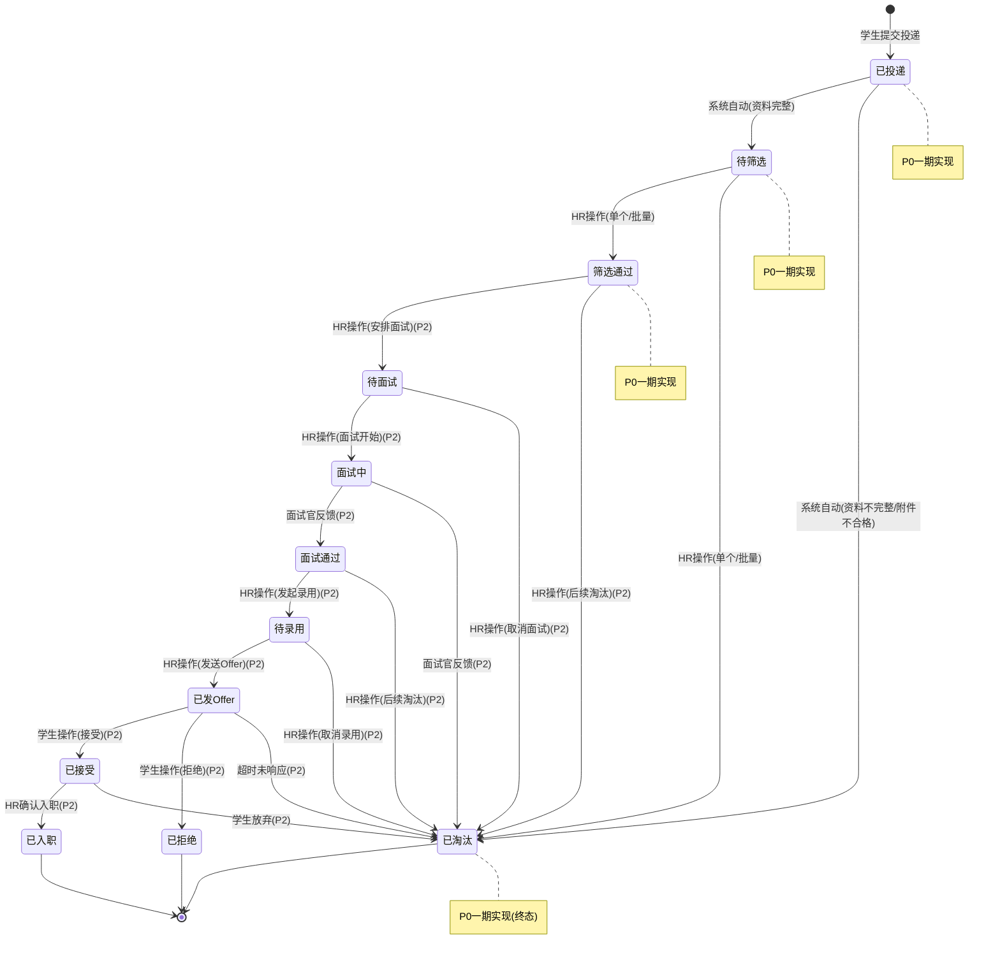
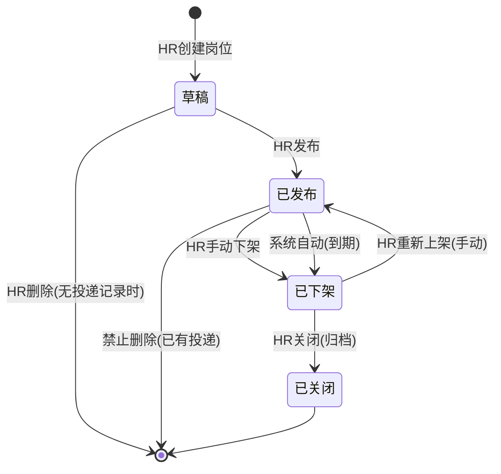
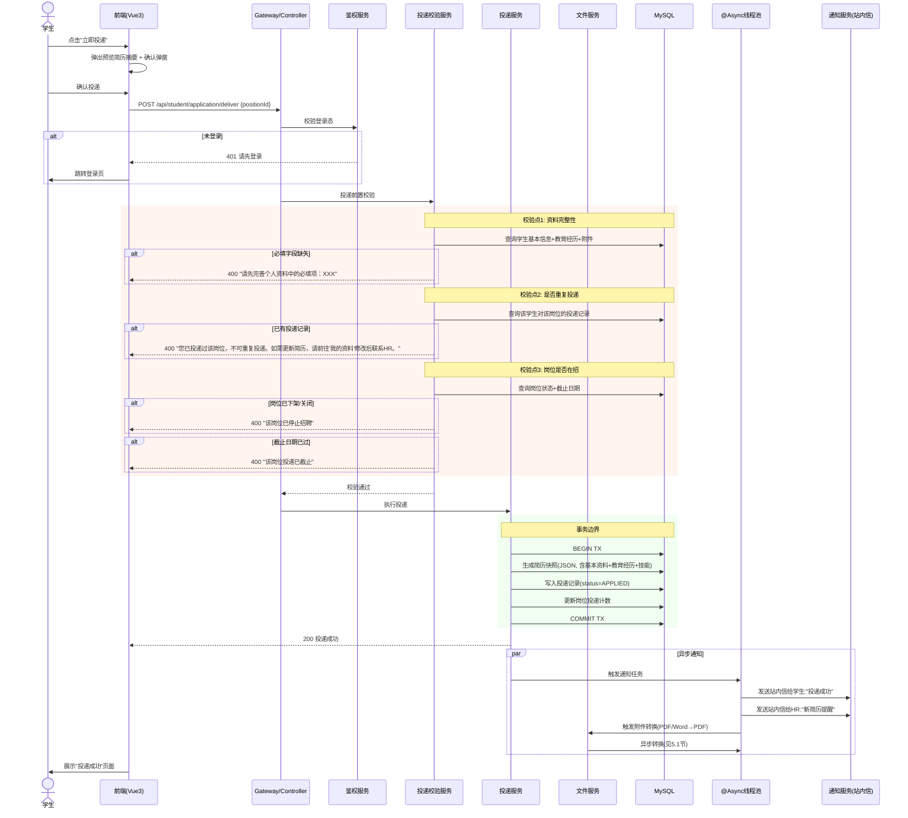

# 业务工作流设计文档：遨天科技校园招聘简历管理系统

> **版本**：V1.0 | **日期**：2026-08-06 | **Agent**：工作流设计师
> **配套文件**：本设计须与架构设计、数据架构、接口设计三份文档协同阅读，边界以 `00-技术选型裁决基线.md` 第七节为准。
> **基线约束**：已读 `00-技术选型裁决基线.md`、`设计简报.md`、需求原文全文。不使用 Quartz/XXL-Job/MQ/Redis；仅用 Spring `@Scheduled` 与 `@Async`。

---

## 1. 候选人状态机（核心产出）

### 1.1 完整状态机图



### 1.2 状态定义表

| 状态码 | 中文名 | 含义 | 允许的下一状态 | 触发者 | 是否终态 | 一期实现 |
|--------|--------|------|----------------|--------|----------|----------|
| `APPLIED` | 已投递 | 学生提交投递，系统校验通过 | `PENDING_SCREEN`, `ELIMINATED` | 系统 | 否 | **是** |
| `PENDING_SCREEN` | 待筛选 | 简历进入HR筛选队列 | `SCREEN_PASSED`, `ELIMINATED` | HR | 否 | **是** |
| `SCREEN_PASSED` | 筛选通过 | HR标记简历通过初筛 | `PENDING_INTERVIEW`, `ELIMINATED` | HR | 否 | **是** |
| `PENDING_INTERVIEW` | 待面试 | 等待HR安排面试 | `INTERVIEWING`, `ELIMINATED` | HR | 否 | 否(P2) |
| `INTERVIEWING` | 面试中 | 面试已安排，进行中 | `INTERVIEW_PASSED`, `ELIMINATED` | 面试官 | 否 | 否(P2) |
| `INTERVIEW_PASSED` | 面试通过 | 面试评价通过 | `PENDING_OFFER`, `ELIMINATED` | HR | 否 | 否(P2) |
| `PENDING_OFFER` | 待录用 | 进入录用审批流程 | `OFFER_SENT`, `ELIMINATED` | HR | 否 | 否(P2) |
| `OFFER_SENT` | 已发Offer | Offer已发送给候选人 | `ACCEPTED`, `REJECTED`, `ELIMINATED` | 学生/系统 | 否 | 否(P2) |
| `ACCEPTED` | 已接受 | 候选人接受Offer | `ONBOARDED`, `ELIMINATED` | HR/学生 | 否 | 否(P2) |
| `REJECTED` | 已拒绝 | 候选人拒绝Offer | — | 学生 | **是** | 否(P2) |
| `ONBOARDED` | 已入职 | 候选人已报到入职 | — | HR | **是** | 否(P2) |
| `ELIMINATED` | 已淘汰 | 候选人在任一阶段被淘汰 | — | HR/系统 | **是** | **是** |

### 1.3 一期状态子集（P0）

一期只实现以下**3个状态**的流转，其余状态值在数据字典中预置，但不开放流转逻辑：

```
已投递(APPLIED) → 待筛选(PENDING_SCREEN) → 筛选通过(SCREEN_PASSED) / 已淘汰(ELIMINATED)
```

**具体规则**：
- `APPLIED → PENDING_SCREEN`：系统自动，投递校验通过后立即触发。条件：登录态有效 + 必填资料完整 + 附件上传成功 + 岗位在招 + 未重复投递。
- `PENDING_SCREEN → SCREEN_PASSED`：HR 手动操作（单个或批量），触发 H-006 筛选通过流程。
- `PENDING_SCREEN → ELIMINATED`：HR 手动操作（单个或批量），触发 H-006 淘汰流程。
- `APPLIED → ELIMINATED`：系统自动，当投递资料不完整或附件不合格时触发（极少场景，正常投递不会走此路径）。

**一期不做的状态**（P2）：`PENDING_INTERVIEW`、`INTERVIEWING`、`INTERVIEW_PASSED`、`PENDING_OFFER`、`OFFER_SENT`、`ACCEPTED`、`REJECTED`、`ONBOARDED`。这些状态值写入 `application_status` 字典表，代码中用枚举预定义，但 Service 层不做流转校验——也就是 P2 扩展时只需在 Service 层加 `checkTransition()` 的 case 分支。

### 1.4 状态流转的幂等性与并发控制

**问题场景**：HR-A 和 HR-B 同时打开同一份简历，HR-A 点"通过"，HR-B 也点"通过"。如果不加控制，可能出现状态被覆盖或重复操作。

**方案**：乐观锁（版本号）。

```
UPDATE candidate_application
SET status = 'SCREEN_PASSED', version = version + 1, update_time = NOW()
WHERE id = ? AND status = 'PENDING_SCREEN' AND version = ?
```

- 表设计预留 `version INT NOT NULL DEFAULT 0` 字段。
- 每次状态变更时，WHERE 条件包含 `status = 当前状态 AND version = 当前版本`。
- 更新返回 affected rows = 0 时，说明已被他人操作（状态已变或版本已变），向后端抛出 `OptimisticLockException`。
- 前端捕获此异常后刷新页面，展示最新状态，并给出提示"该简历已被其他同事操作，请刷新后重试"。
- **不选用悲观锁**（SELECT ... FOR UPDATE），因为 20 并发下乐观锁完全够用，且不需要额外数据库行锁开销。

**幂等性保证**：
- 同一个 HR 连续点击两次"通过"按钮：前端按钮点击后立即 disabled + loading，后端乐观锁 WHERE `status = 'PENDING_SCREEN'` 天然阻挡第二次请求（第二次时状态已变为 `SCREEN_PASSED`，不匹配 WHERE 条件）。
- 不需要额外的幂等键（如 `idempotency_key`），因为状态流转天然幂等——"从待筛选到筛选通过"这个操作执行一次后，第二次再执行时状态条件已不满足。

### 1.5 状态回退设计

**结论**：支持限时撤销，保留审计日志。

| 场景 | 设计 |
|------|------|
| HR 误点"淘汰" | 淘汰后 **5 分钟内**（一期可配参数 `UNDO_WINDOW_MINUTES=5`），HR 可在简历详情页看到"撤销淘汰"按钮。点击后状态恢复为淘汰前的状态（记录在 `previous_status` 字段），版本号 +1。 |
| 超时后需要回退 | 5 分钟后，"撤销淘汰"按钮消失。如需回退，需管理员在系统管理端操作，写入 `status_change_log` 审计表记录原因。 |
| HR 误点"通过" | 同上，5 分钟内可撤销，恢复为 `PENDING_SCREEN`。 |

**审计要求**：
- `status_change_log` 表记录每次状态变更：`application_id, from_status, to_status, operator_id, operator_role, change_reason, change_time`。
- 撤销操作也写入一条新日志：`from_status=ELIMINATED, to_status=原状态, change_reason="HR撤销操作"`。
- 管理员回退写入：`change_reason="管理员强制回退：原因XXX"`。

---

## 2. 岗位生命周期

### 2.1 状态机图



### 2.2 状态定义

| 状态码 | 中文名 | 含义 | 允许的操作 |
|--------|--------|------|------------|
| `DRAFT` | 草稿 | 岗位已创建但未对外发布，学生端不可见 | 编辑、删除（无投递）、发布 |
| `PUBLISHED` | 已发布 | 岗位对外可见，学生可投递 | 编辑（部分字段）、手动下架 |
| `OFFLINE` | 已下架 | 岗位不再接收新投递，已有投递仍可见 | 重新上架、关闭 |
| `CLOSED` | 已关闭 | 岗位归档，不再出现在任何列表 | —（终态） |

### 2.3 到期自动下架

**触发**：Spring `@Scheduled(cron = "0 */5 * * * ?")` —— 每 5 分钟执行一次。

**cron 选型理由**：岗位截止日期精确到"日"（业务不会设 N 时 N 分的截止），因此无需分钟级精度。每 5 分钟扫描一次，最差情况下岗位延迟 5 分钟下架，对业务无影响。若改为每分钟一次也无性能问题（数十个岗位的全表扫描耗时 < 10ms），但 5 分钟足够合理。

**执行逻辑伪代码**：

```
@Transactional
void autoOfflineExpiredPositions() {
    List<Position> expired = positionMapper.selectPublishedExpired(now);
    for (Position p : expired) {
        p.setStatus("OFFLINE");
        p.setOfflineReason("AUTO_EXPIRED");
        p.setOfflineTime(now);
        positionMapper.updateById(p);
    }
    if (!expired.isEmpty()) {
        log.info("自动下架 {} 个到期岗位: {}", expired.size(),
            expired.stream().map(Position::getName).toList());
    }
}
```

**边界处理**：学生投递请求的 Service 层校验包括"岗位状态 = PUBLISHED 且 截止日期 >= 今天"。到期瞬间（如 2026-12-31 23:59:59 → 2026-01-01 00:00:00），定时任务尚未执行（最多延迟 5 分钟）时，如果学生发起投递，Service 层校验 `deadline >= today` 会拦截（今天已经是次日），返回"该岗位已截止投递"。结论：**不会出现"到期瞬间仍可投递"的漏洞**，因为业务层双保险（状态 + 日期）。

### 2.4 岗位下架后已投递简历的处理

**结论**：岗位下架后，已投递该岗位的简历**完全保留**，HR 仍可在简历管理中查看、筛选、导出。学生端的"我的投递"（P1）仍可看到该条投递记录，状态正常流转。唯一变化是：学生端岗位列表不再展示该岗位，岗位详情页的"立即投递"按钮变为"已截止"灰态。

**理由**：岗位下架不等于招聘取消。HR 可能已从该岗位的投递中筛选出候选人进入后续流程，此时收回简历可见性会打断 HR 工作流。

### 2.5 已有投递的岗位能否删除

**结论**：**禁止物理删除**。一旦岗位有 ≥1 条投递记录，直接禁止删除（DELETE 接口返回错误码 `POSITION_HAS_APPLICATIONS`，前端弹出"该岗位已有 N 份投递简历，不可删除。如需移除请选择'下架'或'关闭'"）。

**理由**：
1. 投递记录的外键引用依赖（数据完整性）。
2. 审计合规——"某学生投递了某岗位"这条记录在个保法合规期内必须可追溯。
3. 行业惯例——招聘系统无一允许"删除已有投递的岗位"。

---

## 3. 简历投递流程（P0 核心链路）

### 3.1 完整时序图



### 3.2 各校验点的失败处理与提示文案

| 校验点 | HTTP状态 | 错误码 | 中文提示文案 | 前端行为 |
|--------|----------|--------|-------------|----------|
| 未登录 | 401 | `UNAUTHORIZED` | "请先登录后再投递" | 弹出登录弹窗或跳转登录页 |
| 必填资料不完整 | 400 | `PROFILE_INCOMPLETE` | "请先完善个人资料中的必填项后再投递（姓名、手机号、邮箱、教育经历、简历附件）" | 弹窗，点击"去完善"跳转资料页 |
| 简历附件未上传 | 400 | `RESUME_ATTACHMENT_MISSING` | "请先上传您的个人简历附件（PDF/Word格式）后再投递" | 弹窗，点击"去上传"跳转附件上传 |
| 同一岗位重复投递 | 400 | `DUPLICATE_APPLICATION` | "您已投递过该岗位。如需更新简历内容，请前往'我的资料'修改您的信息后联系HR处理。如需投递其他岗位，请返回岗位列表。" | 弹窗，两按钮："去修改资料"/"返回岗位列表" |
| 岗位已下架 | 400 | `POSITION_OFFLINE` | "该岗位已停止招聘，请浏览其他在招岗位" | 弹窗，点击"查看其他岗位"返回列表 |
| 岗位已截止 | 400 | `POSITION_EXPIRED` | "该岗位投递已截止，请浏览其他在招岗位" | 同上 |
| 附件转换未完成 | — | — | 不阻断投递。投递成功后附件异步转换，如需预览请稍后刷新。 | 简历详情页附件区显示"转换中"状态 |

### 3.3 S-013 歧义处理：同一岗位不可重复投递的产品设计

**需求原文**："同一岗位不可重复投递（可提示更新简历后重新投递）"

这句话有三层歧义：

| 解读 | 行为 | 分析 |
|------|------|------|
| A：彻底禁止，只能联系HR手工处理 | 学生投递过一次后，该岗位永远无法再投 | 过于死板，但最简单 |
| B：允许学生撤回后重新投递 | 学生先撤回，再重新投递 | 引入撤回状态机复杂度 |
| C：允许学生更新资料后覆盖投递 | 学生修改资料后原投递记录的简历快照被更新 | 改变了"投递"的语义，快照不再是"投递那一刻"的冻结 |

**推荐方案：A（彻底禁止，但提供解释路径）**。

**理由**：
1. **业务语义清晰**："投递"是对一个岗位的一次正式申请。就像纸质简历投出去就投出去了，不存在"撤回重投"。如果需要补充材料，那是 HR 从后台发起"要求补充资料"，不是学生主动重投。
2. **一期成本最低**：不需要撤回状态、不需要快照覆盖逻辑、不需要"学生重投后自动更新状态"的复杂流转。
3. **足够满足业务需求**：遨天科技每届校招岗位数十个、学生数百到数千人，重复投递的实际场景极少。极少数需要修正的情况走 HR 手动处理（HR 可备注、可操作状态）。
4. **若未来需要变体**（P2）：可增加"HR 标记为允许重投"——HR 在后台将某条投递标记为 `allow_resubmit=true`，学生端方可重新投递。此时新投递覆盖旧投递、旧投递记录保留在历史表中。**一期只需在 application 表预留 `allow_resubmit TINYINT(1) DEFAULT 0` 字段。**

**等效替代方案**：学生如需更新简历，在"我的资料"中修改后保存，系统自动将最新资料同步更新到已投递的简历快照中（`resume_snapshot` 字段随资料保存而更新，但前提是投递状态仍为 `APPLIED` 或 `PENDING_SCREEN`）。这样 HR 看到的就是最新的简历快照，无需学生重新投递。

---

## 4. 简历筛选流程（H-006）

### 4.1 单个筛选流程

```mermaid
flowchart TD
    A[HR打开简历详情] --> B[点击"筛选通过"或"淘汰"]
    B --> C{确认弹窗}
    C -->|取消| A
    C -->|确认| D{淘汰?}
    D -->|是| E{是否发送感谢信}
    E -->|是(P2)| F[异步发送感谢信]
    E -->|否| G[更新状态为ELIMINATED]
    D -->|否/通过| H[更新状态为SCREEN_PASSED]
    F --> G
    G --> I[写入status_change_log]
    H --> I
    I --> J[触发通知(站内信)]
    J --> K[前端刷新状态展示]
```

### 4.2 批量筛选流程

**设计要点**：

**（1）批量上限**：单次批量操作最多 **100 份**简历。前端在勾选时实时显示已选数量，超过 100 时禁止继续勾选并提示"单次最多选择 100 份简历"。

**理由**：20 并发下，MySQL 单次 IN 查询 + 逐条 UPDATE 100 行约 50ms，不会引起长事务或锁等待。如果放开无上限，某 HR 全选 500 份淘汰，可能导致 MySQL 行锁持有时间过长。

**（2）部分失败处理策略**：**全部回滚 + 失败清单**。

```
@Transactional
BatchResult batchScreen(List<Long> applicationIds, String targetStatus, Long operatorId) {
    List<BatchError> errors = new ArrayList<>();
    for (Long id : applicationIds) {
        int rows = applicationMapper.updateStatus(id, targetStatus, expectedCurStatus, version);
        if (rows == 0) {
            errors.add(new BatchError(id, "该简历状态已变更，请刷新后重试"));
        }
    }
    if (!errors.isEmpty()) {
        throw new BatchOperationException(errors); // 触发事务回滚
    }
    return new BatchResult(applicationIds.size(), 0);
}
```

**策略选择理由**：

| 策略 | 优点 | 缺点 | 是否选用 |
|------|------|------|----------|
| 全部回滚 + 失败清单 | 数据一致性强，无半成品状态 | 一颗老鼠屎坏一锅粥 | **选用** |
| 部分成功 + 失败清单 | 成功的不用重来 | 数据部分生效，HR 需对照清单手动补处理，容易遗漏 | 不选用 |
| 跳过失败的继续 | HR 无感知失败 | 数据不一致，风险最高 | 不选用 |

**理由**：批量操作中，如果第 50 份简历已被其他 HR 先操作了（状态已变），那么前 49 份也不应生效——因为 HR 是看着当前列表的状态做的批量判断。如果前 49 份生效了、第 50 份失败，HR 会以为"全部操作成功"，造成认知与实际状态不一致。

**（3）进度反馈**：批量操作后端返回后，前端逐条展示操作结果。因为是同步操作（不是排队任务），100 条的操作耗时约 200-300ms，不需要进度条。

**（4）二次确认**：二次确认弹窗内容包含：
- 操作类型："批量标记为筛选通过"或"批量标记为淘汰"
- 简历数量：N 份
- 操作人：当前 HR 姓名
- 不可撤销提醒："操作后 N 分钟内可单份撤销，超时需管理员操作"
- 确认按钮：红色（淘汰）/ 蓝色（通过）

### 4.3 淘汰时发送感谢信（P2 扩展位）

一期不做感谢信发送（需求文档标"非必选"）。扩展位预留如下：

- `mail_template` 表预留 `template_code = 'THANK_YOU_LETTER'` 的模板行。
- `candidate_application` 表预留 `thank_letter_sent TINYINT(1) DEFAULT 0` 字段。
- 淘汰操作接口预留 `sendThankLetter boolean` 参数，一期前端不传或传 false。
- P2 实现时：HR 勾选"发送感谢信"→ 异步调用邮件服务渲染模板 → 发送 → 更新 `thank_letter_sent=1`。

---

## 5. 异步任务设计（Spring @Async）

### 5.1 简历附件转换任务（P0 难点）

#### 5.1.1 完整流程图

```mermaid
flowchart TD
    A[学生上传简历附件] --> B[文件存储到本地磁盘]
    B --> C[写入file_record表<br/>status=WAITING]
    C --> D{文件类型?}
    D -->|PDF| E[标记status=COMPLETED<br/>无需转换]
    D -->|doc/docx| F[投递异步转换<br/>@Async]
    F --> G[更新status=CONVERTING]
    G --> H[LibreOffice转换队列<br/>串行执行]
    H --> I{转换结果?}
    I -->|成功| J[保存PDF到磁盘]
    J --> K[更新status=COMPLETED<br/>写入pdf_path]
    I -->|失败| L{重试次数 < 3?}
    L -->|是| M[等待退避时间]
    M --> H
    L -->|否| N[更新status=FAILED<br/>写入error_msg]
    E --> O[HR预览时直接用pdf.js]
    K --> O
    N --> P[前端降级: mammoth.js渲染<br/>或提示下载原件]
```

#### 5.1.2 线程池配置

```java
@Configuration
@EnableAsync
public class AsyncConfig {
    // LibreOffice转换用串行队列（单线程）
    @Bean("libreOfficeExecutor")
    public Executor libreOfficeExecutor() {
        ThreadPoolTaskExecutor executor = new ThreadPoolTaskExecutor();
        executor.setCorePoolSize(1);       // 核心线程数=1（串行）
        executor.setMaxPoolSize(1);        // 最大线程数=1
        executor.setQueueCapacity(100);    // 队列容量100
        executor.setRejectedExecutionHandler(new CallerRunsPolicy());
        executor.setThreadNamePrefix("libreoffice-");
        executor.initialize();
        return executor;
    }

    // 通用异步任务用（通知发送等）
    @Bean("generalAsyncExecutor")
    public Executor generalAsyncExecutor() {
        ThreadPoolTaskExecutor executor = new ThreadPoolTaskExecutor();
        executor.setCorePoolSize(4);       // 核心线程4
        executor.setMaxPoolSize(8);        // 最大线程8
        executor.setQueueCapacity(200);    // 队列200
        executor.setRejectedExecutionHandler(new CallerRunsPolicy());
        executor.setThreadNamePrefix("general-async-");
        executor.initialize();
        return executor;
    }
}
```

**配置依据**：
- LibreOffice 转换**必须串行**（单线程），原因见 5.1.4。
- 通用异步线程池 4 核心 / 8 最大，覆盖通知发送、日志写入等轻量异步任务。20 并发峰值下，投递产生的通知量约 20 条/秒，4 线程绰绰有余。
- 拒绝策略统一用 `CallerRunsPolicy`：队列满时由主线程执行，保证任务不丢（宁可慢，不丢数据）。

#### 5.1.3 任务状态流转

| 状态码 | 中文名 | 含义 | 触发条件 |
|--------|--------|------|----------|
| `WAITING` | 待转换 | 文件已上传，等待转换调度 | 上传成功 |
| `CONVERTING` | 转换中 | LibreOffice 正在处理 | 异步任务拾取 |
| `COMPLETED` | 转换成功 | PDF 已生成并缓存 | 转换成功 |
| `FAILED` | 转换失败 | 重试耗尽，无法转换 | 重试 3 次均失败 |

**超时控制**：单次转换超时 60 秒（LibreOffice 转一个 10MB 的 docx 约 5-15 秒，60 秒是 4 倍余量）。超时后 Force Kill 子进程，记录为一次失败尝试。

**失败重试策略**：

| 参数 | 值 | 理由 |
|------|-----|------|
| 最大重试次数 | 3 | 文件损坏或无权限时 1-2 次即可确定，3 次足够覆盖偶发系统抖动 |
| 重试间隔 | 指数退避：10s, 30s, 60s | 避免快速连续失败，给系统恢复时间 |
| 重试条件 | 超时/进程崩溃等临时性失败 | 文件格式损坏（如假 .docx 其实是 .doc）不重试，直接标记失败 |
| 最终失败处理 | 标记 FAILED + 写入 error_msg | 前端降级为 mammoth.js 或提示下载原件 |

**转换失败的降级**：
1. **前端优先判断**：请求文件记录时，若 `status=FAILED` 或 `status=WAITING` 超过 5 分钟（卡死兜底），前端自动切换为 mammoth.js 渲染（仅 docx 格式）。
2. **mammoth.js 覆盖不到的场景**（.doc 老格式、文件损坏）：前端提示"该简历附件暂不支持在线预览，请下载原件查看"，并提供下载按钮。

#### 5.1.4 LibreOffice 并发安全问题

**已知问题**：LibreOffice headless 模式（`soffice --headless --convert-to pdf`）使用同一用户目录（`--userdir`）时，多进程并发会争抢 profile 锁，导致随机转换失败或进程僵死。

**方案：单线程串行队列（已体现在 5.1.2 线程池配置中）**。

具体实施：
1. `libreOfficeExecutor` 线程池核心/最大线程数均设为 1，保证同一时刻只有 1 个 LibreOffice 进程在运行。
2. 阻塞队列容量 100，20 并发下最大积压是 20 份简历 × 每人一份附件 = 20 个任务，100 足够。
3. 每次转换前显式指定独立的临时用户目录 `/tmp/libreoffice-profile-{taskId}`，转换后清理。这样即使线程池配置被后续调大，也不会出现 profile 锁冲突。
4. 转换完成（成功或失败）后，Force Kill 子进程并清理临时目录。

**为什么不选进程池方案**：进程池（如 3-5 个独立 profile 的并行子进程）可以让转换更快，但 LibreOffice 自身的内存占用较大（每个进程约 200-500MB），3 个进程就是 1.5GB，对 16GB 台式机不友好。串行方案简单、稳定、资源占用可控。20 并发下，最差情况是第 20 份简历排队 20 份 × 10 秒 = 200 秒（约 3 分钟），对于非实时预览场景完全可接受（HR 不是秒开秒看，他会在几分钟后打开简历详情）。

---

## 6. 定时任务清单（Spring @Scheduled）

### 6.1 任务总表

| 编号 | 任务名 | Cron 表达式 | 职责 | 耗时(估) | 优先级 |
|------|--------|------------|------|----------|--------|
| T1 | `autoOfflineExpiredPositions` | `0 */5 * * * ?` | 扫描到期岗位并自动下架 | <50ms | P0 |
| T2 | `retryFailedConversions` | `0 */2 * * * ?` | 扫描 FAILED 状态的转换任务并重试 | <100ms | P0 |
| T3 | `cleanupTemporaryFiles` | `0 0 3 * * ?` | 清理临时文件（LibreOffice profile、导出暂存） | <1s | P0 |
| T4 | `cleanExpiredResumeData` | `0 0 2 * * ?` | 清理过期简历数据（个保法合规） | <5s | P1 |
| T5 | `databaseBackup` | `0 0 1 * * ?` | 触发 MySQL 备份脚本 | <30s | P0 |

### 6.2 逐任务详细设计

#### T1：岗位到期自动下架

- **参见第 2.3 节**，不再赘述。

#### T2：转换失败任务重试扫描

```
@Scheduled(cron = "0 */2 * * * ?")
void retryFailedConversions() {
    List<FileRecord> retryable = fileRecordMapper.selectRetryable(
        "CONVERTING", maxRetryCount=3
    );
    for (FileRecord r : retryable) {
        if (r.getNextRetryTime().isAfter(now)) continue; // 退避期间跳过
        r.setRetryCount(r.getRetryCount() + 1);
        r.setNextRetryTime(now.plus(退避时间(r.getRetryCount())));
        fileRecordMapper.updateById(r);
        libreOfficeService.convertAsync(r); // 重新投递到转换队列
    }
}
```

**幂等性**：`WHERE status='CONVERTING' AND retry_count < 3`，且重试前更新 retry_count，同一任务不会被重复拾取。

#### T3：临时文件清理

```
@Scheduled(cron = "0 0 3 * * ?")  // 每天凌晨3点
void cleanupTemporaryFiles() {
    // 清理 LibreOffice 残留 profile 目录（超过24小时的）
    deleteOldDirs("/tmp/libreoffice-profile-*", olderThan = 24h);
    // 清理导出暂存文件（超过1小时的 Excel/PDF）
    deleteOldFiles(exportTempDir, olderThan = 1h);
    log.info("临时文件清理完成: 删除{}个目录, {}个文件", dirs, files);
}
```

#### T4：简历数据保留期清理（P1，个保法合规）

**合规依据**：《个人信息保护法》第 19 条："个人信息的保存期限应当为实现处理目的所必要的最短时间。"

**设计**：
- 数据字典 `sys_config` 中配置 `data_retention_days`，默认值：
  - 已淘汰简历：365 天（1 年）
  - 已入职候选人：730 天（2 年，劳动法相关记录）
- 每份简历有 `auto_cleanup_date` 字段 = `eliminated_date + retention_days` 或 `onboarded_date + retention_days`。
- T4 扫描 `auto_cleanup_date <= today` 的记录，进行软删除（`is_deleted=1`）或物理删除 + 匿名化。

**一期实现**：仅实现表字段预留和配置项定义。清理逻辑 P1 实现。

#### T5：数据库备份

```
@Scheduled(cron = "0 0 1 * * ?")  // 每天凌晨1点
void databaseBackup() {
    String cmd = "mysqldump -u%s -p%s --single-transaction --routines --triggers %s > %s";
    Process p = Runtime.getRuntime().exec(
        String.format(cmd, dbUser, dbPass, dbName, backupPath + "/" + dateStr + ".sql")
    );
    int exitCode = p.waitFor(300, TimeUnit.SECONDS) ? p.exitValue() : -1;
    if (exitCode != 0) {
        log.error("数据库备份失败, exitCode={}", exitCode);
        // 告警：写入系统告警日志表
    }
    // 保留最近 7 天的备份，删除更早的
    deleteOldBackups(backupPath, keepDays=7);
}
```

### 6.3 定时任务单机可靠性：重启后任务不丢

**核心问题**：`@Scheduled` 是纯内存调度，无持久化。进程重启后，内存中的调度状态全部丢失。

| 风险场景 | 应对方案 |
|----------|----------|
| 恰好有一个到期岗位应在重启期间被下架 | 重启后首次扫描会覆盖：T1 是"全量扫描符合条件的"而非"增量扫描"，重启后马上执行 `select position where status='PUBLISHED' and deadline < now()`，不会遗漏 |
| 正在转换中的任务，重启后丢失 | `file_record.status='CONVERTING'` 的记录会被 T2 重新拾取——T2 的条件是 `status='CONVERTING' AND retry_count < 3`，恰好覆盖了"进程崩溃后卡在 CONVERTING 状态"的任务 |
| 定时任务执行到一半宕机 | 所有写操作用数据库事务包裹。宕机时未提交的事务自动回滚，下次扫描时重新处理 |
| 时钟漂移/时区变化 | 服务器时钟由 IT 运维管理，非本系统职责。代码中统一用 `java.time.Instant` 和 `ZoneId.of("Asia/Shanghai")` |

**一句话结论**：所有定时任务都是"全量扫描 + 条件过滤"模式（而非"增量事件"模式），天然消除了"重启丢事件"的问题。

---

## 7. 通知触发矩阵

### 7.1 完整矩阵（需求附录 4.2）

| 序号 | 触发事件 | 通知渠道 | 接收对象 | 模板变量 | 优先级 | 一期实现 |
|------|----------|----------|----------|----------|--------|----------|
| N1 | 简历投递成功 | 站内信 | 学生 | `{姓名}`, `{岗位名称}`, `{投递时间}` | P0 | **是** |
| N2 | 新简历投递提醒 | 站内信 | HR | `{学生姓名}`, `{岗位名称}`, `{投递时间}`, `{学校}`, `{专业}` | P0 | **是** |
| N3 | 简历筛选通过 | 站内信 | 学生 | `{姓名}`, `{岗位名称}`, `{通过时间}` | P0 | **是** |
| N4 | 简历筛选未通过 | 站内信 | 学生 | `{姓名}`, `{岗位名称}`, `{淘汰时间}` | P1 | 否 |
| N5 | 面试邀请 | 站内信+短信+邮件 | 学生+面试官 | `{姓名}`, `{岗位}`, `{面试时间}`, `{面试方式}`, `{地点/链接}` | P2 | 否 |
| N6 | 面试前提醒(24h/1h) | 短信+邮件 | 学生 | `{姓名}`, `{岗位}`, `{面试时间}`, `{倒计时}` | P2 | 否 |
| N7 | 录用通知(Offer) | 站内信+短信+邮件 | 学生 | `{姓名}`, `{岗位}`, `{入职时间}`, `{薪资}`(不展示) | P2 | 否 |

### 7.2 一期实现范围（P0）

**仅实现 N1 + N2 + N3**，即：
1. **N1**：学生投递成功后，系统自动发送站内信给学生："您的简历已成功投递至【{岗位名称}】，HR 将尽快处理，请留意通知。"
2. **N2**：学生投递成功后，系统自动发送站内信给该岗位所属部门的所有 HR："【{学生姓名}】（{学校}/{专业}）投递了【{岗位名称}】，投递时间：{投递时间}。"
3. **N3**：HR 筛选通过时，系统自动发送站内信给学生："恭喜！您在【{岗位名称}】的简历已通过初筛，请留意后续面试通知。"

**一期不做的通知**：
- N4（淘汰通知/感谢信）：P1，需求文档标非必选。
- N5/N6/N7：P2，依赖面试/Offer 流程，这些流程本身 P2。

### 7.3 通知发送的异步化与失败处理

**异步化**：所有通知发送通过 `generalAsyncExecutor` 线程池异步执行。投递流程的主事务不等待通知发送完成。

```java
@Async("generalAsyncExecutor")
public void sendNotificationAsync(NotificationEvent event) {
    try {
        notificationService.send(event);
    } catch (Exception e) {
        log.error("通知发送失败: event={}, error={}", event, e.getMessage());
        // 写入失败队列（notification_failed 表，供人工/自动重试）
        notificationFailedMapper.insert(NotificationFailed.from(event, e));
    }
}
```

**失败处理**：
- 站内信发送失败（数据库写入失败）：重试 3 次，间隔 5 秒。最终失败写入 `notification_failed` 表。
- 短信/邮件发送失败（P2）：同上，但 P2 加入人工重试后台页面。

### 7.4 短信/邮件扩展位

```java
// 接口抽象
public interface NotificationChannel {
    boolean send(NotificationMessage msg); // true=成功, false=失败
    ChannelType getType(); // INTERNAL_MSG, SMS, EMAIL
}

// 一期实现类
@Service
public class InternalMsgChannel implements NotificationChannel { ... }

// P2 预留实现类（只声明不实现）
// @Service
// public class SmsChannel implements NotificationChannel { ... }
// @Service
// public class EmailChannel implements NotificationChannel { ... }
```

通知渠道通过策略模式（`Map<ChannelType, NotificationChannel>`）注入，新增渠道只需加一个实现类，不改主流程代码。

---

## 8. 面试管理流程（P2，仅设计骨架）

> **一期只预留表结构和扩展接口，不实现任何面试管理功能。**

### 8.1 流程骨架

```
筛选通过(SCREEN_PASSED) → HR安排面试 → 待面试(PENDING_INTERVIEW)
→ 面试开始 → 面试中(INTERVIEWING)
→ 面试官提交反馈 → 面试通过(INTERVIEW_PASSED) / 淘汰(ELIMINATED)
```

### 8.2 扩展位预留

| 预留项 | 具体方式 |
|--------|----------|
| 面试安排表 | `interview` 表：`id, application_id, interview_round, interview_time, interview_type(现场/视频/电话), location_or_link, interviewer_id, status` |
| 面试反馈表 | `interview_feedback` 表：`id, interview_id, interviewer_id, scores(JSON: 各维度评分), comment, submit_time` |
| 面试官账号 | `sys_user` 表已有，面试官作为具有 `interviewer` 角色的 HR 账号 |
| 日历冲突检测 | 安排面试时，按 `interviewer_id + interview_time` 查询是否有时间重叠（前后 30 分钟内） |
| 通知扩展 | 面试邀请通知(N5)和提醒(N6)复用 7.4 节的 `NotificationChannel` 接口，加 `SmsChannel`/`EmailChannel` 实现 |

---

## 9. 异常与补偿

### 9.1 关键流程失败场景清单

| 场景 | 失败影响 | 补偿手段 | 严重程度 |
|------|----------|----------|----------|
| 投递写库事务中 MySQL 宕机 | 事务回滚，投递未生效 | 学生可重新投递（数据库无脏数据） | 低 |
| 投递写库成功，但通知发送失败 | 投递已生效，学生未收到站内信 | 通知进入 `notification_failed` 表，T2 定时重试；学生可在"我的投递"（P1）看到记录 | 低 |
| 附件上传成功，但转换任务发起失败 | HR 无法在线预览 | `file_record.status=WAITING`，T2 定时任务拉取转换 | 低 |
| LibreOffice 进程僵死 | 后续转换排队等待，超时后失败 | 转换超时（60秒）后 Force Kill；状态标记 FAILED；T2 扫描重试 | 中 |
| 批量筛选第 50 条失败 | 前 49 条回滚 | HR 看到失败清单，修正后重新提交 | 低 |
| 定时任务执行中服务器断电 | 任务中断，数据半成品 | 事务回滚，下次扫描重新执行 | 中 |
| 数据库备份脚本执行失败 | 当天无备份 | 日志告警；若连续 3 天无备份则系统告警表触发管理员通知 | 高 |

### 9.2 幂等性设计原则

| 原则 | 说明 | 落地方式 |
|------|------|----------|
| 状态流转天然幂等 | 状态变更的 WHERE 条件包含当前状态，同一操作执行两次时第二次匹配不到行 | `UPDATE ... WHERE status = ?` |
| 文件上传幂等 | 相同文件内容的 MD5 校验，重复上传返回已有 file_id | 上传时计算 MD5，查重后返回已有记录 |
| 投递防重 | 按 `student_id + position_id` 唯一约束，重复投递返回 DUPLICATE | 数据库 UNIQUE INDEX + 业务层校验 |
| 通知去重 | 同一事件 + 同一接收人 + 同一模板 + 同一小时内不重复发送 | 通知发送前查询 `notification` 表的去重窗口 |
| 定时任务幂等 | 全量扫描 + 条件过滤，不是事件驱动 | 见 6.3 节 |

---

## 10. 工作量估算

**假设人力配置**：1 名全栈 Java 开发（熟悉 Spring Boot + Vue3），即 1 人日 = 8 小时有效编码时间。

| 模块 | 内容 | P0 人日 | P1 人日 | P2 人日 |
|------|------|---------|---------|---------|
| **候选人状态机** | 状态定义 + 流转逻辑 + 乐观锁 + 审计日志 + 撤销机制 | 2.0 | — | 2.0（完整状态流转） |
| **岗位生命周期** | 创建/发布/下架/关闭 + 到期自动下架定时任务 | 1.5 | — | — |
| **简历投递流程** | 校验链 + 快照生成 + 投递记录 + 防重 + 投递确认页前后端 | 2.5 | 0.5（投递记录页） | — |
| **简历筛选** | 单个筛选 + 批量筛选（上限/确认/回滚）+ 操作日志 | 2.0 | — | — |
| **附件转换** | LibreOffice 集成 + 串行队列 + 重试 + 超时 + mammoth.js 降级 | 3.0 | — | — |
| **定时任务** | T1/T2/T3/T5 + 可靠性保障 | 1.5 | 0.5（T4） | — |
| **通知系统** | 站内信通道 + N1/N2/N3 模板 + 异步发送 + 失败表 | 1.5 | 1.0（N4+感谢信） | 2.0（短信/邮件通道） |
| **LibreOffice 环境部署** | 服务器安装 LibreOffice + 配置 + 测试 | 0.5 | — | — |
| **异常与补偿** | 全局异常处理 + 失败重试框架 + 幂等性 | 1.0 | 0.5 | — |
| **面试管理** | —（仅建表 + 接口预留） | 0.5（预留） | — | 3.0 |
| **联调 + 修复** | 端到端联调 + Bug 修复 | 2.0 | 1.0 | 1.0 |
| **合计** | | **18.0 人日** | **3.5 人日** | **8.0 人日** |

**总工期**：约 **4 周**（P0 18 人日 / 1 人 ≈ 3.6 周 + 缓冲），P1 追加 1 周，P2 追加 2 周。

**P0 关键路径**：附件转换（3 人日）+ 投递流程（2.5 人日）为工时大头，建议优先启动 LibreOffice 环境部署（与编码并行）。

---

## 附录 A：定时任务与异步任务对照表

| 类型 | 实现方式 | 持久化 | 失败处理 | 适用场景 |
|------|----------|--------|----------|----------|
| 定时任务 | `@Scheduled` | 无（内存），靠全量扫描补偿 | 日志记录 + 下次自动重扫 | 周期性巡检（下架、清理） |
| 异步任务 | `@Async` + 线程池 | 无（内存），靠数据库状态表补偿 | 状态表 + 定时重试 | 事件触发一次性任务（转换、通知） |
| 延迟任务 | 无（不引入 MQ/Quartz） | — | — | 无需求 |

---

## 附录 B：状态码常量定义（Java 枚举建议）

```java
public enum ApplicationStatus {
    APPLIED("APPLIED", "已投递", false),
    PENDING_SCREEN("PENDING_SCREEN", "待筛选", false),
    SCREEN_PASSED("SCREEN_PASSED", "筛选通过", false),
    PENDING_INTERVIEW("PENDING_INTERVIEW", "待面试", false),
    INTERVIEWING("INTERVIEWING", "面试中", false),
    INTERVIEW_PASSED("INTERVIEW_PASSED", "面试通过", false),
    PENDING_OFFER("PENDING_OFFER", "待录用", false),
    OFFER_SENT("OFFER_SENT", "已发Offer", false),
    ACCEPTED("ACCEPTED", "已接受", false),
    REJECTED("REJECTED", "已拒绝", true),
    ONBOARDED("ONBOARDED", "已入职", true),
    ELIMINATED("ELIMINATED", "已淘汰", true);

    private final String code;
    private final String label;
    private final boolean terminal; // 是否终态
}

public enum PositionStatus {
    DRAFT("DRAFT", "草稿"),
    PUBLISHED("PUBLISHED", "已发布"),
    OFFLINE("OFFLINE", "已下架"),
    CLOSED("CLOSED", "已关闭");
}
```

---

> **文档结束**。本设计严格遵循技术选型裁决基线的所有约束（不用 Quartz/XXL-Job/MQ/Redis），所有结论均给出明确理由与落地方案。一期 P0 共 18 人日，核心交付候选人状态机（3 状态）、岗位生命周期、投递防重、附件异步转换、通知站内信、定时任务 4 项。
