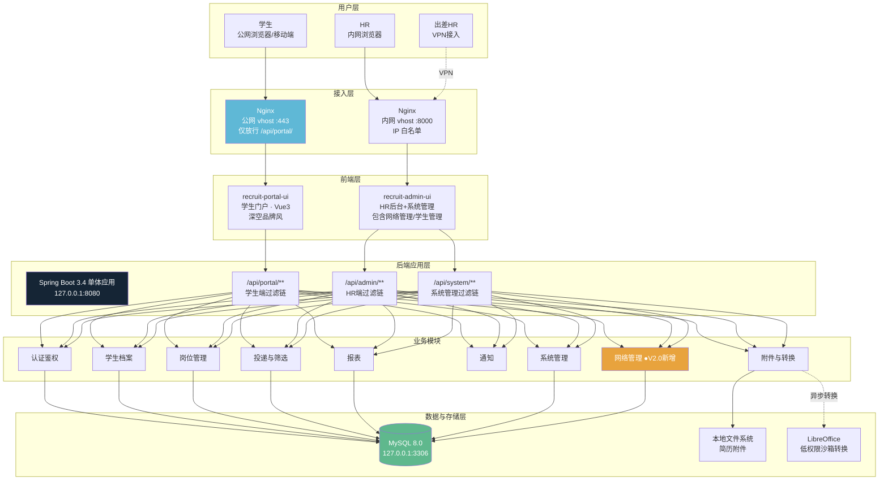
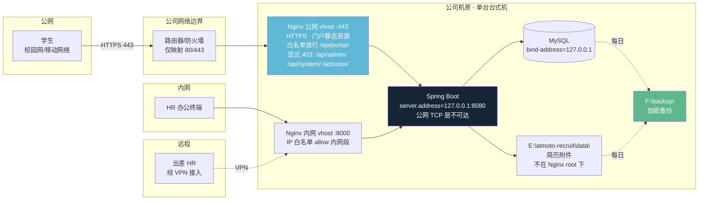
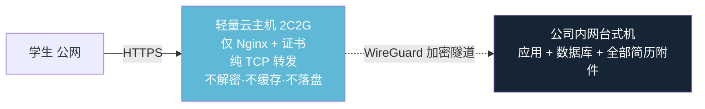
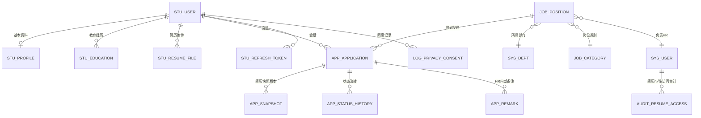
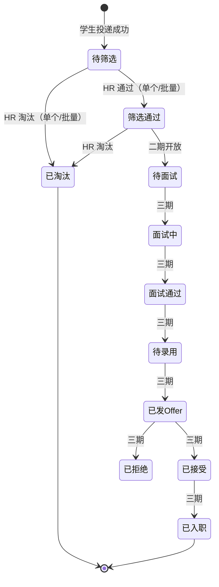
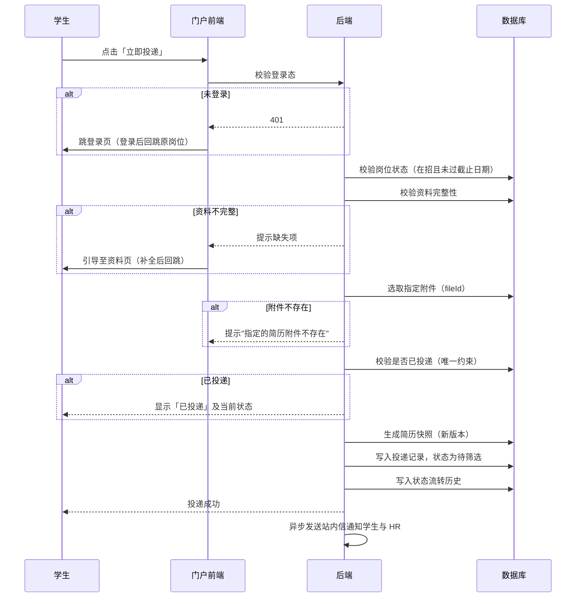
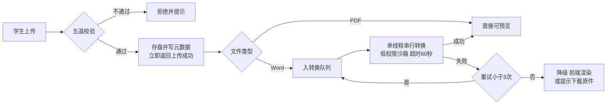
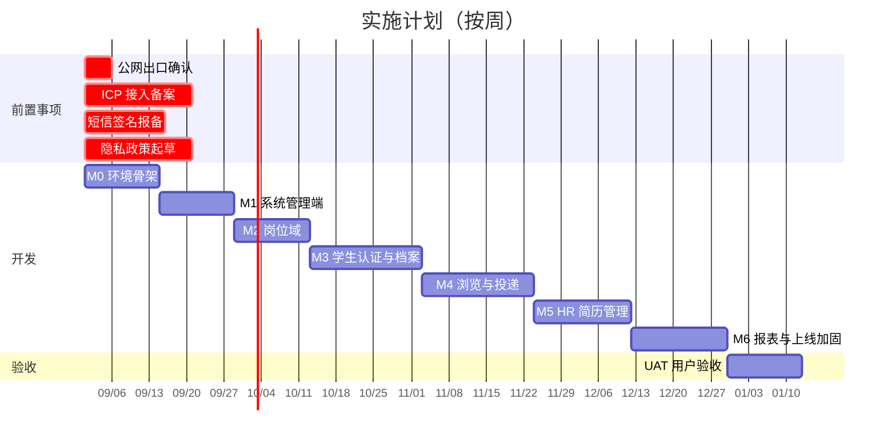

# 校园招聘简历管理系统 技术方案

| 项 | 内容 |
|---|---|
| **项目名称** | 校园招聘简历管理系统 |
| **建设单位** | 遨天科技（北京）有限公司 |
| **需求部门** | 人文发展部 |
| **当前版本** | V2.1（原 V1.0 经 6 轮迭代升级） |
| **首次编制日期** | 2026 年 8 月 6 日（V1.0） |
| **最近更新日期** | 2026 年 8 月 9 日（V2.1） |
| **编制依据** | 《校园招聘简历管理系统_开发需求文档》V1.0（2026-08-05） |
| **编制过程** | 经技术调研、四路并行设计、三轮独立审计、甲方 13 项决策确认（V1.0）→ 网络管理模块设计/实施/测试（V2.0）→ 学生管理模块优化（V2.1） |

---

## 系统升级记录

### V2.1 — 学生管理模块优化（2026-08-09）

| 提交 | 内容 |
|------|------|
| `b5fb98a` | 列表新增毕业院校/专业列（ROW_NUMBER 窗口函数取最高学历），取消邮箱列；新增三项排序（毕业院校/专业/注册时间），Controller 白名单防注入；新增学生详情页（基本信息+教育经历+实习+简历附件+投递历史+完整手机号+审计埋点） |
| `47a5611` | 修正 5 项 code-validator 发现的方案偏差（投递条数/卡片标题/投递链接/label 字段） |

### V2.0 — 网络管理模块全链路（2026-08-09）

| 提交 | 内容 |
|------|------|
| `78fa734` | 阶段2：CORS 白名单管理界面（增删改查+启停用），局域网访问开关，方法级权限控制（hr_director 可写/招聘专员只读） |
| `c1d72e5` | 阶段3：网络诊断接口（被动检测，白名单式 DTO 防信息泄露），变更审计（audit_network_config 表+历史查询），前端诊断卡片+变更历史表格 |
| `e674eb9` | **阻塞级修复**：CorsFilter 用 FilterRegistrationBean 设置 Ordered.HIGHEST_PRECEDENCE，解决 OPTIONS 预检被鉴权层拦截、真实浏览器跨域场景可能连不上的隐性问题 |
| `98e7dac` | 测试方案：73 条用例（P0 28 条），覆盖 CORS 核心机制/管理界面/诊断审计/认证越权/真实网络场景/回归；全部自动化可验证用例 PASS，手机真实设备验证 PASS |

### V1.1 — Bug 修复与文档初始化（2026-08-09）

| 提交 | 内容 |
|------|------|
| `2b73f17` | 初始提交：源码+设计文档，340 文件 |
| `54bf1da` | **修复**：Dashboard「最近投递动态」和字典列表因 `data.records` vs `data.rows` 字段名不匹配，从上线起从未渲染任何数据 |
| `289bf28` | CLAUDE.md 仓库指南 |
| `f2e3d60` | README.md 项目说明 |

---

## 一、执行摘要

### 1.1 项目目标

建设一套自主可控的校园招聘管理系统，解决当前**简历分散在校招邮箱与线下纸质收集、无法统一管理**这一核心痛点。学生通过公司专属校招门户完成岗位浏览、简历投递与进度查询；HR 通过管理后台完成岗位发布、简历筛选与数据分析。

### 1.2 方案一句话

**基于 Spring Boot 3 + Vue 3 的前后端分离单体应用，部署于公司机房单台台式机，学生门户对公网开放、HR 后台仅内网访问，不引入任何分布式中间件。**

### 1.3 关键数字

| 项 | 数值 |
|---|---|
| **总工作量** | **103 人日**（Java 全栈 79 + 前端 24） |
| **工期** | **约 18 周**（16 周开发 + 2 周 UAT） |
| **人力配置** | 1.0 名 Java 全栈 + 0.5 名前端（含 15% 缓冲） |
| **硬件要求** | 单台台式机，i5 及以上 / 16GB 内存 / SSD + 独立备份盘，部署于公司机房 |
| **软件成本** | **0 元**（全部采用 MIT/Apache 等免费商用开源组件） |
| **年运营成本** | **约 100 元**（阿里云短信 0.045 元/条，按每届数千条估算） |
| **并发能力** | 设计目标 20 并发，实测理论上限 200+，**余量约 10 倍** |
| **功能覆盖** | 需求文档 29 项，一期实现 20 项、二期 6 项、三期 3 项，**无遗漏** |

### 1.4 需要立即启动的四项前置事项

以下均为**外部流程，增加人力无法压缩周期**，须在项目启动日（D0）同时发起：

| 事项 | 责任方 | 周期 | 不启动的后果 |
|---|---|---|---|
| **确认公网出口条件**（固定 IP / 80-443 是否被封 / 端口映射权限） | 甲方 IT | 立即 | 本方案部署形态的全部前提；不成立须切换降级预案 |
| **子域 `campus.atmoto.cn` ICP 接入备案** | 甲方 | 10–20 工作日 | 域名不可用，门户无法上线 |
| **阿里云短信实名认证 + 签名报备** | 甲方 | 15 工作日 | 阻塞学生端注册功能联调与验收 |
| **隐私政策正文起草** | 甲方法务 | D0 启动 | 学生同意将指向空内容、法律上自始无效，第三里程碑无法收尾 |

### 1.5 本方案的诚实声明

本方案经三轮独立审计（设计冲突 26 条、安全技术 31 条、合规运维 13 项），以下事项如实披露，不作粉饰：

**一、三项功能"名义覆盖、实质缩水"**

| 需求项 | 需求文档标注 | 实际能力 |
|---|---|---|
| **S-007 简历在线预览** | 必填 | PDF 可即时预览；Word 需后台异步转换，投递高峰期可能排队十余分钟；**`.doc` 老格式存在转换失败的可能，失败后无法在线预览，只能下载原件**。成功率无法承诺 100%，门户将显著提示"推荐上传 PDF 格式" |
| **S-014 我的投递** | 功能清单标"可选" | 需求文档 §1.2 项目目标写明"一站式完成浏览、投递、**查进度**"，与功能清单标注矛盾。**经甲方决策已上调为一期必做** |
| **A-001 短信/邮件模板管理** | 需求列明 | 四份设计文档均遗漏此项，经审计发现后**已补入一期** |

**二、等保测评的选择**

本系统已触发网络安全等级保护二级要求。方案选择**上线后 3 个月内完成定级备案、暂缓测评**。理由：备案成本近乎为零却可将法律状态由"未履行义务"转为"合规进行中"；而测评费用 5–11 万元，且当前部署环境在"安全物理环境"控制项上必然失分，此时测评必不合格。待物理环境改善后再行测评更为经济。

**三、备份策略的残留风险**

经甲方决策，采用本地定期手动备份 + AES-256 加密，**不启用异地备份**。加密消除了"备份介质丢失导致全量个人信息明文泄露"的风险；但**勒索软件与物理灾害场景下的数据丢失风险未被缓解**。此风险已向甲方明示，甲方知悉并接受。缓解方案（阿里云 OSS 只写不删子账号，约 150 元/年）保留在方案中备选。

---

## 二、需求理解与范围界定

### 2.1 业务背景

当前校园招聘依赖第三方平台与线下宣讲会，需求文档 §1.1 列出四项痛点，其中**第一项为核心**：

> 简历分散校招邮箱、各个线下校招专场收集得的纸质简历，效率低下。**（这个最主要，主要是希望有一个系统用于收集学生投递的简历，HR 能用来发布岗位和处理收集的简历，筛选合适简历用于面试）**

需求方在原文中以括号形式强调了这一点，本方案据此确定优先级：**"收集—筛选"链路是一期的绝对核心**，面试管理、通知体系等均为其后。

### 2.2 建设目标

1. **统一校招入口**：建立公司专属校招门户，学生一站式完成浏览、投递、查进度
2. **提升 HR 效率**：集中管理简历、一键筛选、批量操作
3. **流程标准化**：从岗位发布到筛选的全流程线上化、可追溯
4. **数据可分析**：沉淀校招数据，支持多维度统计

### 2.3 功能范围

需求文档共 29 项功能，按需求文档自身的必要性标注划分优先级：

#### 一期实现（P0，20 项）

| 编号 | 功能 | 需求标注 |
|---|---|---|
| S-001 | 手机号 + 短信验证码注册 | — |
| S-002 | 密码登录 / 找回密码 | — |
| S-004 | 基本资料填写 | **必填** |
| S-005 | 教育经历 | **必填** |
| S-007 | 简历附件上传与在线预览 | **必填** |
| S-010 | 岗位列表展示 | — |
| S-011 | 多条件筛选 + 关键词搜索 | — |
| S-012 | 岗位详情页 | — |
| S-013 | 一键投递（同岗位防重复） | — |
| **S-014** | **我的投递（进度查询）** | 可选 → **甲方决策上调 P0** |
| H-001 | 创建岗位 | **必须** |
| H-002 | 编辑 / 上下架 / 到期自动下架 | **必须** |
| H-004 | 简历列表（多维筛选排序） | **必须** |
| H-005 | 简历详情 + 附件预览 + 内部备注 | **必须** |
| H-006 | 简历筛选操作（单个 + 批量） | **必须** |
| H-007 | 简历导出 Excel + 下载附件 | **必须** |
| A-001 | 基础配置（品牌、Banner、公告） | — |
| **A-001-T** | **短信/邮件模板管理** | 审计发现遗漏 → **补入一期** |
| A-002 | 组织架构与岗位类别管理 | — |
| A-003 | 权限管理（HR 账号与角色） | — |
| — | 数据报表 | **必须**（HR 角色定义中标注） |

> 另含个人信息保护法要求的**个人权利功能**（查阅、导出、更正、删除、撤回同意、账号注销）——需求文档未提及，但属法定义务，一期必须实现。

#### 二期（P1，6 项）
S-006 实习/项目经历、S-008 技能证书、S-009 社团经历（三项均标"非必填"）、S-015 站内消息、H-003 岗位模板、完整候选人状态流转。

#### 三期（P2，3 项）
S-003 微信登录（标"可选，优先级低"）、S-016 短信/邮件通知（标"可以不实现"）、H-008~H-010 面试管理（标"可选，或后续优化"）。

### 2.4 明确不做

- 社会招聘、内部推荐（需求文档 §1.3 明确排除）
- 简历智能解析、AI 匹配打分（需求未提及，且与"技术成熟、设计简洁"约束冲突）
- 移动端原生 App（门户采用响应式设计，移动浏览器可正常使用）

---

## 三、总体方案设计

### 3.1 架构总览



### 3.2 三端组织方式

| 组成 | 数量 | 说明 |
|---|---|---|
| **前端工程** | **2 个** | ① 学生门户（全新自建，深空品牌风）② HR 后台 + 系统管理（合并，RuoYi-Vue3 二开，浅色主题） |
| **后端应用** | **1 个** | 单体 Spring Boot 应用，Controller 按 `/api/portal`、`/api/admin`、`/api/system` 三段前缀分区 |

**为什么 HR 端与系统管理端合并？**
同一批内部用户、同一次登录、同一棵 RBAC 菜单树。拆开只会复制登录页与权限指令，无任何收益。

**为什么学生门户不复用 RuoYi 前端？**

| 理由 | 说明 |
|---|---|
| **加载性能** | RuoYi 前端产物 1.5–2.5MB，学生常用移动网络访问，不可接受。门户目标 gzip ≤ 250KB |
| **视觉冲突** | 深空底色 vs 白底表格，覆盖 Element Plus 样式的成本高于重写 |
| **安全边界（最重要）** | 独立工程把安全边界固化到**构建产物层**——公网目录里不会出现任何后台 JS。否则后台接口路径、字段结构、权限点全部泄露给攻击者用于侦察 |
| **认证隔离** | 两套 JWT 与两套拦截器混在一个工程中必然出事故 |

**为什么后端只有 1 个应用？**
双应用方案已淘汰：同一份业务数据出现两个写入方等于隐式耦合，运维内存翻倍，而同机同用户运行的进程隔离并无真实安全收益。

### 3.3 技术栈

| 层次 | 选型 | 版本 | 选择理由 |
|---|---|---|---|
| 后端框架 | Spring Boot | 3.4.x（Java 17 LTS） | 国内人才最易招募，后台生态最完整，单体部署最简单 |
| 后台基座 | RuoYi-Vue | 最新稳定版 | **MIT 协议，完全免费商用**；RBAC、部门、字典、操作日志开箱即用，覆盖系统管理端约 60% 工作量 |
| 前端框架 | Vue 3 + Vite | 3.4+ | HR 端表格密集操作必须 SPA；公司官网即 Vite 技术栈，团队无接手障碍 |
| UI 组件库 | Element Plus | 最新稳定版 | 中文文档最完善、国内用户群最大、后台组件最全 |
| 数据库 | MySQL | 8.0.x | ngram 全文索引直接满足关键词搜索；备份仅需一条 mysqldump |
| 本地缓存 | Caffeine | 与 Spring Boot 集成 | 替代 Redis，验证码 TTL/配置热加载等全部场景由 Caffeine 覆盖 |
| 文件存储 | 本地文件系统 | — | 数据量 GB 级，对象存储属过度设计 |
| 文档转换 | LibreOffice Headless | — | Word 转 PDF 还原度最高的免费方案 |
| PDF 渲染 | pdf.js | — | 浏览器端渲染，无需服务端参与 |
| 部署 | Windows 裸机 + 运维脚本 | — | 不引入 Docker，避免 WSL2 依赖与额外内存开销 |

### 3.4 明确不引入的组件

这是"设计简洁"约束的兑现证明。每一项都经过量化论证：

| 组件 | 裁决 | 不引入的依据 |
|---|---|---|
| **Redis** | ❌ 不引入 | 20 并发无缓存压力；短信验证码等临时数据用 Caffeine 本地缓存即可。RuoYi 的 7 处 Redis 依赖改造成本 2.0 人日，低于引入并长期维护 Redis 的 2.5 人日 |
| **消息队列** | ❌ 不引入 | 无跨服务异步解耦需求，通知类操作用 Spring `@Async` 线程池 |
| **Elasticsearch** | ❌ 不引入 | 岗位总量数十个，MySQL FULLTEXT + ngram 分词扫描 <10ms |
| **Quartz / XXL-Job** | ❌ 不引入 | 仅 5 个定时任务，Spring `@Scheduled` 足够 |
| **Docker** | ❌ 不引入 | Windows 上依赖 WSL2，额外 1–2GB 内存，徒增故障面 |
| **Nginx** | ✅ 引入 | 公网部署必需：反向代理、静态资源、HTTPS 终结、路径白名单 |

### 3.5 Maven 模块架构（五模块单向依赖）

```
recruit-common → recruit-system → recruit-framework → recruit-biz → recruit-admin
```

反向引用会导致 Maven 构建期循环依赖编译失败。此约束在实施过程中两次验证有效——① `recruit-system` 不能引用 `recruit-framework` 中的 `AdminUserHolder`，网络管理模块的审计上下文通过 `NetworkAuditContext` DTO 由 Controller 层组装后传入 Service 解决；② CORS 相关 Service/Mapper 必须放在 `recruit-system`（不能照搬 `BrandConfigController` 放进 `recruit-biz`），否则 `recruit-framework` 中的 `DynamicCorsConfigurationSource` 无法引用。

---

## 四、部署方案

### 4.1 推荐拓扑（方案 B — 已经甲方确认）



**纵深防御的三层设计**：

| 层 | 措施 | 效果 |
|---|---|---|
| **网络层** | 路由器只映射 80/443 | 8080、3306 在 TCP 层即不可达，非依赖应用层配置 |
| **绑定层** | `server.address=127.0.0.1`、MySQL `bind-address=127.0.0.1` | 即使防火墙配置失误，服务也只监听回环地址 |
| **代理层** | Nginx 公网 vhost 白名单放行 `/api/portal/`，其余显式 403 | 后台接口、监控端点、RuoYi 原生路径全部拦截 |

**HR 后台不暴露公网**——简历库是本系统的全部价值所在，不值得为出差便利而独立承担公网爆破与漏洞扫描压力。出差场景走公司 VPN。

**HTTPS**：域名 `campus.atmoto.cn`，win-acme + Let's Encrypt 自动续期。

### 4.2 降级预案（方案 C — 已写入，暂不采购）

**触发条件**：甲方 IT 确认公网出口三项条件（固定公网 IP / 80-443 未被运营商封禁 / 具备端口映射权限）中**任一不成立**。国内企业宽带封禁 80/443 入向端口的情况相当普遍，此预案有实际必要性。



**关键属性：数据不出内网。** 云主机仅承担四层转发，简历、附件、数据库全部仍在公司台式机上。

**为何不违反"单台台式机部署"约束**：该约束的实质是"不做集群、不做微服务、不引入分布式中间件"。云主机在此不运行任何业务逻辑、不存储任何数据，仅相当于一根网线的延长。

**成本**：+2.0 人日，约 60–100 元/月。

### 4.3 方案 A（纯内网）— 仅作降级形态

若甲方完全不接受公网暴露，系统将降级为"HR 内部简历录入工具"——学生无法在线投递，**项目核心目标不成立**，需在合同层面重新定义验收标准。此形态仅作为联调环境与极端网络故障时的降级形态保留。

### 4.4 硬件与目录规划

| 项 | 要求 |
|---|---|
| CPU / 内存 | i5 及以上 / 16GB（应用 4GB + MySQL 2GB + LibreOffice 1GB + 系统余量） |
| 磁盘 | 系统盘 SSD；**E: 数据盘与 F: 备份盘须为两块独立物理盘** |
| 部署位置 | **公司机房**（已确认，非办公室），具备门禁 |
| 操作系统 | Windows 10/11 或 Windows Server |

```
E:\atmoto-recruit\
├── app\                  应用 JAR 与配置（application-prod.yml 含密钥，须限制 ACL）
├── data\
│   ├── resume\           简历附件原件（按 年/月 分目录，UUID 命名）
│   ├── converted\        转换后 PDF 缓存
│   └── temp\             上传临时区（定时清理）
├── logs\                 应用/访问/审计/错误 分类日志
└── nginx\                Nginx 与前端静态资源（root 目录）

F:\backup\                加密备份（AES-256），独立物理盘
```

> ⚠️ **`data\` 目录绝不可位于 Nginx root 之下**，且部署脚本须在启动时强制校验此项——否则简历附件可被公网直接下载。此为上线前必检项。

---

## 五、数据设计概要

### 5.1 实体关系



### 5.2 表结构汇总（25 张自建表 + 复用 RuoYi 约 15 张系统表）

| 域 | 表数 | 主要内容 | 一期状态 |
|---|---|---|---|
| 学生域 | 7 | 账号、基本资料、教育经历、实习经历、技能证书、社团经历、简历附件 | 一期实现 4 张；实习/技能/社团 3 张建表待二期 |
| 岗位域 | 3 | 岗位主表、岗位类别、岗位模板 | 一期实现 2 张 |
| 投递域 | 4 | 投递记录、**简历快照版本表**、状态流转历史、HR 内部备注 | 全部一期实现 |
| 通知域 | 2 | 站内消息、通知模板 | 一期实现 |
| 合规域 | 3 | 隐私政策版本、同意记录、简历访问审计 | 全部一期实现（法定义务） |
| 会话域 | 1 | 学生 refresh token（可吊销） | 一期实现 |
| 系统域 | 2 | 品牌配置、Banner 公告 | 一期实现 |
| **网络管理域** ●V2.0 | **3** | **CORS 动态白名单、网络配置开关、网络配置变更审计** | **V2.0 全部实现** |

**复用 RuoYi 自带**：`sys_user`（HR 账号）、`sys_role`、`sys_dept`、`sys_menu`、`sys_dict_*`、`sys_oper_log`、`sys_config` 等，不重复设计。

### 5.3 V2.0 新增网络管理域表结构

| 表名 | 用途 | 关键字段 |
|------|------|---------|
| `sys_cors_origin` | CORS 白名单（EXACT 精确匹配 + CIDR 网段匹配统一表） | `rule_type`(EXACT/CIDR)、`rule_value`、`is_active`、`is_builtin`(1=禁止物理删除) |
| `sys_network_config` | 网络配置开关（KV 模式，如局域网访问开关） | `config_key`、`config_value`、`config_type`、`config_group` |
| `audit_network_config` | 网络配置变更审计（不可变日志，仅追加） | `rule_id`、`operation_type`、`old_value`/`new_value`(JSON快照)、`operator_id`、`ip_address` |

**审计表 `audit_resume_access` 的扩展使用**：V2.1 起，学生详情页查看操作（`VIEW_STUDENT_DETAIL`）也写入此表，通过 `operation_type` 字段区分简历访问与学生详情访问。`target_application_id` 在学生详情场景下为 NULL。

### 5.4 五项关键数据设计决策

| 决策 | 结论 | 理由 |
|---|---|---|
| **学生账号独立于 sys_user** | 学生用 `stu_user`，HR 用 RuoYi 的 `sys_user` | 认证方式不同、字段需求不同；外部用户与内部员工分表可降低拖库影响面；两者可独立演进 |
| **简历快照独立版本表** | 投递时生成 `app_snapshot` 版本记录，投递主表仅存当前版本指针 | 保证 HR 评审一致性——昨天看到的与今天看到的必须是同一份。学生更新简历后重投生成**新版本**，历史版本完整保留，HR 端可见"该候选人已更新简历（第 N 版）" |
| **防重复投递** | `UNIQUE KEY (student_id, job_id)` 数据库硬约束 | 一名学生对一个岗位始终只有一条记录；"更新后重投"通过新增快照版本实现，不破坏唯一性 |
| **关键筛选字段冗余** | 学校、专业、学历等冗余为投递表普通列并建索引 | 若从 JSON 快照中筛选则无法走索引；若连表查学生主表则会出现"列表按新学校筛选、详情显示旧学校"的不一致 |
| **全文检索不用 ES** | `FULLTEXT ... WITH PARSER ngram`，`ngram_token_size=2`，LIKE 兜底 | 岗位总量数十个，扫描 <10ms；引入 ES 徒增运维负担 |

### 5.5 容量估算

| 项 | 3 年累计 | 说明 |
|---|---|---|
| 岗位 | 数百条 | 每届数十个 |
| 学生与投递 | 数千条 | 每届数百到数千 |
| 简历附件 | 约 20–30 GB | 按每份 3–5MB 均值估算 |
| 数据库 | < 1 GB | 快照 JSON 约 3KB/份 |

单机磁盘容量绰绰有余，无需分库分表、无需归档策略。

---

## 六、关键业务流程

### 6.1 候选人状态机

一期实现三个状态的流转，其余状态值在数据字典中预置但不开放流转：



**并发安全**：采用乐观锁（`version` 字段），更新条件包含当前状态与版本号。两名 HR 同时操作同一份简历时，后者收到"已被其他同事操作，请刷新"提示，不会静默覆盖。

**误操作撤销**：支持 5 分钟内撤销，回退至前一状态并写入审计日志。

### 6.2 简历投递流程



### 6.2.1 投递时选择简历附件

**问题背景**：学生可以在个人中心上传多份简历附件（如中文简历、英文简历、作品集等），投递时需要明确指定使用哪一份作为正式投递简历。

**设计决策**：投递确认页列出学生已上传的全部附件，学生通过单选按钮选择其中一份。后端投递接口接受 `fileId` 参数，按 ID + studentId 双重校验归属后，将该附件信息写入简历快照。

**前端实现**（`ApplyView.vue`）：

- 投递确认页在"简历摘要"与"渠道来源"之间新增"选择投递简历"区域
- 以 radio 单选列表展示所有附件（文件名、大小、上传时间）
- 默认选中第一个附件
- 若未选择附件，提示"请选择一份简历附件用于投递"

**后端实现**：

- `SubmitApplicationRequest` 新增 `fileId` 字段（可空）
- `ApplicationServiceImpl.submitApplication()` 新增参数 `Long fileId`
- 选取逻辑：
  - `fileId != null`：按 id + studentId 双重条件查询附件，不存在则返回"指定的简历附件不存在"
  - `fileId == null`：默认取附件列表第一条
- 选中的附件信息通过 Jackson 序列化写入 `app_snapshot.snapshot_resume_file` JSON 字段

**API 变更**：

- `POST /api/portal/applications/submit` 请求体新增可选字段 `fileId`（类型 Long）

### 6.3 简历附件转换流程



**三条硬性约束**：

1. **转换永不阻塞上传**——上传成功即返回，转换在后台进行
2. **队列满时走数据库兜底**——标记为待转换，由定时任务捞取，绝不因转换失败导致上传失败
3. **PDF 为主推荐格式**——门户上传处显著提示"推荐 PDF，可即时预览"，从源头减少转换量

**并发策略**：LibreOffice 多进程并发存在共享 profile 锁冲突，故采用**单线程串行队列** + 每次转换使用独立临时用户目录。

### 6.4 定时任务（全部使用 Spring @Scheduled）

| 任务 | 频率 | 职责 |
|---|---|---|
| 岗位到期自动下架 | 每 5 分钟 | 截止日期已过的岗位置为下架 |
| 转换失败重试扫描 | 每 2 分钟 | 捞取卡住或失败的转换任务 |
| 临时文件清理 | 每日 03:00 | 清理上传临时区 |
| 数据保留期清理 | 每日 02:00 | 未录用满 365 天、已淘汰满 180 天的记录执行去标识化 |
| 数据库备份 | 每日 01:00 | 见 8.5 节 |

所有任务采用"全量扫描 + 条件过滤"模式而非事件驱动，重启后首次执行即可覆盖全部符合条件的记录，无需持久化调度状态。

### 6.5 一期通知范围

仅实现 3 个站内信场景，短信与邮件通道通过策略模式预留扩展位：

| 场景 | 渠道 | 接收方 |
|---|---|---|
| 简历投递成功 | 站内信 | 学生 |
| 新简历投递提醒 | 站内信 | 岗位负责 HR |
| 简历筛选通过 | 站内信 | 学生 |

---

## 七、界面与用户体验

### 7.1 学生端门户视觉方案

品牌视觉全部取自公司官网源码实测值，非推测：

| 元素 | 色值 | 来源 |
|---|---|---|
| 品牌主色 | `#5FB8D6` | 官网 CSS 变量 `--theme-primary-rgb: 95 184 214` |
| 强调亮蓝 | `#6BB3FF` | `--theme-bright` |
| 深空背景 | `#0A0E17` | `--theme-bg` |
| 卡片背景 | `#152535` | `--theme-card` |
| 成功/通过 | `#5FB88D` | 官网辅助绿 |
| 警告/淘汰 | `#E8A33D` / `#E05252` | **官网无此类语义色，为后台可用性新增**，可在品牌配置中覆盖 |

**字体处理**：官网使用的 Cinzel、Rajdhani、Share Tech Mono **均无中文字形**，中文会 fallback 导致中英文混排断裂。因此：

- 中文一律走系统字体栈：`"PingFang SC", "Microsoft YaHei", "Source Han Sans SC", sans-serif`
- 英文与数字可保留 Rajdhani / Share Tech Mono，须自托管字体文件（不依赖 Google Fonts CDN）

**门户页面结构**：品牌 Banner（可配置）→ 公告 → 岗位列表（卡片式 + 筛选器）→ 公司介绍（复用官网"200+ 产品交付 / 5kW+ 最大功率 / 100% 自主研发 / LEO 轨道范围"数据位）→ 页脚（Logo、备案号、联系邮箱 AT-HR@atmoto.cn、公众号二维码）。

响应式设计，移动端优先保证投递链路可用。

### 7.2 HR 端界面

**采用浅色主题**——这是可用性优先于品牌一致性的取舍：HR 端是表格密集型工具，需长时间阅读并支持打印导出，深色底不适合。仅主色沿用 `#5FB8D6`（主按钮、选中态、链接）。

**简历详情页布局**：桌面端左右 5:5 分栏，左侧结构化资料（基本信息、教育经历、投递信息、内部备注），右侧 pdf.js 附件预览；移动端自动切换上下布局。

**键盘快捷键**（HR 高频页面效率设计）：

| 键位 | 功能 | 键位 | 功能 |
|---|---|---|---|
| `J` / `K` | 下一份 / 上一份简历 | `Enter` | 打开详情 |
| `P` | 通过 | `Shift+P` | 批量通过 |
| `R` | 淘汰 | `Shift+R` | 批量淘汰 |
| `E` | 导出 | `Space` | 勾选 |
| `Esc` | 关闭 | `?` | 帮助面板 |

焦点位于输入框时自动屏蔽。

### 7.3 页面清单汇总

| 端 | 页面数 | 主要页面 |
|---|---|---|
| 学生门户 | 12 | 首页、岗位列表、岗位详情、注册、登录、找回密码、个人资料、教育经历、简历附件、投递确认、我的投递、隐私政策与个人权利中心 |
| HR 后台 | 13 | 登录、工作台、岗位列表、岗位编辑、简历列表、简历详情、批量操作、导出、数据报表、消息中心、个人设置、**网络管理** ●V2.0、**学生详情** ●V2.1 |
| 系统管理 | 10 | 品牌配置、Banner 公告、通知模板、部门管理、岗位类别、账号管理、角色权限、操作日志、**网络管理** ●V2.0、**学生管理(含排序+院校+专业列)** ●V2.1 |

---

## 八、安全与合规设计

### 8.1 认证与授权

| 措施 | 设计 |
|---|---|
| **两套独立认证** | 学生端与 HR 端使用独立用户表、独立 JWT 签名密钥与 `aud` 声明、独立 SecurityFilterChain。学生 token 在后台过滤链上**验签即失败**——防越权从"依赖每个接口注解写对"变为"结构上不可能" |
| **会话可吊销** | access token 2 小时 + refresh token 7 天落库。登出即删除数据库记录，token 立即失效；支持"在其他设备退出登录" |
| **refresh 轮换** | 每次刷新生成新 token，旧 token 再次使用即判定为盗用，全链吊销 |
| **登录保护** | 密码加盐哈希、失败次数锁定、图形验证码（学生端与 HR 端各自独立的验证码接口） |
| **短信防刷** | 同手机号/同 IP 频率限制 + 图形验证码前置 + 日发送上限 |

### 8.2 越权防护三层

| 层级 | 风险 | 措施 |
|---|---|---|
| **水平越权** | 学生 A 查看学生 B 的简历 | 所有学生端接口的学生标识一律从 token 提取，**不接受请求参数传入**；附件访问通过统一切面强制校验归属 |
| **垂直越权** | 学生 token 调用 HR 接口 | 双过滤链 + 双密钥，结构性阻断 |
| **HR 间越权** | HR-A 查看 HR-B 负责岗位的简历 | 岗位表增加负责人字段；简历列表、详情、导出、批量操作及全部报表接口**均施加数据范围约束**；招聘专员角色**不授予导出权限** |

> 此项在初版设计中仅停留于声明——字段未建、注解未标。经安全审计核实后已完整补齐，并列为里程碑验收硬性条件。

### 8.3 动态 CORS 安全管理 ●V2.0 新增

HR 后台通过「系统管理 → 网络管理」可视化管理跨域访问白名单，修改后即时生效不需重启：

| 防护措施 | 说明 |
|---|---|
| **白名单模式** | 仅精确 Origin 匹配或 CIDR 网段（限 RFC1918 私网地址段 + 前缀 ≥ /16） |
| **通配符禁止** | `*` 在保存时被后端强制拒绝——通配符 + 当前硬编码的 `allowCredentials=true` 是浏览器规范禁用的高危组合 |
| **内置规则保护** | `is_builtin=1` 的种子规则（如 `campus.atmoto.cn`）禁止物理删除，仅允许禁用，防止误操作导致门户跨域全部失败 |
| **CORS/鉴权解耦** | CorsFilter 用 `FilterRegistrationBean` 设为 `Ordered.HIGHEST_PRECEDENCE`，在 Spring Security 过滤链之前执行；OPTIONS 预检不再被鉴权层拦截 |
| **遗留高危配置清除** | 删除了 `ResourcesConfig.java` 中 `allowedOriginPatterns("*") + allowCredentials(true)` 的 RuoYi 脚手架遗留代码 |
| **CORS 不能替代访问控制** | 模块文档明确标注：CORS 只约束浏览器脚本，对 `curl`/直接 API 调用无效，HR 后台的公网不可达性由 Nginx 层保证，不是靠 CORS |

### 8.4 网络诊断安全边界 ●V2.0 新增

`GET /api/system/network/diagnostics` 接口返回当前监听地址/端口/CORS白名单/来源IP/Nginx转发特征等诊断信息。安全约束：

- 响应体严格走白名单式 DTO（`NetworkDiagnosticsVO`），不序列化 `Environment`/`ServerProperties` 整对象
- 绝不返回 `jwt.*.secret`、数据库连接串等敏感配置
- **纯被动检测**——不做任何出站 HTTP 请求探测前置 Nginx 存活（后端是被反代方，反向探测是错误依赖方向）
- 仅 `adminFilterChain` 认证后可访问，不在任何 `permitAll` 列表

### 8.5 文件上传与转换安全

**五道校验**：扩展名白名单 → MIME 类型 → 大小不超过 10MB → **文件魔数嗅探** → docx 需校验 ZIP 内部文档结构存在。

**LibreOffice 加固**（本系统唯一"接受公网匿名用户上传的二进制文件并由服务端主动解析"之处，攻击面等同于把文档解析器暴露在公网）：

| 措施 | 目的 |
|---|---|
| 禁用宏、禁用外部链接与 OLE 对象加载 | 阻断 DDE 执行、外部实体引用导致的内网探测与凭据外泄 |
| **以独立低权限账户运行**，禁止使用系统最高权限账户 | 即使被利用，也无法读取应用配置中的数据库密码、JWT 密钥、云服务密钥 |
| 沙箱工作目录 + 转换超时 60 秒 + 强制终止 | 限制资源占用与横向移动 |

**附件访问**：预览与下载使用**一次性凭据**（60 秒有效、用后即焚），不再在 URL 中携带会话 token——避免 HR 分享预览链接时连带移交完整会话权限。

### 8.6 个人信息保护法合规

| 法定义务 | 法条 | 本方案的落实 |
|---|---|---|
| **告知同意** | 第 13/14/17 条 | 隐私政策独立页面 + 版本管理；注册时双勾选并记录同意时间、IP 与政策版本号 |
| **最小必要** | 第 6 条 | **删除户籍所在地必填**（兼具《就业促进法》第 31 条就业歧视风险）；**删除设计中自创的头像字段**；性别、出生年月、现居住地降为选填 |
| **保留期限** | 第 19 条 | 未录用 365 天、已淘汰 180 天（甲方确认），到期自动执行去标识化 |
| **查阅与复制** | 第 45 条 | 学生端「个人权利中心」提供资料查阅与一键导出个人数据 |
| **更正补充** | 第 46 条 | 资料编辑功能已覆盖 |
| **删除权** | 第 47 条 | 提供账号注销，级联执行去标识化覆写（姓名、手机号清除，附件物理删除） |
| **撤回同意** | 第 15 条 | 提供撤回入口及后续处理说明 |
| **保护负责人** | 第 52 条 | 门户公示联系渠道 AT-HR@atmoto.cn |
| **审计留痕** | — | 简历查看、导出、删除等 11 类操作 + **学生详情查看** ●V2.1 强制记录；**应用数据库账号收回审计表删除权限**，防止一条 SQL 清空留痕 |
| **导出管控** | — | 单次上限 + **日累计上限 2000 条** + 三处水印 + 联系方式默认脱敏 + 全量留痕 |

> **一处重要澄清**：初版设计中称到期数据执行"匿名化"，实为**去标识化**——仍属个人信息，不能主张个保法第 4 条的豁免。本方案已改为：个人信息字段**不可复原地覆写**（等效删除），同时将统计维度（学历、岗位类别、渠道、是否通过）预先写入独立的匿名聚合表，保证报表连续性不因清理而失真。

> **另一处设计冲突的裁定**：简历快照原设计为"永不删除"以保证留证，与学生删除权直接冲突。**裁定删除权优先**（留证是内部管理需要，删除权是法定义务，且招聘场景无会计法式的强制保存期）。留证需求改由不含个人信息的状态流转记录承担——可证明"某次筛选于何时由谁作出"，无需知道对象是谁。

### 8.7 备份与恢复（按甲方决策）

| 项 | 方案 |
|---|---|
| 数据库 | `mysqldump` 配合凭据文件（避免无人值守时的密码交互挂起）；使用最小权限备份账号 |
| 附件 | `robocopy /E /XO`（**禁用 `/MIR`**——镜像模式会把清理任务已删除的文件从备份中一并抹除） |
| **加密** | **7-Zip AES-256，同时加密文件名** |
| 执行方式 | Windows 任务计划程序 + 定期手动执行 |
| 脚本编码 | `.bat` 纯 ASCII 无 BOM 且不加 `chcp 65001`；`.ps1` 须 UTF-8 with BOM |
| binlog | **须与数据文件分置于不同物理盘**，否则实际恢复点目标为 24 小时而非承诺值 |

> ⚠️ **加密密码遗失将导致全部备份不可用**。要求由 HR 主管与 IT 负责人分别留存，不得仅存于部署机本机，不得明文写入脚本。

### 8.8 等级保护

**判定**：公网提供服务 + 处理大量个人信息，依《网络安全法》第 21 条与 GB/T 22240-2020，触发**二级**。系统不承载任何技术数据，商业航天属性不拉高定级。

**路径（甲方已确认）**：上线后 3 个月内完成定级备案，暂缓测评。日志留存 180 天已满足二级要求。

**暂缓测评的理由**：备案成本近零（2–4 周流程）却可将法律状态由"未履行义务"转为"合规进行中"；测评费用 5–11 万元，且当前部署环境在"安全物理环境"控制项上必然失分，此时测评必不合格。

---

## 九、实施计划

### 9.1 里程碑

| 里程碑 | 范围 | 关键交付物 | 验收标准 | 周数 |
|---|---|---|---|---|
| **M0** | 环境骨架 | 服务器环境、RuoYi 基座裁剪与去 Redis 化改造、两个前端工程脚手架、数据库初始化 | 应用可启动，HR 可登录并看到菜单 | 2.0 |
| **M1** | 系统管理端 | 品牌配置、Banner 公告、通知模板、部门与岗位类别、账号与角色权限 | 管理员可完成全部基础配置；**HR 数据范围权限生效** | 2.0 |
| **M2** | 岗位域 | 岗位创建/编辑/上下架、到期自动下架、岗位列表与详情 | HR 可发布岗位，公网门户可见 | 2.0 |
| **M3** | 学生认证与档案 | 注册登录、找回密码、隐私政策与同意、个人资料、教育经历、**个人权利中心** | 学生可完成注册与资料填写；**可行使查阅/导出/删除/撤回同意** | 3.0 |
| **M4** | 浏览与投递 | 岗位浏览筛选搜索、简历附件上传与异步转换、投递流程、我的投递 | **学生可完成端到端投递并查看进度** | 3.0 |
| **M5** | HR 简历管理 | 简历列表多维筛选、详情与预览、内部备注、单个与批量筛选、导出、审计留痕 | HR 可完成全流程筛选；**专员看不到他人负责岗位的简历（返回 403）** | 2.5 |
| **M6** | 报表与上线加固 | 数据报表、门户品牌视觉、公网加固与实测、备份恢复演练 | **全部安全与合规验收清单通过** | 2.5 |
| **UAT** | 用户验收 | HR 实操验证、问题修复 | 甲方签署验收 | 2.0 |
| | | | **合计** | **19.0** |

> 说明：M0–M6 合计 17 周，但部分里程碑存在并行（前端工程与后端接口可交叉推进），关键路径约 16 周，加 UAT 共约 18 周。

### 9.2 进度示意



### 9.3 工作量分解

| 项 | 全栈 A | 前端 B | 说明 |
|---|---|---|---|
| 基础开发（M0–M6） | 63 | 24 | 含设计冲突裁决后的全部修正 |
| 安全阻塞项 | 6.5 | — | 13 项，含数据范围权限、一次性凭据、LibreOffice 加固等 |
| 合规阻塞项 | 8.5 | — | 8 项，含隐私政策、个人权利六项、导出管控等 |
| 甲方决策增量 | 1.1 | — | 我的投递上调 P0（+1.0）、模板管理（+0.5）、机房部署免 BitLocker（−0.4） |
| **合计** | **79** | **24** | **103 人日** |

**人力假设**：1.0 名 Java 全栈（后端 + 部分前端）+ 0.5 名前端（专注两个前端工程），已含 15% 缓冲。

**条件性追加**（触发时才发生）：

- 方案 C 云主机反代：+2.0 人日 + 约 60–100 元/月
- 短信降级为邮箱注册：+2.0 人日

### 9.4 V2.0/V2.1 迭代实际工作量（已完成）

以下为本方案 V1.0 编制后实际发生的增项工作，已全部实施并验证：

| 迭代 | 增项 | 范围 | 验证 |
|---|---|---|---|
| **V2.0 网络管理模块** | 动态 CORS 白名单机制、管理界面、网络诊断、变更审计、权限隔离（hr_director/hr_recruiter） | 后端 15 文件、前端 3 文件、数据库 3 新表 | 73 条测试用例全部通过，手机真实设备验证通过 |
| **V2.1 学生管理优化** | 列表新增毕业院校/专业列+排序、学生详情页（5 类信息）、审计埋点 | 后端 7 文件、前端 3 文件 | 两轮 code-validator + impact-analyzer + 真实 API 测试全部通过 |
| **Bug 修复** | CorsFilter 执行顺序、Dashboard/SysDictList 字段名不匹配 | 后端 1 文件、前端 2 文件 | 独立 curl 复测 + 数据库直接查询核实 |

### 9.5 三轮审计发现的阻塞项如何嵌入里程碑

| 里程碑 | 嵌入的阻塞项 |
|---|---|
| M0 | RuoYi 去 Redis 化、部署目录强制校验脚本、数据库账号最小权限 |
| M1 | **HR 数据范围权限**（岗位负责人字段 + 数据范围约束 + 角色权限点分配） |
| M3 | **隐私政策与同意存证、个人权利六项功能** |
| M4 | **LibreOffice 安全加固与低权限运行**、一次性凭据、上传五道校验 |
| M5 | 简历访问审计留痕、导出日累计上限与水印、批量接口归属校验 |
| M6 | Nginx 白名单实测（含七种绕过手法）、公网 403 验证、备份恢复演练、门户登录页正向用例 |

---

## 十、风险与应对

| 编号 | 风险 | 概率 | 影响 | 应对措施 | 责任方 |
|---|---|---|---|---|---|
| **R1** | **公网出口条件不成立**（无固定 IP / 80-443 被封 / 无端口映射权限） | 中 | 高 | 立即由 IT 书面确认；不成立时切换方案 C 云主机反代（+2.0 人日） | 甲方 IT |
| **R2** | ICP 接入备案或短信签名报备延期 | 中 | 中 | D0 即启动；短信可降级为邮箱注册过渡（+2.0 人日） | 甲方 |
| **R3** | 隐私政策正文未按时提供 | 中 | 高 | D0 启动法务起草；未提供则 M3 无法收尾，学生注册功能不可上线 | 甲方法务 |
| **R4** | Word 转换失败率高于预期，`.doc` 老格式无法预览 | 中 | 中 | 门户显著提示推荐 PDF；失败时降级前端渲染或提示下载原件；**成功率不作 100% 承诺** | 实施方 |
| **R5** | **勒索软件或物理灾害导致数据全失** | 低 | **极高** | 备份已加密（防介质丢失泄露）；**异地备份未启用，此风险甲方已知悉并接受**。缓解方案（OSS 只写不删，150 元/年）保留备选 | 甲方已接受 |
| **R6** | 单机单点故障（主机宕机、硬盘损坏） | 中 | 高 | 每日备份 + 恢复演练；备件预案；校招高峰期前做一次完整恢复验证 | 甲方 IT |
| **R7** | LibreOffice 被恶意文档利用 | 低 | 高 | 低权限账户运行 + 禁用宏与外部链接 + 沙箱 + 超时；即使被利用也拿不到配置密钥 | 实施方 |
| **R8** | 无专职运维，日志无人查看、补丁无人更新、备份未验证可恢复 | **高** | 中 | 指定 IT 兼职责任人；建立月度检查清单（查日志、验备份、打补丁）；关键告警发送至指定邮箱 | 甲方 IT |
| **R9** | 校招投递高峰期并发超出预期 | 低 | 中 | 20 并发设计下实测余量约 10 倍；转换队列不阻塞上传；必要时临时提高转换线程数 | 实施方 |
| **R10** | 个人信息保护合规检查或投诉 | 低 | 高 | 一期已实现全部法定义务功能；上线后 3 个月内完成等保备案 | 甲方 + 实施方 |

### 单机架构的固有局限（如实说明）

| 局限 | 说明 | 可接受性论证 |
|---|---|---|
| **无高可用** | 主机故障即服务中断 | 校招非 7×24 业务，恢复时间目标 4 小时可接受；投递截止日前需重点保障 |
| **无弹性伸缩** | 并发上限受单机限制 | 实测余量约 10 倍，且校招规模可预测 |
| **备份依赖人工** | 手动备份存在遗漏可能 | 已配置任务计划自动执行；**建议每月核对一次备份文件是否正常生成** |
| **物理安全依赖机房** | 机房门禁即为最后一道防线 | 机器已部署于公司机房（非办公室），风险显著低于办公环境 |

---

## 十一、待决策事项状态

甲方已于 2026-08-06 完成全部 13 项决策，记录于 `_briefs/11-甲方决策记录.md`。摘要如下：

| 事项 | 决定 |
|---|---|
| 学生端网络访问 | 方案 B：公网直接暴露 |
| 等级保护 | 上线后 3 个月内备案，暂缓测评 |
| S-014 我的投递 | **上调 P0，一期实现** |
| 简历保留期 | 未录用 365 天 / 已淘汰 180 天 |
| 岗位类别 | 硬件研发 / 软件研发 / 职能 |
| 短信邮件模板管理 | **一期实现** |
| 涉密审批 | 无特殊要求 |
| 台式机位置 | 机房（BitLocker 降为可选） |
| 校招邮箱 | AT-HR@atmoto.cn |
| 公司地址 | 采用官网表述 |
| 方案 C 预案 | 写入方案，暂不采购 |
| 备份方式 | 手动备份 + AES-256 加密，不启用异地 |

### 仍需甲方执行的前置事项

| 事项 | 责任方 | 周期 | 状态 |
|---|---|---|---|
| 确认公网出口三项条件 | 甲方 IT | 立即 | ⏳ 待办 |
| 子域 ICP 接入备案 | 甲方 | 10–20 工作日 | ⏳ 待办 |
| 阿里云短信实名 + 签名报备 | 甲方 | 15 工作日 | ⏳ 待办 |
| 隐私政策正文起草 | 甲方法务 | D0 启动 | ⏳ 待办 |

---

## 十二、附录

### 12.1 分册文档索引

本方案为主文档，深度技术内容见 `_briefs/` 目录：

| 文件 | 用途 |
|---|---|
| `设计简报.md` | 需求 P0/P1/P2 切分与硬约束基线 |
| `品牌视觉规范.md` | 官网源码实测的色值、字体、文案、业务序列 |
| `00-技术选型裁决基线.md` | 技术栈裁决与排除项论证 |
| `01-技术可行性评估.md` | 后端/前端/数据库/存储/中间件的多方案对比 |
| `02-外部方案调研.md` | 开源 ATS 与后台脚手架调研、自研 vs 二开结论 |
| `03-系统架构设计.md` | 完整架构、包结构、部署拓扑、非功能性设计 |
| `04-数据架构设计.md` | 完整 DDL、索引、数据字典、备份策略 |
| `05-接口与界面设计.md` | 全部 API 契约、错误码、页面规格、交互设计 |
| `06-业务工作流设计.md` | 状态机、流程时序、定时任务、异步任务 |
| `07-审计报告-冲突裁决.md` | 26 条设计冲突的裁决与修改指令 |
| `08-审计报告-安全技术.md` | 31 条安全问题与上线前验收清单 |
| `09-审计报告-合规运维.md` | 个保法逐条对照、备份唯一方案、等保结论 |
| `10-最终裁决汇总.md` | 审计间分歧的最终裁定 |
| `11-甲方决策记录.md` | 13 项决策与风险接受声明 |

### 12.2 V2.0/V2.1 新增文档

| 文件 | 用途 |
|---|---|
| `网络管理模块设计方案_V1.0.md` | 动态 CORS 白名单、网络诊断、变更审计的完整方案（经三路并行设计+红队审查裁决） |
| `网络管理模块测试方案_V1.0.md` | 73 条测试用例 + 10 条高风险门禁点 + 可执行 curl 命令模板 + 数据清理规范 |
| `学生管理模块优化方案_V1.0.md` | 学生详情页、列表列调整、排序功能的设计方案（经数据架构+接口设计+审计审查） |
| `CLAUDE.md` | 仓库指南：常用命令、模块架构、编码约定、已知 bug 标注 |
| `README.md` | 项目说明：企业背景、快速开始、技术栈、开发注意事项、文档索引 |

### 12.3 三轮审计概况

| 审计 | 发现 | 严重度分布 | 处置 |
|---|---|---|---|
| 设计冲突裁决 | 26 条 | Critical 9 / High 11 / Medium 4 / Low 2 | 全部裁决，无一条留作"视情况而定" |
| 安全技术 | 31 条 | 高危 11 / 中危 13 / 低危 7 | 13 项阻塞上线，已嵌入里程碑 |
| 合规运维 | 13 项缺失 | 8 项阻塞上线 | 已补入一期范围 |

**三轮审计共同指向的四个根因**（供实施阶段防范）：

| 根因 | 典型表现 |
|---|---|
| **声明与实现脱节** | 架构声称用负责人字段做数据隔离，但字段未建、注解全文未出现 |
| **安全只覆盖已知面** | LibreOffice 被三份文档一致当作稳定性问题，无人识别其为"公网文件解析器" |
| **合规被当作功能而非义务** | 需求文档未提及个人权利，各设计环节均未覆盖——但法定义务不以需求文档为准 |
| **并行设计的接口漂移** | URL 前缀、状态枚举、表名各出现三套互不咬合的版本 |

> 实施阶段建议：**先冻结共享契约（命名规范、状态枚举、URL 前缀、表名）再分头开发**。

### 12.4 V2.0/V2.1 迭代中的关键教训

**1. 多 Agent 协作的可靠性边界**
设计阶段使用并行专业 Agent（架构师+数据师+接口师+审计师）产出高，但 `execution-orchestrator` 后台 agent 出现了三次异常中断且无报错通知。作为补偿机制，主对话在每个阶段完成后独立核实代码/数据库真实状态，独立发现并修复了菜单落库缺口等汇报中遗漏的问题。

**2. CORS 测试的陷阱**
Vite 开发代理的 `proxyReq.removeHeader('Origin')` 会让"经前端页面测试 CORS"这条路径形同虚设——请求在代理转发前 Origin 头已被剥离，根本不触发 CORS 判定，导致"一切看起来正常"的假象。有效测试必须直连后端 8080 端口并显式添加 `Origin` 请求头。

**3. Maven 模块依赖方向的硬约束**
`recruit-framework → recruit-system` 是既有的单向依赖边，`recruit-system` 不能反向引用 `recruit-framework` 中的 `AdminUserHolder`。网络管理模块的审计埋点通过 `NetworkAuditContext` DTO 由 Controller 层（`recruit-admin`，同时依赖双方）组装后传入 Service 层解决了这一约束。此模式在后续 StudentDetail 的审计埋点中再次复用。

**4. 既有数据现状对功能实现的制约**
学生管理优化中"取最高学历"功能的准确性受限于 `stu_education` 表中 `degree` 字段的中英文混存和 `sort_order` 96.6% 为 0 的现状。`ROW_NUMBER()` 窗口函数做了最佳努力（`FIELD` 覆盖所有已知中文值 + `sort_order` 作为平局决胜键），但数据治理是独立前置任务。

### 12.5 术语表

| 术语 | 中文解释 |
|---|---|
| **ATS** | 申请人跟踪系统，即招聘管理系统的通用称谓 |
| **RBAC** | 基于角色的访问控制，通过"用户—角色—权限"三层授权 |
| **JWT** | 一种自包含的登录凭证格式，服务端无需存储会话即可验证身份 |
| **SPA** | 单页应用，页面切换不刷新整页，操作更流畅 |
| **CORS** | 跨域资源共享，浏览器的同源策略例外机制 |
| **CIDR** | 无类别域间路由，用 `IP/前缀长度` 表示网段 |
| **Caffeine** | Java 高性能本地缓存库，本项目替代 Redis |
| **等保** | 网络安全等级保护，国家对信息系统的分级安全管理制度 |
| **去标识化** | 使个人信息无法直接识别到特定个人，但**仍属个人信息**，受法律保护 |
| **匿名化** | 经处理后无法识别特定个人**且不能复原**，处理后不再属于个人信息 |
| **RPO** | 恢复点目标，故障后最多可容忍丢失多长时间的数据 |
| **RTO** | 恢复时间目标，故障后多长时间内须恢复服务 |
| **水平越权** | 同级用户之间的非法访问，如学生 A 查看学生 B 的简历 |
| **垂直越权** | 低权限用户访问高权限功能，如学生调用 HR 接口 |
| **魔数嗅探** | 通过文件头部字节判断真实文件类型，防止仅靠扩展名伪装 |
| **OPTIONS 预检** | 浏览器在发起跨域复杂请求前自动发送的 HTTP 方法，用于询问服务器是否允许跨域 |

---

**文档结束**

> 本文档基于方案 V1.0（需求文档 V1.0、四路并行设计、三轮独立审计、甲方 13 项决策确认），经 V2.0（网络管理模块全链路）和 V2.1（学生管理模块优化）两轮迭代更新至当前版本。原始 V1.0 中的技术栈、架构设计、安全策略、部署方案等基线约束在迭代中未发生变更——迭代均为增项功能，未推翻任何已裁决设计决策。
>
> V2.0 核心交付物：动态 CORS 白名单管理、网络诊断、变更审计、OPTIONS 预检修复，73 条测试全部通过。
>
> V2.1 核心交付物：学生详情页（基本信息+教育经历+实习+简历附件+投递历史）、列表排序、院校/专业列，两轮 code-validator 交叉核对全部通过。
