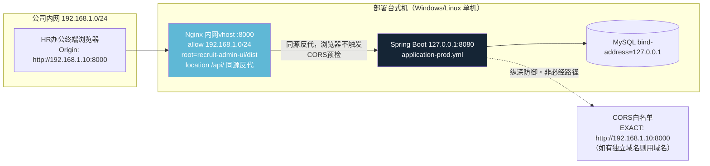
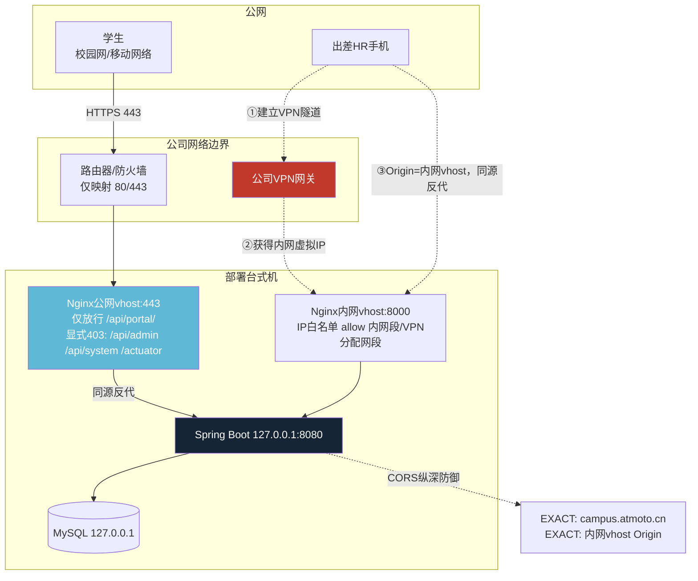
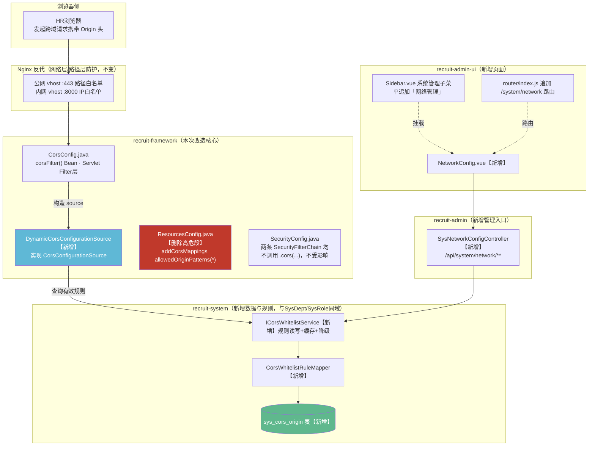

# HR 后台「网络管理」模块设计方案 V1.0

> 本文档整合自：发现层三路调研（外部方案调研 / 数据资产探索 / 技术可行性评估）→ 设计层三路并行设计（系统架构 / 数据架构 / 接口与界面）→ 审查层红队裁决（8 项跨文档冲突裁定 + 6 项独立发现）。所有结论均基于实际源码核实（4 个 `pom.xml`、`SecurityConfig.java`、`CorsConfig.java`、`ResourcesConfig.java`、`PortalBrandController.java`、`nginx-campus.conf`、`init-data.sql`、前端 `Sidebar.vue`/`router/index.js`），不做未经验证的假设。

---

## 一、问题背景与设计目标

### 1.1 触发本方案的真实故障

HR 用手机连公司 WiFi 访问后台开发环境，登录报"网络错误"。排查后定位到三层叠加缺陷：

1. **CORS 白名单是编译期常量**——`CorsConfig.java` 的 `DEFAULT_ORIGINS` 硬编码了 `localhost:5174`/`127.0.0.1:5174`/`campus.atmoto.cn`，局域网设备的 Origin（如 `http://192.168.31.56:5174`）不可能被预先写死进代码，被直接拒绝（403）。
2. **`ResourcesConfig.java` 存在遗留的高危通配符 CORS 配置**——`addCorsMappings("/**").allowedOriginPatterns("*").allowCredentials(true)`，与 `CorsConfig.java` 的白名单模式同时存在于同一容器中，两者生效顺序不确定，这段遗留代码必须清除。
3. **当前的临时修复是掩盖故障而非根治**——`vite.config.js` 在代理层 `removeHeader('Origin')`，只在"通过 Vite 代理访问"这一条路径上生效，且导致开发环境的 CORS 校验从未被真实触发过，验收无法反映真实效果。

### 1.2 设计目标

把 CORS 白名单从"改代码 + 重启才能生效"变成 HR 后台可视化管理、修改后立即生效，同时覆盖三种网络拓扑场景，且不引入超出项目体量的复杂度。

### 1.3 项目硬约束（本方案严格遵守）

| 约束 | 具体要求 |
|---|---|
| 部署形态 | 单台式机（Windows/Linux），禁止微服务/集群/分布式中间件 |
| 并发规模 | 峰值约 20 并发，**禁用 Redis**（技术选型裁决基线明确规定，仅验证码 TTL 例外用本地缓存） |
| 运维能力 | 无专职运维，配置变更尽量"不改源码不重启" |
| 设计原则 | 组件数量最小化，每个技术选型须写明"选它的理由 + 被淘汰备选 + 淘汰原因" |
| Maven 依赖方向 | 单向链 `recruit-common → recruit-system → recruit-framework → recruit-biz → recruit-admin`，反向引用编译期报错 |

### 1.4 模块价值范围的准确定位（红队发现 D，避免范围膨胀）

本模块并非对三种部署场景"平均用力"。实测：

- **场景①（开发环境局域网联调）**：前端 Vite（5174）与后端 Spring Boot（8080）不同端口，构成真实跨域，**这是 CORS 白名单机制唯一真正生效、也是本模块要解决的核心场景**。
- **场景②（公司内网台式机部署）**：生产形态下 Nginx 同一 vhost 既served 前端静态资源又反代 `/api`，浏览器视角前后端**同源**，CORS 机制根本不触发，此场景的网络隔离由 Nginx 层 `allow/deny` 网段规则承担，不重复建设。
- **场景③（公网 + HR 手机远程访问）**：结论明确——HR 远程访问走**公司 VPN 接入内网 Nginx vhost**，`/api/admin/**`/`/api/system/**` 永不直接暴露公网（延续现有 `nginx-campus.conf` 已确立的路径白名单策略）。同样是同源访问，CORS 不适用。

**结论**：本模块的直接价值集中在开发/联调阶段的跨域场景；生产部署形态下的网络访问控制主要由 Nginx 层承担。这个定位决定了模块只需管理"CORS 动态白名单"这一件事，不需要做成大而全的网络控制台。

---

## 二、三种部署场景的网络拓扑

### 2.1 当前场景：开发环境局域网联调

```mermaid
graph LR
    subgraph WiFi["公司WiFi局域网 192.168.31.0/24"]
        M["HR手机浏览器<br/>Origin: http://192.168.31.56:5174<br/>IP随DHCP动态变化"]
    end
    subgraph DEV["开发机（同处一个网段，无独立防火墙拦截）"]
        V["Vite Dev Server :5174<br/>host=0.0.0.0（--host CLI参数，不改vite.config.js源码）"]
        S["Spring Boot :8080<br/>application-dev.yml: server.address=0.0.0.0"]
        DB[(MySQL 127.0.0.1:3306)]
    end
    M -->|1.加载页面| V
    V -->|2.代理 /api 请求，保留Origin头| S
    M -.3.可选直连测试.->|Origin同为192.168.31.56:5174| S
    S --> DB
    S -.4.CORS判定.-> RULE["sys_cors_origin<br/>CIDR规则: 192.168.31.0/24<br/>覆盖整个公司WiFi网段，无需逐台设备加白名单"]
    style RULE fill:#5FB88D,color:#fff
```

关键变化：`vite.config.js` 的 `removeHeader('Origin')` workaround **建议在本模块上线并完成 CIDR 白名单覆盖后移除**——保留它会让开发环境永远无法真实检验 CORS 配置是否正确，是一种障眼法式的临时修复，与"根治故障"的定位冲突（见第七章"已知限制"）。

### 2.2 未来场景 A：公司内网台式机部署



此场景下 CORS 白名单不在日常访问路径上，只作为"万一某天有人从内网另一 Origin 直连 8080"的兜底防线。

### 2.3 未来场景 B：公网可访问 + HR 手机远程访问

**结论先行**：HR 远程访问后台走**公司 VPN 接入内网 Nginx vhost**，`/api/admin/**`、`/api/system/**` 永不直接暴露公网。

**被否决的备选方案**：公网直接开放 HR 后台 + 靠 CORS/IP 白名单加固。**淘汰理由**：CORS 是浏览器执行的同源策略，只约束"页面脚本能不能读取跨域响应"，对 `curl`/Postman/攻击脚本直接调用 API 完全无效；服务端在 CORS 拒绝时其实**已经处理了请求**，只是不把结果吐给浏览器脚本。把 CORS 当作访问控制层是常见的安全误区，简历库是本系统唯一价值所在，不值得为出差便利独立承担公网爆破面。



三种场景的白名单规则集是**同一张表**的不同子集，靠 `is_active` 启停而非切换配置文件——环境切换不需要重新部署应用。

---

## 三、系统架构设计

### 3.1 模块定位与整体架构



### 3.2 【裁决1】模块归属：`recruit-system`，不是 `recruit-biz`

**结论**：`CorsWhitelistRule`（Domain）/`CorsWhitelistRuleMapper`/`ICorsWhitelistService`/`CorsWhitelistServiceImpl` 全部放 `recruit-system` 模块；`DynamicCorsConfigurationSource` 放 `recruit-framework`；Controller 放 `recruit-admin` 的 `controller/system/` 包组。

**依据（实测 4 个 pom.xml）**：

| 模块 | 依赖的内部模块 |
|---|---|
| `recruit-common` | （无） |
| `recruit-system` | `recruit-common` |
| `recruit-framework` | `recruit-common` **+ `recruit-system`**（已显式声明） |
| `recruit-biz` | `recruit-common` + `recruit-framework` + `recruit-system` |
| `recruit-admin` | `recruit-framework` + `recruit-biz` |

`recruit-framework/pom.xml` 已经显式依赖 `recruit-system`——这不是"允许新增依赖"，而是"依赖边早已存在"。`DynamicCorsConfigurationSource`（必须放在 `recruit-framework`，因为要替换 `CorsConfig.java` 里的 Bean）调用 `ICorsWhitelistService`（放在 `recruit-system`）零新增依赖边，直接可用。

**被淘汰方案**：放入 `recruit-biz`（照搬 `BrandConfigController` 风格）。**淘汰原因**：`recruit-biz` 已依赖 `recruit-framework`；若 `recruit-framework` 反过来依赖 `recruit-biz` 来调用 CORS Service，构成 `framework → biz → framework` 环形依赖，**Maven reactor 构建期直接报错，编译失败**，这不是风格问题而是硬故障。

### 3.3 【裁决8】API 路径前缀：`/api/system/network/**`

**结论**：`/api/system/network/**`，Controller 类名 `SysNetworkConfigController`，与现有 `SysUserController`/`SysRoleController`/`SysDeptController` 同级。

**依据**：`SecurityConfig.java` 的 `adminFilterChain`（Order 2）无 `securityMatcher()` 限定，是兜底链，`/api/system/**` 与 `/api/admin/**` 在鉴权安全性上完全等价，不构成裁决依据。真正依据是**架构一致性**：裁决1已确定 CORS 相关代码归属 `recruit-system`（系统管理域），现有全部 `Sys*Controller` 都走 `/api/system/**` 前缀（`/api/admin/**` 现有全部是 `JobAdminController`/`ResumeAdminController` 这类 HR 招聘业务接口），网络管理 Controller 语义上应与 `SysConfigController` 同级。

### 3.4 CORS 动态化改造方案

**类设计**：

| 类 | 所在模块/包 | 职责 |
|---|---|---|
| `CorsWhitelistRule` | `recruit-system` / `domain` | 继承 `BaseEntity`，规则实体：`ruleType`(EXACT/CIDR)、`ruleValue`、`description`、`isActive`、`isBuiltin` |
| `CorsWhitelistRuleMapper` | `recruit-system` / `mapper` | `extends BaseMapper<CorsWhitelistRule>`，纯 CRUD |
| `ICorsWhitelistService` | `recruit-system` / `service` | 规则读写业务逻辑，封装缓存与降级，`I`前缀跟随 `recruit-system` 现有 `ISysDeptService` 惯例 |
| `CorsWhitelistServiceImpl` | `recruit-system` / `service.impl` | 唯一键查重转update/insert（同 `BrandConfigServiceImpl.saveConfig` 模式）；写操作后清缓存 |
| `DynamicCorsConfigurationSource` | `recruit-framework` / `security.cors` | 实现 `org.springframework.web.cors.CorsConfigurationSource`，替换 `UrlBasedCorsConfigurationSource` |
| `SysNetworkConfigController` | `recruit-admin` / `controller.system` | `/api/system/network/**` |

**`CorsConfig.java` 改造点**：

```java
@Bean
public CorsFilter corsFilter(DynamicCorsConfigurationSource dynamicSource) {
    // 用自定义 Source 替换 UrlBasedCorsConfigurationSource
    // 其余 CorsFilter 构造逻辑（allowedHeader/*、allowedMethod/*、maxAge）不变
    return new CorsFilter(dynamicSource);
}
```

`UrlBasedCorsConfigurationSource.registerCorsConfiguration` 本身非线程安全，是"注册一次，全程复用"的静态模型，不适合运行时反复刷新——这是必须自定义 `CorsConfigurationSource`（每次请求实时构造）的原因。

### 3.5 【裁决2】CORS 白名单与 IP/CIDR：单表，CIDR 直接参与 CORS 匹配

**结论**：不建独立的 IP 访问控制表/Filter，CIDR 规则直接作为 CORS Origin 匹配的一种方式，与精确 Origin 匹配共用一张表 `sys_cors_origin`。

**三层理由**：

1. **问题本质决定机制**：触发故障是"手机局域网 Origin 不在白名单内被 403"，本质上只能通过 CORS 匹配逻辑解决。若 IP/CIDR 不参与 CORS 匹配、单独做一个"IP 访问控制 Filter"，根本不会修复这个故障。
2. **独立 IP-ACL Filter 是重复建设**：Nginx 层已经在用 `allow 192.168.10.0/24; deny all;` 做内网访问限制，且这层防护在 TCP 连接层面即生效，强度天然强于应用层 Filter。再造一个平行的 IP-ACL Filter + 独立表，是对已有防线的重复实现，违反"组件数量最小化"。
3. **CIDR 参与 CORS 匹配的目的是覆盖 IP 会变化的局域网设备**（DHCP 环境下手机 IP 今天是 `192.168.1.23`，明天是 `192.168.1.45`，逐条加精确 Origin 不现实，用网段一次性覆盖），不是做访问控制——CORS 本身就不能当访问控制层用（第 2.3 节已论证）。

**【发现B】匹配算法必须明确写出**（三份并行设计都未讲清楚，是本方案首次显式定义）：

```java
private boolean matchOrigin(CorsWhitelistRule rule, String origin) {
    if ("EXACT".equals(rule.getRuleType())) {
        return rule.getRuleValue().equalsIgnoreCase(origin);
    }
    // CIDR类型：仅对"字面IP地址"的Origin host做网段包含判断
    // 域名类Origin（如campus.atmoto.cn）只走精确匹配，绝不触发CIDR/网络地址解析逻辑
    try {
        String host = URI.create(origin).getHost();
        if (host == null || !IPV4_LITERAL.matcher(host).matches()) return false;
        return new IpAddressMatcher(rule.getRuleValue()).matches(host);
    } catch (Exception e) {
        return false;    // Origin格式异常 → 拒绝而非抛异常中断请求链
    }
}
```

**为什么要显式排除域名类 Origin 参与 CIDR 判断**：避免实现者对域名做 DNS 解析后再判断（引入延迟与潜在 SSRF 风险面），或把域名字符串直接传入 CIDR 判断库导致异常/误判。

### 3.6 缓存策略

| 项 | 设计 |
|---|---|
| Cache Bean | `CaffeineCacheConfig` 新增 `corsWhitelistCache`：`Cache<String, List<CorsWhitelistRule>>`，`maximumSize=1`（整表作为单一条目缓存，key固定），无TTL |
| 读路径 | `getEffectiveRules()` 优先查缓存，miss 则查 DB 并回填 |
| 写路径 | 严格遵循"先写DB成功→再 `cache.invalidate("ALL")`"，不做增量更新，下次读取触发整表重载 |
| 一致性窗口 | DB写成功到缓存失效之间的极短暂窗口，20并发单机场景下影响可忽略，不引入分布式锁 |
| 幂等性 | `addRule` 内部先按 `rule_value` 唯一键查重，存在则转 update，不存在则 insert，与 `BrandConfigServiceImpl.saveConfig` 现有模式一致 |

### 3.7 降级兜底策略

```
getEffectiveRules() 内部：
  1. 尝试读缓存 → miss 则查 DB → 成功则回填缓存并返回
  2. DB查询抛异常 → log.error记录 → 降级返回基于 DEFAULT_ORIGINS 静态常量构造的规则列表
  3. 查询成功但结果为空 → 同样降级到 DEFAULT_ORIGINS（防御首次上线表为空的情况）
```

`DEFAULT_ORIGINS` 角色从"唯一白名单来源"降格为"数据库与缓存双失效时的最后防线"，同时作为 `init-data.sql` 种子数据插入 `sys_cors_origin`（`is_builtin=1`）。

---

## 四、数据架构设计

### 4.1 【裁决3/裁决5】表设计决策：多行表 + 独立审计表，不复用 `sys_brand_config`

**KV 模式（塞进 `sys_brand_config` 式的单值配置表）被淘汰**：

1. 单条白名单记录需要精确到"谁添加的、什么时候添加的、备注说明"，KV 模式下如果把整个数组塞进一个 `config_value`，元信息只能是整个数组共用，无法区分数组内某一条的归属，除非在 JSON 内部再嵌套一层对象数组——那等于在文本字段里手工重新发明一张关系表。
2. 无法用数据库唯一约束防止重复添加（唯一约束只能作用在 `config_key` 上，真正的重复检测被迫下沉到应用层反序列化后比较）。
3. CORS 过滤器每次请求都要做"当前 Origin 是否在白名单"的判断，多行表走索引，KV+JSON 需要先取整段TEXT再应用层遍历，性能与故障隔离都更差（一条脏数据可能导致整个 JSON 反序列化失败，CORS 全部失效）。

**【裁决5・一票否决级安全发现】`sys_brand_config` 不能被网络配置复用或参照查询路径**：

实测 `PortalBrandController.getPublicBrandInfo()`（路径 `/api/portal/brand`，`SecurityConfig` 中 `permitAll()`）执行 `brandConfigMapper.selectList(new LambdaQueryWrapper<>())`——**不做任何 `config_key` 过滤，把该表全表所有行都返回给任何匿名访问者**。若把 CORS 白名单或局域网开关塞进 `sys_brand_config`，等于把安全边界配置直接公开给攻击者。**因此网络配置必须落在全新的表上，绝不共用 `BrandConfigMapper`/`PortalBrandController` 的查询路径**，且新 Controller 严禁出现在任何 `permitAll()` 路径下。

**强制约束（验收项）**：匿名（无 Token）请求网络管理模块的任一只读接口必须返回 401。

**顺带记录的已知问题（不在本模块修复范围，登记为技术债）**：`PortalBrandController.getPublicBrandInfo()` 应改为按 `config_group` 或显式 `config_key` 白名单过滤，而非 `selectList(全表)`，避免未来任何人往 `sys_brand_config` 加一行非公开配置就被动泄露。

### 4.2 表 DDL

#### 4.2.1 `sys_cors_origin`（CORS 白名单，EXACT + CIDR 统一表）

```sql
CREATE TABLE `sys_cors_origin` (
    `id`           BIGINT       NOT NULL AUTO_INCREMENT COMMENT '规则ID',
    `rule_type`    VARCHAR(16)  NOT NULL COMMENT '规则类型：EXACT-精确Origin匹配, CIDR-局域网网段匹配',
    `rule_value`   VARCHAR(128) NOT NULL COMMENT 'EXACT时为完整Origin(scheme://host:port)；CIDR时为网段(如192.168.31.0/24)',
    `description`  VARCHAR(256) DEFAULT NULL COMMENT '规则说明（如"HR办公室WiFi网段"）',
    `is_active`    CHAR(1)      NOT NULL DEFAULT '1' COMMENT '启用标记：1-启用 0-停用（停用不删除，保留历史）',
    `is_builtin`   CHAR(1)      NOT NULL DEFAULT '0' COMMENT '是否内置默认规则：1-是（拒绝物理删除，只可禁用）',
    `create_by`    VARCHAR(64)  DEFAULT NULL COMMENT '创建者',
    `create_time`  DATETIME     NOT NULL DEFAULT CURRENT_TIMESTAMP COMMENT '创建时间',
    `update_by`    VARCHAR(64)  DEFAULT NULL COMMENT '更新者',
    `update_time`  DATETIME     NOT NULL DEFAULT CURRENT_TIMESTAMP ON UPDATE CURRENT_TIMESTAMP COMMENT '更新时间',
    PRIMARY KEY (`id`),
    UNIQUE KEY `uk_rule_value` (`rule_value`),
    KEY `idx_type_active` (`rule_type`, `is_active`)
) ENGINE=InnoDB DEFAULT CHARSET=utf8mb4 COLLATE=utf8mb4_0900_ai_ci
  COMMENT='CORS动态白名单表（Origin精确匹配 + 局域网CIDR网段匹配统一存储，rule_type判别列，参照stu_internship的record_type判别列模式）';
```

- 唯一约束 `uk_rule_value` 直接满足"防止重复添加相同白名单条目"；`utf8mb4_0900_ai_ci` 排序规则本身大小写不敏感，无需应用层额外转小写去重（建议写入前仍统一规范化，避免视觉重复困扰 HR）。
- 索引 `idx_type_active` 覆盖最典型查询——"取某类型下所有启用条目"。
- 预计总行数长期维持两位数以内，不构成分区场景。

#### 4.2.2 `sys_network_config`（局域网开关等标量配置，独立 KV 表）

```sql
CREATE TABLE `sys_network_config` (
    `id`           BIGINT       NOT NULL AUTO_INCREMENT COMMENT '配置ID',
    `config_key`   VARCHAR(64)  NOT NULL COMMENT '配置键',
    `config_value` TEXT         DEFAULT NULL COMMENT '配置值',
    `config_type`  VARCHAR(32)  NOT NULL DEFAULT 'STRING' COMMENT '配置值类型：STRING/BOOLEAN/NUMBER',
    `config_group` VARCHAR(32)  NOT NULL DEFAULT 'NETWORK' COMMENT '配置分组',
    `description`  VARCHAR(256) DEFAULT NULL COMMENT '配置说明',
    `create_by`    VARCHAR(64)  DEFAULT NULL COMMENT '创建者',
    `create_time`  DATETIME     NOT NULL DEFAULT CURRENT_TIMESTAMP COMMENT '创建时间',
    `update_by`    VARCHAR(64)  DEFAULT NULL COMMENT '更新者',
    `update_time`  DATETIME     NOT NULL DEFAULT CURRENT_TIMESTAMP ON UPDATE CURRENT_TIMESTAMP COMMENT '更新时间',
    PRIMARY KEY (`id`),
    UNIQUE KEY `uk_config_key` (`config_key`)
) ENGINE=InnoDB DEFAULT CHARSET=utf8mb4 COLLATE=utf8mb4_0900_ai_ci
  COMMENT='网络配置开关表（局域网访问开关等标量配置，独立于sys_brand_config——后者对匿名公网用户全表暴露，绝不能共用）';
```

字段风格照抄 `sys_brand_config`（因为数据形状相同：一行一个配置项），但物理上是完全独立的表，且**此表只能挂 `/api/system/**` 下的认证接口，绝不能出现任何 `/api/portal/**` 的匿名查询路径**。

#### 4.2.3 `audit_network_config`（网络配置变更审计表）

**【裁决3】表名采用 `audit_network_config`（非 `sys_network_config_log`）**：本项目数据架构约定 `audit_` 前缀专指审计域（`audit_resume_access` 为既有先例），`sys_` 前缀专指"系统管理/复用RuoYi语义"的表，用 `sys_` 给审计表命名打破了已确立的命名约定。

**不复用 `audit_resume_access`**：该表的 `target_student_id BIGINT NOT NULL`、`target_student_name VARCHAR(64) NOT NULL` 是硬约束，专为"操作对象是某个学生"设计，网络配置变更不涉及学生，强行复用要么伪造脏值污染统计，要么放松约束破坏原表的合规完整性保证；且该表没有 `old_value`/`new_value` 列，无法满足"谁在什么时间把什么值改成了什么值"的审计要求。

```sql
CREATE TABLE `audit_network_config` (
    `id`               BIGINT       NOT NULL AUTO_INCREMENT COMMENT '审计记录ID',
    `rule_id`          BIGINT       DEFAULT NULL COMMENT '关联规则ID（规则被删除后此字段仍保留历史值）',
    `config_table`     VARCHAR(32)  NOT NULL COMMENT '被修改的配置来源：CORS_ORIGIN-白名单条目, NETWORK_CONFIG-开关配置',
    `operation_type`   VARCHAR(32)  NOT NULL COMMENT '操作类型：ADD/UPDATE/DELETE/ENABLE/DISABLE/TOGGLE',
    `old_value`        VARCHAR(512) DEFAULT NULL COMMENT '变更前的值（JSON快照或简单值）',
    `new_value`        VARCHAR(512) DEFAULT NULL COMMENT '变更后的值',
    `operation_detail` VARCHAR(512) DEFAULT NULL COMMENT '操作详情补充',
    `operator_id`      BIGINT       NOT NULL COMMENT '操作人ID（关联sys_user.user_id）',
    `operator_name`    VARCHAR(64)  NOT NULL COMMENT '操作人姓名',
    `ip_address`       VARCHAR(64)  DEFAULT NULL COMMENT '操作来源IP地址',
    `user_agent`       VARCHAR(512) DEFAULT NULL COMMENT '浏览器User-Agent',
    `create_time`      DATETIME     NOT NULL DEFAULT CURRENT_TIMESTAMP COMMENT '操作时间',
    PRIMARY KEY (`id`),
    KEY `idx_operator_time` (`operator_id`, `create_time`),
    KEY `idx_create_time` (`create_time`)
) ENGINE=InnoDB DEFAULT CHARSET=utf8mb4 COLLATE=utf8mb4_0900_ai_ci
  COMMENT='网络配置变更审计表（不可变日志，仅追加，参照audit_resume_access结构范式并扩展old_value/new_value）';
```

不可变、仅追加，不设 `update_time`/`del_flag`，与 `audit_resume_access` 保持一致。

### 4.3 `sys_menu` 挂载方案

```sql
-- 挂载于系统管理 parent_id=1 下，续用10-14序号段（menu_id=15未被占用，已核实不冲突）
INSERT INTO sys_menu (menu_id, menu_name, parent_id, order_num, path, component, is_frame, is_cache, menu_type, visible, status, perms, icon, create_by, create_time) VALUES
(15, '网络管理', 1, 6, 'network', 'system/network/index', '1', '0', 'C', '0', '0', 'system:network:list', 'server', 'admin', NOW());
```

`menu_id=15` 续用系统管理子项序号段（10-19），而非另起新段——这不是新的顶级业务域，只是系统管理里新增的第6个子项。

**【裁决4・关键现状】菜单表数据不构成实际访问控制**：实测 `Sidebar.vue`/`router/index.js` 是纯静态硬编码，全局搜索确认无任何 `hasPermi`/`v-permission`/动态菜单树渲染逻辑，`router.beforeEach` 只检查 token 是否存在，不检查角色权限；`sys_menu`/`sys_role_menu` 的数据从未被前端消费。**即便不给某角色分配 `menu_id=15`，只要该菜单项被写进 `Sidebar.vue` 模板，所有登录 HR 都能看到入口并点进去**——这是本次审查独立验证出的事实，`sys_menu`/`sys_role_menu` 记录仍应插入（元数据治理层面应该做，且为未来菜单动态化留埋点，成本为零），但**不能**依赖它作为访问控制手段。

```sql
-- 两个角色都绑定（因为读操作两角色皆可访问，隐藏菜单在当前前端架构下没有实际意义）
INSERT INTO sys_role_menu (role_id, menu_id) VALUES (1, 15), (2, 15);
```

### 4.4 数据初始化

```sql
-- 将 CorsConfig.java 硬编码的 DEFAULT_ORIGINS 迁移为落库数据，保证上线瞬间不中断现有访问
INSERT INTO sys_cors_origin (rule_type, rule_value, description, is_active, is_builtin, create_by, create_time) VALUES
('EXACT', 'http://localhost:5173',    '开发环境 Vite 默认端口', '1', '1', 'system_migration', NOW()),
('EXACT', 'http://localhost:5174',    '开发环境 Vite 备用端口', '1', '1', 'system_migration', NOW()),
('EXACT', 'http://127.0.0.1:5173',    '开发环境本机回环地址', '1', '1', 'system_migration', NOW()),
('EXACT', 'http://127.0.0.1:5174',    '开发环境本机回环地址（备用端口）', '1', '1', 'system_migration', NOW()),
('EXACT', 'https://campus.atmoto.cn', '生产环境门户域名（禁止误删，删除会导致门户前端跨域请求全部失败）', '1', '1', 'system_migration', NOW());

-- 局域网访问开关默认true，与当前"未做任何IP限制"的现状一致，避免上线瞬间收紧访问范围
INSERT INTO sys_network_config (config_key, config_value, config_type, config_group, description, create_by, create_time) VALUES
('lan_access_enabled', 'true', 'BOOLEAN', 'NETWORK', '是否允许局域网/内网IP直接访问HR后台。默认true保持现状，如需收紧请先在白名单中添加需要放行的网段', 'system_migration', NOW());
```

`is_builtin='1'` 的 5 条记录，Service 层拒绝物理删除，仅允许禁用，防止误删导致 `campus.atmoto.cn` 主域名失联。

---

## 五、接口与界面设计

### 5.1 后端 REST API

统一前缀 `/api/system/network`，全部挂在 `adminFilterChain` 下，**不加入任何 `permitAll` 列表**。

#### CORS 白名单管理

| 接口 | 鉴权 | 说明 |
|---|---|---|
| `GET /api/system/network/cors-origins` | 两角色可读 | 返回全量列表，数据量小不分页 |
| `POST /api/system/network/cors-origins` | 仅 `hr_director` | 新增规则 |
| `PUT /api/system/network/cors-origins/{id}` | 仅 `hr_director` | 编辑规则 |
| `DELETE /api/system/network/cors-origins/{id}` | 仅 `hr_director` | 删除（`is_builtin=1` 拒绝） |
| `PUT /api/system/network/cors-origins/{id}/status` | 仅 `hr_director` | 启停用 |

**校验规则（后端强制，一票否决级）**：

1. `ruleValue` 非空、长度≤128
2. EXACT 类型必须匹配 `^https?://[a-zA-Z0-9.-]+(:\d{1,5})?$`（禁止路径、禁止尾部斜杠、禁止查询参数、**禁止通配符 `*`**）——通配符+当前硬编码的 `allowCredentials(true)` 是浏览器规范禁止但 Spring 会绕过检查的危险组合，必须在保存时直接拒绝，不是仅前端警示
3. 【裁决7】CIDR 类型：后端**强制拒绝**前缀短于 `/16` 或不落在 `10.0.0.0/8`、`172.16.0.0/12`、`192.168.0.0/16` 范围内的提交。前端保留友好提示作为体验优化，但绝不作为唯一防线——任何直接调用管理 API 的请求（不经过浏览器表单）都会绕开前端警示，只有后端校验不可绕过
4. 唯一性：与已有 `rule_value` 大小写不敏感去重比对

#### 局域网访问开关

| 接口 | 鉴权 |
|---|---|
| `GET /api/system/network/lan-access` | 两角色可读 |
| `PUT /api/system/network/lan-access` | 仅 `hr_director` |

#### 网络诊断（只读）

`GET /api/system/network/diagnostics`——两角色可读。返回字段严格走白名单式 DTO 组装，**不得**直接序列化 `Environment`/`ServerProperties` 整个对象，绝不能夹带 JWT 密钥、数据库连接串等其他配置项。

诊断内容是"被动推断当前请求是否经过预期的 Nginx 转发"（检查 `X-Forwarded-For`/`X-Forwarded-Proto` 头 + `Host` 头是否等于预期域名），**不做任何反向探测**——后端是被 Nginx 反代的一方，无法也不应该主动发起出站请求去探测前置 Nginx 是否存活，这是错误的依赖方向。

#### 变更审计历史

`GET /api/system/network/audit/list`——两角色可读（分页），审计记录本身是"谁改了什么"的透明化机制，不应仅总监可见。

### 5.2 【裁决4】权限模型：后端方法级读写分离为主

**结论**：主控制机制是后端方法级检查，`sys_menu`/`sys_role_menu` 仅作元数据保留。

比照项目现有 `ResumeAdminController.hasAllDataScope()` 的过渡模式（全项目 0 处使用 `@PreAuthorize`，不为本模块单独引入一整套目前项目里不存在的方法级鉴权体系，避免"只有网络管理这一个模块有细粒度权限"的架构不一致）：

```java
/**
 * 校验当前HR是否具备网络管理"总监级"权限
 * <p>过渡方案：查询 sys_user_role → sys_role.role_key 判断是否为 hr_director。
 * 【重要】不可照抄 ResumeAdminController.hasAllDataScope() 的判断逻辑——
 * 该方法用 "sys_admin".equals(sysUser.getUserType()) 判断，但实测 init-data.sql
 * 中初始化的 admin 账号 user_type='00'，不是"sys_admin"，该逻辑在实际数据下恒为false，
 * 是一个已存在的独立bug（超出本模块范围，但本模块的实现严禁复制这个错误模式）。
 * 正确做法是查角色key，见下方实现。</p>
 */
private void requireNetworkAdminRole() {
    Long userId = AdminUserHolder.getUserId();
    if (userId == null) {
        throw new BizException(ErrorCode.UNAUTHORIZED);
    }
    boolean isDirector = sysRoleService.selectRoleKeysByUserId(userId).contains("hr_director");
    if (!isDirector) {
        throw new BizException(ErrorCode.NETWORK_ADMIN_ROLE_REQUIRED);
    }
}
```

所有写操作（POST/PUT/DELETE）方法体第一行调用此方法；所有读操作（GET列表/诊断/审计历史）两角色皆可访问，不调用。

前端在能取到角色信息时做展示层的按钮禁用（体验优化，非安全边界，真正边界在后端）。

### 5.3 错误码新增（延续 `ErrorCode.java` 现有分段规则）

```java
// ────────── 7xxxx 网络管理 ──────────
NETWORK_ORIGIN_DUPLICATE(70001, "该Origin已存在于白名单中"),
NETWORK_ORIGIN_WILDCARD_FORBIDDEN(70002, "CORS白名单不允许配置通配符Origin（*）。当前系统已启用凭证模式，根据浏览器CORS规范，通配符Origin与凭证模式不能同时生效，该组合会使白名单形同虚设"),
NETWORK_ORIGIN_FORMAT_INVALID(70003, "Origin格式不正确，需为完整来源地址（如 https://campus.atmoto.cn），不能包含路径、查询参数或结尾斜杠"),
NETWORK_ORIGIN_NOT_FOUND(70004, "该CORS白名单记录不存在或已被删除"),
NETWORK_CIDR_FORMAT_INVALID(70005, "IP/网段格式不正确"),
NETWORK_CIDR_RANGE_FORBIDDEN(70006, "网段范围不合法：仅允许RFC1918私有地址段（10.0.0.0/8、172.16.0.0/12、192.168.0.0/16），且前缀不得短于/16"),
NETWORK_CIDR_DUPLICATE(70007, "该网段已存在于白名单中"),
NETWORK_ADMIN_ROLE_REQUIRED(70008, "该操作仅限「人力资源总监」角色执行，当前账号无修改权限"),
NETWORK_BUILTIN_RULE_PROTECTED(70009, "内置规则不可删除，可禁用"),
```

### 5.4 前端页面设计

新建 `code/recruit-admin-ui/src/views/system/network/NetworkConfig.vue`，Tab布局：

```
NetworkConfig.vue
├── Tab 1「CORS白名单」    → 表格 + 新增/编辑Dialog（EXACT/CIDR统一管理）
├── Tab 2「局域网访问」    → 开关卡片，独立"保存"按钮（不用@change直接触发，避免误触）
├── Tab 3「网络诊断」      → el-descriptions只读信息卡（仿ResumeDetail.vue风格）
└── Tab 4「变更历史」      → 表格+筛选栏（仿AuditLog.vue结构）
```

**【裁决4关联】菜单挂载的两处必改硬编码**（不能假设配了路由就自动生效）：

1. `router/index.js`：在 `system/audit` 之后新增 `{ path: 'system/network', name: 'network', component: () => import('@/views/system/network/NetworkConfig.vue'), meta: { title: '网络管理', icon: 'Connection' } }`
2. `Sidebar.vue`：在 `<el-menu-item index="/system/audit">操作审计</el-menu-item>` 之后新增 `<el-menu-item index="/system/network">网络管理</el-menu-item>`

放在"操作审计"之后的理由：两者都属于偏运维的高敏感操作。

**安全交互（二次确认，`ElMessageBox.confirm`）**：

- 新增CORS白名单：提示"该来源发起的跨域请求将被允许携带登录凭证访问所有后台接口，请确认该地址可信"
- 新增CIDR白名单前缀 `< /16` 时：**前端提示**并说明覆盖的IP数量级；**但最终以后端强制拒绝为准**（见5.1第3条）
- 切换局域网访问开关：区分"开启"/"关闭"两种不同措辞的风险提示
- 删除白名单条目：确认"删除后对应来源将立即失去访问权限"

---

## 六、安全边界设计

网络管理模块本身允许 HR 修改谁可以跨域访问系统，是高风险攻击面。风险模型说明：CORS 配置错误的核心风险不是"绕过身份认证"（认证走独立的 `AdminTokenFilter`/JWT，与 CORS 无关），而是"让恶意第三方网页的脚本能够以受害者浏览器身份读取本系统响应"。本项目 Token 存于 `localStorage` 并通过 `Authorization` Header 发送（非 Cookie 自动携带），CSRF 风险天然较低，但通配符+凭证组合仍是必须堵死的高危配置。

| 风险点 | 防护措施 |
|---|---|
| 通配符+凭证组合 | 后端强制正则校验禁止 `*`；`allowCredentials` 硬编码 `true` 不开放前端配置开关，避免未来维护者误开危险组合 |
| CIDR范围过大 | 后端强制限定 RFC1918 私有地址空间 + 前缀不短于 `/16`（裁决7） |
| 内置规则误删 | `is_builtin=1` 拒绝物理删除，仅允许禁用 |
| 越权修改 | 方法级 `requireNetworkAdminRole()` 检查，写操作仅 `hr_director`（裁决4） |
| 审计留痕 | `audit_network_config` 记录变更前后快照、操作人、来源IP，挂钩在Service层每个写方法 |
| 匿名访问 | 强制验收测试：无Token请求任一接口必须401（裁决5） |
| 诊断接口信息泄露 | 白名单式DTO组装，不序列化整个Environment/ServerProperties对象 |

### 6.1 【发现A・阻塞级】必须清理的遗留高危配置

`ResourcesConfig.java` 同时实现了 `WebMvcConfigurer.addCorsMappings()`，注册 `/**` 并使用 `allowedOriginPatterns("*") + allowCredentials(true)`——与 `CorsConfig.java` 的 `CorsFilter` Bean 白名单模式**同时存在于同一容器**，两者实际生效顺序不保证一致，该文件的类注释甚至自相矛盾地写着"CORS 由 CorsConfig 中的 CorsFilter Bean 处理"却又重复注册了一遍通配符 CORS。这是 RuoYi 脚手架遗留代码未清理的产物。

**影响**：一票否决级。只要存在任何执行路径使这段通配符配置生效，新建的动态白名单机制就会被整体架空，退化为"任意 Origin + 允许携带凭证"——比"手机连不上"严重得多的问题（任意恶意网站都能带着用户凭证发起跨站请求）。

**必须作为阶段1的独立强制任务**：删除 `ResourcesConfig.java` 中 `addCorsMappings()` 方法的覆写（或整个方法体）。**验收测试**：清理后确认容器中只有一个有效的 CORS 配置来源。

---

## 七、已知限制与后续处理

1. **域名遗留错误（P0，建议立即修复，不阻塞本模块交付）**：核实 `nginx-campus.conf` 全文使用 `campus.atmoto.com`，但全项目 50+ 处（系统架构设计、数据架构设计、7份审计/裁决文档、甲方决策记录、ICP备案信息）一致使用 `campus.atmoto.cn`。`atmoto.cn` 是唯一正确、已被甲方确认、已进入备案流程的域名。**`nginx-campus.conf` 需修正为 `.cn`**（含 SSL 证书路径 `/etc/nginx/ssl/campus.atmoto.com.pem` 同步改名），否则实际部署时 Nginx 会为错误域名终止 TLS，导致真实域名请求全部无法匹配 `server_name`，门户彻底不可访问。此问题独立于本模块的三处冲突裁决之外，建议一并登记为待修复项。

2. **Vite Origin剥离补丁掩盖了真实验收效果**：`vite.config.js` 现有的 `proxyReq.removeHeader('Origin')` 会导致标准开发流程下浏览器请求实际上不经过真实的CORS校验路径（同源代理 + Origin头被剥离，Spring在无Origin头时不启用CORS处理）。若验收测试仍沿用"手机连WiFi打开Vite页面登录成功"作为标准，测不出新机制是否真的生效。**验收必须新增一条绕过Vite代理、直接对8080发起带自定义Origin头的curl测试**（见第八章任务清单）。建议本模块上线并完成CIDR�covering开发网段后，评估移除这个补丁，让开发环境真实检验CORS配置。

3. **`ResumeAdminController.hasAllDataScope()` 的既有bug**：判断逻辑 `"sys_admin".equals(sysUser.getUserType())` 与实际初始化数据（`user_type='00'`）不匹配，恒为false。这是本次审查顺带发现的独立问题，超出本模块范围，但本模块的权限检查实现严禁复制这个错误模式（已在5.2节标注）。

4. **`PortalBrandController` 全表暴露的既有问题**：建议后续改为按 `config_group`/`config_key` 白名单过滤，不在本模块修复范围内，仅登记。

---

## 八、实施任务清单

### 8.1 后端

| 文件 | 操作 | 说明 |
|---|---|---|
| `recruit-backend/recruit-system/src/main/java/.../system/domain/CorsWhitelistRule.java` | 新增 | Domain实体 |
| `recruit-backend/recruit-system/src/main/java/.../system/mapper/CorsWhitelistRuleMapper.java` | 新增 | Mapper |
| `recruit-backend/recruit-system/src/main/java/.../system/service/ICorsWhitelistService.java` | 新增 | Service接口 |
| `recruit-backend/recruit-system/src/main/java/.../system/service/impl/CorsWhitelistServiceImpl.java` | 新增 | 含缓存/降级/查重逻辑 |
| `recruit-backend/recruit-system/src/main/java/.../system/domain/NetworkConfigLog.java`（对应`audit_network_config`表） | 新增 | 审计Domain |
| `recruit-backend/recruit-system/src/main/java/.../system/mapper/NetworkConfigLogMapper.java` | 新增 | 审计Mapper |
| `recruit-backend/recruit-framework/src/main/java/.../framework/security/cors/DynamicCorsConfigurationSource.java` | 新增 | 核心：动态CORS判定逻辑，含EXACT/CIDR匹配算法（3.5节） |
| `recruit-backend/recruit-framework/.../config/CorsConfig.java` | 修改 | `corsFilter()` Bean 替换为注入 `DynamicCorsConfigurationSource`，`DEFAULT_ORIGINS`保留作降级兜底 |
| `recruit-backend/recruit-framework/.../config/ResourcesConfig.java` | **修改（阻塞级）** | 删除 `addCorsMappings()` 通配符覆写（6.1节） |
| `recruit-backend/recruit-framework/.../config/CaffeineCacheConfig.java` | 修改 | 新增 `corsWhitelistCache` Bean |
| `recruit-backend/recruit-admin/src/main/java/.../admin/controller/system/SysNetworkConfigController.java` | 新增 | `/api/system/network/**` |
| `recruit-backend/recruit-common/.../enums/ErrorCode.java` | 修改 | 新增7xxxx段错误码（5.3节） |
| `recruit-backend/recruit-admin/src/main/resources/application-dev.yml` | 修改 | `server.address: 0.0.0.0` |
| `recruit-backend/recruit-admin/src/main/resources/application-prod.yml`（**当前不存在，需新建**） | 新增 | `server.address: 127.0.0.1`，显式覆盖 |
| `recruit-backend/recruit-admin/src/main/resources/sql/init-schema.sql` | 修改 | 追加3张新表DDL（4.2节） |
| `recruit-backend/recruit-admin/src/main/resources/sql/init-data.sql` | 修改 | 追加menu/role_menu/CORS种子数据/开关默认值（4.3/4.4节） |
| `recruit-backend/recruit-admin/src/main/resources/scripts/nginx-campus.conf` | **修改（P0，独立于本模块）** | 域名 `.com`→`.cn`，证书路径同步（7.1节） |

### 8.2 前端

| 文件 | 操作 | 说明 |
|---|---|---|
| `recruit-admin-ui/src/views/system/network/NetworkConfig.vue` | 新增 | 主页面，4个Tab（5.4节） |
| `recruit-admin-ui/src/router/index.js` | 修改 | 追加 `system/network` 路由 |
| `recruit-admin-ui/src/layout/Sidebar.vue` | 修改 | 追加"网络管理"菜单项 |
| `recruit-admin-ui/vite.config.js` | 评估后修改 | 移除 `removeHeader('Origin')` workaround（需在CIDR覆盖开发网段生效后进行，见7.2节，不与本次改动同批次） |

### 8.3 数据库

| 内容 | 说明 |
|---|---|
| `sys_cors_origin` 建表 | 4.2.1节 DDL |
| `sys_network_config` 建表 | 4.2.2节 DDL |
| `audit_network_config` 建表 | 4.2.3节 DDL |
| `sys_menu` 插入 menu_id=15 | 4.3节 |
| `sys_role_menu` 插入 (1,15)(2,15) | 4.3节 |
| `sys_cors_origin` 种子数据 5条 | 4.4节，迁移`DEFAULT_ORIGINS` |
| `sys_network_config` 种子数据 1条 | 4.4节，局域网开关默认true |

### 8.4 验收测试（新增，不可省略）

1. **匿名访问必须401**：无Token请求 `GET /api/system/network/cors-origins` 等任一接口，验证返回401（对应6.1/裁决5安全约束）
2. **【关键】绕过Vite代理的真实CORS测试**：直接对 `127.0.0.1:8080` 发起 `curl -H "Origin: http://192.168.31.56:5174"` 请求（不经过Vite代理），验证：CIDR白名单覆盖该网段时返回正确的 `Access-Control-Allow-Origin` 响应头；不在白名单内时应观察到无该响应头（对应7.2节，这是唯一能验证新机制真实生效的测试方式，标准的"手机连WiFi登录成功"测试不足以证明）
3. **通配符拒绝测试**：提交 `ruleValue="*"` 应返回 `NETWORK_ORIGIN_WILDCARD_FORBIDDEN`
4. **CIDR范围拒绝测试**：提交 `1.0.0.0/8`（非RFC1918）应返回 `NETWORK_CIDR_RANGE_FORBIDDEN`
5. **内置规则保护测试**：删除 `is_builtin=1` 的记录应返回 `NETWORK_BUILTIN_RULE_PROTECTED`
6. **权限测试**：`hr_recruiter` 账号调用写接口应返回 `NETWORK_ADMIN_ROLE_REQUIRED`
7. **`ResourcesConfig.java`清理验证**：清理遗留通配符配置后，确认任意Origin不再被无条件放行
8. **降级测试**：模拟数据库不可达，确认CORS判定降级到 `DEFAULT_ORIGINS` 而非直接拒绝所有请求
9. **回归测试**：现有5个已知Origin（localhost:5173/5174、127.0.0.1:5173/5174、campus.atmoto.cn）改造后仍正常放行

### 8.5 实施顺序建议

1. **阶段1（根治故障，含阻塞级清理）**：建3张表 → 种子数据 → `DynamicCorsConfigurationSource` → 替换 `CorsConfig.java` Bean → **删除`ResourcesConfig.java`危险配置** → 新建`application-prod.yml`拆分 → 执行验收测试1/2/7/8/9
2. **阶段2（管理界面）**：`ICorsWhitelistService`分层实现 → `SysNetworkConfigController` → `NetworkConfig.vue` → 路由与菜单挂载 → 执行验收测试3/4/5/6
3. **阶段3（诊断与审计，可与阶段2合并）**：诊断接口 → `audit_network_config`审计埋点 → 变更历史页面
4. **独立并行处理**：`nginx-campus.conf`域名修正（7.1节，P0但不阻塞上述阶段）
